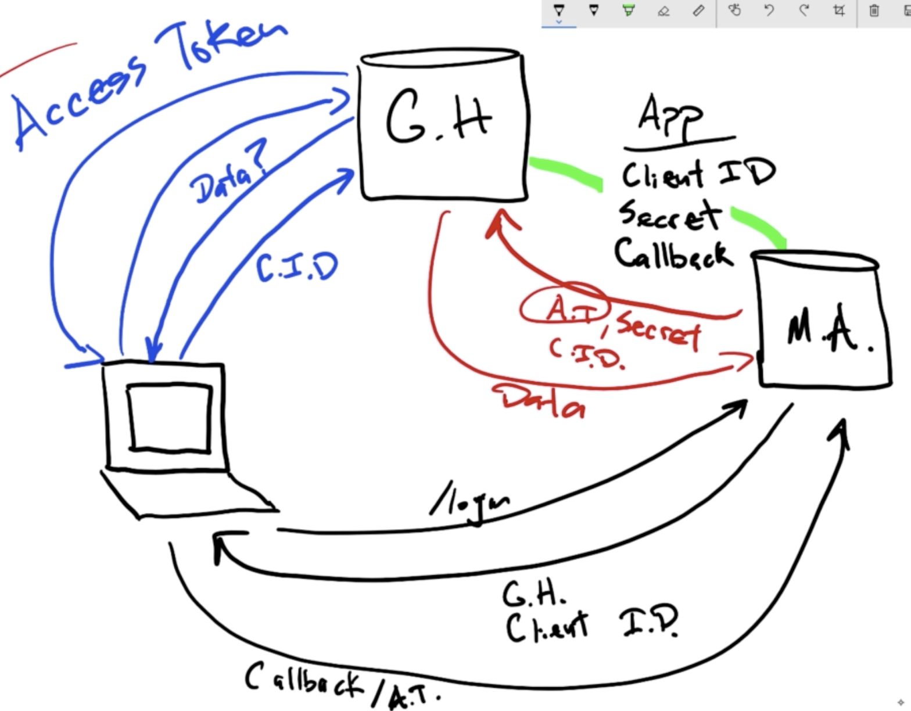
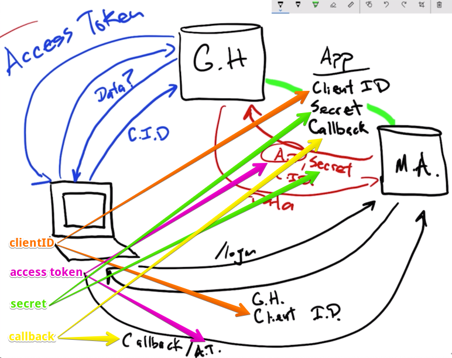
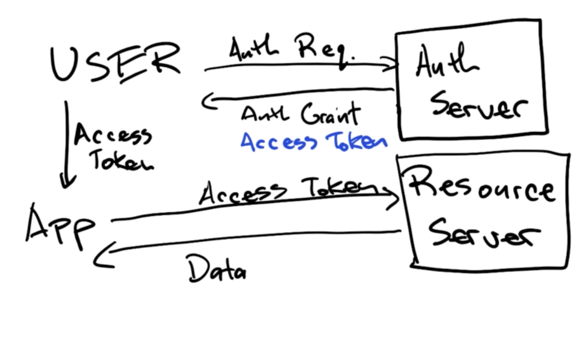
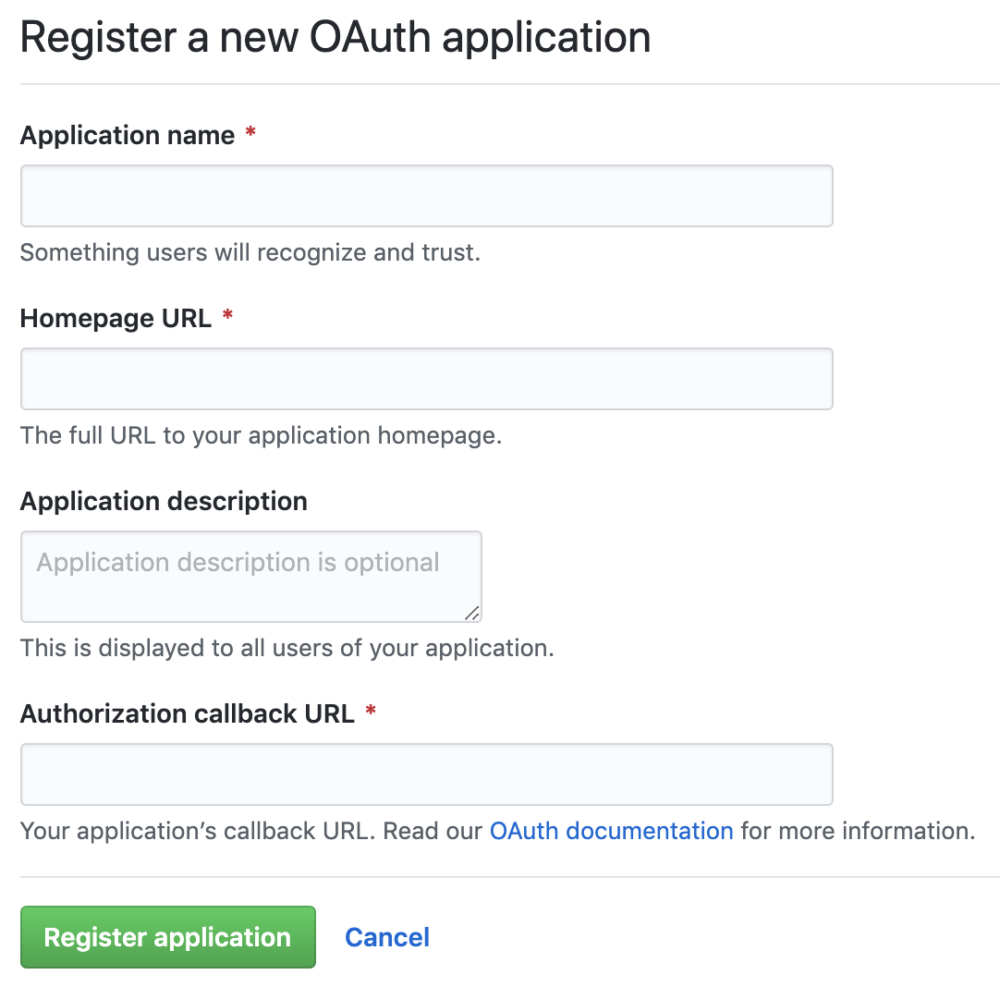
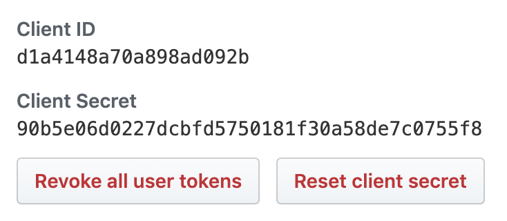

## Movie Fan App

<details><summary> <strong>Project setup</strong></summary>

TBD

---

</details>

## Building an API

<details><summary> <strong>Project setup: the goal, express generator, and data dump</strong></summary>

We're going to scaffold out a new project similar to the previous one except this time we are on the *other* side; that is, instead of *requesting* data from an API to use in an application by making different requests and so forth, we will actually *response* with data as if a user is asking *us* to be their API. They should be able to hit different routes, and we should respond with the expected data. 

Since this is a "Just Express" course, we will not add a database layer on top of things but instead siphon off some data from [The Movie Database API](https://developers.themoviedb.org/3/getting-started/introduction). The "data" we will deal with may be found [here](https://github.com/daniel-farlow/just-express/tree/master/udemy-course-files/starterFiles/apiProject2).

We will run the express generator to generate the basic scaffold for our project:

``` BASH
npx express-generator --no-view movieFanAPI
```

Note we *do not* need a view engine (unless you want one for the built-in error handling that the generator gives us) since we will not be responding with views but with data. Once you have run the generator, `cd` in the project directory and always remember to wear your helmet: `npm i helmet`. Then simply do `npm i` to install all of the express dependencies. 

Then create a `data` folder at the root level in the project directory and copy the [files mentioned above](https://github.com/daniel-farlow/just-express/tree/master/udemy-course-files/starterFiles/apiProject2) into this folder. Again, we do not have a database to work with here. It's not uncommon to have a `data` directory, but it would be far more common to be pulling the data out of a database (a SQL or NoSQL database like MySQL/PostgreSQL or MongoDB, respectively) rather than using a huge, static chunk of JSON. 

---

</details>

<details><summary> <strong>Project structure and routes</strong></summary>

The basic file structure for our application has been given to us from the express generator, but we want to specifically think through the routes because that is the bulk of the API. We are going to create endpoints for somebody else to come in and hit. Of course, the express generator starts us off with an `indexRouter` and `usersRouter` for `/` and `/users`, respectively. What do we actually need in this project though? 

In our other project, we largely went to just two routes:

- `/movies/...`
- `/search/...`
- `/now_playing/...`

We can look at [the API docs](https://developers.themoviedb.org/3/movies/get-movie-details) for the movie database we used previously and see how they have structured getting movie detaisl: `/movie/{movie_id}`. Under [the movies tab](https://developers.themoviedb.org/3/movies) you'll see all sorts of ways for `GET`ting data as well as a way to [`POST` a movie rating](https://developers.themoviedb.org/3/movies/rate-movie) and a way to [`DELETE` a movie rating](https://developers.themoviedb.org/3/movies/delete-movie-rating). We're not going to be able to do anything with these since we don't have a database, but we're going to include them anyway. What we're looking at so far: 

- `GET` movie details: `/movie/{movie_id}`
- `POST` movie rating: `/movie/{movie_id}/rating`
- `DELETE` movie rating: `/movie/{movie_id}/rating`

The point here is that `/movie` is definitely a good candidate for us as far as routes are concerned. And for `/search` let's see [what the possibilities are](https://developers.themoviedb.org/3/search/search-companies). [We have](https://developers.themoviedb.org/3/search/search-movies) a `/search/movie` one and [another](https://developers.themoviedb.org/3/search/search-people) `/search/person`. These both seem like good candidates for making a `/search` route.

If you look at the sidebar for their API docs, you'll see everything really organized into routes. For example, everything under the [TV](https://developers.themoviedb.org/3/tv/get-tv-details) heading starts with `/tv` whether it's to get content ratings (i.e., `/tv/{tv_id}/content_ratings`) or to get keywords for a movie (i.e., `/tv/{tv_id}/keyword`) or a whole host of other things about TV all on the `/tv` route. Similar things will play out for the `/movies`, `/search`, `/discover`, etc., routes. Think about how all the data relates and structure things accordingly. What kind of data do you want to serve up based on endpoints that are hit? 

All that said, we can get rid of the `usersRouter` and everything associated with it. And we want to add a `movieRouter` and a `searchRouter` (via `movie.js` and `search.js` in the `routes` folder). And for `now_playing` we'll simply use the `indexRouter` for that so someone can go to `/now_playing` and get the data they want and expect.

Remember that using middleware such as `app.use('/movie', movieRouter)` means that *all* of the routes in our `movieRouter` behave as if `/movie` were prepended to them. That is, 

```javascript
router.get('/', (req, res, next) => {
  res.json({msg: `It's working!`})
})
```

in `movieRouter` is equivalent to 

```javascript
app.get('/movie', (req, res, next) => {
  res.json({msg: `It's working!`})
})
```

if the above were in `app.js`. All this to say: don't do something like 

```javascript
router.get('/movie', (req, res, next) => {
  res.json({msg: `It's working!`})
})
```

in `movieRouter` if you're trying to manage a `GET` request to `/movie`; the above code would manage a `GET` request to `/movie/movie`. 

---

</details>

<details><summary> <strong>Setting environment variables (e.g., <code>PORT</code> to listen on) via <code>.env</code> from <code>dotenv</code> module</strong></summary>

Now that we have the basic structure of how our endpoints are going to work in our application (FYI: this is something you should spend a nontrivial amount of time thinking about; poor application structure can lead to major problems down the road), we want to actually build a route. Before we do that, however, recall the following lines from `bin/www`, the entry point for our application:

```javascript
var port = normalizePort(process.env.PORT || '3000');
app.set('port', port);
```

You can change the `3000` manually or, as noted in the code above, you can set a `process` environment variable named `PORT` which, if defined, will take precedence over `3000` and be used as the port on which to listen to instead. What is `process` in Node.js? As [the docs](https://nodejs.org/api/process.html#process_process) note: The `process` object is a `global` that provides information about, and control over, the current Node.js process. As a global, it is always available to Node.js applications without using `require()`. It can also be explicitly accessed using `require()`:

```javascript
const process = require('process');
```

So you won't often `require` `process` since it is made available globally. One thing you will often want to install as a dependency in your project is the `dotenv` module: `npm install dotenv`. This module, as noted in [the docs](https://www.npmjs.com/package/dotenv), is a zero-dependency module that loads environment variables from a `.env` file into `process.env`. Storing configuration in the environment separate from code is based on the [The Twelve-Factor App](https://12factor.net/config) methedology. 

The docs note that, as early as possible in the application, we should require and configure dotenv:

```javascript
require('dotenv').config()
```

For this to be of any use, we should create a `.env` file in the root directory of our project and add environment-specific variables on new lines in the form of `NAME=VALUE`. For example:

``` BASH
DB_HOST=localhost
DB_USER=root
DB_PASS=s1mpl3
```

`process.env` now has the keys and values you defined in your `.env` file. One potential "gotcha" though: [the default](https://www.npmjs.com/package/dotenv#config) `path` property used in `.config()`, namely `path.resolve(process.cwd(), '.env')` reflects the expectation that our `.env` file is located in the root directory of our project. As [the Node docs note](https://nodejs.org/api/process.html#process_process_cwd), the `process.cwd()` method returns the current working directory of the Node.js process. We may specify a custom path if our `.env` file containing environment variables is located elsewhere. For example:

```javascript
require('dotenv').config({ path: '/full/custom/path/to/your/env/vars' })
```

As noted above, `require('dotenv').config()` is equivalent to the following by default:

```javascript
require('dotenv').config({ path: path.resolve(process.cwd(), '.env') })
```

Finally, in [the FAQ](https://www.npmjs.com/package/dotenv#should-i-commit-my-env-file) for `dotenv`, we see strong advice to 

1\. **NEVER COMMIT YOUR `.env` FILE**: We **strongly** recommend against committing your `.env` file to version control. It should only include environment-specific values such as database passwords or API keys. Your production database should have a different password than your development database. Add `.env` to your `.gitignore_global`. If you don't have a global `.gitignore` file, then see [this guide](http://egorsmirnov.me/2015/05/04/global-gitignore-file.html) on how to set up and configure one (you do not want to add `.env` every time to your local `.gitignore`). Below you can find the `.gitignore_global` I currently use:

<details><summary> <strong>My current <code>.gitignore_global</code></strong></summary>

``` BASH
# Compiled source #
###################
*.com
*.class
*.dll
*.exe
*.o
*.so

# Packages #
############
# it's better to unpack these files and commit the raw source
# git has its own built in compression methods
*.7z
*.dmg
*.gz
*.iso
*.jar
*.rar
*.tar
*.zip

#dotenv
.env
env.sh

#node file
node_modules
sessions

# Logs and databases #
######################
*.log
*.sql
*.sqlite

# OS generated files #
######################
.DS_Store
.DS_Store?
._*
.Spotlight-V100
.Trashes
ehthumbs.db
Thumbs.db

#for Python:
__pycache__
*.pyc

#for React
dist
```

---

</details>
<br>

2\. **NEVER HAVE MORE THAN ONE `.env` FILE:**  We **strongly** recommend against having a "main" `.env` file and an "environment" `.env` file like `.env.test`. Your config should vary between deploys, and you should not be sharing values between environments.

The point is that it is a very good idea to set up a `.env` file and store stuff you need in multiple places that may change there (e.g., the `PORT` number, API keys, different passwords, etc.).

---

</details>

<details><summary> <strong>First route and middleware</strong></summary>

We want to build our first route. And our first route on the website was the homepage route. And that was really the `now_playing` data and we can't use `now_playing` because that's going to require dynamic data and we don't have dynamic data (also recall that we're not interested in rendering views at all but only responding with data in the form of JSON since we are building an API).  

The route we are going to try to imitate, in essence at least, is the [/movie/now_playing](https://developers.themoviedb.org/3/movies/get-now-playing) one but we'll use `most_popular` and we will do so through the static data in our `movies.js` file in our `data` directory. As [the docs](https://developers.themoviedb.org/3/movies/get-now-playing) note for getting the movies that are now playing, the query string *must* have an `api_key` equivalent to some string. And we can imitate this requirement fairly easily. We can also bake in a contrived use of the optional `page` parameter in the query string. We won't bother with `language` and `region`. 

So here is what the `indexRouter` might look like so far:

```javascript
const express = require('express');
const router = express.Router();

const movies = require('../data/movies');

/* GET home page. */
router.get('/', function(req, res, next) {
  res.render('index', { title: 'Express' });
});

router.get('/most_popular', (req, res, next) => {
  const { page, api_key } = req.query;
  console.log(req.query)
  if (page === undefined) { page = 1;}
  if (api_key != '123456789') {
    res.json({unauthorized: `Invalid API Key`});
  } else {
    let results = movies.filter(movie => movie.most_popular === true);
    console.log(results.length)
    results = results.slice((page - 1) * 20, page * 20);
    res.json(results)
  }
})

module.exports = router;
```

We can actually test this using the movieFanApp we built earlier by dumping the following into our `indexRouter`:

```javascript
const apiKey = process.env.OUR_OWN_API_KEY; // for testing our own API
const apiBaseUrl = 'http://localhost:3030'; // for testing our own API
const nowPlayingUrl = `${apiBaseUrl}/most_popular?api_key=${apiKey}`; // for testing our own API
```

One important thing to note, however, is from [the docs](https://developers.themoviedb.org/3/movies/get-now-playing) in the movie database we see the response will be `application/json` which is great, but the response data type is expected to be an `object` with a `results` property whose value is the retrieved data. So we need to make sure we return an object whose `results` property holds the actual data, and we can do this pretty easily: `res.json({results})` instead of `res.json(results)`. 

Another thing to note is that in our previous application the route we were going to for `nowPlayingUrl` was `movie/now_playing` but instead now it is just `most_popular`. 

The previous point about sending over an object whose `results` property held an array of data is pretty normal in API design. Why? Well, often you will want to send over *more* than just the requested data. Maybe in our response we want to also send over how many pages were requested. Etc. So instead of just `res.json({results})`, it might be good to have something like 

```javascript
res.json({
  page,
  results // ... other stuff
})
```

So right now our `indexRouter` might look like the following:

```javascript
const express = require('express');
const router = express.Router();

const movies = require('../data/movies');

router.get('/', function(req, res, next) {
  res.render('index', { title: 'Express' });
});

router.get('/most_popular', (req, res, next) => {
  let { page, api_key } = req.query;
  console.log(req.query)
  if (page === undefined) { page = 1;}
  if (api_key != '123456789') {
    res.json({unauthorized: `Invalid API Key`});
  } else {
    let results = movies.filter(movie => movie.most_popular === true);
    console.log(results.length)
    results = results.slice((page - 1) * 20, page * 20);
    console.log(results)
    res.json({
      page,
      results
    })
  }
})

module.exports = router;
```

---

</details>

<details><summary> <strong><code>/movie</code> routes, some header work, and <code>return</code>ing in a route (e.g., <code>return res.json</code>, <code>return next()</code>, etc.) to prevent further callback execution</strong></summary>

We have covered the `/most_popular` route, and now it is time to handle the `/movie` and `/search` routes. Let's go ahead and generate a table/list of some of the routes we will want to build:

| Method | Route | API Reference |
| :-: | :-- | :--|
| `GET` | `/movie/movieId` | API ref: [get movie details](https://developers.themoviedb.org/3/movies/get-movie-details) |
| `GET` | `/movie/top_rated` | API ref: [get top rated movies](https://developers.themoviedb.org/3/movies/get-top-rated-movies) |
| `POST` | `/movie/{movie_id}/rating` | API ref: [post movie rating](https://developers.themoviedb.org/3/movies/rate-movie) |
| `DELETE` | `/movie/{movie_id}/rating` | API ref: [delete movie rating](https://developers.themoviedb.org/3/movies/delete-movie-rating) |
| `GET` | `/movie` | API ref: [tbd](tbd) |

In setting up our API, if we require an API key, which we do in this case, then it starts to become cumbersome to check in each route whether or not a correct API key was added. We could copy code from before:

```javascript
if (api_key != '123456789') {
  res.json({unauthorized: `Invalid API Key`});
} // ...
```

But copying code is a bad idea! So many opportunities for issues. As Rob says, "You do not want to be clever as a developer. You always want to make things as simple as possible." This is a perfect use case for two lessons: 

1. We can write some middleware, and we probably want to do this at the application level with `app.use` instead of `router.use`. We could certainly do `router.use`, but why restrict ourselves if we are going to require an API key for retrieving data on *all* of our routes?  

We can do something like the following (and we'll put this code just below our invocation of `helmet`; that is, we'll put it up near the top of our application; we want it firing off first):

```javascript
app.use((req, res, next) => {
  // cut off the API response if the API key is bad
  const {api_key} = req.query;
  api_key != '123456789' ? res.json({unauthorized: `Invalid API Key`}) : next();
})
```

In production or in a real application with a database, you would query the database in the middleware to see if their API key was valid. We don't have that right now so we are just checking for the hard number. 

2. One more thing we need to do above is realize that Express is automatically going to provide a `200` status code, and what we are sending back is *not* indicative of a `200` status. That is, we are responding with JSON, but the JSON we are responding with is not what the user expects--it is a failure due to a bad or nonexistant API key. So this is a perfect use case `res.status(401)`, where `401` is an unauthorized status code meaning. 

So we should ideally end up with something like the following in our `app.js` to use at the application level:

```javascript
app.use((req, res, next) => {
  // cut off the API response if the API key is bad
  const {api_key} = req.query;
  if (api_key != '123456789') {
    res.status(401); // unauthorized = 401
    res.json({unauthorized: `Invalid API Key`})
  } else {
    next();
  }
})
```

When working on the `/movie/top_rated` route, we may run into an issue with how things are currently structured: 

```javascript
router.get('/:movieId', ...) 

router.get('/top_rated', ...)
```

As [Mozilla notes](https://developer.mozilla.org/en-US/docs/Learn/Server-side/Express_Nodejs/routes), the URL `/movie/top_rated` will be matched by a route like `/movie/:movieId` (which will extract a "movieId" value of '`top_rated`'). The first route that matches an incoming URL will be used, so if you want to process `/movie/top_rated` URLs separately, then their route handlers must be defined before your `/movie/:movieId` route. 

This gives us the opportunity to note a few important observations that have so far not been stressed, namely that callbacks in route matchers are just JavaScript callbacks and sometimes it can be wise to `return` the response we want to send back (or `return next()` or `return next('route')`) whether it's `return res.json`, `return res.render`, etc.; otherwise, you risk possibly trying to set the headers more than once for a response.

<details><summary> <strong>Explicitly <code>return</code>ing a response or control to the next middleware (i.e., <code>return next()</code>) or route (i.e., <code>return next('route')</code></strong></summary>

- **Callback functions in route handlers are just normal callbacks:** Something like `router.get('/some_route', callback)` in Express simply means, "Hey JavaScript, when `/some_route` is matched, I want you to execute my `callback` (typically in Express an anonymous function with `req`, `res`, and `next` arguments). Generally speaking, within the `callback` we will run some logic having to do with `req` and/or `res`, and if we do not want to pass control to the `next` piece of middleware, then we should *respond* whether with `res.json` (e.g., when we are building an API), `res.render` (e.g., when we are building a server-side rendered application), `res.download`, `res.sendFile`, etc. Here's the key point to note: Typically, the code in your callback naturally ends by using `res.METHOD` to send a response, but *there's nothing magical about `res.METHOD` in influencing when the `callback` is complete/incomplete*. That is, you can still use `res.json` or generally `res.METHOD` in your callback and the headers for your response will likely be set and the response sent, but your callback function does not actually terminate. The code will continue to execute, as [this post](https://stackoverflow.com/a/37314619/5209533) illustrates. To avoid this, if it poses a potential problem, we can simply use `return` to stop executing the `callback`; that is, instead of using `res.json` and then the subsequent code running, we can simply `return res.json`, and this will ensure the callback execution is halted/completed.
- **Returning `next()` and/or `next('route')`:** [Here](https://stackoverflow.com/q/16810449/5209533) is a great thread on when to use `next()` or `return next()` and, by extension, when to use `next('route')` or `return next('route')`.  As the chosen answerer notes, some people *always* write `return next()` to ensure that the execution of the current callback (i.e., the current route handler) stops after triggering the next callback (i.e., the next callback in the route middleware stack or the next matched route callback). If you do not use `return`, then you risk triggering the callback a second time later, which usually has devastating results (e.g., trying to set the headers for a response after the response has already been sent). Also, per the point directly above, if you do not `return` within your callback, then some rather funky things can happen, as reflected by what shows up in the console if you are testing or what may break your app. 

Everything said above about `next()` and `return next()` equally applies to `next('route')` and `return next('route')`. Consult [this resource](https://expressjs.com/en/guide/using-middleware.html) if you need a refresher about `next('route')`; essentially, to skip the rest of the middleware functions from a router middleware stack (typically we only have one but we may have more than one, as our example below will show), call `next('route')` to pass constrol to the next route. 

Consider the following rather funky looking code: 

```javascript
app.get('/example', (req, res, next) => {
  console.log('Log 1')
  next()
  console.log('Log 2')
}, (req, res, next) => {
  console.log('Log 3')
  return next()
  console.log(`Log 4`)
}
)

app.get('/example', (req, res, next) => {
  console.log('Log 5')
  next('route')
  console.log('Log 6')
}, (req, res, next) => {
  console.log('Log 7')
  next()
  console.log('Log 8')
})

app.get('/example', (req, res, next) => {
  console.log('Log 9')
  return next('route')
  console.log('Log 10')
}, (req, res, next) => {
  console.log('Log 11')
  next()
  console.log('Log 12')
})

app.get('/example', (req, res, next) => {
  console.log('Log 13')
  console.log(`Header sent? `, res.headersSent)
  res.json({ msg: 'We should be done now' })
  console.log(`Header sent? `, res.headersSent)
  console.log('Log 14')
})
```

What do you think will be logged to the console when you visit `/example`? Take a moment and try to figure it out. Here's the result:

``` BASH
Log 1
Log 3
Log 5
Log 9
Log 13
Header sent?  false
Header sent?  true
Log 14
Log 6
Log 2
```

As you can tell from what is logged to the console above, we get *very* different behavior than what we might expect otherwise. Basically, when we call `next` (whether or not `'route'` is passed to it) we are passing control to the *next* piece of middleware, but if we haven't ended the callback we were in when we called `next`, then control will eventually be passed back to this callback, and this control being passed back is where issues can happen with accidentally trying to set the headers more than once.

For a slightly more basic example to bring the point home, consider the following code:

```javascript
app.get('/another_example', (req, res, next) => {
  console.log('This is a middleware')
  next()
  console.log('This is first-half middleware')
})

app.get('/another_example', (req, res, next) => {
  console.log('This is second middleware')
  next()
  console.log('This is second half-middleware')
})

app.get('/another_example', (req, res, next) => {
  console.log('This is third middleware')
  next()
})
```

What will be logged to the console?

``` BASH
This is a middleware
This is second middleware
This is third middleware
This is second half-middleware
This is first-half middleware
```

As can be seen above (and also before in the more complicated example), if a function's body has not finished executing but passes off control to another handler, then control is successfully passed back to the executing bodies in a stack-like fashion. That is, `console.log('This is second half-middleware')` runs before `console.log('This is first-half middleware')` when passing control back up because the second route handler (which tries to log `'This is second half-middleware'`) was later on the stack than the first route handler (which tries to log `'This is first-half middleware'`). 

---

</details>

In summary, in the context of our movie fan API, we really should put the `/top_rated` route first and the `:movieId` wildcard one last. That is, for the `/movie` route, `/movie/:movieId` will unintentionally match anything submitted as just `/movie/SOMETHING`. So our wildcard route, if it's only matching one thing, should really go last.

Before we move on to the `POST` and `DELETE` routes, it may be of interest to note that there are a *ton* of routes that will use the `:movieId` wildcard. It may be useful on occasion to detect when this wildcard appears in a matching route. Can we recall a way to run a callback if that wildcard is present? The `router.param()` [method](https://expressjs.com/en/api.html#router.param) will do the trick. We can hand this method any string and if that string matches a wildcard in the route, then the callback we pass to `router.param` will fire off. 

As the docs note, to use `router.param(name, callback)` effectively, we first pass a `name` that represents the wildcard that, when detected in a matching route, will trigger the execution of the `callback`. In our case, the wildcard name to possibly pass `router.param` is `movieId`. The parameters of the callback function itself are as follows:

- `req`: The request object
- `res`: The response object
- `next`: Indicating the next middleware function
- The value of the `name` parameter

Don't forget the fourth parameter. It gives you access to the *value* of whatever `name`ed wildcard was used in the matching route. As the docs further note, a use case might have to deal with when `:user` is present in a route path--we could map user loading logic to automatically provide `req.user` to the route or perform validations on the parameter input:

```javascript
router.param('user', function (req, res, next, id) {
  // try to get the user details from the User model and attach it to the request object
  User.find(id, function (err, user) {
    if (err) {
      next(err)
    } else if (user) {
      req.user = user
      next()
    } else {
      next(new Error('failed to load user'))
    }
  })
})
```

Another thing to note is that `param` callback functions are local to the router on which they are defined. That is, they are not inherited by mounted apps or routers. Hence, `param` callbacks defined on `router` will be triggered only by route parameters defined on `router` routes. A `param` callback will be called only once in a request-response cycle, even if the parameter is matched in multiple routes (hence `router.param(name, callback)` is a good thing to potentially use *before* you want to pass off handling logic to the matching routes' callbacks), as shown in the following examples:

```javascript
router.param('id', function (req, res, next, id) {
  console.log('CALLED ONLY ONCE')
  next()
})

router.get('/user/:id', function (req, res, next) {
  console.log('although this matches')
  next()
})

router.get('/user/:id', function (req, res) {
  console.log('and this matches too')
  res.end()
})
```

A `GET` request to `/user/42` will result in the following being logged to the console:

``` BASH
CALLED ONLY ONCE
although this matches
and this matches too
```

The point is that we may want to add some data analytics before passing control to a route handler, validate things concerning API key usage, or whatever it might be. `router.param` is our chance (and only chance) to run logic on the value of the `name`ed parameter that is passed before passing control to the matched routes and their callbacks. 

We can now work on our `POST` route. If we look at [the API docs](https://developers.themoviedb.org/3/movies/rate-movie) for what we are trying to mimic, then we will see that the `Content-Type` header is required and is expected to be `application/json`. We are going to require the `Content-Type` to be `application/json`. We can test things out initially (using Postman) as follows:

```javascript
router.post('/:movieId/rating', (req, res, next) => {
  let { movieId } = req.params;
  console.log(req.get('Content-Type'))
  res.json({ msg: 'Test' })
})
```

If our request body is empty, then we will see `undefined` get logged to the console. If we put in some dummy text to the body (e.g., `name` of `Daniel`), then we will see `application/x-www-form-urlencoded` get logged to the console. We don't want to accept this--we are not willing to accept a `Content-Type` of `application/x-www-form-urlencoded`--we want `application/json`. We can easily check things using the [req.is(type)](https://expressjs.com/en/4x/api.html#req.is) method (recall: this method returns the matching content type if the incoming request's `Content-Type` HTTP header field matches the MIME type specified by the `type` parameter--if the request has no body, then this method will return `null` or will return `false` otherwise). We could modify our `POST` route in the following manner:

```javascript
router.post('/:movieId/rating', (req, res, next) => {
  let { movieId } = req.params;
  if (!req.is('application/json')) {
    return res.json({ msg: `Content-Type must be application/json` })
  }
  else {
    return res.json({ msg: `Request successful` })
  }
})
```

Now, if we look at [the API docs](https://developers.themoviedb.org/3/movies/delete-movie-rating) for deleting a movie rating, we will see we want to require `Content-Type` of `application/json` as well. So we could create the `DELETE` route and copy over some of the code above, but copying over the code is rarely advisable! Instead, it would probably be wise to *define* (i.e., not use at the router-level but simply define to use within certain `/movie` routes) some middleware at the top of our `/movie` route, say `requireJSON`, that handled this task upfront. For example:

```javascript
function requireJSON(req, res, next) {
  if (!req.is('application/json')) {
    return res.json({ msg: `Content-Type must be application/json` })
  }
  else {
    return res.json({ msg: `Request successful` })
  }
}
```

And then we could call this function within the routes where we needed to:

```javascript
router.post('/:movieId/rating', (req, res, next) => {
  requireJSON(req, res, next)
})
```

But this is still not a very good strategy to use the defined middleware *within* the first callback in our route handler. Instead, this is a great use case for passing *more than one* piece of middleware to a route handler. We can now truly make use of the middleware stack for a route like so:

```javascript
router.post('/:movieId/rating', requireJSON, (req, res, next) => {
  // ...
})
```

Of course, now we need to modify `requireJSON` so that if the `Content-Type` is what we want, namely `application/json`, then we don't respond with JSON but forward control to the next piece of middleware. 

Now, returning to [posting a movie rating](https://developers.themoviedb.org/3/movies/rate-movie), we see that the request body accepts a named object with a `value` property and a `number` value associated with this property, where the `number` is the value of the rating that is desired to be submitted, and the number value is to be between 0.5 and 10.0. With all of this said, our `POST` route could work as follows: 

```javascript
router.post('/:movieId/rating', requireJSON, (req, res, next) => {
  let { movieId } = req.params;
  let { value: userRating } = req.body;
  if ((userRating < 0.5) || (userRating > 10)) {
    return res.json({ msg: 'Rating must be between .5 and 10' })
  } else {
    return res.json({ 
      status_code: 200,
      msg: 'Thank you for submitting your rating'
    })
  }
})
```

Now, of course, you would insert the ratings through SQL in your database if we were dealing with a database. But we aren't. So that is it for our `POST` route. 

---

</details>

<details><summary> <strong><code>/search</code> routes with <code>router.use()</code></strong></summary>

Our final task here is to handle the `/search` routes. We can consult [the API docs](https://developers.themoviedb.org/3/search/search-companies) for searching for movies and we can note the different possibilities for searching [for people](https://developers.themoviedb.org/3/search/search-people) and [for movies](https://developers.themoviedb.org/3/search/search-movies). We can deal with the [search movies](https://developers.themoviedb.org/3/search/search-movies) one first. Looking at the docs, we see for the query string to `/search/movie` that an API key is required. Great! We've already dealt with this at the application level. We also see that `query` needs to be present in the query string and its value needs to be of type `string` and represents text by which to query a result and the value should be URI encoded with a `minLength` of 1. The same is true for `/search/person` (i.e., we need the query string to have `query` in it with things as specified above). We could write some middleware at the top of our route to use in some select matching routes and then pass this middleware as the first function to run for the middleware run on matching routes:

```javascript
function queryRequired(req, res, next) {
  if (!searchTerm) return res.json({msg: 'Query is required'});
  else return next();
}
```

But what if we *always* need `query` to appear in the query string (this is the case on the real movie database API for *all* search possibilities)? Then it makes little sense to use the above middleware on *all* routes and specify so within all matching routes. This is where something like `router.use` could be helpful! We can simply declare `router.use(queryRequired)` underneath our middleware declaration above. Note that `router.use` limits in scope whatever middleware is being used to the specific router in question.

---

</details>

## Passport

<details><summary> <strong>Introduction to Passport</strong></summary>

[Passport](http://www.passportjs.org/) is what it claims to be: unobtrusive authentication for Node.js. They give us a little bit more of a sell: "Passport is authentication middleware for Node.js. Extremely flexible and modular, Passport can be unobtrusively dropped in to any Express-based web application. A comprehensive set of strategies support authentication using a username and password, Facebook, Twitter, and more."

Two important keywords from the above: authentication and middleware. The reason you use Passport is because you have users. You need people to be able to log in. That's what the authentication part is. And that's what Passport is for! It's meant to make it easy for you to have user accounts on your website. Also, it is middleware for Node.js. It doesn't say anything about Express, and that is perfectly fine because remember that Express *is* Node.js. Also, Express does not need Passport in order to do authentication, but like Express is to Node.js (i.e., you can write a Node.js web server, but there's no reason to do that because Express makes it so easy), there's very little reason to do authentication in Express without Passport because Passport has taken care of most stuff that you need. So Passport and Express are not dependent on each other in any way, but they're almost always used together for the sake of simplicity. The middleware part should really sing to us because it just means it's stuff happening between request and response. This is where Passport is going to live (i.e., between the request and response). 

Something to note: Passport itself is the starting block. You will never just use it by itself. Instead, you use a *strategy*. And we can look at all of the listed [strategies](http://www.passportjs.org/packages/) that Passport lends itself to being used for. What is a strategy? It's simply what you want to use for your authentication (e.g., Facebook, Twitter, GitHub, etc.). So you may have more than strategy. You often see on a site how you can log in or sign up with Google, Facebook, GitHub, etc. Those are all popular strategies. The point is that all of the strategies are going to be building blocks on top of the base module.

We are going to use the [passport-github](http://www.passportjs.org/packages/passport-github/) strategy strategy for authenticating with GitHub using the OAuth 2.0 API. But first we need to talk about OAuth 2.0.

---

</details>

<details><summary> <strong>Overview of OAuth 2.0</strong></summary>

Before we get into talking about Passport, using it, and then employing the GitHub strategy, we should talk about what OAuth is. The great news is that you don't really need to know how any of it works because all of it is taken care of for you in the module, but it's always good to know what's really going on so you know what you're using and what you're exposing. 

Back in the 1990s, users had maybe one account somewhere, and they had to just remember one password. And it was awesome because you could make it something really easy to remember. But then we got to the 2000s where things got a little stickier. Now you probably have dozens of accounts, but maybe you are still sticking with that one password, and you're using it for just about everything. But eventually that kind of gets broken, and then you go to one slightly harder password. And then we get into the 2010s, and now maybe you have hundreds of accounts which now means you're going to need hundreds of passwords because bad actors have gotten much more powerful with their capabilities in recent years. The problem is it's really hard to remember hundreds of passwords!

So what do we do? We want to make a really cool application, but we need user accounts. And we don't want their one killer password that they use everywhere because then we are responsible if we end up with a security breach. But we also don't want them to have to create one more password to throw on top of several of their probably already existing passwords. This is where 0Auth comes in. It's not really so much of a protocol so much as it is a standard. It's almost like a framework or a way of doing things. The fancy word/phrase for what it does is "access-delegation". And what that means is we have a bunch of trustworthy (or maybe not so trustworthy, but we trust them more than ourselves perhaps in terms of handling authentication) companies out on the web: Google, Facebook, Microsoft, Twitter, Amazon, GitHub, etc. These are big companies that have *huge* security teams that we would like standing between us and the end-users of our application. And the odds are pretty high now that someone has a Google account, an Amazon account, a Twitter account, etc. Basically, we want one of the companies with which the user has already shared data to share some of that data with us too (i.e., we want the user to delegate to us access to some of their information by means of a company they have already shared their data with). The whole thing is basically a mutual agreement, "Hey! You want to use my application, but you need a secure account. Oh, you trust this big company and have shared your data with them? Cool! I trust them too. Why don't we just offload the security burden on to them and save both of us some hassle?"

This whole process starts back near the beginning when we are developing our application. We decide for our authorization that we want to make GitHub available. (Note: There's any number of companies that could be an option here, not just big companies. Anyone who follows the OAuth standard would be an option, but most users are often comfortable using a company they think safeguards their data.) In order for us to be able to talk to GitHub and be able to use them for authentication, we have to set up an applicaiton. And when we set up our application GitHub is going to issue us a client ID, a secret, and we're going to tell them what callback is allowed. All of this creates a relationship between our application and GitHub:

- `clientID`: The clientID is public. It's like our public key. Everybody can know that this clientID references our application.
- `secret`: The secret is like *our* password (i.e., the developer's password) so that when we want to talk with GitHub about our application we can prove it is actually us. 
- `callback`: The callback is the only place that GitHub will send users after they have been authenticated because the user is going to go off our site briefly to be authenticated by GitHub.  

So all of the above happens before anything else. Here's the basic process for how things work once we start getting users: We set up our application with GitHub. We finish our application and roll it out and it's a huge success. We have one of many users somewhere on their laptop trying to access our site. Let's say they go to the `/login` page because they want to log in. Well, we will immediately turn around and send them off to GitHub along with our clientID. So the whole Internet knows about our clientID or can know. Makes no difference to us. We send the user off with our clientID so they can effectively ask GitHub which application they want to use. The user now leaves our website completely. And now the user is talking to GitHub (and we have no idea that this is going on; we, meaning our application, are not at all a part of the conversation the user is having with GitHub ... we're simply waiting at this point). The user will send over to GitHub the clientID that we gave them, and GitHub will ask the user to log in to GitHub with their own credentials. Once the user has successfully logged in to GitHub, GitHub will recognize the user as one of their own users and will acknowledge that they know about or recognize the clientID and what application it points to. They'll tell the user that our application wants whatever kind of data we are requesting (typically an email or something like that--basically whatever is public). GitHub will prompt the user to make sure the user is okay with GitHub sharing that data with our application. Hopefully the user answers in the affirmative. If so, then GitHub will send the user an access token. This access token is specific to our application and the conversation the user had with GitHub. GitHub then tells the user they are supposed to go to our callback function along with their access token. So the user gets redirected back to our site to the one place we said is okay to send them to. In our callback, we take the user's access token, our secret, and our clientID, and we send them all over to GitHub, and GitHub says, "Yes, this is the right secret for this clientID, this callback is the right place so I will honor this request. This access token you sent me matches the access token I sent the user who logged in a moment ago, and that user said it was okay to share this data with you." Here is a slightly jumbled picture of the process:

<p align='center'>
  
</p>

It may look somewhat confusing, but it's just a couple different pieces talking with each other. And there's a couple different things to match up:

- `clientID`: The clientID our application has associated with GitHub needs to match the clientID the user gives GitHub when they temporarily leave our site.
- `access token`: The access token given to the user by GitHub when the user logs in to GitHub needs to match the access token we send to GitHub when we are trying to pull the user's data.
- `secret`: When we request the user's data from GitHub, the secret we send (along with the clientID and user access token) needs to match the secret associated with our application that we received when we first set up our application with GitHub. 
- `callback`: Finally, the callback we establish with GitHub when we set up our application needs to match the callback the user gets to after leaving GitHub once they've logged in to GitHub (in order to guarantee they're not being spoofed or coming from the wrong place).

So just a whole bunch of checks and balances in order to make sure our conversation with GitHub is legitimate (because we don't want someone spoofing us) and also that the user conversation with GitHub is legitimate (because the user doesn't want someone spoofing them). These "matches" can be highlight in the above image:

<p align='center'>
  
</p>

So those are all the different transactions and requests that need to happen in order to satisfy OAuth 2.0. The good news is that, in spite of however confusing the above may seem, the different strategies that Passport employ basically make it so you don't have to do anything other than put in the secret and clientID. That's why a lot of people use Passport--because so much of the work is already done for you. Eventually, of course, you'll run into something that is not supported or there's no strategy or there's not a solid strategy anyway, so you'll have to write the HTTP request yourself, and that can be a bit fun despite the tangle (and those will be extreme cases anyway).

One other piece to touch on to more or less complete the OAuth cycle/framework overview is to recognize that the OAuth server is basically two pieces:

1. Authorization server
2. Resource server

Both servers are part of the same system (e.g., GitHub, Facebook, Google, or whoever). These two servers are together in the sense that they are under the same control, but they are otherwise completely separate. The user is only going to communicate with the authorization server. This is where the user will go to make what's called an authorization request, and the authorization server will send back what's called an authorization grant, namely the access token. Our application, on the other hand, is going to get the access token granted to the user in the authorization step, we are going to send the access token over to the resource server, and then the resource server is going to send back the data or whatever the resource happens to be. So the user's entire experience is with the authorization server while our application's entire experience is with the resource server. The authorization and resource server make up a system that can talk with itself while the user and our application are talking. The process looks somewhat like this:

<p align='center'>
  
</p>

---

</details>

<details><summary> <strong>Passport and the GitHub strategy</strong></summary>

There are a bunch of little things needed in order to make Passport work properly. We'll handle each piece in turn and just deal with the errors as they crop up. In [the docs](http://www.passportjs.org/docs/authenticate/) we can head to the Authenticate section and we'll start there. The first thing we should do is copy over the contents from our previous `movieFanApp`:

``` BASH
cp -R movieFanApp movieFanAppWithGitHubAuth
```

The only two files we will need after we have copied the contents over successfully are the `app.js` and `indexRouter` (`index.js` in `routes` or whatever you have called the router for the index). First we will change "Login" in our `navbar.ejs` to "Login with GitHub". Right now we do not have a `/login` route in our application so we will need to make that. 

If we go back to the docs under the Authenticate section we will see the following: "Authenticating requests is as simple as calling `passport.authenticate()` and specifying which strategy to employ. `authenticate()`'s function signature is standard [Connect](https://github.com/senchalabs/connect#readme) middleware, which makes it convenient to use as route middleware in [Express](http://expressjs.com/) applications."

As far as Connect is concerned, prior to Express 4, Express was based on Connect. So Connect middleware is kind of the same thing as Express, meaning Express middleware and Connect middleware are essentially the same thing which is why they say it is convenient to use in Express applications. They even give us an example:

```javascript
app.post('/login',
  passport.authenticate('local'),
  function(req, res) {
    // If this function gets called, authentication was successful.
    // `req.user` contains the authenticated user.
    res.redirect('/users/' + req.user.username);
  });
```

The point is that `passport.authenticate('local')` is middleware so it's the first thing that's going to happen if the route matches. We pass the strategy we want to use to `authenticate`. Remember that Passport is useless without a strategy. You can think of Passport as a key ring. Passport is your key ring, and the strategies you use are the keys. Since we will be using the GitHub strategy, we can go ahead and install these dependencies in our project: 

``` BASH
npm install passport passport-github
```

Then we can drop the following into our `app.js` right underneath requiring our third-party modules:

```javascript
//=============== PASSPORT FILES ===============//
const passport = require('passport');
const GitHubStrategy = require('passport-github').Strategy;
//==============================================//
```

Now, as the [passport-github docs](http://www.passportjs.org/packages/passport-github/) note: Before using `passport-github`, you must register an application with GitHub. If you have not already done so, a new application can be created at [developer applications](https://github.com/settings/applications/new) within GitHub's settings panel. Your application will be issued a client ID and client secret, which need to be provided to the strategy. You will also need to configure a callback URL which matches the route in your application."

If we go to set up a new application, we will be prompted with something that looks like the following: 

<p align='center'>
  
</p>

We are doing the pre-work to set up a relationship between our application and GitHub. We have to establish that relationship first before trying to implement the GitHub strategy. The "Application name" is what the user will see when GitHub pops up and says, "Hey, is it okay if I give this application to some of your stuff?" The "Homepage URL" is going to show up and show who you are (you want these to be helpful to the user so they can trust you). For "Application description" you can put whatever you want (again, try to make it helpful). So we might have something like the following thus far:

- Application name: `Movie App`
- Homepage URL: `https://daniel-farlow.com/`
- Application description: `We want your profile info for our movie fan site!`

The "Authorization callback URL" is *not* for the user--it is for our application. It is absolutely critical that you use something that actually exists for this. For example:

- Authorization callback URL: `http://localhost:3000/auth/github`

The above line means we are going to need to set up a new route for `/auth`, but the point is that `http://localhost:3000/auth` is the *only* place that GitHub will send the user and the token after they have agreed to release some of their data. So you would obviously need to change `http://localhost:3000/auth/github` in production, but this is fine for our development purposes. Once you register the application you will be greeted with something like the following:

<p align='center'>
  
</p>

So we have all three pieces for our application association with GitHub now:

- `clientID`: `d1a4148a70a898ad092b`
- `secret`: `90b5e06d0227dcbfd5750181f30a58de7c0755f8`
- `callback`: `http://localhost:3000/auth/github`

The `clientID` is what everyone can know about, but the `secret` is what you cannot let anyone see. Otherwise, it will compromise your application, and it will compromise your users. As said before, Passport is not a protocol but more so like a framework, meaning it's a way of doing things, but not every application is going to be exactly like this. But they will all be similar to this. So Facebook has a way for you to register your application and get the information above and for you to set your callback up. Google is the same way. Amazon is the same way. Etc. 

If you want to remove everyone's token so you effectively log everyone out, you can "Revoke all user tokens". And if you want to reset your cleint secret you can do that as well (maybe you have a developer who left the team or whatever). 

Returning to [usage of passport-github](http://www.passportjs.org/packages/passport-github/), we did the "create an application" part where we got our clientID and secret. Now we can look at the configuration strategy: "The GitHub authentication strategy authenticates users using a GitHub account and OAuth 2.0 tokens. The client ID and secret obtained when creating an application are supplied as options when creating the strategy. The strategy also requires a `verify` callback, which receives the access token and optional refresh token, as well as `profile` which contains the authenticated user's GitHub profile. The `verify` callback must call `cb` providing a user to complete authentication." We are then given an example:

```javascript
passport.use(new GitHubStrategy({
    clientID: GITHUB_CLIENT_ID,
    clientSecret: GITHUB_CLIENT_SECRET,
    callbackURL: "http://127.0.0.1:3000/auth/github/callback"
  },
  function(accessToken, refreshToken, profile, cb) {
    User.findOrCreate({ githubId: profile.id }, function (err, user) {
      return cb(err, user);
    });
  }
));
```

`passport.use` is a little like Express middleware. Anytime you use passport, namely `passport.authenticate`, that will cause the passport middleware referenced above to kick into gear. So we kind of have a middleware system inside of a middleware system, where passport is running inside of Express. We're actually going to take the code above and drop it into our `app.js` and drop it right below where we use `app.use(helmet())`. 

From the code snippet above, we see what we talked about above that defines the association between our application and "the middleman" (in this case GitHub):

- `clientID`
- `clientSecret`
- `callbackURL`

We see that this information is passed in the form of an object as the first argument to our `GitHubStrategy` constructor, and the second argument is a function or callback to run which will get the `accessToken`, the `refreshToken`, the `profile` (i.e., the user's GitHub profile), and a callback `cb` to run. It's not uncommon to dump the first object into a `config.js` file:

```javascript
module.exports = {
  clientID: 'd1a4148a70a898ad092b',
  clientSecret: '90b5e06d0227dcbfd5750181f30a58de7c0755f8',
  callbackURL: "http://localhost:3000/auth/github"
}
```

Of course, make sure to now add `config.js` to your `.gitignore` file so no one will see this on GitHub. Depending on how many strategies or other configuration elements you may have, it's not unusual to have a `config` folder. You could imagine having a `config-github-passport.js` file in here, a `config-facebook-passport.js` file as well (where we would also `module.exports` the configuration data depending on how the Facebook strategy works), `.env` to house environment variables, etc. In any case, you would want to make sure you added the `config` *folder* or directory to your `.gitignore`. 

So right now our entire `app.js` file might look something like this:

```javascript
// Native node modules
const path = require('path');
require('dotenv').config();

// Third-part modules
const express = require('express');
const app = express();
const createError = require('http-errors');
const cookieParser = require('cookie-parser');
const logger = require('morgan');
const helmet = require('helmet');

//=============== PASSPORT FILES ===============//
const passport = require('passport');
const GitHubStrategy = require('passport-github').Strategy;
//==============================================//

// Import custom routers
const indexRouter = require('./routes/indexRouter');

// Application settings
app.set('views', path.join(__dirname, 'views'));
app.set('view engine', 'ejs');

// Application-level middleware
app.use(helmet());

//=============== PASSPORT CONFIG ===============//
const passportConfig = require('./config');
passport.use(new GitHubStrategy(passportConfig,
  function (accessToken, refreshToken, profile, cb) {
    console.log(profile)
  }
));
//==============================================//

app.use(logger('dev'));
app.use(express.json());
app.use(express.urlencoded({ extended: false }));
app.use(cookieParser());
app.use(express.static(path.join(__dirname, 'public')));

// Use router middleware on specified paths
app.use('/', indexRouter);

// catch 404 and forward to error handler
app.use(function(req, res, next) {
  next(createError(404));
});

// error handler
app.use(function(err, req, res, next) {
  // set locals, only providing error in development
  res.locals.message = err.message;
  res.locals.error = req.app.get('env') === 'development' ? err : {};

  // render the error page
  res.status(err.status || 500);
  res.render('error');
});

module.exports = app;
```

Of course, right now we are just logging to the console `profile` within `passport.use` (the boilerplate code is mongoose-speak), but we will fix that soon. Back in our `indexRouter.js` file, we can then add what we need:

```javascript
router.get('/login', passport.authenticate('github'));
```

We can now actually click to "Login with GitHub" in our application now, and GitHub will show up asking us to authorize them to hand over some of our data. If we click to authorize, then we will get a 404 error currently because GitHub will try to redirect us to where we specified in our `config.js`: `http://localhost:3000/auth/github`. But we don't have a `/auth` right now. You can click it and you can see where GitHub sends us: `http://localhost:3000/auth/github?code=d548d95367eb59467c8a`. GitHub did send us the code as part of the query string, and we'll figure out how to use that in just a second, but go back to your `indexRouter` and include the following:

```javascript
router.get('/login', passport.authenticate('github'));

router.get('/auth/github', passport.authenticate('github', {
  successRedirect: '/',
  failureRedirect: '/loginFailed'
}))
```

So we will use `router.get` and provide the route our `callbackURL` it is expected to go to, and we will call `passport.authenticate('github')` again, but this time we will also pass an object to `passport.authenticate`, indicating where the user should be redirected to upon successful log in or where they should be redirected to if it fails. 

If we now click "Login with GitHub" then we don't go to the GitHub page again (because we've already given it permission) and the app is currently hanging (spinning wheel of death). But if we look in the Node console, then we will see that we have logged the profile. Cool! But let's return to the more important issue at hand: Why is our app currently hanging? If we jump back over to [the docs](http://www.passportjs.org/packages/passport-github/), then we will recall the following lines at the top of the section about configuration strategy: "The strategy also requires a `verify` callback, which receives the access token and optional refresh token, as well as `profile` which contains the authenticated user's GitHub profile. The `verify` callback must call `cb` providing a user to complete authentication." What's the `verify` callback? That's what the second argument (i.e., function) is to `new GitHubStrategy`. The first argument was the object containing our client ID, secret, and callback URL, but the second argument is the `verify` callback:

```javascript
const passportConfig = require('./config');
passport.use(new GitHubStrategy(passportConfig,
  function (accessToken, refreshToken, profile, cb) {
    console.log(profile)
  }
));
```

The 

```javascript
function (accessToken, refreshToken, profile, cb) {
  console.log(profile)
}
```

is our `verify` callback. So once the user is finished authenticating, the `verify` callback is going to run (which is why we got the `profile` logged to the console just a moment ago). In the example code from the docs we saw

```javascript
User.findOrCreate({ githubId: profile.id }, function (err, user) {
  return cb(err, user);
});
```

which was relevant to mongoose, but we can still make sense of what is happening with `cb(err, user)`. We don't have an error or user to return, but we can return the `profile`:

```javascript
const passportConfig = require('./config');
passport.use(new GitHubStrategy(passportConfig,
  function (accessToken, refreshToken, profile, cb) {
    return cb(null, profile)
  }
));
```

If we test this out now, we see we get a little bit further: our app doesn't hang! But it breaks:

```
passport.initialize() middleware not in use
```

Back in the [Configure](http://www.passportjs.org/docs/configure/) section of the main passport docs, if we scroll down to the "Verify Callback" section and look even further down to the "Middleware" subsection, we see the following: "In a Connect or Express-based application, `passport.initialize()` middleware is required to initialize Passport. If your application uses persistent login sessions, `passport.session()` middleware must also be used." (**NOTE:** Read the docs! As painful as it can be, it can ultimately save you from a world of hurt in the future.) 

We can add `app.use(passport.initialize());` to the top of our passport configuration in `app.js`:

```javascript
//=============== PASSPORT CONFIG ===============//
app.use(passport.initialize());
const passportConfig = require('./config');
passport.use(new GitHubStrategy(passportConfig,
  function (accessToken, refreshToken, profile, cb) {
    // console.log(profile)
    return cb(null, profile)
  }
));
//==============================================//
```

If we try this now, then we get yet another error:

```
Failed to serialize user into session
```

Well, the fix seems to be indicated by one of the lines we saw just above from the docs: "If your application uses persistent login sessions, `passport.session()` middleware must also be used." So maybe we can just drop `app.use(passport.session());` underneath `app.use(passport.initialize());` and be good to go. But we can't. That's not quite enough. To use `passport.session` we are going to need `express.session`, and that is actually [another node module](https://www.npmjs.com/package/express-session). From the NPM docs, we see this module allows us to use sessions inside of Express. It's session middleware. That's it. ("Create a session middleware with the given `options`," the NPM docs for `express-session` says.)

If you don't know what sessions are, then hopefully you know what cookies are (previously covered in another note). Cookies store data on the browser, and you pass that data up every single time to the server. So every request all the cookie data gets sent up. One of the reasons browsers used to run so slowly in the old days was becauase cookies got massive and every single page load you sent up a huge payload. So there was a ton of bandwidth getting sucked up.

Sessions are kind of the other side of that, where you store all the data on the server (as they note in the NPM docs, session data is *not* saved in the cookie itself, just the session ID; session data is stored server-side). So the actual session data is stored on the server, but you get a session ID which is stored in your cookies. So what the browser has is the key or sort of the ID (i.e., the session ID) and you send *that* up to the server and that's the only thing that will unlock your data. So the session data will allow you to hope from place to place to place, and even though you are making totally new requests, the user will have data that can be stored and persistent. 

So we need to run a little 

``` BASH
npm install express-session
```

We can then `const session = require('express-session');` in our passport files in our `app.js`:

```javascript
//=============== PASSPORT FILES ===============//
const session = require('express-session');
const passport = require('passport');
const GitHubStrategy = require('passport-github').Strategy;
//==============================================//
```

We'll do this for right now, but just know `express-session` is capable of a lot more than just working with passport. Now, just underneath the [cookie.secure](https://www.npmjs.com/package/express-session#cookiesecure) section of the docs for `express-session` we see some options to pass to the `session` function we just imported above:

```javascript
app.use(session({
  secret: 'keyboard cat',
  resave: false,
  saveUninitialized: true,
  cookie: { secure: true }
}))
```

In the object above we see a few different options, but the one we always have to pass is `secret`, and the `secret` key is simply "salt"; that is, it is just to make your session IDs harder to crack. It doesn't make any difference what you put there, but just don't use `keyboard cat` because that's in the docs, and that's probably the first thing a bad actor might try. The docs give more details on the other options, but we can plan on just copying and pasting the given object for now into our code directly at the top of our passport configuration section (and we can change our `secret` first):

```javascript
//=============== PASSPORT CONFIG ===============//
app.use(session({
  secret: 'I love Express!',
  resave: false,
  saveUninitialized: true,
  cookie: { secure: true }
}))
app.use(passport.initialize());
const passportConfig = require('./config');
passport.use(new GitHubStrategy(passportConfig,
  function (accessToken, refreshToken, profile, cb) {
    // console.log(profile)
    return cb(null, profile)
  }
));
//==============================================//
```

The `app.use(session({ ... }));` sets up sessions so we can use sessions. This still doesn't quite get us there with Passport. We still get "Failure to serialize user into session." So again we hop back to [the docs](http://www.passportjs.org/docs/configure/) and right underneath the Middleware subsection of Configure we see another subsection of Sessions. We see the following: "In a typical web application, the credentials used to authenticate a user will only be transmitted during the login request. [This should make perfect sense because we don't want the username and password or whatever the authentication stuff is to be passed around anymore than is absolutely necessary. So when the user logs in that's the only time we're going to mess with that access token.] If authentication succeeds, a session will be established and maintained via a cookie set in the user's browser. [That's why we want the sessions!] Each subsequent request will not contain credentials [just as we noted above--we only want to mess around with authentication details when absolutely necessary], but rather the unique cookie that identifies the session [so that the server knows who this person/user is]. In order to support login sessions, Passport will serialize and deserialize `user` instances to and from the session."

And we are then given the structure of the code needed to make this magic happen in large part:

```javascript
passport.serializeUser(function(user, done) {
  done(null, user.id);
});

passport.deserializeUser(function(id, done) {
  User.findById(id, function(err, user) {
    done(err, user);
  });
});
```

In our application we will simply have the following at the bottom of our passport configuration:

```javascript
passport.serializeUser((user, cb) => {
  cb(null, user);
})
passport.deserializeUser((user, cb) => {
  cb(null, user);
})
```

As can be seen above, it's exactly the same process both times. Because of the way data is stored inside of the session, it needs to be serialized. We should hopefully now not have the "Failure to serialize user into session" error we were just getting a moment ago. As our code is right now, if our page refreshes and no errors are thrown, then we should be good. But we don't really see anything happen so we have no idea what actually happened. If we take one last trip to [the docs](http://www.passportjs.org/docs/configure/), then we will see the following underneath code snippet referenced about user serialization and deserialization: "In this example, only the user ID is serialized to the session, keeping the amount of data stored within the session small [in the code snippet in the docs only `user.id` is being serialized whereas we are serializing the whole user `profile` ... which is obviously less small than just the user ID!]. When subsequent requests are received, this ID is used to find the user, which will be restored to `req.user`."

So passport is creating `req.user` because of `serializeUser` and `deserializeUser`, which is happening as a result of all of our configuration and what not. Recall where we redirected the user after a successful authorization/login:

```javascript
router.get('/auth/github', passport.authenticate('github', {
  successRedirect: '/',
  failureRedirect: '/loginFailed'
}))
```

So within `router.get('/', ...)` we can `console.log(req.user)` to see what shows up after attempting to log in. As soon as we are done authenticating, we have victory! Our user object, via `req.user` (which is created by passport), as sent back to us by GitHub, will be logged to the console. So we will have all of the user's public info. The good news is that as you go from place to place now this data will remain there because we have put it in a session. 

We could set up a dummy route in our `indexRouter` to test this out:

```javascript
router.get('/favorites', (req, res, next) => {
  res.json(req.user.displayName)
})
```

After authenticating, we can click on different movies, search, and so forth. But we can always click on "Favorites" and the authenticated GitHub user name will display. One catch here, however, is that if the server restarts (e.g., if you are using `nodemon` and you make a change and save), then `displayName` will no longer be there because `req.user.displayName` is *session* data, and session data is stored on the server. So if you *restart* the server, then all the data gets wiped out for that session, and you have to start completely over. So keep that in mind as you do your development. But once your server is up and running and not expecting to restart, you should be in good shape. 

---

</details>

## Multer: Uploading files to Express

<details><summary> <strong>Express view to Express Route</strong></summary>

We are now going to look at [the multer module](https://www.npmjs.com/package/multer) whose job is to allow you to upload files (so maybe you have a file input box ... sending up a file is a lot different than sending up text or JSON or something like that). As the start of the docs state: "Multer is a node.js middleware for handling `multipart/form-data`, which is primarily used for uploading files. It is written on top of [busboy](https://github.com/mscdex/busboy) for maximum efficiency. Multer will not process any form which is not multipart (`multipart/form-data`)."

So "multer" is coming from "multipart." As the docs also note: "Don't forget the `enctype="multipart/form-data"` in your form." So if you want to use the multer module, then you will absolutely have to use `enctype="multipart/form-data"` on whatever form you are using to submit your files. We can check this out more by visiting [the Mozilla docs](https://developer.mozilla.org/en-US/docs/Web/HTML/Element/form) on `form` and scrolling down to `enctype` in the Attribues section 

Mozille notes the following for `enctype`: If the value of the `method` attribute is `post`, `enctype` is the [MIME type](https://en.wikipedia.org/wiki/Media_type) of the form submission. Possible values: 

- `application/x-www-form-urlencoded`: The default value.
- `multipart/form-data`: Use this if the form contains [<input>](https://developer.mozilla.org/en-US/docs/Web/HTML/Element/input) elements with `type=file`.
- `text/plain`: Introduced by HTML5 for debugging purposes.

So first of all we have to have a `post` request. You wouldn't use another form method for trying to *upload* files. As we have seen before, the default is `application/x-www-form-urlencoded`, which is basically urlencoded JSON. But `multipart/form-data` is going to be what we need for the `enctype` if we  have an `input` with `type="file"`. That is exactly where we are headed. We want to upload an actual file like a picture, an image, a video, an audio file, etc. Those are files and those cannot come through as `application/x-www-form-urlencoded`. 

We can get rid of the boilerplate code for our `index` view and go ahead and create a basic form:

```HTML
<!DOCTYPE html>
<html>
  <head>
    <title><%= title %></title>
    <link rel='stylesheet' href='/stylesheets/style.css' />
  </head>
  <body>
    <form method="post" action="/formsub" enctype="multipart/form-data">
      <input type="text" placeholder="filename">
      <input type="file">
    </form>
  </body>
</html>
```

Again, if we *must* have `enctype="multipart/form-data"` on our form in order to be able to upload a file. The dialog you get for such a form for file submission (i.e., "Choose File" in some browsers) is set by the browser and notoriously difficult to style. If you click the "Choose File" button, then the browser is going to interact with your computer (e.g., via Finder or something like that). 

Right now if we set up a simple route like

```javascript
router.post('/formsub', (req, res, next) => {
  res.json(req.body)
})
```

and choose a file and submit the form, then we will get back an empty object as the JSON response. Why? What gives? We posted some data--where is it? Well, the `body-parser` is not meant to work with the particular `enctype` of `multipart/form-data`. We need multer to do it (or do something ourselves which is not advised). If we hop back to [the docs](https://www.npmjs.com/package/multer#usage) for multer, we can see an example of its usage. We first need multer (i.e., `const multer = require('multer');`), and then there's an example given that looks informative:

```javascript
var upload = multer({ dest: 'uploads/' })
```

So we will invoke `multer` at some point just as we did `express` (with express we invoked `express()` and assigned the value to `app` whereas here we are invoking `multer` with certain options and assigning the value to upload)--the point is that the `multer` module returns a function (like the express module returns the `createApplication` function). For the above example, we invoke the `multer` function and we tell it where we want to upload our folder. It's probably easiest if we reproduce the example code in the docs to refer back to:

```javascript
var express = require('express')
var multer  = require('multer')
var upload = multer({ dest: 'uploads/' })
 
var app = express()
 
app.post('/profile', upload.single('avatar'), function (req, res, next) {
  // req.file is the `avatar` file
  // req.body will hold the text fields, if there were any
})
 
app.post('/photos/upload', upload.array('photos', 12), function (req, res, next) {
  // req.files is array of `photos` files
  // req.body will contain the text fields, if there were any
})
 
var cpUpload = upload.fields([{ name: 'avatar', maxCount: 1 }, { name: 'gallery', maxCount: 8 }])
app.post('/cool-profile', cpUpload, function (req, res, next) {
  // req.files is an object (String -> Array) where fieldname is the key, and the value is array of files
  //
  // e.g.
  //  req.files['avatar'][0] -> File
  //  req.files['gallery'] -> Array
  //
  // req.body will contain the text fields, if there were any
})
```

In our `index.js` route, we are going to declare the following:

```javascript
const upload = multer({ dest: 'public/images/uploads' });
```

We are going to choose `public` here because we want anyone to be able to view this. Of course, if you don't want the uploaded image to be served publicly, then don't put it there, but it will be an easy way to test it out. So any file that multer processes will end up there. Right now we have an `images` folder in `public` already but not an `uploads` one. So take note of that. In the example code snippet from the docs above, take a look at the first route handler:

```javascript
app.post('/profile', upload.single('avatar'), function (req, res, next) {
  // req.file is the `avatar` file
  // req.body will hold the text fields, if there were any
})
```

As we can tell (hopefully), `upload.single('avatar')` is a piece of middleware. In particular, it is the first piece of the middleware stack on the route that handles `POST` requests to `/profile`. So this is just regular middleware that we don't have to actually look at. And from the example we see several method choices for `upload`, namely `single`, `array`, `fields`, and two others not mentioned right there (i.e., `none` and `any`). What multer is trying to do is communicate and enforce that they don't trust the scary internet. The last thing we want to do is open up our server or our Express site to potental security risks. We are going to limit the fields that they can upload to whatever we say. So for something like `upload.single('avatar')`, we are effectively saying, "We are accepting one file and it *must* have the `name` `avatar`." This prevents people from spamming your site with, say, 4k videos that crash your hard drive and your database goes down, etc. So `upload.single('avatar')` means I will only accept a single field with `type="file"` and whose `name` attribute on the `input` is `avatar`. 

So our form may look like the following now:

``` HTML
<form method="post" action="formsub" enctype="multipart/form-data">
  <input type="text" placeholder="filename" name="desc">
  <input type="file" name="meme">
  <input type="submit" value="submit">
</form>
```

Now, if we submit the form with "programming" as the input text and choose the file to submit, then we will get the following JSON back since we are doing a `res.json(req.body)` in our `index` route:

```javascript
{
  "desc": "programming"
}
```

As [the docs](https://www.npmjs.com/package/multer#singlefieldname) note for `.single(fieldname)`, this accepts a single file with the name `fieldname`, and the single file will be stored in `req.file`. So the file is not stored on `req.body` but `req.file`. So instead of just doing `res.json` with `req.body` let's do this:

```javascript
router.post('/formsub', upload.single('meme'), (req, res, next) => {
  res.json({
    field: req.body,
    image: req.file
  })
})
```

Then we will get back something more informative:

```JSON
{
  "field": {
    "desc": "programming"
  },
  "image": {
    "fieldname": "meme",
    "originalname": "myProgramming.png",
    "encoding": "7bit",
    "mimetype": "image/png",
    "destination": "public/images/uploads",
    "filename": "2eb902fec95e2e869efd34c073c84858",
    "path": "public/images/uploads/2eb902fec95e2e869efd34c073c84858",
    "size": 517353
  }
}
```

So we have a lot of information coming in about the submitted image now. And we can also check inside of the `images` folder in `public` and see that an `uploads` folder has been created and it contains the uploaded image as what may look like rubbish for right now (they're not `.png`s or something else so they are not displaying right now). Something happened at least! Which is a good sign. The next step is going to be making that file into something that is actually openable. Now, there's any number of ways you can go about doing this. You can choose to read the file in and check it over and then you can write the file or what we can do for right now is just rename the file. 

Of course, to do things with files in Node we will want to use the `fs` module. We will specifically use [fs.rename](https://nodejs.org/api/fs.html#fs_fs_rename_oldpath_newpath_callback) or `fs.rename(oldPath, newPath, callback)`. The `oldPath` is going to be `req.file.path` (i.e., what the path of the file is by the time it gets to our `fs.rename` function--this will be available as soon as the form is submitted and the data has been posted), the `newPath` will be the place we *want* to put the file (typically, you will want this to be dynamic, such as attaching a timestamp, so you don't risk overwriting files--for example, many users may use `profile.png` as their profile picture), and then a `callback` to run once the file has been renamed.

The following is one way you could then structure the route using `fs.rename`:

```javascript
router.post('/formsub', upload.single('meme'), (req, res, next) => {
  console.log(req.file);
  let {desc: desiredFileName} = req.body; // get what the user named the file on input
  let {originalname: actualFileName} = req.file; // rename actual name of file submitted as actualFileName
  let newFileName = encodeURIComponent(desiredFileName + Date.now() + actualFileName.slice(actualFileName.lastIndexOf('.'))); // in case user tries any funny business with file name submission
  const newPath = `public/images/uploads/${newFileName}`
  fs.rename(req.file.path, newPath, (err) => {
    if (err) throw err;
    // upload newPath to the database
    res.json({msg: 'file uploaded successfully'})
  });
})
```

If you run this now after submitting a file, then you will see that we no longer get a bunch of gibberish but the actual file renamed and with a dynamic date set as well. The [encodeURIComponent()](https://developer.mozilla.org/en-US/docs/Web/JavaScript/Reference/Global_Objects/encodeURIComponent) part could come in handy depending on what the user is trying to submit in terms of naming (spaces or things like that could cause issues). We can imagine somewhere in our application the user wanting to see the image they uploaded so we may actually want the new file name to be part of a URL or a component of a URL. [Here](https://stackoverflow.com/q/4540753/5209533) is a good discussion of all of this. Also, while above we try to respect the file type (i.e., extension) of what the user gives us, often you will want to mandate what kind of file extensions you expect to get so a user cannot, say, submit a `.txt` file when a `.png` is expected.

The above covers the `single` use case for uploading files, but there's also the case when we want to upload [multiple](https://www.npmjs.com/package/multer#arrayfieldname-maxcount) files using `upload.array(fieldname[, maxCount])`: Accept an array of files, all with the name `fieldname`. Optionally error out if more than `maxCount` files are uploaded. The array of files will be stored in `req.files`. To test this out, we could make a new form:

``` HTML
<form method="post" action="/formsubarray" enctype="multipart/form-data">
  <label for="profile_picture">Profile Picture: <input type="file" id="profile_picture" name="meme" value="profile_picture"></label><br>
  <label for="album_cover">Album Cover: <input type="file" id="album_cover" name="meme"></label><br>
  <label for="personal_art">Personal Art: <input type="file" id="personal_art" name="meme"></label>
  <input type="submit" value="submit">
</form>
```

And we can include the following route:

```javascript
router.post('/formsubarray', upload.array('meme'), (req, res, next) => {
  console.log(req.files)
  req.files.forEach( async (file) => {
    let {originalname: actualFileName} = file;
    let newFileName = encodeURIComponent(actualFileName + Date.now() + actualFileName.slice(actualFileName.lastIndexOf('.')));
    const newPath = `public/images/uploads/${newFileName}`
    await fs.rename(file.path, newPath, (err) => {
      if (err) throw err;
      // upload newPath to the database
    });
  })
  res.json({msg: 'files uploaded successfully!'})
})
```

Another thing to do would be to specify individual fields so everything would be easier to manage. But this covers the basic use cases for now.

---

</details>

<details><summary> <strong>React to Express</strong></summary>

The main trick in React is making sure you properly set the header when making your `POST` request from your form: `'content-type': 'multipart/form-data'`. There's also use of [FormData](https://developer.mozilla.org/en-US/docs/Web/API/FormData). 

Essentially what we will have (without all the fluff) will look as follows:

```javascript
import React, { Component } from 'react';
import axios from 'axios';

class FileForm extends Component {

  handleSubmit = async (e) => {
    e.preventDefault();
    // console.log("Form Submitted");
    // normally for a text field you would use .value
    // but input boxes that are files do not have a value property
    // they have a files property
    // and the files property will be an array for every file that is submitted with the form
    const file = document.getElementById('file-field').files[0];
    const file2 = document.getElementById('file-field').files[0];
    // console.log(file)
    const url = 'http://localhost:3000/uploadFiles';
    const config = {
      headers: {
        'content-type': 'multipart/form-data'
      }
    }

    const data = new FormData();
    data.append('meme', file);
    data.append('meme', file2);
    // console.log(data); // <-- doesn't actually log anything to the console
    // for (let pair of data.entries()) {  // <-- use this instead to log to the console
    //   console.log(pair[0])
    //   console.log(pair[1])
    // }

    let ourData = await axios.post(url, data, config);
    console.log(ourData.data);
  }

  render() {
    return (
      <div>
        <h1>Sanity Check</h1>
        <form onSubmit={this.handleSubmit}>
          <input id="file-field" type="file" name="meme" />
          <input id="file-field2" type="file" name="meme" />
          <input type="submit" name="submit" />
        </form>
      </div>
    )
  }
}

export default FileForm;
```

---

</details>

<details><summary> <strong>Express to S3</strong></summary>

Best left for reference to watch. Great programmatic way of going about being able to upload submitted files to an S3 bucket so you can offload the strain of hosting data onto AWS.

---

</details>