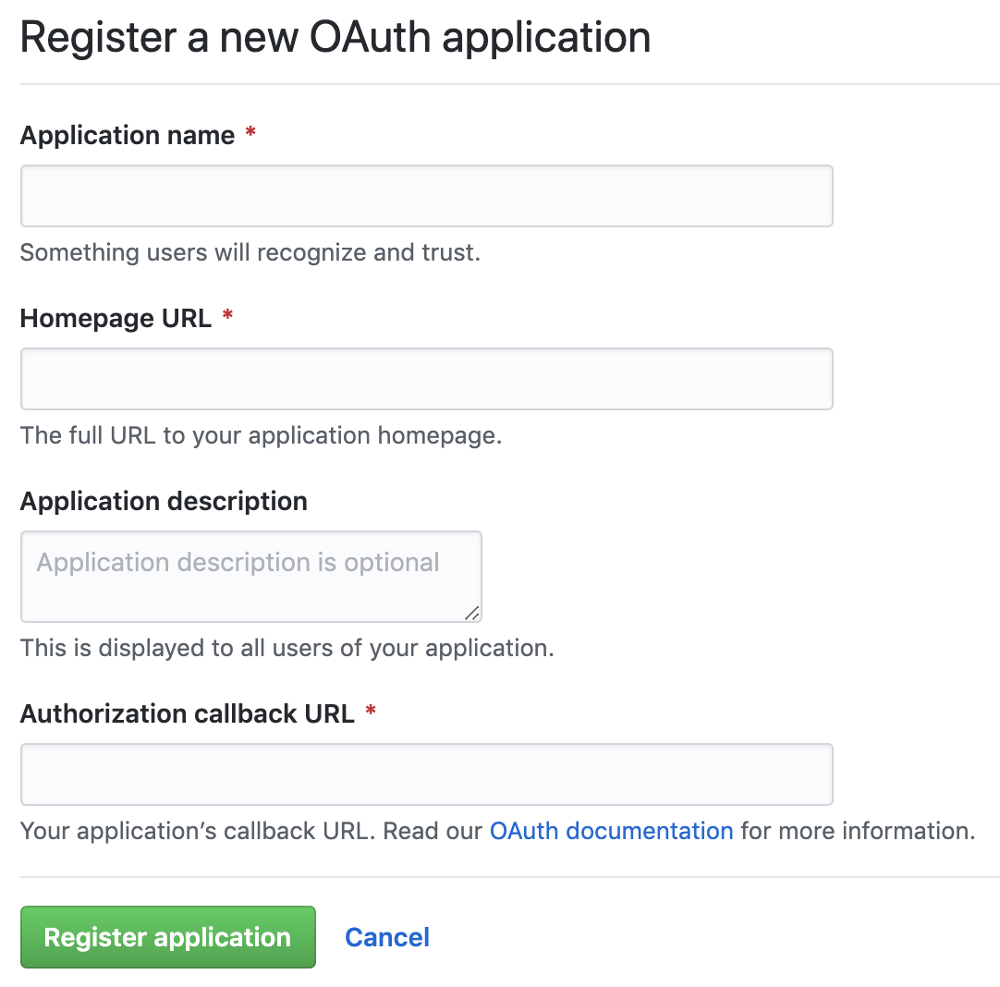

# Course Notes: Just Express

The starter files for the course can be found [on GitHub](https://github.com/robertbunch/justExpress).

## Introduction

<details><summary> <strong>Beginning remarks (main job of Express)</strong></summary>

The main job for Express is to manage HTTP traffic (i.e., manage how the [request](https://expressjs.com/en/5x/api.html#req) and [response](https://expressjs.com/en/5x/api.html#res) go back and forth). Hence, it makes sense to first talk about what HTTP even is and that relies in part on understanding TCP and UDP.

---

</details>

## Before Express

<details><summary> <strong>Express is just a node module</strong></summary>

Express is "just" a node module. Literally, you can [install Express](https://www.npmjs.com/package/express) via NPM because Express is literally just a node module. The [Express website](https://expressjs.com/) makes clear what Express is:

> Express is a minimal and flexible Node.js web application framework that provides a robust set of features for web and mobile applications.

It also makes clear how, implicitly or explicitly, the main job for Express is to manage HTTP traffic via methods on the `request` and `response` objects:

> With a myriad of HTTP utility methods and middleware at your disposal, creating a robust API is quick and easy.

---

</details>

<details><summary> <strong>The cloud</strong></summary>

The cloud is not a cloud but just a network of computers (not belonging to you) talking with each other where the language they speak is in "packets," where these packets are little streams of data.

---

</details>

<details><summary> <strong>Data packets</strong></summary>

The data interchange between client and server happens through packets of data. When you deal with Express, you (i.e., the server) are now put in charge of handling what packets of data people (i.e., the client or browser) receive 

<p align='center'>
  
</p>

So you are now in charge of effectively serving up that content. Node does most of the heavy lifting via low-level C. As can be seen above in the illustration, a "data packet" consists of 5 parts or layers. From the lowest-level to the highest-level, the following are the layers of each packet:

- **Physical:** Cables. These are the actual physical cables connecting things together. See [the submarine cable map](https://www.submarinecablemap.com/) for more details and the end of this note for two visuals (the map of cables and a randomly chosen specific cable).
- **Link:** Wifi or ethernet connection
- **Network:** IP (Internet Protocol)
- **Transport:** UDP/TCP
- **Application:** HTTP, FTP, SSH, SMTP

The network and transport layers together form the internet protocol suite or TCP/IP. 

Developers generally spend the majority of their time in the application, transport, and network layers, with most time being spent specifically in the application layer. Express only handles HTTP requests, but it's important to note that the HTTP application layer uses the transport layer and specifically TCP instead of UDP.

<details><summary> Submarine cable map</summary>

Here is a picture of the entire cable map as of March 27, 2020:

<p align='center'>
  
</p>

---

</details>

<details><summary> Particular cable from the submarine cable map</summary>

Here is a specific cable from the submarine cable map (note it is 11,000km in length and where its landing points are):

<p align='center'>
  
</p>

---

</details>

---

</details>

<details><summary> <strong>TCP and UDP</strong></summary>

You have a computer with an internet connection. The transport layer creates 2^16 = 65,536 ~ 65k ports on your computer. Whenever you start a Node app, say on port 3000, the reason you have that 3000 at all is because you are using one of the 65k ports that the transport layer creates. If you started an app on port 5000 (like a Flask app or Rails app), then again you are using one of those ports. 

Think of your network connection as being a hotel, where the hotel is a single building but with tons of individual rooms that are all numbered. If someone comes to the hotel, then in order to find a guest, they need to know the room number. Armed with the room number, they can actually find who they are looking for. 

Typically what happens is an application of a given machine will issue a network request. Suppose this request is an HTTP request. And suppose the request originates from port 49742 (an arbitrary port of the 65k available). Let's suppose the request wants to talk with port 80 on another computer. That request will get handed off to the transport layer and that will get wrapped up in what's called a segment. Inside of the segment there will be metadata which will have the destination port (i.e., port 80) and the source report (i.e., 49,742). The transport layer will hand that off to the network layer for further processing. When it gets to the receiving machine, it will go through the process in reverse and eventually find the right port. 

There are *two* different kinds of transport layer protocols: UDP and TCP. They can broadly be characterized in the following manner:

### UDP (User Datagram Protocol)

Basically the win is that UDP is crazy fast but the loss is that it is incredibly unreliable. Since Express is based on HTTP and not UDP, Express will not have these faults (but it will also miss out on some of the positives). Here's the high-level view of UDP:

- **Lightweight:** Only 8 bytes for a header. Very little overhead required to work.
- **Connectionless:** If a client wants to talk with a server, then you do not have to create a connection first. You can go ahead and start sending data from the client without a connection to a server being established.
- **Consistency:** UDP is good and bad. 
  * **Bad:** UDP will send data no matter what. This may seem good on the surface but it can also be quite bad. What if there's packet loss? UDP doesn't care. It will keep right on sending packets. It doesn't make any difference. What if the network is very congested? It doesn't care. It will just keep right on sending packets and just making the network more and more congested. What if the packets are out of order? It doesn't care. It's not UDP's problem. They're just going to show up out of order--that will be the other side's problem. 
  * **Good:** Everything mentioned above is bad. So what is good about UDP? What's the win? It's blazing fast. It's very lightweight (the headers are incredibly small). You don't have to bother to set up a connection to start. You can just start sending data. It's consistent in how it sends data. Packets will always show up whether they are ordered properly or not. 
  * **Use cases:** UDP is primarily used for things like video games or real-time communication. If you have ever experienced "lag" in a video game where everything seems to stop or go back in time and then suddenly catch up...that's UDP. That's the client screaming at the server without making a connection. And suddenly the server updates your machine with "Whoops, you're actually way behind. I'm going to start sending some different data." 

### TCP (Transmission Control Protocol)

- **Connection-based:** Unlike UDP, if you are a client and you want to start talking with a computer via TCP (i.e., if you are a browser and want to start communicating with a server), then you don't just start screaming and sending data as in UDP. You have to go through what's called a 3-way handshake. Before you are going to transmit any data, you are going to have to initiate a connection. The 3-way handshake goes like this:
  1. The client says, "Hey, I'd like to talk."
  2. The server responds with yes or no. Hopefully the server responds with yes and that it is happy to set up a connection.
  3. Actual data starts being transmitted.

  These are the 3 steps that will happen before a TCP connection actually goes through.
- **Reliable:** From the above, we can see TCP is reliable because we actually know the connection is going to happen before any data is transmitted. Additionally, for TCP, there are data acknowledgments. What this means is that every time data is transmitted the server will let the client know that it received the client's data and vice-versa. There's also retransmission of data in TCP. If data isn't received, then the server can let the client know (and vice-versa) that some data was not received and the client can send it again.
- **Ordered packets:** With UDP, there may be packet loss or disorganized packets. With TCP, you can guarantee that the packets arrive in the correct order regardless of what happens with the network.
- **Congestion control:** With TCP, if the network is overwhelmed, it may intentionally introduce latency to try and keep packet loss to a minimum to not make the problem worse.

The upshot of all of this is to use TCP when you need reliability and probably UDP when you need something fast and you don't need it to be reliable.

What you need to remember: TCP and IP, together, get two computers ready to talk with each other. They create an environment that will allow two computers to talk with each other. And HTTP uses TCP as the transport layer because it is reliable whereas UDP is not.

---

</details>

<details><summary> <strong>Some notes about HTTP and its requests</strong></summary>

What do HTTP and HTML have in common? The first two letters: **H**yper **T**ext. Something fun to check out: [info.cern.ch](info.cern.ch). This was the very first webpage that was ever made. It's not just HTML. It was the magic that was being able to get all of the networking happening together to be able to *pass* the HTML around. But HTTP doesn't just pass around HTML anymore. HTTP definitely still passes around HTML but it also passes around images, 4k videos, etc. 

Some highlights about HTTP as a protocol:

- **Efficiency:** It is incredibly efficient. TCP remains connected. It connects and then remains connected until all of the data has been sent. HTTP does not have to stay open. HTTP is only connected when absolutely necessary. Once the request arrives, the machines will disconnect entirely from each other. As soon as the responder is ready, the HTTP connection will reestablish across TCP and will send the response.
- **Stateless:** No dialogue. This means the machines only know about each other for as long as the connection is open. As soon as the connection closes, everything is completely forgotten. So if they need to talk again for any reason, they have to start over completely again, which is like to say it's the very first conversation (i.e., the 3-way handshake needs to occur: tell me who you are and what you want). It's not like a phone conversation where the first person says something (request) and listens for a response and there's a running memory throughout of what is being said back and forth (i.e., there's a history and different points that can be looked back to and referenced to inform and continue the dialogue). Stateless means, "I only know about what you just said right now. And I'm going to respond based on that and then completely forget everything." So the requestor gets one thing to say and the responder gets one thing to say and then they are totally done talking.

Illustration of how this process works in practice: Suppose you have a user on a computer who is connected to the internet. Let's say they go to Udemy's website. Here's the process:
  1. The user is going to go through their internet connection (through their ISP) and they'll bounce around however many times before eventually getting to the host machine, Udemy's servers, via TCP and IP. They will go through the process of establishing that 3-way handshake. This is the first step. TCP says the client (i.e., the user's browser) would like to make a connection to the server (i.e., Udemy's servers). 
  2. Via TCP, the server will respond in the affirmative that a connection can be made. 
  3. Then the data will start to come. Part of that data is going to be the HTTP request. So the HTTP request will come into the server and once the request has hit, then that connection is terminated. The TCP connection is still open but the HTTP request has terminated. The client computer is still patiently waiting for some kind of response. It still wants an HTTP response. While the server does its song and dance, it will get an HTTP response together and send back the response. The connection will then be terminated. And then the TCP connection is also terminated and everything goes away.

That's the basic gist of how the networking will interact and how the HTTP messages will go back and forth. What does an HTTP message actually look like though? See the next note.

---

</details>

<details><summary> <strong>HTTP messages (start line, header, body; request/response)</strong></summary>

There are three parts to an HTTP message: 

1. Start line
2. Header
3. Body

HTTP messages are generally all text so you usually can read an HTTP message. Let's unpack each piece of the above. 

### Start Line

The start line is a *single* line, and it describes the type of request on the way there and on the way back in the response it's the status. 

- **Request:** `method path version-of-HTTP`; for example: `get /blog HTTP/1.1`
- **Response:** `version-of-HTTP status-code`; for example: `HTTP/1.1 404`

### Header

The header specifies the request or describes the body. So essentially what it contains is metadata. And it always comes in the form of key-value pairs. So as JS developer, it will look like an object or JSON. There are loads of options in there and the earliest we will use is a mime-type. For example, we might see something like `content-type: text/html`. There will always be a blank line between the header and body. And that is to indicate that all of the header is done and that it's time for the body.

### Body

The "actual stuff" or what you may think of as maybe the content or HTML, the image, etc. 

| Recap and Example |
| :-- |
| All of the above is what makes up HTTP messages. You have to follow that protocol, namely having a start line, header, and body. |

**Example:** We can use something like `curl` to illustrate the above with `curl -v www.google.com` in Bash to get the following:

``` BASH
# Notes that curl gives us are offset by * markers (this isn't part of the HTTP request):
* Rebuilt URL to: www.google.com/
*   Trying 2607:f8b0:4009:80d::2004...
* TCP_NODELAY set
* Connected to www.google.com (2607:f8b0:4009:80d::2004) port 80 (#0)
# Start line
> GET / HTTP/1.1        # GET method; path requested is / (i.e., the root); and protocol is HTTP/1.1
# Header
> Host: www.google.com
> User-Agent: curl/7.54.0
> Accept: */*
# End of header
> 
# In our request, we didn't actually send a body because it's a GET request
# Note the meaning of the left-most arrows: > correspond to request and < to response
# Start line (of response)
< HTTP/1.1 200 OK
< Date: Thu, 02 Apr 2020 05:08:30 GMT
< Expires: -1
< Cache-Control: private, max-age=0
< Content-Type: text/html; charset=ISO-8859-1
...
< Accept-Ranges: none
< Vary: Accept-Encoding
< Transfer-Encoding: chunked
# End of response header
< 
# Response body
<!doctype html>
```

---

</details>

<details><summary> <strong>Node server without Express (the basics/fundamentals)</strong></summary>

<details><summary> TLDR Version</summary>

Here is the TLDR version of possibly the most basic Node server without Express:

```javascript
const http = require('http'); 

const server = http.createServer((req, res) => {
    res.writeHead(200, {'content-type': 'text/html'});
    res.write('<h1>Hello, World!</h1>');
    res.end();
});

server.listen(3000);
```

---

</details>

| Note |
| :--- |
| It is always a good idea to consult [the docs](https://nodejs.org/dist/latest-v12.x/docs/api/) through [the Node website](https://nodejs.org/en/). There you will find documentation about all things Node. For example, [under HTTP](https://nodejs.org/dist/latest-v12.x/docs/api/http.html#http_http) you will see the following: "To use the HTTP server and client one must `require('http')`. |

In setting up a Node server without Express, we use the following (all of which can be read up on through the links to the docs as noted above): 

| Class | Syntax | Documentation |
| --- | --- | :-: | --- |
| `N/A` | `http.createServer([options][, requestListener])` | [Link](https://nodejs.org/dist/latest-v12.x/docs/api/http.html#http_http_createserver_options_requestlistener) |
| [`http.ServerResponse`](https://nodejs.org/dist/latest-v12.x/docs/api/http.html#http_class_http_serverresponse) | `response.writeHead(statusCode[, statusMessage][, headers])` | [Link](https://nodejs.org/dist/latest-v12.x/docs/api/http.html#http_response_writehead_statuscode_statusmessage_headers) |
| [`http.ServerResponse`](https://nodejs.org/dist/latest-v12.x/docs/api/http.html#http_class_http_serverresponse) | `response.write(chunk[, encoding][, callback])` | [Link](https://nodejs.org/dist/latest-v12.x/docs/api/http.html#http_response_write_chunk_encoding_callback) |
| [`http.ServerResponse`](https://nodejs.org/dist/latest-v12.x/docs/api/http.html#http_class_http_serverresponse) | `response.end([data[, encoding]][, callback])` | [Link](https://nodejs.org/dist/latest-v12.x/docs/api/http.html#http_response_end_data_encoding_callback) |
| [`http.Server`](https://nodejs.org/dist/latest-v12.x/docs/api/http.html#http_class_http_server) | `server.listen()` | [Link](https://nodejs.org/dist/latest-v12.x/docs/api/http.html#http_server_listen) |

The HTTP module is simply part of Node--it is not a third-party module (like Express) that we need to install with NPM or Yarn or something like that. This is the module that will allow us to make HTTP requests and responses (it has those request and response objects for us to interact with). The HTTP module has a `createServer` method that comes with it.

| Note from the docs about `createServer` |
| :--- |
| In [the docs](https://nodejs.org/dist/latest-v12.x/docs/api/http.html#http_http_createserver_options_requestlistener) we see the syntax `http.createServer([options][, requestListener])` which indicates we are expected to pass `createServer` a `requestListener` function, where the `requestListener` is a function which is automatically added to the `request` event, and `http.createServer` returns a new instance of [`http.Server`](https://nodejs.org/dist/latest-v12.x/docs/api/http.html#http_class_http_server), which is itself an extension of [`net.Server`](https://nodejs.org/dist/latest-v12.x/docs/api/net.html#net_class_net_server), a class used to create a TCP or IPC server. |

<details><summary> <strong>Additional notes about request/response objects with <code>createServer</code></strong></summary>

As noted above, the `requestListener` function passed to `http.createServer` is automatically added to the `request` event, an event that is emitted each time there is a request to the server (where there may be multiple requests per connection such as in the case of HTTP Keep-Alive connections). The docs entry for `request` begin in the following manner:

- `request` [<http.IncomingMessage>](https://nodejs.org/dist/latest-v12.x/docs/api/http.html#http_class_http_incomingmessage)
- `response` [<http.ServerResponse>](https://nodejs.org/dist/latest-v12.x/docs/api/http.html#http_class_http_serverresponse)

The docs note that the `http.IncomingMessage` object extends the [`stream.Readable`](https://nodejs.org/dist/latest-v12.x/docs/api/stream.html#stream_class_stream_readable) class, is created by `http.Server` or `http.ClientRequest`, and is passed as the first argument to the `request` and `response` event respectively. It may be used to access response status, headers, and data.

The docs note that the `http.ServerResponse` class object extends [Stream](https://nodejs.org/dist/latest-v12.x/docs/api/stream.html#stream_stream) and is an object created internally by an HTTP server (not by the user). It is passed as the second parameter to the `request` event. 

---

</details>

In simple terms, the `createServer` method takes one argument, a callback function, where this callback function takes two arguments, the `request` and `response` objects, respectively, which are typically denoted as `req` and `res` to avoid potential naming conflicts while using other node modules.

The `request` and `response` objects, or `req` and `res`, are just that (i.e., what was noted earlier about HTTP traffic and how requests and responses work). The `req` object represents what we know about the requesting machine or the HTTP request that has come in. And we actually know quite a lot about it. Because we need to. We need to be able to get back to them. We need to be able to find them. So their IP address will be in there, we'll know something about their client (i.e., what type of browser it was and stuff like that), what page or route they wanted to find, all the stuff in the headers, whether or not there was any data passed to us, etc. There will be *lots* of stuff inside of the request object. 

The `response` object is what we are going to send back. And, generally speaking, in Express, we are going to get stuff out of the `request` object, and we are going to add stuff to the `response` object. That is somewhat of an oversimplification, but with strict Node we have fairly limited options. Using Express will make our lives so much easier. 

Before we log anything to the console to see anything about a request or possibly putting together a response, we need to be able to *listen* for traffic on the server so we can respond appropriately. Fittingly, `createServer` returns an object with a `listen` method, where `listen` has the following syntax [for TCP servers](https://nodejs.org/dist/latest-v12.x/docs/api/net.html#net_server_listen_port_host_backlog_callback) according to [the docs](https://nodejs.org/dist/latest-v12.x/docs/api/net.html#net_server_listen): 

```javascript
server.listen([port[, host[, backlog]]][, callback])
```

As the docs note, the `listen` function is asynchronous, and when the server starts listening the `listening` event will be emitted. If a `callback` function is passed to `listen`, then the `callback` will be added as a listener for the `listening` event. Hence, it's fairly common to see something like the following:

```javascript
const http = require('http');
const port = 3000;

const server = http.createServer((req, res) => {
  // Stuff
});

server.listen(port, () => console.log(`Server listening on port ${port}!`));
```

The `callback` passed to `listen` in this case is really just a sanity check to make sure the server is listening and that we've started things up effectively. 

| Note about the port number |
| :--- |
| The number `3000` is not special. Neither is `5000` or `8000` or several other arbitrary port numbers (within the 65k possible ports). But there are some exceptions. The port number has to be greater than 1000 because unless your role is `root` then you do not have access to ports 1000 and below unless you change the permissions which is not often advised. |

**Recap:** The HTTP module is native to Node--we do not have to install it. We simply have to ask for it in the form of `const http = require('http');`. We create a `server`. We use the HTTP module to create the server with `http.createServer`, where `createServer` is a function that takes a callback which will run whenever an HTTP request is made to the server. When is an HTTP request made to the server? It is made whenever the `port` on which the server is listening gets an HTTP request. We can try this out with the following simple program:

```javascript
const http = require('http');

const server = http.createServer((req, res) => {
  console.log(req);
});

server.listen(3000);
```

Execute this with Node and then open the browser and go to `localhost:3000`. You should see an enormous object logged to the console. 

<details><summary> <strong>Partial <code>req</code> object logged</strong></summary>

You'll see a ton of different things but here's an example of a few of the things:

```javascript
IncomingMessage {
  _readableState: ReadableState {
    objectMode: false,
    highWaterMark: 16384,
    buffer: BufferList { head: null, tail: null, length: 0 },
    length: 0,
    pipes: null,
    pipesCount: 0,
    flowing: null,
    ended: false,

...

  httpVersionMajor: 1,
  httpVersionMinor: 1,
  httpVersion: '1.1',
  complete: false,
  headers: {
    host: 'localhost:3000',
    connection: 'keep-alive',
    'cache-control': 'max-age=0',
    'upgrade-insecure-requests': '1',
    'user-agent': 'Mozilla/5.0 (Macintosh; Intel Mac OS X 10_14_6) AppleWebKit/537.36 (KHTML, like Gecko) Chrome/80.0.3987.149 Safari/537.36',
    'sec-fetch-dest': 'document',
    accept: 'text/html,application/xhtml+xml,application/xml;q=0.9,image/webp,image/apng,*/*;q=0.8,application/signed-exchange;v=b3;q=0.9',
    'sec-fetch-site': 'none',
    'sec-fetch-mode': 'navigate',
    'sec-fetch-user': '?1',
    'accept-encoding': 'gzip, deflate, br',
    'accept-language': 'en-US,en;q=0.9,la;q=0.8'
  },
  rawHeaders: [
    'Host',
    'localhost:3000',
    'Connection',
    'keep-alive',
    'Cache-Control',
    'max-age=0',
    'Upgrade-Insecure-Requests',
    '1',
    'User-Agent',
    'Mozilla/5.0 (Macintosh; Intel Mac OS X 10_14_6) AppleWebKit/537.36 (KHTML, like Gecko) Chrome/80.0.3987.149 Safari/537.36',
    'Sec-Fetch-Dest',
    'document',
    'Accept',
    'text/html,application/xhtml+xml,application/xml;q=0.9,image/webp,image/apng,*/*;q=0.8,application/signed-exchange;v=b3;q=0.9',
    'Sec-Fetch-Site',
    'none',
    'Sec-Fetch-Mode',
    'navigate',
    'Sec-Fetch-User',
    '?1',
    'Accept-Encoding',
    'gzip, deflate, br',
    'Accept-Language',
    'en-US,en;q=0.9,la;q=0.8'
  ],
  trailers: {},
  rawTrailers: [],
  aborted: false,
  upgrade: false,
  url: '/',
  method: 'GET',
  statusCode: null,
  statusMessage: null,
  client: Socket {
    connecting: false,
    _hadError: false,

...

```

---

</details>

If you look at the above snippet for the `req` object, then you'll see stuff like the `headers` object which is a bunch of key-value pairs like `host: 'localhost:3000'`, what the `user-agent` is, etc. We are not interested in *all* of this right now. The point is that we get a *ton* of information about the HTTP request that's being made in the form of an `IncomingMessage`. 

With the above code, if you actually made the request, then you may see your browser having a spinning wheel or hanging. What's happening? Basically, the browser is waiting for a response. We fielded the request, but we never sent anything back. And that's a problem for the browser because the browser needs a response to know that we are actually finished. This is where the `response` object, or `res`, comes in. It will be our way of responding to the requestor.

Before putting together the `response` object ourselves, recall the following about what each HTTP message (request or response) is comprised of:

- **start line:** Node will take care of this for us.
- **header:** We need to deal with this in Node even though Express will largely take care of this for us in the future.
- **body:** We are absolutely in charge of this. It's a pain to handle in Node but will be much easier in Express.

Let's put together our response message: 

<details><summary> Start line</summary>

Node takes care of this for us so we do not need to worry about.

---

</details>

<details><summary> Header</summary>

The `response` object has a `writeHead` method we can use which takes two arguments, the first being a status code and the second being an object for the mime-type. We can do something like the following:

```javascript
res.writeHead(200, {'content-type': 'text/html'});
```

This will write out our headers.

---

</details>

<details><summary> Body</summary>

The `response` object has a `write` method we can use and we can pass it some HTML to be used as the body for the response:

```javascript
res.write('<h1>Hello, World!</h1>');
```

---

</details>

We finally need to actually use `res.end()` at the very end because we need to let the browser know to close the connection. So here's the final stripped down Node web server without Express:

```javascript
const http = require('http'); 

const server = http.createServer((req, res) => {
    res.writeHead(200, {'content-type': 'text/html'});
    res.write('<h1>Hello, World!</h1>');
    res.end();
});

server.listen(3000);
```

If we now run `curl -v localhost:3000`, we'll get something like the following:

``` BASH
* Rebuilt URL to: localhost:3000/
*   Trying ::1...
* TCP_NODELAY set
* Connected to localhost (::1) port 3000 (#0)
> GET / HTTP/1.1                                # start line (request)
> Host: localhost:3000                          # header 
> User-Agent: curl/7.54.0                       # header
> Accept: */*                                   # header
>                                               # end of start line/headers (and no body)
< HTTP/1.1 200 OK                               # start line (response)
< content-type: text/html                       # header (response)
< Date: Thu, 02 Apr 2020 08:55:29 GMT           # header (inserted by Node)
< Connection: keep-alive                        # header (inserted by Node)
< Transfer-Encoding: chunked                    # header (inserted by Node)
<                                               # end of start line/headers
* Connection #0 to host localhost left intact   # inserted by Node
<h1>Hello, World!</h1>                          # body (response)                       
```

Very cool!

| Note about routing |
| :--- |
| Our little "Hello, World!" message will show up regardless of the path the user tries to visit because we are simply listening on port 3000 for HTTP traffic. Whenever there is traffic, the code above says hey send this response right along. In nodeServerTwo.js, we add a conditional to say what to do based on certain routing (i.e., we will have something specific happen for the home page, etc.) |

---

</details>

<details><summary> <strong>Node server without Express (routing and serving up static files)</strong></summary>

| TLDR |
| :--- |
| The driving point here is that serving up routes and static files in plain Node without Express is **horrible**. It is no fun at all. But as observed at the end of the previous note, we have to have some way of selectively choosing when something renders and when something doesn't. We do not want *everything* to render for a site just when somebody visits the root. Hence, we have to introduce routing of some sort. |

<details><summary> <strong>Basic routing in plain Node without Express</strong></summary>

```javascript
const http = require('http');   // enable ability to manage HTTP traffic
const fs = require('fs');       // access THIS computer's file system (yours, not the requestor's) with Node

const server = http.createServer((req, res) => {
    if (req.url === '/') { // user wants the home page
        res.writeHead(200, { 'content-type': 'text/html' });
        const homePageHTML = fs.readFileSync('node.html');
        res.write(homePageHTML);
        res.end();
    } else if (req.url === "/node.png") {
        res.writeHead(200, { 'content-type': 'image/png' });
        const image = fs.readFileSync('node.png');
        res.write(image);
        res.end();
    } else if (req.url === "/styles.css") {
        res.writeHead(200, { 'content-type': 'text/css' });
        const css = fs.readFileSync('styles.css');
        res.write(css);
        res.end();
    } else {
        res.writeHead(404, { 'content-type': 'text/html' });
        res.write(`<h4>Sorry, this isn't the page you're looking for!</h4>`)
        res.end()
    }
});

server.listen(3000);

```

---

</details>

In the above script, the main "gotcha" is when we try to read in a file that requests *another* file. Hence, for the `node.html` file, which uses the `node.png` file, we have to also make an HTTP request for the `node.png` file which means making another route for `/node.png`. Basically, the whole ordeal becomes quite an enormous mess. Luckily, Express will help us with all of this!

---

</details>

## Express 101 (plain node vs express: basic server, routing, etc.)

<details><summary> <strong>What is Express and why should we care?</strong></summary>

If we visit [the Express website](https://expressjs.com/), then we are greeted with the following:

> Express: Fast, unopinionated, minimalist web framework for Node.js

What does this mean? Well, let's first make it clear that Express is literally "just" a node module. That is, we cannot have Express without Node even though we can have Node without Express (as painful as that might be).

The "fast" part is debatable because everything is fast until it's not. But Express has put in a lot of work to trim things down and make it as lean and lightweight as possible. The "unopinionated" is a market-friendly word but sometimes it's good and sometimes it's bad. Basically, "unopinionated" means they don't force things on you. Rails is basically the opposite--they make decisions for you like sort of corralling you into using Postgres. The "framework" element is mostly a remark on how the Express architects have tried to make everything that one might commonly use when employing Node in an application. 

There are a lot of reasons to use Express. One of the obvious reasons (or it will be obvious) is all of the utilities Express gives us to avoid a lot of the torment we had to endure previously when trying to serve things up and route stuff in Node. Web applications can be made quickly and easily with Express. There are lots of templating engines for Express like Jade/Pug, EJS, Handlebars, etc. Express truly shines in building APIs. It's almost unfair how quickly and easily you can build one and process JSON and respond with JSON. 

---

</details>

<details><summary> <strong>Basic Express server (reworking the Node server in Express)</strong></summary>

Recall the most basic Node server we set up:

<details><summary> Most basic Node server code for reference</summary>

```javascript
// nodeServer.js
const http = require('http');

const server = http.createServer((req, res) => {
    res.writeHead(200, {'content-type': 'text/html'});  
    res.write('<h1>Hello, World!</h1>');                
    res.end();                                          
})

server.listen(3000);
```

---

</details>

We will now recreate the above basic server in Express.

Recall that previously we could just write `const http = require('http');` because the HTTP module is native to Node. Well, the Express module is *not* native to Node. It is a third-party module and thus we need to install it with NPM. So we need to have a `package.json` file in our folder structure. 

| Installing a new node module and where it is saved |
| :--- |
| When you install a new node module, it is going to install itself relative to the first `package.json` it finds. It will put itself in the `node_modules` folder. |

The best way to handle this is to run `npm init` inside of whatever folder your project is in where your node modules should be located (generally at the root-level). 

Since we want to use the Express module, we will execute `npm install express` which then adds a bunch of different dependencies to the `node_modules` folder. Subsequently, we can use the Express module just as we use other modules:

```javascript
const express = require('express');
const app = express();
```

In almost all Express applications, you will include the line `const app = express();` as well. What do these lines do? Well, the `express` variable declared above holds whatever has been exported by the `express` node module. If you look in the `node_modules` folder for `express`, then you can inspect it to see what is being exported (from its `index.js` file). We find the following in `index.js`:

``` JS
module.exports = require('./lib/express');
```

So now we open the `lib` folder inside of the `express` module and look at the `express.js` file. Lots of stuff is being exported but the thing we are interested in is this line which contains what is being exported by default:

```javascript
exports = module.exports = createApplication;;
```

What is `createApplication`? It is a function in that file:

```javascript
function createApplication() {
  var app = function(req, res, next) {
    app.handle(req, res, next);
  };

  mixin(app, EventEmitter.prototype, false);
  mixin(app, proto, false);

  // expose the prototype that will get set on requests
  app.request = Object.create(req, {
    app: { configurable: true, enumerable: true, writable: true, value: app }
  })

  // expose the prototype that will get set on responses
  app.response = Object.create(res, {
    app: { configurable: true, enumerable: true, writable: true, value: app }
  })

  app.init();
  return app;
}
```

So basically write `const express = require('express');` is equivalent to writing `const express = createApplication;`. So when we write `const app = express();` what we are really doing is invoking the `createApplication` function. 

The point of all of this, which may seem like just a bunch of rigmarole, is to train ourselves to think about what is really going on under the hood so we can better inspect problems we may encounter and understand boilerplate syntax.

As noted in [the docs](https://expressjs.com/en/4x/api.html#app.all), the Express `app` comes with a whole bunch of methods, one of which is `all`, which takes two arguments, the first being a route or path and the second being a callback function to invoke if the path specified as the first argument is requested, where the callback accepts three arguments: `req`, `res`, and `next`. The first two we are already acquainted with and the `next` one we will become more acquainted with when we start looking at middleware. 

Let's use `app.all` in a very generic way:

```javascript
app.all('*', (req, res, next) => {
  res.send(`<h1>This is the home page!</h1>`)
})
```

Some things to note here: The `'*'` means we will listen for HTTP traffic for *any* route on the specified port, much as we did previously. The very first win is that Express handles the basic headers (i.e., status code, mime-type; we may have to modify them once we get fancy) which is awesome. Another awesome win is that Express handles closing the connection so we do not manually need to do something like `res.end()`. What we need to deal with is the in-between. We need to come up with the `response` body we want to send back to the requestor. As [the docs](https://expressjs.com/en/4x/api.html#res.send) note, we will not use `res.write` but `res.send`. 

Finally, the last thing we need to do, as noted in [the docs](https://expressjs.com/en/4x/api.html#app.listen), is `app.listen` instead of `server.listen`. 

In sum, we have the following basic servers in Node and Express, respectively:

```javascript
// nodeServer.js
const http = require('http');

const server = http.createServer((req, res) => {
    res.writeHead(200, {'content-type': 'text/html'});  
    res.write('<h1>Hello, World!</h1>');                
    res.end();                                          
})

server.listen(3000);

///////////////////////////////////////////////////////

// expressServer.js
const express = require('express');
const app = express();

app.all('*', (req, res, next) => {
  res.send(`<h1>This is the home page!</h1>`)
})

app.listen(3000);
```

---

</details>

<details><summary> <strong>Basic Express routing concepts and implementation</strong></summary>

We will recreate the plain Node server that served static files in a bit but we should get some basic routing concepts down from Express. 

To get started, we can immediately include the `express` module since we are inside the same directory in which `express` was installed before and we can go ahead and plan to listen on port 3000:

```javascript
const express = require('express');
const app = express();

// routing and other stuff

app.listen(3000);
```

As can be seen in [the docs](https://expressjs.com/en/4x/api.html#app.all), `app` has a ton of methods (but we are especially interested right now in the ones in bold):

- **`app.all()`**
- **`app.delete()`**
- `app.disable()`
- `app.disabled()`
- `app.enable()`
- `app.enabled()`
- `app.engine()`
- `app.get()`
- **`app.get()`**
- `app.listen()`
- `app.METHOD()`
- `app.param()`
- `app.path()`
- **`app.post()`**
- **`app.put()`**
- `app.render()`
- `app.route()`
- `app.set()`
- `app.use()`

We are interested in the bolded ones because they correspond to HTTP verbs! REST verbs! Worth noting is that when you make an HTTP request you are making a *specific* type of HTTP request. We can easily see these methods correspond to what many people would think of as a CRUD application where you can create, read, update, and delete, all of which correspond to `app.post`, `app.get`, `app.put`, and `app.delete`, respectively. (The `app.all` method simply accepts any type of request.)

Of course, a `GET` request is the default for all browsers. This is why a tool like [Postman](https://www.postman.com/downloads/) is so useful. You can make all sorts of requests besides a `GET` request (even though you can do that too of course). 

So the application methods we want to focus on right now are the following:

- `app.all()`
- `app.delete()`
- `app.get()`
- `app.post()`
- `app.put()`

Each of these methods takes two arguments, the first being a route or path and the second being a callback function to invoke if an HTTP request is made to the first argument (i.e., the route or path) with a verb that matches the application method name for that route; that is, something like

```javascript
app.post('/post-something', (req, res, next) => {
    res.send(`<h1>I tried to POST something!</h1>`)
})
```

indicates that we are looking out for an HTTP request to the `post-something` route where the HTTP request is specifically a `POST` request. 

The great thing is we can handle all types of requests on the same path/route with very little overhead. The callbacks for the routes will only respond when a request is made to the specified path and the request is of a type equivalent to the application method being used as above with `post`. This is great news!

The point here is that the routing system in Express is meant to handle two things, namely the type of HTTP request and also the path you actually want to fetch. The application methods are named to correspond with the HTTP verbs they are looking out for. 

Express works from the top down. That is, as soon as we have sent a response, subsequent matching routes won't get run (unless we explicitly architect it in a way to do this). 

---

</details>

<details><summary> <strong>Basic Express server with routing (reworking the Node server in Express)</strong></summary>

Recall the basic albeit tedious Node server we set up that handled basic routing:

<details><summary> Basic plain Node server with basic routing</summary>

```javascript
// nodeServerTwo.js
const http = require('http');  
const fs = require('fs');       

const server = http.createServer((req, res) => {
    if (req.url === '/') { 
        res.writeHead(200, { 'content-type': 'text/html' });
        const homePageHTML = fs.readFileSync('node.html');
        res.write(homePageHTML);
        res.end();
    } else if (req.url === "/node.png") {
        res.writeHead(200, { 'content-type': 'image/png' });
        const image = fs.readFileSync('node.png');
        res.write(image);
        res.end();
    } else if (req.url === "/styles.css") {
        res.writeHead(200, { 'content-type': 'text/css' });
        const css = fs.readFileSync('styles.css');
        res.write(css);
        res.end();
    } else {
        res.writeHead(404, { 'content-type': 'text/html' });
        res.write(`<h4>Sorry, this isn't the page you're looking for!</h4>`)
        res.end()
    }
});

server.listen(3000);
```

---

</details>

Using the routing concepts discussed in the previous note, we will now try to recreate the plain Node server above but in Express.

For us to accomplish this, we will start by noting that `app` comes with a `use` method. Per [the docs](https://expressjs.com/en/4x/api.html#app.use), the `app.use([path,] callback [, callback...])` syntax results in mounting the specified middleware function or functions at the specified path: the middleware function is executed when the base of the requested path matches `path`. 

In our specific use case, we will not explicitly provide the path or callback but instead pass something a built-in middleware function in Express, namely `express.static('public')`. As noted in [the docs](https://expressjs.com/en/4x/api.html#express.static) for `express.static(root, [options])`: This is a built-in middleware function in Express. It serves static files and is based on [serve-static](http://expressjs.com/en/resources/middleware/serve-static.html). The `root` argument specifies the root directory from which to serve static assets. The function determines the file to serve by combining `req.url` with the provided root directory. When a file is not found, instead of sending a 404 response, it instead calls `next()` to move on to the next middleware, allowing for stacking and fall-backs. (See the rest of the docs for more details as well as adding options to `express.static`.)

Worth noting is how `express.static` actually works in light of how most Express applications begin:

```javascript
const express = require('express');
const app = express();
```

We noted previously how the `createApplication` function is the default export from `express` module. But there are several other exports, one of which is the `static` method we are now going to use. If we look in the `node_modules` folder as we did before, then we will see the following lines among others:

```javascript
/**
 * Expose middleware
 */

exports.json = bodyParser.json
exports.query = require('./middleware/query');
exports.raw = bodyParser.raw
exports.static = require('serve-static');
exports.text = bodyParser.text
exports.urlencoded = bodyParser.urlencoded
```

Right now, of course, we are interested in the `exports.static = require('serve-static');` line. We can see how `express.static` is based on the `serve-static` module. We could inspect the `serve-static` module and see what the default export is (it's the function `serveStatic`), but we will not go into the details here. The important thing is that we can pass this function a directory name, say `public` as is often the case, and anytime anybody wants to see a resource located in `public`, we do not have to worry about routing or anything like that. 

| Note about how `express.static` works and serving up tons of files |
| :--- |
| Some people actually use `express.static` to serve up entire front-end sites. If using `express.static('public')`, you could drop an entire front-end site into the `public` folder and you're done. You don't have to deal with many headaches you might have to otherwise endure. You *do not* (and *should not*) put `public` in front of the path to the resource you want to access that is being statically served. For example, if `node.png` is in the `public` folder and we are listening on port 3000, then we can access this picture by going to `localhost:3000/node.png` instead of `localhost:3000/public/node.png`.<br><br>For the sake of clarity, although you would never do this in practice, you could also have `app.use(express.static('node_modules'))` and then you'd be statically serving up all the files in the `node_modules` folder. And then we could access whichever one we want, say the `HISTORY.md` one in the `accepts` node module, like so: `localhost:3000/accepts/HISTORY.md`.<br><br>The point is that if we execute `app.use(express.static('folder-name'))` then the server knows that everything in `folder-name` is going to be served up as part of the root domain. It's worth noting too that you can have as many `app.use(express.static('folder-name'))` commands as you want; that is, you can statically serve the contents of as many folders as you want. Do take care, however, that you do not statically serve something that should not be readily accessible. This is why the convention is to name the folder `public` whose contents you want to be made publicly available. Typically, the stuff you would want to be statically served are things like stylesheets, images, etc. |

To fully recreate our Node server, we will not use Node to read in our `node.html` file with the `fs` module but instead use the `sendFile` method on the `response` object to achieve the same thing (courtesy of the native `path` module so we can use an absolute path which is required). That is, instead of having to deal with 

```javascript
if (req.url === '/') { 
  res.writeHead(200, { 'content-type': 'text/html' });
  const homePageHTML = fs.readFileSync('node.html');
  res.write(homePageHTML);
  res.end();
}
```

we will simply have something like the following:

```javascript
app.all('/', (req, res) => {
    res.sendFile(path.join(__dirname + '/node.html'));
}) 
```

It's very uncommon to do something like `res.sendFile`; instead, typically you would do something like `res.render`, but we have not gotten to templates yet which will make that feasible. 

| Note about `__dirname` |
| :--- |
| As noted on [a Stack Overflow thread](https://stackoverflow.com/q/8817423/5209533), `__dirname` is only defined in scripts (i.e., `.js` files). It's not available in the Node REPL. Basically, `__dirname` means "the directory of this script." In REPL, you do not have a script. Hence, `__dirname` would not have any real meaning. It's too bad this is the case because loading a script file while inside the REPL using `.load` will result in an error if you used `__dirname` in your script. One way to get around this is, inside of the REPL, do something like `__dirname = process.cwd()`. In fact, in light of this, instead of using `path.join(__dirname + '/node.html')` as we did above, we could just as well use `process.cwd() + '/node.html'` as the argument to `res.sendFile`. There's a lot more about `process` and its available methods in [the docs](https://nodejs.org/dist/latest-v12.x/docs/api/process.html). Always look at the docs. |

Recapping, we have the following two equivalent ways of handling the basic routes and serving up static files:

Using Express:

```javascript
// expressServerTwo.js
const express = require('express');
const app = express();

app.use(express.static('public'));

app.all('/', (req, res) => {
    res.sendFile(process.cwd() + '/node.html');
}) 

app.all('*', (req,res) => {
    res.send(`<h1>Sorry, this page does not exist</h1>`)
})

app.listen(3000);
```

Using plain Node:

```javascript
// nodeServerTwo.js
const http = require('http');  
const fs = require('fs');       

const server = http.createServer((req, res) => {
    if (req.url === '/') { 
        res.writeHead(200, { 'content-type': 'text/html' });
        const homePageHTML = fs.readFileSync('node.html');
        res.write(homePageHTML);
        res.end();
    } else if (req.url === "/node.png") {
        res.writeHead(200, { 'content-type': 'image/png' });
        const image = fs.readFileSync('node.png');
        res.write(image);
        res.end();
    } else if (req.url === "/styles.css") {
        res.writeHead(200, { 'content-type': 'text/css' });
        const css = fs.readFileSync('styles.css');
        res.write(css);
        res.end();
    } else {
        res.writeHead(404, { 'content-type': 'text/html' });
        res.write(`<h4>Sorry, this isn't the page you're looking for!</h4>`)
        res.end()
    }
});

server.listen(3000);
```

Hopefully it is clear just how much nicer Express is to work with and how much easier we could get things to scale if we wanted or needed to.

---

</details>

## Express 201 (middleware and rendering)

<details><summary> <strong>Middleware in Express</strong></summary>

Express claims itself to really be two things:

1. A router. We saw several of the possibilities previously with stuff like `apt.post`, `apt.get`, etc.
2. A series of middleware that comprises a web framework. 

What does the second point really mean? Middleware is something that happens ... in the middle ... of something. What do we do a lot of in web applications? We get requests and send responses. Middleware is stuff we can do between getting the request and sending back the response: `req ---MIDDLEWARE---> res`. In more "Express-ish" terms, a middleware function is ANY function that has access to the `req`, `res`, and `next` objects. That said, basically Express is just a bunch of middleware! It's a whole bunch of little functions working in unison that have access to `req`, `res`, and `next` that slowly piece together a cool web framework (that and a router).

Maybe think of an illustrative example like this:

1. Request comes in
2. We need to validate the user (sometimes)
3. We need to store some things in the database
4. If there is data from the user, then we need to parse it and store it
5. Respond

Steps 2-4 above are all situations that must be addressed with middleware functions. They are everything that happens between getting the request and firing back a response. 

The response *always* depends on the result. The nature of the dependence (i.e., large or small) could be negligible as we have seen with what we have done so far (i.e., basically sending back some stuff regardless of what kind of request we get). But in some cases it could matter quite a bit (e.g., whether or not a user is validated). The point is that *how* the response is constructed *always* depends on the request in some manner, and Express has a `locals` property on every `response` object intended to effectively capture whatever we want from a specific request--what we capture from the specific incoming `request` can be stored as local variables on the `response` object via `res.locals`. 

As [the docs](https://expressjs.com/en/4x/api.html#res.locals) communicate about `res.locals`: An object that contains response local variables scoped to the request, and therefore available only to the view(s) rendered during that request / response cycle (if any). Otherwise, this property is identical to [app.locals](https://expressjs.com/en/4x/api.html#app.locals). This property is useful for exposing request-level information such as the request path name, authenticated user, user settings, and so on:

```javascript
// Documentation example usage of how you might want to use res.locals
app.use(function (req, res, next) {
  res.locals.user = req.user
  res.locals.authenticated = !req.user.anonymous
  next()
})
```

Basically, the `response` object has a property called `locals` that is pre-built into Express--it is attached to *every* response, and it will live for the life of the response and it's very useful for passing data over to a template. For now, it is simply nice to know that we will be able to pass `res.locals` around from place to place. Every middleware function will have access to `res.locals` for the life of the response. How? Because every middleware function has access to the `response` object. 

We can illustrate all of this by means of a somewhat phony example involving some `validateUser` middleware:

```javascript
const express = require('express');
const app = express();

function validateUser(req, res, next) {
  res.locals.validated = true;
  next(); 
}

// app.use(validateUser);
app.use('/admin', validateUser);
app.get('/', validateUser); 

app.get('/', (req, res, next) => {
  res.send(`<h1>Main Page</h1>`)
  console.log(`Validated? ${!!res.locals.validated}`);
})

app.get('/admin', (req, res, next) => {
  res.send(`<h1>Admin Page</h1>`)
  console.log(`Validated? ${!!res.locals.validated}`);
})

app.get('/secret', (req, res, next) => {
  res.send(`<h1>This is a secret page. Go away!</h1>`);
  console.log(`Validated? ${!!res.locals.validated}`);
})

app.use('*', (req, res) => {
  res.send(`<h1>Woops! Is no good.</h1>`);
  console.log(`Validated? ${!!res.locals.validated}`);
})

app.listen(3000);
```

Let's now unpack some of the stuff from above:

<details><summary> <strong>Artificial use of <code>res.locals</code> in <code>validateUser</code></strong></summary>

As can be seen with our definition of `validateUser` and our use of `res.locals`, no reference is even made to the `request` object. Nearly always the local variables you want on the `response` object will depend, in some way, on the `request` object as the example in the docs shows:

```javascript
app.use(function (req, res, next) {
  res.locals.user = req.user
  res.locals.authenticated = !req.user.anonymous
  next()
})
```

We will get to such common use cases very soon.

---

</details>

<details><summary> <strong>Non-anonymous middleware by defining <code>validateUser</code> globally</strong></summary>

The `validateUser` function seen above is an explicit, named function declaration which is different than much of the other middleware we have used to this point. Since `validateUser` is a function whose signature contains `req`, `res`, and `next`, we should note that something like 

```javascript
app.get('/', validateUser); 
```

is basically equivalent to

```javascript
app.get('/', (req, res, next) => {
  res.locals.validated = true;
  next(); 
})
```

The main difference is that declaring the `validateUser` middleware globally will give us access to it globally; that is, we can use `validateUser` wherever we want whereas the callback function/middleware in 

```javascript
app.get('/', (req, res, next) => {
  res.locals.validated = true;
  next(); 
})
```

is only available when a `GET` request is made to the root. 

---

</details>

<details><summary> <strong>Effect of <code>next()</code></strong></summary>

It is hard to overstate how critical `next()` really is. Suppose we omitted it in our definition of `validateUser`:

```javascript
...
function validateUser(req, res, next) {
  res.locals.validated = true;
  // next(); 
}

app.use(validateUser);
...
```

What would happen here? Any route that expected us to *use* (i.e., invoke) the `validateUser` function would not actually get around to sending a response. If we actually ran `app.use(validateUser);`, then `validateUser` would be invoked for whatever path we could try to reach, and doing so would result in `validateUser` running but us never actually sending a response back. The browser would just hang. Not good! Don't forget `next()`: you want to hand control off to the next piece of middleware in the cycle (probably the actually routing you have set up).

---

</details>

<details><summary> <strong><code>app.use(validateUser);</code></strong></summary>

The reason `app.use(validateUser);` is commented out is exactly because of its effect: it results in invoking `validateUser` every time *any* HTTP request is made to *any* path (i.e., `validateUser` is used at the "application level"). Of course, in some cases you may want to do this. But the use cases are likely few.

---

</details>

<details><summary> <strong><code>app.use('/admin', validateUser);</code></strong></summary>

The effect of `app.use('/admin', validateUser);` is that we are telling Express to use `validateUser` for *any* type of HTTP request to *only* the `/admin` path. 

---

</details>

<details><summary> <strong><code>app.get('/', validateUser); </code></strong></summary>

The effect of `app.get('/', validateUser);` is that we are telling Express to use `validateUser` only on `GET` requests for only the path `/`.

---

</details>

---

</details>

<details><summary> <strong>Express <code>helmet</code> and other awesome Express middleware</strong></summary>

In this note we will talk about two important methods that belong to the `express` module that have not been used yet, namely `express.json` and `express.urlencoded`, and then one other piece of middleware (from the `helmet` module) that is not native to Express but that we really should always use for security reasons (always wear your `helmet`!).

Looking at [the docs](https://expressjs.com/en/4x/api.html#express), we see a few Express methods we can use:

- `express.json()`
- `express.raw()`
- `express.Router()`
- `express.static()`
- `express.text()`
- `express.urlencoded()`

We have already touched on `express.static`, but we want to look at `express.json` and `express.urlencoded` now. We'll look at the others later. Let's start with `express.json`. 

As [the docs](https://expressjs.com/en/4x/api.html#express.json) note, `express.json([options])` is a built-in middleware function in Express. It parses incoming requests with JSON payloads and is based on [body-parser](http://expressjs.com/en/resources/middleware/body-parser.html). Returns middleware that only parses JSON and only looks at requests where the `Content-Type` header matches the `type` option (the default `type` option is `application/json`). This parser accepts any Unicode encoding of the body and supports automatic inflation of `gzip` and `deflate` encodings. A new `body` object containing the parsed data is populated on the `request` object after the middleware (i.e., `req.body`), or an empty object (`{}`) if there was no body to parse, the `Content-Type` was not matched, or an error occurred. 

Read the above excerpt from the docs again (and actually visit [the docs](https://expressjs.com/en/4x/api.html#express.json) for all sorts of good and more detailed information). Since `express.json` is based on `body-parser`, just like `express.static` is based on `serve-static`, we can see that by installing the `express` module we also install the `body-parser` module as a dependency (we cannot use `express.json` without the `body-parser` and `express.json` is *built-in* middleware in Express), we can take a look inside the `express` node module and we will find `body-parser` listed as one of the `dependencies` in the `package.json`. So what does this mean? Well, if someone sends you JSON, meaning the `Content-Type` is going to come through as `application/json` or something along those lines, then `express.json` will kick into action and parse the body for us. Note that any data that comes into any server (via form submission or whatever), even if it's an Express server, is still going to be interpreted as a basic string. It doesn't make any difference. That's how servers work. The string needs to be parsed to be of much use and we can do that thanks to `express.json`. Of course, we will want to use this everywhere in our Express application (not just on select paths or routes) and thus we will use it like so:

```javascript
app.use(express.json())
```

Now let's consider `express.urlencoded([options])`. As [the docs](https://expressjs.com/en/4x/api.html#express.urlencoded) note, this is a built-in middleware function in Express. It parses incoming requests with urlencoded payloads and is based on [body-parser](http://expressjs.com/en/resources/middleware/body-parser.html). Returns middleware that only parses urlencoded bodies and only looks at requests where the `Content-Type` header matches the `type` option (the default `type` option is `application/x-www-form-urlencoded`). This parser accepts only UTF-8 encoding of the body and supports automatic inflation of `gzip` and `deflate` encodings. A new `body` object containing the parsed data is populated on the `request` object after the middleware (i.e., `req.body`), or an empty object (`{}`) if there was no body to parse, the `Content-Type` was not matched, or an error occurred. This object will contain key-value pairs, where the value can be a string or array (when `extended` is `false`), or any type (when `extended` is `true`).

We will want to use the `express.urlencoded([options])` middleware at the application level just like `express.json([options])` and it's typically good to set the `extended` property to `false` (the default is `true`) to ensure each value in the key-value pairs that make up the `body` of the `request` (i.e., `req.body`) will be a string or an array: 

```javascript
app.use(express.urlencoded({extended: false}))
```

---

</details>

<details><summary> <strong>Example using <code>express.json</code> and <code>express.urlencoded</code> by making an AJAX post request</strong></summary>

To make much of what appeared in the previous note more concrete, consider the following setup: in the root of the project folder, make a `public` folder and create an `ajax.html` file with the following contents:

``` HTML
<!-- ajax.html -->
<h1>AJAX test page has been loaded!</h1>

<script src="https://ajax.googleapis.com/ajax/libs/jquery/3.3.1/jquery.min.js"></script>

<script>

  function makeOurRequest() {
    return $.ajax({
      method: "POST",
      url: "http://localhost:3000/ajax",
      dataType: "text",
      // dataType: "json",
      data: {
        name: "Daniel"
      }
    });
  }

  const theRequest = makeOurRequest();

  theRequest
    .then(response => console.log(`AJAX request successful! Response: `, JSON.parse(JSON.stringify(response))))
    .catch(err => console.log(`AJAX request failed! Error: `, err))

</script>
```

Then at the root of the project folder create a `server.js` file:

```javascript
const express = require('express');
const app = express();
const helmet = require('helmet');

app.use(helmet());

app.use(express.static('public'));
app.use(express.json());
app.use(express.urlencoded({extended: false}));

app.post('/ajax', (req, res) => {
  console.log(req)
  // console.log(req.headers)
  res.send('THIS IS A TEST RESPONSE AS PLAIN TEXT') // for dataType: 'text' in ajax request
  // res.send({message: 'this is a test response as JSON'}) // for dataType: 'json' in ajax request
});

app.listen(3000);
```

Let's walk through what happens when you visit `http://localhost:3000/ajax.html`:

- First, we can only access the `ajax.html` file because it is being statically served thanks to `app.use(express.static('public'))`. Once the document is served and loaded, the scripts in the file fire: jQuery is made available to us and then we make an AJAX request with the following properties:
  + `method: 'POST'`: We are making a post request (which will almost always be the case with form submissions and the like).
  + `url: "http://localhost:3000/ajax"`: We are making a POST request to the `/ajax` route--Express will be responsible for accepting the request and putting together a response.
  + `dataType: 'text'` or `dataType:json`: What kind of data are we sending through? 
  + `data: { name: 'Daniel'}`: The actual data we are sending through.
  + Finally, once the request has been made, the return value from the AJAX request is a promise. If that promise is resolved or rejected, then we will respond to indicate so and this can be seen in the browser console. 
- In `server.js`, we have constructed things so that when a `post` request is made to the `ajax` route, we first log the request (and later the request headers specifically) with `console.log(req)` (which will become relevant soon) and then we send our response (which we have set up to be either text or JSON).

| Note about `dataType` and `arg` in `res.send(arg)` |
| :--- |
| The data type of what we send back in our response should match the `dataType` of the AJAX request. If we specify `dataType: 'json'` in the AJAX request but send back text (e.g., `'THIS IS A TEST RESPONSE AS PLAIN TEXT'`) as our response, then the returned promise from the AJAX request will be rejected. On the other hand, if we specify `dataType: 'text'` on the AJAX request but send back JSON (e.g., `{message: 'this is a test response as JSON'}`), then what we actually get back will be the object as text which is not what we want: `{"message":"this is a test response as JSON"}` instead of `{message: "this is a test response as JSON"}`. |

The above note touches on making sure what is being sent and requested are as expected, but what we *really* do not want to happen is to leave off `app.use(express.json());` or `app.use(express.urlencoded({extended: false}));` in our `server.js` file. Why? Run the server and keep an eye on the console (not the browser console but in Node) for what shows up when you visit `http://localhost:3000/ajax.html`. With everything as it is currently, you should see something like the following towards the end of the logged request object:

```javascript
...
body: [Object: null prototype] { name: 'Daniel' },
...
```

What does this mean? It means the `data` sent through (i.e., POSTed) by the AJAX request is coming through as a value (notably as JSON) on the `body` property for the incoming `req`uest object. This is great! What good would form submissions and stuff of that nature be if you could not actually pull the data from the form submissions effectively? That is what `app.use(express.json());` and `app.use(express.urlencoded({extended: false}));` allow us to do. 

Try repeating the above process but this time comment out `app.use(express.urlencoded({extended: false}));`. What do you see logged to the console for the `body` object? You probably see a line like the following:

```javascript
...
  body: {},
...
```

Now repeat the process yet again but this time *also* commenting out `app.use(express.json());`. What do you get for the `body` object? Nothing at all! That's not good. Now, you could probably try to parse things yourself and find the data you want somewhere in the `req` object, but why do this when all of it has been made easier for you? Express middleware to the rescue!

One point of curiosity: Why did we get the data we wanted when we used `app.use(express.urlencoded({extended: false}));` but only got `{}` when it was commented out? This has to do with the headers. Visit the page again *without* commenting out `app.use(express.json());` or `app.use(express.urlencoded({extended: false}));` while also changing `console.log(req)` to just `console.log(req.headers)`. You should then see a line like the following: 

```javascript
'content-type': 'application/x-www-form-urlencoded; charset=UTF-8',
```

From above, we can see what the mime-type is: `application/x-www-form-urlencoded`. Now *that* is why we need the `app.use(express.urlencoded({extended: false}));` middleware. When a form comes through, unless specified otherwise, usually the default is going to be `application/x-www-form-urlencoded` for the `content-type`. That's typically how data is passed around by default. Oftentimes it will also be passed around as `application/json` or `text/json`. That's what `app.use(express.json());` is for. But we need `urlencoded` because if someone sends us data with the header shown above, then we need some middleware to parse it and the parsing result is made available to us in the `body` object. The data is stored on the `body` property of the `req` object likely because the middleware is based on `body-parser`.

From everything we have seen so far, it is safe to say good practice is to basically always include the following on any Express application:

- `app.use(express.static('public'));`
- `app.use(express.json());`
- `app.use(express.urlencoded({extended: false}));`

It will cover most of your bases and save you from a bunch of headaches of why something doesn't work, why your data isn't coming through, etc.

One last thing to note concerns the use of `helmet` middleware. It sets HTTP headers right upfront and protects you from a bunch of well-known vulnerabilitie. There's really no reason not to use this middleware. It's very simple: 

```javascript
npm i helment                       // install helmet in your package.json
const helmet = require('helmet');   // import its contents (check npm for more options)
app.use(helmet());                  // use it at the application level 
```

Remember: When using Express, make sure to use your `helmet`.

---

</details>

<details><summary> <strong>Responding with JSON</strong></summary>

In the previous note, in one of the examples, we *manually* tried to respond with JSON by including `res.send({message: 'this is a test response as JSON'})` within Express and having `dataType: 'json'` in our AJAX request. But we can do much better. Looking at [the docs](https://expressjs.com/en/4x/api.html#res.json) in the section about the `response` object, we see `res.json([body])`. This seems to be what we want.

From the docs: `res.json([body])` sends a JSON response. This method sends a response (with the correct `content-type`) that is the parameter converted to a JSON string using [JSON.stringify](https://developer.mozilla.org/en-US/docs/Web/JavaScript/Reference/Global_Objects/JSON/stringify). The parameter can be any JSON type, including object, array, string, Boolean, number, or null, and you can also use it to convert other values to JSON.

With this new method, we can drop the `dataType` on the AJAX request completely and just use `res.json`:

```javascript
res.json('Some text');
res.json({message: 'an object without setting dataType on AJAX request'});
res.json(['Some text', {message: 'a message'}, [1,2,3], 4]);
```

As the docs note, any one of the above attempts to respond would result in the parameter (whether it be simple text, an object, an array of a bunch of other things, etc.) being converted to a JSON string using `JSON.stringify` before being sent over the server (remember everything sent over the server is done so as a string ... we simply want the string to be a JSON string which can be effectively parsed). 

To recap: By default, `res.send` is going to set a mime-type of `content-type: text/html`. If, however, we use `res.json`, then the mime-type will be set as `content-type: application/json`. The takeaway is that `res.json` is incredibly important because anytime you need to respond with JSON, which will be very often depending on what you're building, then you're going to use `res.json` and not `res.send`. Any time you are going to respond with HTML, then you will probably use `res.render`, something we will get to shortly.

---

</details>

<details><summary> <strong><code>res.json</code> and <code>res.render</code>: API or server-side rendering</strong></summary>

Something to note which will become more and more evident as you build with Express: `res.render` and `res.json` loosely represent the two main things you would typically do with Express. To make the upcoming need/use of `res.render` evident, let's consider a scenario back in the day where say you wanted to visit MySpace before Facebook killed everything. 

You would get on your computer and go to `www.myspace.com` and you'd connect with their servers. You'd send in a request and the server would need to kick back a response to your browser (which basically only understand HTML, CSS, and JavaScript). So the question becomes: What goes on inside of the server when your request is received? What happens inside? It may be helpful to consider what full stack development is really all about and to look at what makes up a server:

<p align='center'>
  
</p>

You have a number of different layers in the stack. From bottom to top:

- **OS (operating system):** The server is a computer and you have to have an operating system. You can't do anything without an operating system because you need some means of your software interacting with the hardware. Typically the OS will be [Linux](https://en.wikipedia.org/wiki/Linux), [Windows](https://en.wikipedia.org/wiki/Microsoft_Windows), [UNIX](https://en.wikipedia.org/wiki/Unix), etc.
- **WS (web server):** [Apache](https://en.wikipedia.org/wiki/Apache_HTTP_Server), [Nginx](https://en.wikipedia.org/wiki/Nginx), [IIS](https://en.wikipedia.org/wiki/Internet_Information_Services), etc.
- **DB (database layer):** You'd have a whole host of SQL and NoSQL options: [MySQL](https://en.wikipedia.org/wiki/MySQL), [PostgreSQL](https://en.wikipedia.org/wiki/PostgreSQL), [Oracle](https://en.wikipedia.org/wiki/Oracle_Database), [MongoDB](https://en.wikipedia.org/wiki/MongoDB), [Apache CouchDB](https://en.wikipedia.org/wiki/Apache_CouchDB), etc.
- **PL (programming layer):** C, C++, Java, Python, Ruby, PHP, R, etc.
- **Front-end UI (bonus):** Not really a part of the server stack but part of full stack development (the front-end layer). You have React, Vue, Angular, etc.

The OS, WS, DB, and PL layers make up the server. When a user sends a request to port 80 (a port created by the transport layer), what happens? How does the server decide how to respond with HTML, CSS, and JavaScript? Since everyone on MySpace has their own page (just like Facebook), the question becomes: Does MySpace have individual HTML pages stored on the hard drive for every single user (millions of HTML pages, all very similar) that they serve up? Of course not. 

What happens is that the user gets to port 80, and then the web server kicks into gear (say it's Apache). Suppose it's running PHP. It starts processing and interpreting PHP. It realizes it needs some stuff from the database (say from MySQL), go back to running some PHP, get some more stuff from the database (hopping back and forth, back and forth, ...). Eventually the back and forth process finishes, and Apache has finished all of its processing. It's read everything, and Apache sends it back out the door. At this point, then, PHP and MySQL have worked together to create HTML, CSS, and JavaScript. What it created was handed off to Apache/Nginx/IIS and *that* was sent back across the wire via HTTP. 

That's how it happens. There's not an individual HTML file that is requested and then sent back. A whole bunch of stuff goes on inside of the server to ensure all of the proper information is being grabbed. A specific HTML file for you does not exist. What likely exists is some sort of template file. Every user page, no matter how complicated, appears basically the same. Maybe colors are different, the song was different, etc. But the structural integrity (think HTML) of each user page was the same. But all of the particulars about different parts of the structure depended on user-supplied information (stored in databases). 

The key here is that the initial request goes out and grabs the HTML, CSS, and JavaScript once it's been made available. But the servers at MySpace are going to have to prepare a new response for every new request. Each new request is like starting over from scratch. So every time we go to our user page, the user page is built up and sent back. Built up and sent back. Every single time. This is called server-side rendering. Because the *server* is in charge of putting together the HTML, CSS, and JavaScript and sending it back to the browser. Wikipedia still does this. Each page you go to you're restarted the whole process from scratch. That is what we will be doing with `res.render`. So within Express, we will be able to create a template, however complicated. And the server is going to process our template into HTML, CSS, and JavaScript. And the template will ultimately be replaced by user-specific information retrieved in a variety of ways. That is server-side rendering. The server is in charge of everything on every page load always. 

The other weapon is `res.json`. And what would happen in a more modern sense is you would go out to a place like Facebook and the first time you go out you have to get everything. You have to get all the necessary HTML, CSS, and JavaScript. Every following request, every time you click on something after that, because it is a single page application in the case of something like React, when you make a new request, instead of making a full-blown request, you are going to use AJAX and, instead of sending back HTML, CSS, and JavaScript, the server is just going to send back JSON. And that original HTML document which was loaded upon the first request, the JSON is going to go there and update the DOM. So it will *look* like a new page, but it's really just the same HTML, CSS, and JavaScript, but it's going to have some new data in it thanks to the JSON. Since we're using AJAX, we will still have a new request. We will still have a `req` and a `res`, it will still be our responsibility to handle that network traffic, but instead of responding with a template (with all the HTML, CSS, and JavaScript), we are *just* going to respond with JSON. 

So the quick review: `res.render` is server-side rendering whereas `res.json` is going to mostly be for API/JSON needs. Server-side rendering is, "I am going to the server and every time the server is going to respond with *new, fresh* HTML, CSS, and JavaScript. Every single time. Always. Think Wikipedia. With `res.json`, or an API type situation, you as the user are going to go out, hit the server, and the server the first time is going to send you a whole bunch of HTML, CSS, and JavaScript. But every time after that, the server is just going to send JSON. And the page or the DOM will update itself accordingly to reflect the incoming data (i.e., JSON) after an AJAX request. Think Facebook or Amazon.

In one case, you always have to come back to the server. The nice thing with `res.render` is you can make use of session variables, cookies, etc. The user always has to come to the server for everything because the server contains everything. The other architecture is very fast, it creates a great UI/UX opportunity, but you have to start storing stuff on the browser you would maybe not normally want to store there.

---

</details>

<details><summary> <strong>Wiring up Express with a view engine</strong></summary>

Let's wire up a basic Express server as we have done previously:

```javascript
const express = require('express');
const app = express();

const helmet = require('helmet');

app.use(helmet());

app.use(express.static('public'));
app.use(express.json());
app.use(express.urlencoded({extended: false}));

app.get('/', (req, res, next) => {
  // res.send('Sanity check')
  // res.json({msg: 'Success!'}) // Send back some legitimate JSON
  res.render('index') // We get an error without a view engine
})

app.listen(3000)
```

Right now, if we visit `http://localhost:3000/`, we'll get an error:

```
Error: No default engine was specified and no extension was provided.
```

The error message you might get sometimes can be rather scary, but often a good strategy is to look for whatever files *you* have created. If we do that, then we will see (in my case)

```
at /Users/danielfarlow/[...]/just-express/express201/rendering.js:14:7
```

This is telling us that there is an issue in the `rendering.js` file (which we have created) on line 14, character 7. In order to use `res.render`, the process goes something like this: 

1. Express as we know it "happens" (i.e., our `rendering.js` file is nothing special except for trying to use `res.render` in one of its route handling response methods; otherwise it's business as usual). All the Node happens. We include express (i.e., `const express = require('express')`), we make our app (i.e., `const app = express()`), we do our middleware, we build our routes, etc. 
2. We define a view engine. There are several options (these are just a few of the most popular ones):
  - [EJS](https://ejs.co/) (Embedded JavaScript): From the home page: What is the "E" for? "Embedded?" Could be. How about "Effective," "Elegant," or just "Easy"? EJS is a simple templating language that lets you generate HTML markup with plain JavaScript. No religiousness about how to organize things. No reinvention of iteration and control-flow. It's just plain JavaScript. Install [via NPM](https://www.npmjs.com/package/ejs) with `npm install ejs`.
  - [Mustache](http://mustache.github.io/): Logic-less templates for a variety of templates. If we were to use this, then we would be interested in [mustache.js](https://github.com/janl/mustache.js), a zero-dependency implementation of the mustache template system in JavaScript. Install [via NPM](https://www.npmjs.com/package/mustache) with `npm install mustache`. 
  - [Jade/Pug](https://pugjs.org/api/getting-started.html): Pug is a high-performance template engine heavily influenced by Haml and implemented with JavaScript for Node.js and browsers. Previously named "Jade," it is now named "Pug" thanks to the fact that "Jade" was a registered trademark. Basically, Pug is a clean, whitespace sensitive syntax for writing HTML (see [the Pug GitHub page](https://github.com/pugjs/pug) or its [API reference](https://pugjs.org/api/reference.html) for more). Install [via NPM](https://www.npmjs.com/package/pug) with `npm install pug`.
3. Inside one of our routes we have a `res.render`. 
4. We pass that `res.render` two things:
  1\. The file we want to use (e.g., an `.ejs` file, a `.mustache` file, a `.handlebars` or `.hbs` file, a `.pug` file, etc.).
  2\. The data we want to send to that file.
5. Express uses the node module for our specified view engine and parses the file accordingly. That means it takes the HTML, CSS, and JavaScript and combines it with whatever "node" there is in the file (i.e., the data available in `res.locals`).
6. The final result of this process is a compiled product of the things the browser can read (i.e., HTML, CSS, and JavaScript).

All the steps above constitute "the round trip" for a `res.render`. The templating engine serves as a bridge between Node and the front-end stuff. We can make a template out of HTML, CSS, and JS, and we can have a bridge that will allow us to access Node.js stuff. The specific bridge is the second argument to `res.render` (i.e., the data we want to send to our template file). That object, the data we want to send to our template file, is made available as `res.locals`. It will give us the ability to pass in a user's name, whether or not the user is validated, and generally any kind of data we might want to send over to the template. And then the template engine can fill out the HTML accodingly with the given data. So Express uses the node module for the view engine and will parse the template file out. It will combine all of the "node stuff" (i.e., the data we make available in `res.locals`) and combine it with HTML, CSS, and JavaScript to return a product of *only* HTML, CSS, and JavaScript that can be sent to the requesting client. 

Before we can effectively use `res.render`, we need to use `app.set` to tell Express what will be used as the templating engine. Note that `app.set` is used for more than just this functionality though.

| [The docs](https://expressjs.com/en/4x/api.html#app.set) on `app.set(name, value)` |
| :--- |
| `app.set(name, value)` assigns setting `name` to `value`. You may store any value that you want, but certain names (like `'view engine'` in our case) can be used to configure the behavior of the server. These special names are listed in the [app settings table](https://expressjs.com/en/4x/api.html#app.settings.table).<br><br> Calling `app.set('foo', true)` for a Boolean property is the same as calling `app.enable('foo')`. Similarly, calling `app.set('foo', false)` for a Boolean property is the same as calling `app.disable('foo')`. <br><br> Retrieve the value of a setting with `app.get()`: `app.set('title', 'My Site')` and then `app.get('title') // "My Site"`|

Underneath the high-level description above in the docs, we see a section about "Application Settings" that provides a table of different properties (where each property corresponds to a `name`, the first argument to `app.set`), the type for that property, a description of the property, and what the default value is. In particular, we `view engine` is one such property, it's a string, a description (the default engine extension, file name extension that is, to use when omitted; note: sub-apps will inherit the value of this setting), and finally a default value of `undefined` (we will need to provide a value that reflects the template or view engine we want to use whether that's `ejs`, `hbs`, `pug`, etc.).

With all of the above said, let's modify our server by running `npm install ejs` and then adding `app.set('view engine', 'ejs')` and see if we encounter any errors:

```javascript
const express = require('express');
const app = express();

const helmet = require('helmet');

app.use(helmet());

app.use(express.static('public'));
app.use(express.json());
app.use(express.urlencoded({extended: false}));

app.set('view engine', 'ejs');

app.get('/', (req, res, next) => {
  res.render('index');
})

app.listen(3000)
```

If we go to `http://localhost:3000/`, then we do get an error, namely the following:

```
Error: Failed to lookup view "index" in views directory "/Users/danielfarlow/[...]/express201/views"
```

So what happened? We failed to lookup view `'index'`. Why `index`? Well, we told Express to go looking for a file `index` by using `res.render('index')`. What should the file extension of `index` be? It should be `.ejs` according to `app.set('view engine', 'ejs')`. Well, we don't have an `index.ejs` file. Furthermore, Express went looking for the `index.ejs` in the `views` folder. But we don't currently have a `views` folder. Why did Express go looking for this file in the `views` folder?

The answer, as usual, is in the documentation. In the "Application Settings" table under [the docs entry](https://expressjs.com/en/4x/api.html#app.set) for `app.set` we see a `name` of `views` that is expected to be a string or array, with a description (a directory or an array of directories for the application's views. If an array, the views are looked up in the order they occur in the array), and finally a default value of `process.cwd() + '/views'` (i.e., the current working directory or `cwd` with `/views` appended to it; basically, it's just looking for the `views` folder in your project director). We're going to be more explicit than `process.cwd() + '/views'` by using the `path` module and using `path.join(__dirname + '/views')`. What's the difference?

| Note: `process.cwd()` vs `__dirname` in Node.js |
| :--- |
| Some helpful comments can be found on [a Stack Overflow post](https://stackoverflow.com/q/9874382/5209533). Basically, the `cwd` in `process.cwd()` is a method of the global object `process` where the return value is a string representing the current working directory of the Node.js process (i.e., where you are currently running Node or simply the directory from which you invoked the `node` command). On the other hand, `__dirname` is the string value of the directory name for the directory containing the current script. The big difference is that `__dirname` is not actually a global but rather local to each module. You can always execute `process.cwd()` to find out where the Node.js `process` originated or is running (you can actually change this with `process.chdir` but we do not need to worry about that right now).<br><br> In a nutshell, knowing the scope of each makes things easier to remember. `process` is `node`'s global object, where `.cwd()` returns where Node is running. `__dirname` is `module`'s property, where the value represents the file path of the module. Similarly, `__filename` is another `module`'s property which holds the file name of the module. |

All that said, `require` the native `path` module at the top of your server like so: `const path = require('path');`. Then, underneath  `app.set('view engine', 'ejs');` we can add `app.set('views', path.join(__dirname + '/views'));`. Then create a `views` folder and place an `index.ejs` file inside of the `views` folder with just an `<h1>Rendered file!</h1>` for right now. So here are the three pieces to `res.render` for a specific file:

1. **The file name:** For example: `index` in `res.render('index');`
2. **The type or extension of the file:** For example: `app.set('view engine', 'ejs');`. This tells us we will be looking for `index.ejs`.
3. **The location of the file:** For example: `app.set('views', path.join(__dirname + '/views'));` tells us the file will be in the `views` directory which should be at the same level at whatever script we are writing our code in (see note above). If we have more than one folder for the views, then the docs note we can include something like `app.set('views', [folder1, folder2, ...]);` where each folder will be searched for the file until the first one is found. It should be noted here that Express will *not* search subdirectories you create within the `views` directory if you plan on creating subdirectories. 

---

</details>

<details><summary> <strong>Using more than one view engine in Express</strong></summary>

In the note above, we learned the basics of wiring up Express with a view engine. It's entirely plausible (albeit somewhat unlikely) that you would want to use *more than one* view engine. Maybe you liks EJS for certain things and Pug more for others. Whatever the case, you can use as many view engines as you like. The only catch is you will have to be explicit for what files you want to render.

Recall from [the docs](https://expressjs.com/en/4x/api.html#app.set) concerning `app.set(name,value)`, the `'view engine'` `name` takes one `value`, the extension to be used for a file name when the file name extension is omitted. Hence, if we declare

```javascript
app.set('view engine', 'ejs');
```

and later invoke `res.render('index');`, then we have basically told Express to assume there's an `.ejs` extension on the end of the `index` file name given to `res.render`. If we did not use `app.set('view engine', 'file-extension')`, then Express would not know what to do with `res.render(index)`. Instead, we would have to *explicitly* (i.e., manually) include the filename extension like so: `res.render(index.ejs)`. The upshot of all this is basically we should use `app.set('view engine', 'file-extension')` to tell Express the *default* template engine we want to use when filenames are provided to `res.render` when the file extension for the file name is omitted. If you want to use a view engine other than the default one set by `app.set('view engine', 'file-extension')`, then you must explicitly provide the file extension for whatever file name you pass into `res.render`. 

Here's the process in more detail with a working server example below it:

1. NPM install the engines you need:

```bash
npm install ejs
npm install pug
npm install hbs
```

2. Set the engine you want to be your default view engine:

```javascript
/* Setting the default view engine
  - Uncomment whichever line you want to set your default view engine
  - Whichever one you uncomment means you do not need to provide 
    the file extension for that file when the file name is passed to
    res.render. For example, if you uncommented the line setting ejs
    to the default view engine, then you could use res.render(index)
    and Express would automatically look for index.ejs
  - If you do not uncomment one of the lines below, then you will always
    have to manually specify the file extension for the file name passed
    to res.render
  - If you set ejs as the default view engine, then whenver you want to
    use hbs, pug, or something else, then you will need to explicitly
    provide the file extension for the file name passed to res.render.
  - In summary, if we set ejs to be the default view engine, then we 
    could use ejs, hbs, and pug in our application like so:
    * res.render(index);        // assumes the file is index.ejs
    * res.render(index.hbs);    // explicitly tell Express to use Handblebars
    * res.render(index.pug);    // explicitly tell Express to use Pug
*/
// app.set('view engine', 'ejs');    // EJS
// app.set('view engine', 'hbs');    // Handlebars
// app.set('view engine', 'pug');    // Pug
```

3. Render your template (be sure to set the file extension when rendering a template without the default extension):

```javascript
res.render(index);        // assumes default use of .ejs extension per above
res.render(index.hbs);    // specify use of handlebars as hbs is not the default
res.render(index.pug);    // specify use of pug as pug is not the default
```

Finally, here's an example tying all of this together (see below the code snippet for directory structure and file contents):

```javascript
// server.js
const path = require('path');

const express = require('express');
const app = express();

const helmet = require('helmet');

app.use(helmet());

app.use(express.static('public'));
app.use(express.json());
app.use(express.urlencoded({extended: false}));

// Set the default view engine
app.set('view engine', 'ejs');   // uncomment to make default
// app.set('view engine', 'hbs');   // uncomment to make default
// app.set('view engine', 'pug');   // uncomment to make default

// Specify folders for Express to look in for views files
app.set('views', [
  path.join(__dirname + '/views'), 
  path.join(__dirname + '/views/ejsViews'),
  path.join(__dirname + '/views/handlebarsViews'),
  path.join(__dirname + '/views/pugViews'),
  path.join(__dirname + '/viewsFakeOne'),
]);

// For base visit to the root
app.get('/', (req, res, next) => {
  res.render('index');
})

// For files directly in the views folder (which will be typical)
app.get('/sampleejs', (req, res, next) => {
  res.render('sample', {name: 'EJS'});
})

app.get('/samplehandlebars', (req, res, next) => {
  res.render('sample.hbs', {name: 'HANDLEBARS'});
})

app.get('/samplepug', (req, res, next) => {
  res.render('sample.pug', {name: 'PUG'});
})

// For files in subdirectories of the views folder (somewhat common)
app.get('/subfolderejs', (req, res, next) => {
  res.render('subEjsView', {name: 'EJS in a subfolder'});
})

app.get('/subfolderhandlebars', (req, res, next) => {
  res.render('subHandlebarsView.hbs', {name: 'HANDLEBARS in a subfolder'});
})

app.get('/subfolderpug', (req, res, next) => {
  res.render('subPugView.pug', {name: 'PUG in a subfolder'});
})

// For a file in a viewsFakeOne folder not within views folder
app.get('/fakeview', (req, res, next) => {
  res.render('fakeview', {name: 'EJS in a viewsFakeOne directory'});
})

app.listen(3000)
```

Directory structure needed for this code:

```
express201
  node_modules
  views
   ejsViews
    subEjsView.ejs
   handlebarsViews
    subHandlebarsView.hbs
   pugViews
    subPugView.pug
   index.ejs
   sample.ejs
   sample.hbs
   sample.pug
  viewsFakeOne
   fakeview.ejs
  package-lock.json
  package.json
  server.js
```

File contents:

```javascript
// subEjsView.ejs
<h1>A template file rendered using <%= name %>!</h1>

// subHandlebarsView.hbs
<h1>A template file rendered using {{name}}!</h1>

// subPugView.pug
h1 A template file rendered using #{name}!

// index.ejs
<h1>Rendered template page!</h1>

// sample.ejs
<h1>A template file rendered using <%= name %>!</h1>

// sample.hbs
<h1>A template file rendered using {{name}}!</h1>

// sample.pug
h1 A template file rendered using #{name}!

// fakeview.ejs
<h1>A template file rendered using <%= name %>!</h1>

// server.js (the code snippet previously)
```

---

</details>

<details><summary> <strong>Example of putting an entire frontend site in Express</strong></summary>

As mentioned previously, we can host entire frontend sites using Express by just dumping everything in a `public` folder and statically serving it. Execute the following commands in the terminal (e.g., bash):

``` BASH
# Navigate to desktop or wherever you want the project to be created
cd ~/Desktop
# Clone the repository at https://github.com/rbunch-dc/jquery-todo
git clone https://github.com/rbunch-dc/jquery-todo.git
cd jquery-todo
# Get rid of the git repository--we don't need it for this example
rm -rf .git
mkdir public
touch server.js
# Initialize a project using npm
npm init -y
npm i express helmet
npm i nodemon -g # if you haven't already
nodemon server.js
```

Now, move all of the files in the directory except `server.js` into the `public` folder (using VSCode or whatever editor you are using) and paste the following code into the empty `server.js` folder and save the file:

```javascript
// server.js
const express = require('express');
const app = express();

const helmet = require('helmet');

app.use(helmet());

app.use(express.static('public'));
app.use(express.json());
app.use(express.urlencoded({extended: false}));

app.get('/', (req, res, next) => {
  res.send('index.html')
})

app.listen(3000);
```

Now navigate to `http://localhost:3000/` and behold!

---

</details>

<details><summary> <strong>Small preface to rendering</strong></summary>

When using `send`, `sendFile`, or `express.static`, we are always sending back HTML, CSS, and JavaScript. Why? Because the browser is on the other end and it is expecting ... HTML, CSS, and JavaScript. The *goal* of Express is to always get to this point *somehow* (i.e., sending back HTML, CSS, and JavaScript). The goal of Express will be either to send back JSON (like in the case of using React or some modern rendering for single page applications) or likely to send back something that is not a *static* product. That is, we do not want to send back static code (as is the case when just dumping a bunch of code in the `public` folder). What if instead of using JavaScript to manipulate the DOM, what if we actually wrote the DOM the way that we wanted it from the beginning. So when the response is initially sent out, instead of having something where blanks are waiting to be filled in with JavaScript, what if instead of that the DOM were written so that when it showed up it showed up front in the correct way? Then we wouldn't need JavaScript to get involved because the DOM would already be correct. We wouldn't need that extra step. But in order to know what would be in the blanks, we need information from Node. In order to pull that off, if we're not going to use JavaScript to manipulate the DOM directly, then we need something in between that can speak both Node and front-end. That thing that speaks both Node and front-end ... that thing is a template engine. 

When a request comes in, Express does its thing internally (our routes and stuff). Before the response goes out, we send a template some Node (i.e., some data from Express) for the template engine to make sense of. Since the template engine speaks both Node and front-end, it will build HTML, CSS, and JavaScript for us, and then it will take that final product and send it back out as the response. So the main job of the template engine is to marry the data from Express to the front-end so that what we get in the end is not a static front-end site but a dynamic front-end site where we can build the DOM based on Node.js. 

In a previous note we talked about a variety of things that went on to use `res.render`. Recall the last 3 parts:

4. We pass `res.render` two things:
  1\. The file we want to use (e.g., an `.ejs` file, a `.mustache` file, a `.handlebars` or `.hbs` file, a `.pug` file, etc.).
  2\. The data we want to send to that file.
5. Express uses the node module for our specified view engine and parses the file accordingly. That means it takes the HTML, CSS, and JavaScript and combines it with whatever "node" there is in the file (i.e., the data available in `res.locals`).
6. The final result of this process is a compiled product of the things the browser can read (i.e., HTML, CSS, and JavaScript).

Note how step 5 is the translation part. It is where Express uses the node module for the specified view engine to parse the template file from a little bit of Node and some HTML, CSS, and JavaScript to *only* HTML, CSS, and JavaScript.

Finally, one very important thing to note concerning something we have

---

</details>

<details><summary> <strong><code>res.locals</code> and passing data in <code>res.render</code></strong></summary>

As noted in [the docs](https://expressjs.com/en/4x/api.html#res.render) for `res.render(view [, locals] [, callback])`: Renders a `view` and sends the rendered HTML string to the client. Optional parameters:

- `locals`, an object whose properties define local variables for the view.
- `callback`, a callback function. If provided, the method returns both the possible error and rendered string, but does not perform an automated response. When an error occurs, the method invokes `next(err)` internally.

There's more from the docs, but what's important to us is the first point about `locals`. Whatever data is passed to `res.render` as the second argument is automatically appended to the `locals` object available in whatever view we are dealing with. Not only that but we can use the data property names directly for their values instead of having to worry about a bunch of destructuring (unless we want to). 

As an example, suppose we have the following in our server file:

```javascript
app.get('/', (req, res) => {
  res.render('index', {
    msg: 'Here is a message.',
    secret: 'This is a secret',
    friends: ['John', 'Jeff', 'Eric']
  });
});
```

And suppose our EJS view is like this:

``` HTML
<h1>Silly example of locals object and its use!</h1>

<h2>The message</h2>
<li><%= msg %></li>

<h2>The secret</h2>
<li><%= secret %></li>

<h2>The friends</h2>
<li>As a basic array: <%= JSON.stringify(friends) %>. But below we list them:</li>
<% for (let i = 0; i < friends.length; i++) { %>
  <li><%= friends[i] %></li>
<% } %>

<h2>The entire locals object</h2>
<pre><%= JSON.stringify(locals, null, 2) %></pre>
```

Then what you will see will be something like the following:

<p align='center'>
  
</p>

Look at all of the properties on the `locals` object! In particular, note how our data was appended to the `locals` object and made available as local variables in the view. We didn't have to use `locals.msg` or anything like that. We also never had to do anything like `res.locals` because it is already a given that we are inside of the `response` object (i.e., `res`) when dealing with our view. This should make sense because we are, after all, inside of `res.render` when specifying what data gets passed to the view template. In fact, trying to access `res.locals` won't even work inside of the template file because that's basically the same as trying to do `res.res.locals` since we are *already* inside of the response object. So when using `locals` just remember you are already inside of the `response` object and that your data is accessible directly using the data property names instead of `locals.<property-name>`.  

*That* is why templating is powerful. We essentially have a bridge between our `.ejs`, `.hbs`, `.pug` or whatever template file/engine you use and the Express server. The `locals` made available in the template comes from the route visited by the user (and whatever middleware is involved in that process). When we're ready to build the DOM, we need something from Express, and we'll write it to our response before it's ever sent out so the browser will never have any idea what's going on behind the scenes. 

It's important to note that `res.locals` lives throughout the lifetime of preparing the `response` (i.e., `res`). When we are actually ready to render and use `res.render`, the second argument passed in to `res.render`, if any, will simply be appended to whatever `res.locals` already is up to that point; that is, we have lots of opportunities between receiving the `request` and calling `res.render` to modify the `res.locals` object using middleware. 

Let's consider a somewhat contrived example to make this more concrete. Suppose we have the following in our `index.ejs` file:

``` HTML
<h2><%= bannerMsg %></h2>
<h2><%= _locals.bannerMsg %></h2>

<p style=<%= userType === 'premium' ? 'color:green;' : 'color:red;' %>> <%= greetingMsg %> </p>

<h2>The entire locals object</h2>
<pre><%= JSON.stringify(locals, null, 2) %></pre>
```

And we have the following in our Express server file:

```javascript
const path = require('path');

const express = require('express');
const app = express();
const helmet = require('helmet');

app.use(helmet());

app.set('views', path.join(__dirname + '/practice-views'));

app.set('view engine', 'ejs'); 

app.use(express.static('public'));
app.use(express.json());
app.use(express.urlencoded({extended: false}));

function randomNumInclusive(min,max) {
  return Math.floor(Math.random() * (max - min + 1)) + min;
}

function validateUser(req, res, next) {
  res.locals.validated = (randomNumInclusive(0,1) === 1 ? true : false);
  next();
}

function userType(req, res, next) {
  let {validated} = res.locals;
  res.locals.userType = (validated ? 'premium' : 'basic');
  next();
}

function greetingMsg(req, res, next) {
  let {userType} = res.locals;
  res.locals.greetingMsg = (userType === 'premium' ? 
    'Thanks for using premium! Drop us a line if you see room for improvement.'
    : 'Enjoying your basic plan? Consider upgrading to premium!')
  res.locals.bannerMsg = 'bannerMsg set on res.locals during middleware sequence'
  next();
}

app.get('/', validateUser);
app.get('/', userType);
app.get('/', greetingMsg);

app.get('/', (req, res, next) => {
  res.render('index', {
    bannerMsg: 'bannerMsg passed manually in second argument in res.render'
  });
});

app.listen(3000);
```

First let's take a look at the two possible outcomes and then tease apart what all is happening/happened:

<p align='center'>
  &nbsp;&nbsp;&nbsp;&nbsp;
  
</p>


The `randomNumInclusive` function is only meant to ensure we get a random number between 0 and 1, inclusive, to simulate randomly determining whether or not a user is validated so as to start the cascading effect that will become apparent:

- `app.get('/', validateUser);`: Express knows to run the `validateUser` middleware as soon as a GET request is made to the root. We randomly determine whether or not the user is validated and store the result on the `res.locals` object as `validate: true/false`. Since `next()` is in this middleware, control gets handed off to the next piece of middleware.
- `app.get('/', userType);`: This is the `next` piece of middleware referred to above. The `userType`, `premium` or `basic`, is determined at this step based on whether or not the user was (randomly) validated from the previous piece of middleware. Note how we actively use `res.locals` in this piece of middleware to *further* add data to `res.locals` in the form of what `userType` we have. If the user is validated, then the `userType` is set to `premium`. If not, then `userType` is set to `basic`. Control is now passed to the `next` piece of middleware.
- `app.get('/', greetingMsg);`: A greeting message is formed based on what `userType` we have. Control is now passed to the `next` and final piece of middleware where `res.render` is called.
- We use `res.render`: At this point, `res.locals` has a number of different properties and corresponding values on it. Note that *we do not have to pass `res.render` a second argument in order to have access to `locals` as local variables in the template file*. That is, when we call `res.render`, it is up to us if we want to pass *additional* data to be appended to `res.locals`. At this point, we can use anything/everything on the `locals` object in the template file. 

**Note:** Properties and values manually set on `res.locals` throughout the middleware process before calling `res.render` are available as local variables in a template file, but what if one of the property names manually set on `res.locals` conflicts with a property of the same name given as part of the second argument to `res.render`? If we use the variable name just on its own, the last one assigned "wins" or takes precedence. But note that we can still access the one we set manually by accessing it through the `_locals` object on `res.locals`. Properties and values manually set on `res.locals` are appended to the `_locals` object on `res.locals`. Hence, if we still want to access the property value we manually set, then we will need to use `_locals.<property-name>`. For example, suppose we set 

```javascript
res.locals.bannerMsg = 'bannerMsg set on res.locals during middleware sequence';
``` 

somewhere in the middleware process and later invoked the `res.render` method like so:

```javascript
res.render('index', {bannerMsg: 'bannerMsg passed manually in second argument in res.render'});
``` 

If we just try to access `bannerMsg` in our template file, then we will get `'bannerMsg passed manually in second argument in res.render'`. However, we can access `_locals.bannerMsg` and that will give us `'bannerMsg set on res.locals during middleware sequence'`. 

Nifty!

---

</details>

<details><summary> <strong>Passing data that we trust (in EJS)</strong></summary>

As [the docs](https://ejs.co/) note: 

- `<%= val %>`: Outputs the unescaped value of `val` into the template (HTML escaped)
- `<%- val %>`: Outputs the unescaped value of `val` into the template

How could this be useful? Well, suppose we have some HTML in our database that we want to retrieve and drop into our template. The default way of dropping stuff into the DOM `<%= val %>` will result in literally *printing* the HTML string in the DOM (since the HTML is escaped for `<%= val %>`) which is obviously not what we want. We don't want to escape the HTML in this case. We want the browser to interpret it. Hence, in such cases, we use `<%- val %>`. 

Why would we *normally* not want to use `<%- val %>`? Well, HTML is generally considered unsafe because if Express or the templating engine doesn't know where the HTML came from, then it could be that someone sneaked a `script` tag in there and is trying to do some kind of cross-origin attack or something of that nature. So by default HTML is escaped. But if you want the HTML to be evaluated and you trust the source of the HTML, like if you yourself are pulling it from your own database, then instead of using `<%= val %>` you will use `<%- val %>`. This will print off the HTML and tell the browser to interpret it rather than to just print the string off as text. Basically, using `<%- val %>` indicates that you *trust* the data. You know that it's safe because it's coming from us somehow or we just trust it for whatever reason. It is the only way to get escaped data out and to have it print as desired. 

Rob gives an example of having a company directory where all the pictures were stored in base64-encoded format. So in the database you'd have a large string representing a picture and anytime you'd want to drop the picture in the DOM, well you would want to use `<%- val %>` very likely.

<details><summary> <strong>Example from Rob with base64-encoded picture</strong></summary>

The `.ejs` file:

``` HTML
<h1><%= msg %></h1>
<h2><%= msg2 %></h2>
<h3><%= validated %></h3>

<%- html %>
```

The Express/server file:

```javascript
const path = require('path')

const express = require('express');
const app = express();

const helmet = require('helmet');
app.use(helmet());

app.use(express.static('public'))
app.use(express.json());
app.use(express.urlencoded({extended: false}));

app.set('view engine', 'ejs')
app.set('views',path.join(__dirname, '/practice-views'))

app.get('/about',(req, res, next)=>{
    res.render('about',{})
})

function validateUser(req, res, next) {
  res.locals.validated = true;
  next();
}

app.get('/', validateUser);

app.get('/',(req, res, next)=>{
    // the data, in the 2nd arg, is going to be appened to res.locals
    res.render("indexWithUnescapedHTML", {
        msg: "Failure!",
        msg2: "Success!",
        // HTML came from the DB and we want to drop it in the template
        html: `<p><img src="data:image/jpeg;base64,/9j/4AAQSkZJRgABAQAAAQABAAD/2wCEAAkGBxMTEhUTEhMVFhUWGRoWFxgXGBgXFxgaGRkdGBoYGhcYHSggGxolHxgeIjEhJSkrLi4uFyAzODMtNygtLisBCgoKDg0OGxAQGy0lICYtLS0tLS0tLS0tLS0tLS0tLS0tLS0tLS0tLS0tLS0tLS0tLS0tLS0tLS0tLS0tLS0tLf/AABEIAKMBNgMBIgACEQEDEQH/xAAcAAACAgMBAQAAAAAAAAAAAAAEBQMGAAIHAQj/xAA+EAABAgUCBAQEAwcDBQADAAABAhEAAxIhMQRBBSJRYRNxgZEGMqGxQsHwByNSYoLR4RRy8RUzQ5KiFiRz/8QAGgEAAwEBAQEAAAAAAAAAAAAAAQIDAAQFBv/EADARAAICAQMCBAUEAgMBAAAAAAABAhEDEiExBEETIjJRBRRhcYFCkaHB4fBisdEj/9oADAMBAAIRAxEAPwBspIGdsxlEGTuFBKiGRcklgQOQBWXyAw8rRojRhPIEBhdSU3JAwkdz54j1X8X/AOP8njL4I3zP+P8AJBK0ylB0gkdRjLZxG6tCsAkpYAEm6cDO8EanWTDNQkEUvSzuAwKnLNskh+4y7R5xfV0ghLAMz3Pfa4iMvi2V+lJF4fBMP6m3+yF5KRYliWDHN8Wj0I6QtnzWKXKSupIPKMEhnLZAL38oNQlkrDutKD4fVTKLlZdiA9nYCrNorj+LS/XH9iOX4JGv/nL9/wDBL4cZ4ce6NalJBIB6kY3v5WidAcAjBxHp4uqx5V5WePn6PLgfnX57A1EZ4cE0RlEX1nPpBqIyiCaIyiNqBpBgiPaIIojKY2oOkHojKIJojKIGo2kHojKIIpjKI2o2kHoibSaVS1BKQ5+3fyjaiLD8OaNkqWXDlh5Df3+0Rz5/Dg2dPS9P4uRR7dwTiXCxKlg1FS1ED+W8DS+BKJDqDHPaLaUA2IeNJ/Dpa9qT1TY+o3jzYdbJKm/yezk+Hwk7S29ivztNKkC6aiUtlwo72MKp8kG6bC1ovo0KCgJUHaz49ukezOHSlAAoBCcdoMOuUebbFyfDnNUqS7Kv7OeoqTcOAfrFk4F4tLlm7m/tD9XD5TjkTYMxAYeQwImRp0gMAITP10cka0j9N8PlileoglahsxMrUDrGqdNtA+qkDeOCotnpbpEpnjrHqZzwBL0yTa4gyVowncmM0kZNs3SY3AiQoAEaiFsNGJX1iUKgeamNDNAOY1BDgqPCuIc7tEUySBcOT5wtBC6o0MAf61vmYdojm8Vlp/EPeDpYLQxCYyEp+JJIsVRkHRL2BqXuKdYlqi5c1FiQRZ3BD/oGB+HoUSlmfJOX6ntfz+hjaTrUz3Wlil1F0gitmBPNkd8Fu0eTAU00kDfrupnDYdz1tHK2dUUTaWQklSS5NYU7H+l2s7jNsDdoG4/oSmWp/lSa3CsAXdlY3t3HeC+H6pc1KyaOYoDgEDcv5sAfWCZ2lMyyjZjU+LkPtccpy/q0ZOmY5ZrZ6gqaJtQCEeJUQXdJsw7t9odfCWpUrWrXY+HLuQXCSZiVbAufmtkti8DfGOmQk6ikC6cAsFIT84ANiaUE9W8hHvwnLCkzAlx4xDKs4R4RLkAkO8wsC7knpHTtosl+ouqp6WWpCHUfEKE0l7l1czMkgJxfs7xTuHadUvTeOqaqozly0osoMlVO2TY33i68I1EtRUkEApXyXYmpDKAG4ZzFN+KJdMuTJQ1KtROYIJJNSFG4AZgZiPXyiOOTTpDTimtw/h3EBMRWHKQsyyprFQewxbv2Ig6WUqBIIt3H5GFkvThEiVISWVKleMQRyhZW4KwMhIJLA7+TL9TpCJ2nlpWQJiFplklSnmJQJiSoOAXLDfLdX9DF12SLq7X1PNz/AAzDPdKn9P8Awsxlx54cLfggzFaX94VKKJq5QUrJoax8nb0h8ZcevDLqVnz+TBok4vsB+HGeHBfhxnhw2sTQC+HGeHBfhxnhxtZtBDp9NUcs0ZOkMcNBCEXgvUTkkCztE3kakXhig4O9mD6HTprlgpck36N/eLaUggCEmhmoUoJpAYZbfe8NioNYx53VScpKz2eihGMHVGx042MeCQXzEBnnrEnjvHNTOy0bgEWjZEzaNpbKiZSBCNjJGoMepAEakjrHhWIATcriGeQY0mL6QFqZ9NlQVEDZIWEFSZtormo1TbxAOM0/ieKvG2JrSLb48eTprByfeKbP+KqQSA7bO0U/W8Ymz1EzpzhJVyhglmFgh8uxFTnl2vEMnkKQ8x1wzXuMdYHXTu/oY4lxL4jMs0SSrIc3YkMQWBGDEnD/AI61SWTNZQ2Jdxfc9L9/KGg21bRpKuDsGrmy0IKitYA9foIR/wD5Cg/JMVuOYFOC2+9oruh+IU6j/wAibMWq/E+OtmuRC3i8mYo5AclylNsKDpc3ukZO4xE55dMqW6GULjbLFreIg/jc+cJp+t9Yj0+kDJQFpUpgXYJDszirftn1tBatRKkEeOjxUvfw/mSG9AS/lHRi6vG9nsQngkt1uLF6kxkWbhug0erFWmmhX8SFGmYjspOez46ExkdilBrk5nadUx5M4dQUc5SlgFBICU8uXG34vp0gbUSQbYLu5ybAbbWeLDOkBVTi298uHVnz+8KdRpkJU7GwTdiQ5wXFzjytHhSPYgwbh0xSSlDBnUqq7uRkWt/n3aaxIqUoMWSE3wCCd/JR9oEl6b94hRAuDc9lJxb2Hcwi+Nfin/TDw5bFbgltrP8AkIMIuTpGlJLdlV/aNMCZiQSaihYF9wAlz/8AXvBHwryolAH+FYD3ShICiS24TMXbofSKxxviX+pWkrZ2KX6VKz5t9YtfACkTgjZWnow7HwpUsgY8o6mnGCTI3cm0WDgqvBnVBNSl+JbNvEIACujpWf6ugYgyp0tQCxLKiJ3hrWoAqNCqyEPegFQTsOXtD+ZogCgpDEkOCXIYzFEepmHHSKTKmpPiE1ciyE9CSlK7XZ6lmIcj8Fq03DqUlKAkqpKVG4qC6UgktlkgenlFY+IJ/hK08xYA8DUeI6X+TxUco/pf0SItnAjypIIKVJKVF3D3UD7ERWP2gyuUqexQFY/iCVel42F+en7hyenYZ/s1WoydXKZ6dQVA/wC4AEf/ACD6xbUcOUSA2b+kU/8AZbq2RN/mXUbZPhSX+pV7x0iTNqAKfWPUjllGOx5OXpoZJ2yCRwhG7mN5nCJZwCPI/wB4NqiR3ESead3ZZdNiqtKFsvgiGuSfpHiuCo2JhmFRgMDxsnuD5XDXpQnVwI7KHqIjHBVDLN2h+lUbQfmciF+Sw+wq02jQAzX67+8TI0jAh/KJNZpiQSlVPpC9OqFIFbKILZIcRrlLdMpphDajzUS2e8AjWsWjTU6hSSQth+Y6wErVAiLxx7bk3P2HUvW2cFo2VxE7mK1OmrSbJMQL4gpOQRG8BM3jFnPEB1iKZxLoYqs3ipNmiRGi1C8S1X62jeAlybxr4G2p4uRuBCvVcXfcn1gKbw3UHEpR8gT9oEPD5xfkVbLgxRY4iubJpmpKjYmB5iepjVeinJ2aIRpZijf6xRRQrkwzSyUXUpykDYAuXDAA7wu49wNAWGZD1FJfLnlDt8twItGk0yaES0tUlJKnwVE2fsGvE2s0SwQ6HYEWwEiwZti/6aPEzZnObZ6mPGoxo5BxLReGq5vv/gx6RUAbve0OPibTpVMoSXULkuOgt3hMUGW6VWIv+hF4O1uTmqewLOTQsKHuDce0Fj4imAEHmSb3d3YDO1hAmsll3PoAIGUkHI/tDShGXJPcYTPiWccMLuw+zn8+kRDiCpvKtbjzL/5gI6azgvEaUGF8OK4QLZZtAlKQ4W2zk/3/AFmMgf4f4L4oUtRNI5drntdyA0ZHPKCvdlYp0fQa5YUgAXSUi4IIIZreYAbzgXWyTUL9G6ctX9zf0vHM/g/imo08j9yjxELIdCybXL0kfI9QBLEOnGSekcK4nL1aEKRYlxMSSCqWd0qT1sWcXF4jJMvGQt+J+ITdNKPhh7fMTZyWNh269I51xXhswpVPnElaklXMC7Uslh1YfaOx8S4agpIIJDXvsL72JhT8TSkHSzCaflDdGy3k/wB4tjloXAslqOCzSUqcOG94s/whxWvVaRJZ3MvsxrU/YlQT7CE2v4V4SJRJNUxJUQcghs+ZUfaF+kWZcyWpNik58o7pRU4nMpOLPoGYmoSTg1qGeqFW87GKPr9GAqYgnlVNqWpmZLqlpSGs5Mn/AOxvDn4U+I0TZKgtQTNlzamP4k11W9CR5QP8UpCJimAdc0m7u0v95LADsAK1PbYR58U4y0s6m01Zv8N6o+DOQpgBPUkMC4FKbX2YpHqYX/G8oK0wVY0oCerKASCfYEx7wLTkSJ/OFKK/EUQXasJ6YahmvG3EJR1GnWkD/tOJjFsoLC+XKVY2F2g1U7+puY0J+E8WTopennEFUta5aZiQ7qQvTpqUP5kqlhurEbvHYuD62ROlCZIWmZLVgpxaxBGQRuDcRwj4ikFGikJUlplcslzsJBSBYswUFe5iX9nPxWNBNWmc/gTSApgTQsfLMYbM4IFyKc0gHuUW4nG3TO/kiNawIXydQFpSuWakrDpUkulQOCCMiNZqVdDAUDOQzCnxGPAUjUsGMaK4gxuA0DQzakHKlqyC0b6dRcgm8L1cUBxGydaI2iVbh1K9hqRAsxIJZQFsRpL1Y6xtM1aDkiESaYzaZHquHpXlr5sPvA2i4HLQai58y4jbWalkjw1PAaOKlINYsLv084vFZHHZkpOCluhrN4cgsQkWjxWhCvmCe3KD94qOq/aBpkVcy1EBwEBwe1Rt9YXK49xTUSwuSZMiWqpnYrZId3UDYg2YfhPqHimuXX3CskHwi/6fh6Umo0MP5QG9YW8a+MdFpVFEyaCsZQgVqFwLtYZdiXYGOZzNDxGepVeoWoEFKyFmkggOmkMMKuOx3EAzuBhEyguWy3ufVoPhxvzSv7A1yS2VFw4j+1RDNptOpy/NNYAH/agl/cRW5vxPrlEqGoUCdqUAObsE0sfvGiNHJQAxBKnZwbixvfIBfa46QXLnJqCkILfKLkVWbF+j52HWIPqYQlUY39SiwzkrbDD8W6mXLbUSErUQChSVABT4dIf6e0aaTjU+csVSBKkOAWS6ySeUDo5IexYPvGqDVdfzJsks/Km1z1cYG2N4O0iHP8qQLepwzM2b9RAl1SapKhl07TtjXRz0pcgqGLnOS4uB+Fh+nio8Y+K5pUpEokJAp6vdi5/PvF2EpKZUxRyA/wDj6Rz3h/Cpk6YaQwrqc9HufS/tEMairbLTt8CCbLWtXMOb1uWYnptt+cQf6dS1iq7Wu4LDZ3i2DQoQFK8RJUjmLF+Xm5h1xjoHxFb1E5YWSk2KiQCAC3Rh5xdT1cE9OkGPDpmwLD5T1HR3iCfplA3Hr5w74NqFFbHG72HT2EN+IcNUVUmWQbMC2/Rji4N9mhXNp0x4wVWijiSx+hg/hPCVT5gSCycqV0HX8osavhJDgqWcXADMds+u0WLh2kRJliWlBQrNTukhgSQcl7C/frCy6hJVECxNvcj0WgEtICBYBgHsBnZi8exbpelQhIbmxcEHbrZ48jieVWX0nIeF8RmadKpEyWVAhbTZbnmUoKdVuXDbQy+F9fOkLOolTEhBtMMwEgAP8+FEByas2s73GRJTNKaVpVLWAEqD2P8ACW/EXAdRIsbQMdYZJWkqBQsUlFyO72YAMLj16xbU3yc6dcnStT+0LRhSUaoLkqZRWkipIUklBS6bkEgsWDtdoz9oYI0aTINVdbUlwQJM2YCCDgUAiObccR/q0JdRBCqqqHyWJNw4JUHN7tDz4Y4rMQmRodcAJaSPBmgiikilMpVIBS5NitncgxSMotJrn2CnvRX/AIx1SipAalquXpZP0tAmr0YBKhhRJDdAsgf+zfWLb8T8J8Y1nAlCnupy7N1CT/mBdLwQqFLEcqGI2YUmw8n7kk7x1RmkkI4ttldnhlOCQ5JB9TDbi3xIudLQCf3iCTVvdID38n9O8R8e4GuWyrU3vuP0DCEJc+0PojNpianFUdCkatUopQmnwzppBSDcqWZQLXsAA5fckAQR8Ia5M08pDrFKknpUtAJH9aT6RzpWsmAJSVE0WTf8IHKB2H5RHoNVMQsLlqKSC9s5eJy6a0Os5e/2hcM/c+IAeRSH2dLFJt2UtP8A7HMc4nyrH9dYsk3juomS1S5igoLQU9wM+hsLxX1odJO946MMHFUyOSSb2Ld+y/4qXpdRL061gaeaohQVhCiGStJ/C5YHZvJ47pMQDkAx8qagDltYx2L4c+J5szTSjdSkpCFElyVI5aj3LP6wzwOcvKTeVQW50RchByIgmcLQoWJB84rmm4hqlKYC+W3bq0FK1upd6qUuzM56H29IDwzi/Uv3MssZL0sLXwNexEBTeGzu3uIF1vHZyTZSlAWYhN+pJT/xHmh4suatKAUgqUAUuSQP4sMRvmLKGVLU6JOeNulYbodLMqZSSAASVG48h3hlK0SFocLPsLen+YUa/VKpnSD/AAkF+gu79G+0I0cbXLlolyVEKAvgtVdr52vE5qTWq6Hi4rZqyw6jUokWmmp/lpd1dxew7m0J0zBOUCouCQQhzyi4ZQPzHqfbur0yJi1KKjUo8xUouT6m/tD34ZluVkj5WG1rKMRnNjwVvgB4pw2VM1EoTZdQWhQcOCKWITYi7FRhjMQmaihQFSVpHvazHBBIgviGmZcpf8Ki9suhSG9yD6RDNkkKcXIYt/ELOP7G7GE1XRfTVivW6dSZqzKpR4iTY4CgMjGQq9v/ABjpEEvSqXLWZigVB3LAD+LlLuxwO42h3PmIWpEwAhLBgcgMxsOl/b1hJxfWApZDAbkuRyuQHAwCM9e0JPJpQVC2INRJGCQ5U48nICSbWLE/3g/TIABckOScktgNcuHG3r2gnTcOC0pK03JJScMQbPfA3PYekMzSKlzFUDkALOenyp62L37v5+fK3wdSVEiQkHObHIuHvvb/ADE5ms4FAOM5DW/x5iIZIa7F7EAC42Fg9n+xhTM4rzULSLOl05ba2w8mibk3sM5KJYdNql00uaXZ7B7FwzAMSz2yTtEsvjGmlC5oKQwFJJuGazg9fXEV7x+UfvSWuSSV5ax6Xxb0jYaiWtDLAwS6kkKBYgtyh7sbjaNqF1LsK9VrkKUuqW6DYB83cEv9vtAqZskKcFTuDsQCLO7E+1/WC5HBFzTVJah7lVvO3obOX92uA4HJlyglCEKWGcgcyiQz5Jy1seUNqZNQlIr+lkKU60S00luYVXUC5IBJyHZt+m1g0qytJK7lIpThgB1beJOFvUZa0umk0+ZLEAO7XG20emSUpUz3JT3eo/kl42pydMslSs0WSpQcDBwMBj/aMkSHWoswa/nf+0MdPJYKe4YhOcm3qLxillyfTHbtBWzM2Qr1JS1JGBY37ux84yMKKji7dPeMjUKcl4TJBVMaZSBhNRCnB+blDpG7g3eDuOT60TJSQkqmhFADtUiYtSyCouHEynOEgHtshV2RQlNN7Wcqdi1LWZ+/lE+n1aS6CTYU3qA3Lur5mbMHxZKVo5u1CPh65mnKUTxSksErHMk8yWSSCwvub8rRYFJQUKTNKFOGUmxcEDuaT0s7h92geZPGEkhIId2a5BJYs7g9sg7vHmomS5aS6FFRUFFaUqIZwKXxso2xfpActTTWzMth5wGfOARInzQtKK6FfjIKbJWrekAsreq+A9n8AUkBIJCihNibXIFs3UYpJWhdPh1ZweYEn5Q/KCA9jj3s5+GPiOSH0WpWmXMSpNFbALBNk1Yr5hboxDsYvCTn+CiaDuI6ZPhlCkEghLKAuWlmpR658rRy/VIAqbZm9zHblfhwaVAgk2Zr+hxEXEPg7SzXNHzAFx/ufHXMdEMqg9xZQ1HE7KHcfbf7R6gRcfiD4O8B1I5kA+oeKnqtOUt+r3jsjJTVo55RcXR4gsX+v68oBmliUvbaGcsP9XB9IB18vfs3t/zDrYRgk5YP5R0P9kHFJImTtPOLA/vZdskClaSfIJIHZUcyTtBfD9YuTMTNTlJcdDsR5EOD2JhqtULZ9B67jsv/AMKWVitQGOgu+0IdUtRJK1kjJ/4gnhk2VrJEudLvWkgpb/slPz1kYa7blwRmNNNoDOnBH4RkAZZnPTf2BaK4XjgrRDKsknTIuEcC8X96tXhyk3VspTbDoP5u9oZyuPISpNElKUJwBkk8tz1ucu5ObvEXEv3dVJPgOUsWqChkhlPm7YhOCakhFT52cpIcqYe9+h3iOfIpq5P7L2+/1Hxw0bR/L9wnWasla1BBZZfnyOoIGevoIW1FFykNmwBAh0dAQEigFQy5ztu4fEb6S2E4DEBg/X9GORyb3Ojw7FnDOIoqIJpsWLX6DyPeHPBVqBb8JW5LNkAN0PWNDppS+VKAl9m6N08sGGQRSlASRYuXzZI9sZ7NAkxoxa5GM0AsD1ffYv8A59IhnyS1SBckWvcP9MdIi0QIUXUS4Ktmqexfc3AH+0RPPkvRUTlyRbH6+kT4LCriWmCArBIFtnKnZI7Yt5dIr/8A09uV7KdxaybPvaz+6jFh1TTVKqLhNz/uNzi4YcvoYEmzghZANJc1PihL1G5dyKQ+1XkIhm5Q8Ko2lg3WwUEg2TYsCx7PbHaBNTKCjynmIbo569xkt2gycVpCbBKDfvcszDu143lISljdTFwMWyWL/TsO8RcuxZLuK5elmVAKRWAak4SpJAGSpWHbyhR8U8OW5mUKYcqiRaxNw2LMf6vMRb9QQsp+ZJ5KiAOtTX2sxthUFaWaFINQaouAwcVAC/eIN72NKFqjlOk1CpbkM24IsYbaTTTtQUugBCCCrY5Zh1H9rxLxIy5+o1ISilOl065luWqZUEpKqM0hVk9mOIt/Ak+Lo5C1FlKRUGSN7i1sQ04uKUiWOCumey5cxDMlIpYCl2DWs3kP0I3nTCoF7EgAkeeG8w8NJswjDW++/wBe8aaGSiZLJDcxyD0chj+swqdlmB8NkAJBDAksDa3Yff0iAykqCCCxPNi5uXPaG8iWEpUN7gHu2frAOjk1eEP5b/8As59bn2h477isn1Mihs3Bt6pJ8sQGpnFIJJdxs+/pfeG+pkKVu4Zr5zs36tA0nhZASnCzUXy1rX8yC27GGT2sXuSSOGSxzAm75tv09I8hdx/4kkaIIROmJrI+UAkgDdrbiPYyjN9jWvc4dw4KJZxZySpTDYMA3qNswTrtdMljkVhQ5Q9JFyAQDdzscktvA0kXpSlyGJx73+8OtNU7WJ9n69H+0POSTto417BE7SoI/e85UEumyrubVAhwkk9MHyiHXamWmakXCqBSAaQWAcFsku93dj3dpptZSlUtYdCi7FCSpB/jQThQAe7u0KtdKlTG5gsOCDcE4Yl7gtkPe0STTf0/6HPJE2oIpWEJbCSHXSDmk5qVsc5G0K/iLgilqMxJQokDlBYsEtawBNvVosElIT4QKAlDsqkVWZyQqxFwOY5JAgLUy0A1iUFzLH94pIDWAVzWDAVZcF+rh8eRxlcTNbC/4X+L9RpFALUqbKAbwyoukBmCSbpAbAt26dj+FPimRrZf7pQEwBX7tRAWzguBuL5Ecw1fw3JWQUrUicS5KSMi6mSC1ux6XMK9JxESZvhzk86FOmZJFBqF6lIDObu4pUMuq0dOuGZeXn2BGTjyd11ukUpJSC1i7erern6RyT4m4NMlLUFhxkEYN4uHB/jVRpE8FSF/JNQkMdw6bYY2HMLOMw71kuXqQUIYslLLvcKB9mpx1eDhy6JUx5pTRxzRpu2Yg4ihINywP3LRZOO8BmaZaVlilXTDX/MfWK3x5FUqr+Ej7sPoqPTjJSWxySTQjQlncW3gmpCkgC5x0gSWQbHd79enrG8hCfXvDiFo+CviNOmrTMSpUpakKLM6SDzEpJuCG/8AQZjo8jjomrC9Or93QaSG5sOSSzXDdQx6mOQqSCAff9dXH2h/8FcREub4KiAiZYF25msHwKmA82jOopurM05bXRd0SlAOQCFEkkkAGxO/u4fDRFLnEXBQlJbZ1IDgvh37i5byMMOJ6BCTdyzs5LA5pYCyfaBNdozlCQzPl1Zb3vHDLI5O2W0aVSGmj4pKmqShyDfIYObm48jEmvQErLsP1b3ipodxt5Zft/eJ/wDUKS7qKi17kgHZi7E/zbfWNQFl9xno1rVODkMkkhOQ4ch+p7eWC0WLTS2LbX83Ny/3tFL02rMtYUGU2AruSbe598QTxDjS5hZIKEcpVgnYm+AY1WaM0luWKZxWVLWQtQSWJIAfsMbv9jG6uLSlEIQSVEhhfdyCSdgL532ikplElg7kjG5Nm7lzD7R6ZEqYE1VTmwPkTUMOzqV1NmeBJIMckmxkqVRiz3LW8k39fpC7j04IQVFNdQFbmzKJFup7d4acW1stAVMVgYA3Idh7ufSKRrCpQC5y/mIdrsPlCgmwwBYHBHURw5W7s6+I7BfDdXRKS8xVz8pU705ShOEg9BkOHi0Mp0seRiQNyTcMQbP/AGisS+CygkTELqTYrLpYWBATd6nvftuIfcPm0TvBJJAAEsqyUgXF/mI65DpfMSd8jwdKmNUKPMKQwUxu42YjGQQW2hVr9UZOkUpJ5mAT3UA2/wDsJh7KkuAMgEPkCxa3sIpXxtrqZaZIyhRX0ILzE+Vy3rCxWqSRRvYA/Z/pSZWuEwfPLloNzcTSST659oK+HeOytLJlada1GYXNKQ9AJWpIJWW6DIs2LOy+A0jwNWbEDwkpKRylgpiAOoIVfq8UTWSANZNwk+Ic784YDJGPpHXNak0yF6d0dM1HGULpTKYgq5izpLpHKM3JUPIAl+pWo4siQp5pCUEBRXezZDAE9SC+WGSBCbhEgSkpBcBCAhgfxMCpRaz4tsxES65Ysnma5LAuRh7DLfaOLSXTbRZlK+Zi989LPt5gQq0i6HqUAEu5J6kmKFreKTpc1SAoowSoKNSxLekkuxs1zfY4gDiHHJ0xJTMUS5Jf5diLgC4FTtaGjGicsq4Oj8b+KUaeSmYAeZAWhJsWqSAC9xnHYwPxf440oql+MtBWkhM1I+QuRkXBs4t0xHK9RqZiwhKlFdI5QeilVWJ2eMk6QlQBAblVYfrDRTSktyTyvsLePzZuonTJq1k85SkqJekE0uT2/OMhlM0oUTUW6xkWWalRFk2kU8xSSgAJI5gHBDEoc7G2/TvdxoRzikgABIbuoFy+W3iraLi6QCVVsWFLls5DWuCzsNrw+0+tEwqSlhSUszg5A6thQ6YjlyQd7oYzhmmmKSCT8qiS7gWdmcOrbzD5GRNdwEvWJxSoKKqQk0bFgHByMOc4ETzBNVNTXzS0uvLDlcBzYZpt0cxtpdZMmKJA5QqzqZ+V2djZyxs9zATnF6kzKjfWcKIIomkMrIFT5sWLG2xyzRvrNSlCkhCUrrJqILY81soXuH/KDCZjkpWm5ZLksDdx0288wFqNFLmMlRSQLgqDly5ISotdx2sPSGjJTaX8DV7Eum1CUsVSwFisBWQkFwGuwS1rj6wGsJmMUtOSlSXKQpkVAoqWCxQBdjZJpsTE+v0MxIC1ygoJDUJcg4AdnqDFwDm2IIRMUmwKi5NQqpHMdg7s9vJ4z8m7RjcJ8NDSpyiliVhQCweb8RA6kYIPcBxE/DVzEc+nmORZaU8ymObFLrGQOmbmB9DwhAqCCpCskKJKCLOzDkuBzOfSNfBEtS1LPhKyAAllIDNUXIId2OQO8GM13d/XuYM1GpTqP+6ZiEhIszhJckul3ANgGfHlCPiOlSqWsJL1DzIIyPoO8OUT0Ty5QFLDsaSpJDOHBZKvmTYl38hAWu4MqYCSkEpUBXLYLALgBRA5bnBBAa7O8d2HqHD1boScLWxzsDrGAEQ81/w7ORzJBmpZyUhyPMAl85STviFuo06kBJUGrBI62JSXGxt9RHfDNCe8Wczi1yb6XVKSDYKTuDkd43GoSThx0NnAuxgNKmvjyjCXiuoU7dN4qkCXMJSpC0qnopDqoASFhgmxFeM7Ydka/i2Qs/u5oQL5srOx22YxzVGvmpASmasJFwmo0jqwdo202vmo+VTb4H9o5FhpclpZLOmaTWyWN0qtsQ+x+1/WPZlBNlFmAAJHT/m3SOdJ43qLNNNuwv52v5xkvjWoGJqvVj9x2geFPtRO0dGWgf8ALO36+4jJYAs+On+I50OM6i/71Ubf9Z1GPEVgjuzuYDxT90bY6KhRCgUmlQwdx3eJ9JqVy3KSm7XIc2e3l/aKPwziGoJBXMISNyAx3Av5CGJ4/QjnZ2sB1vf2P1iMnOO3I6iuS1cS16VFSpykikJtsVEO3oANz/dJoOJomLKGASzH/cLuOlxjvFZVrpmpUVTDgOGxhg//AMiCdNolClyUqVghjm+/6tAeKKXme50LIXaRInSlzaGUUMlhUxqIPiUghiwZg7l7ncv/AEyjKmPTWpHjdFS1uR8wuLJSAf5CbiK/qFqVSKeZIpKwVAqYO5awvjziPQcUmylghZIJJXfJFndQPVif0OBofWk/oWWYNTIlqmKnkGpAPiMvlCiAxbfLd8vFN4lxheomTCUjnsAHwouwa57fm0XPUcTCypIUkIpCUi123USPoOsCpn6bhygpSCtakFSSmlSXdmpBBSnlN4thj3Y7dcD34I0SdJopkzUqoqLqKzT8opAuTu7Nl7C8cx1P7zU+PVZUyvBwVWLG+Id8d46vWEGZZIDJTgd2G/mYRayYEpNLkhkgNfDxpZHqqJKUvYvqtUmWPDSCspIR3qJYkpN33G1xcA2H4xxhEhI8QCq7XLMQCBV8pJJdgT54jmer4wWUUq5nHMHewzVkQHrNbP1BAmLUQSuZfuSVEeox2jLBJ87B8fbYP1HHApVL27kttvmI5/E0AFjUsJDW5XcP9PvASOFGuilXndsPnfB9oc8O+GAUlUwgFQICc0u4cv6GHlHFDdsluzNFOQtlMbUsTcMHcEev0gzSzCs8oNLtXsGew9Az9YIl8LTLHJUwDHepvPr7OYnSyUpQkANZhguXz2jllOPYNGitJKsZhOGsQL/fEZEpPVBLWalz0BNux94yJa2MUGTqEBwQQKaSzVEW3I7Q44LqEJWlO6iFMS7gfkyYrstYTm584MSkppKQXKHD7BzYe0ejOOrYQdy5lU9kqKUkqrTUSFAJAAbAwfQw3la1K0qloepaSpZzZRpAA2Nn9YrPD9cEgmYVJuySUqIJAFQyL3HvDTQ6yWCpctAS2L3OWy4AGRjG0c2SH8BH+jUshbig1uSTjmSLMdw/0gLhgmgkzJktRIC/lJLlL05FgQCzEl9rR5owpwtV6kGu7AEuUCklnYXLdYEMlStTJCgWLrSoGxSFHI60gMP5ojFLc1lg1U5ctJCUrYuKgxYMeudsA5ibUSpa2fo6ffb+La5fOIgqJQQ5POVbA2AWxe3/ADEKtWORRFtz/CFEMPI1D7QVllppj6jWcpMtLsVXucEgJPQB8fq7TaWfUEomoKUPQAXqD2CkMAxwbG7dniLSawljMS3yEbgguyn62g6at7OQwLHuzg98Qqbi9jIincGMhI/0s9Uu7hyVJFAZmYgublwCeuG1nKI8OYZpTNLAprKEGYrooOWcEsbY8o10+omEVuxJCQlaQQbspxuOYW7QRJMlaUsgAGoFKgRSsuSUpJLO5YOzE72FtWpW+TAcyfMNXKUTBY1BpdyQ4bqzt3zHms0I1AZaUFhYvfuxKQobG2WDtDKZNSkfxg3Cb3FVhcm9ntg+UQ6iUZhK6nBuwDKBubEE7jpmF8RXa2ZmrK5qvg4FhLXSWZluQblzUANjin8I6uAZ/wAJTUpWoqSwBKWPzAM3k9/bvFslpUkMxA7ErZmSHqfr5QUieSz8wNTbAMzYVuD9YouszR72ScIlEX8LzqmDEO1Q2FVLkfX1jfR/Da1HmNKWVcg/hXQzecXmczKw74FmG32z/LEYnC4PzJCSQ2CfvmH+eyNA8NFeT8LBK5fMCQHKSPmZYf0ZTe0Qaf4YJrCiQUkAYYl1Aju7D3i0iY97l267l7jbGPOMmzQAKsGxPQDmfDNZoT5zJ7h0REJ+G0snxHB8O4T1Fie5FQ9o9kcDkC5qBUeUl2IICmtixAftD86lJJzyFlDYWCvtES/EI5RRzM7fhZ6mOf8AEKupyd2NoQtHAgEtSSHYM7C9/Y794ARwGkpUUqWxwzDNgXLn0G+YtIWWta4HZzfy6e8aV1Ek3Y2F8s3qIX5rIu5tCAdFwwIamXSQ5Llx6F2bffeCUJLAFId+Uju4BIyD+L3iaRUwByRcA7n5g/TPvEtytwkZLO4FmYvuWKrRGU5PdjKCBBKUTdwA58tvePZ6U2CsgAN3U2+w/tEa9QoUMk71jsxY2/pHnBPhJUhVQdTt5AEv6sMmNb7mUQYynFV7OBttHi5Qu93y+bj7f2jzUaxIUEpA5mDZawjWXNKkF/4gB5C794Gp8mI1adJIN3uzmzGxt6j2jedoZYKltzGmrLcoPXzb0jZS1KcYpI/qsCw9D9Iye7uN1B3bD4Y9iYGt+5qFQ4PISukJFQdRDvlwxHSCk6FOwSMDAuOYn7H3gw6dNQLklRIcgFwR12iCdqwElRwD+vv9YLyyfcFE8s8oty+VyAWY/cecaVBRy1QV68pI/XnAmu4kAgF7MVZywYP6/lAUvjkjw0zFqNRDFI2d0lh0s9+vlBSb3oaxlpbEF7Cwtk4v239o3CEpZxzJ9rgi/vCjVfEkvwUKQ1Ux6g3yUkEg+YNoH4txFwUu75byd/eGWOTe4o1malSQXw4xs7sPp94yFcxE/UpAqSlHKoNzKsCPw7Fyb4PrGQ2mHdhKDLlKNwCWv9h+YixSETJqpQJCeRKAVC9yQmwNz6vCGStjkdMOPQGJJmrUTcsGHbAYW6tv/mO632AWn4gXLRp5UlBQpSVKJIsHzv1qG+w7QJwjRCd4gDppQVEDJAawfzEV6ShSlBASS7MGJd8EdfOOi/B8oiWpKpRTy4KSHCnuatyEAbWIcRGcnCJqsF0WgIQUqnMSAwLEOQWenb19YcaPTB5alquhLtbLEKDgkbjc3G8Vnia1ypqZi0Hw3KAACByEJZ8G/wBQ0WbTKEyRVLfJSD17hzuSbRz5NVJvhmQXpyBLy5UCLm5cDr9u0B8UIRpUHNTuHf5k8oDbAkexgSRwjUKWlRmUs6gm7hRdk56kejiGchIaTLUaiPmYMksm7OH/ADsYn5U7TsNGmnWmYkJIA8MIKgHszFvKx9CIKKFqCWSxASTawNgoMcWWWHqYD4QHZTEFSmU4YkIYA3GP7w3qUHUrINLAvfpYZtAk6YUtivp1wKkygmwWGPUUlTnzpIz/AILnrCWByVBQ6ciQSG7hx6CI5+hDcuyncEPyqUWvZiVkdhE8lJKk1SnUKlvsCEAdbZZmDtDOUeUKFGUlRAIBTQQdstftePFqCTS2ByhnFkh7/nEC0qIVkOhDjoTUDfzA9oyVKHirIUl3UCNwFJAZvMA/1QgQiYCAR0DgAlyB93t6xIA1Kai4AB7gvn6e0QmYAoqqZkFPssEFmyzj2jWdM50qdNIBKrP+IEejP6wOTUglYatWAzuBskWfbJMDTQPErA5gooVazEA3+h+kRT9UxRMExkOVMR8woNId+t4zT6ldLLcEVqP9JUH7jti8FJpWCgmWogFaksbnvk5fzT7xpM04KBX+IMR3UCCDc2NVojOrM2YpDsUKCjlighJF+pLj03iHXIP7xQLpuB5Ui3o31MGnYaC5a0JQS/NNALs5LhKW6/8AMSzDzBVXLzClsmql+wBH1hDqOIkGWThRSBYG7EED3f1EeJ4stRT1SolhYXU7frtDeFJ7gssU2YlKXuxZ97izje7CINbqEJmfOwCrgDIUCA58xntCCfxWYkqGQym7XF/PEK53EpqpaiRm9W7lg31gxwSZnItuq1ktNKiSkJze7DY5Jdr/AKMRaXiTqKpakqFQGbiq5dz3H22ika6bMU9WwZvIn/MQJBChkB2J2dvuw+kXXSquRdRdtRxGUJzrWXApJflIUpzYdCAOzxDq/iNArIuXYEM2xs2zCEP/AE5XISLKACe5U7fYmB+K6YoVLlJvUbAbkW84CwwbSYbY34hxMDwpiWIXdiHsCUu2NoNmceQmQFpuSQz25lJKvOzfWBFcGSlAQSVEAjzq/IEvCnXcLUhLtk/di3/1AUcc6RrYdrvifdIc98YtbzhTO4/NVVfLW79v1tAeokMxO94hKPb/ABHRDDjXCBbHGn+I5qVAkuAGbtA+v4wuYABYC7Dcs0BKSBc9IHCoZYoXaRrYXN1ilSwkmwDfV/7wEtWY9Usx4A4LRSKSMYhUSKmls9o8BHT/ABHkxL4H6MYw64dMlIR8ylKLFXMJaQWxcKKiL3YRkRyeGyyTR4k3AZilmySW62Atg5zGRDSnvY6sVcdQBMDJSAxskBIx0EB6AOQTcghveMjIePpMi/cMSE6iWwD0gOwdqFKao3ZwPQAYEWXWKJUtLlmBZyN+0ZGR50/WgrgRr1i0hdKm5KtmdiXbzEFy5hTpCtNlUKW4AHM6btiMjIq0jGvw5qVqUkKUTjNzepy+XsIO0coJnoSHZpimckO46nufePIyOfLtJ/Yy4FGsnKTqZaQSAZqQR1q1QSfoo/oCJJs5X+pAe3g1/wBRrD+0ZGRVLZfZi9hujTJMkAhwTMySd1Hcwv1qyJ0pibzEg3ODNAI9jGRkJj3lv/vIXyMNJzIWTfmWPQAkD6xglJTNmkBiZlJ7gAMIyMgS7mYk4OsnULSS4BUQD/8A0TD5MpNRDBikP3dagb+RjIyGzeoVGunkJaWlnAZgbtcjfsYh1yiyTvWU+hSokeVh7RkZC/qYwTw2SkGeQAP+0n0DsPIPEJTzLTtWzdiASIyMjd3/AL7B7AerkJUuQkiwWW9EqIv6CF3CEAqWSPxI+oBP3MZGRe3T+39sD5PddZ2/m/KNdOgf6aVbID9+YxkZFP0r7mNdRJT/APs2/wDG/wD8k/cRprZSRp7AfNKPqWf7n3j2Mgxe6/H9GHGoQPDlncLlB/Uj7Qq1aB/rdP8A7h9ZSn+wjIyJR7/ZhYzSXmrB2Fu0acWSBQkYBTb+oCMjIVG7MqXHyy0jalP1D/cmF6zyv/LHsZHdj9KJmkxLj0jWYGIbvGRkOY8nJDjyjaSkNGRkZ8GPSLGJeHSgqYhJDgqAMZGQkvSzFlmyU+IAQ4owb7997xkZGR5zbNLk/9k=" /></p>`
    })
})

app.listen(3000)
```

---

</details>

---

</details>

<details><summary> <strong>Including other files for robust templating in EJS</strong></summary>

One other thing that's awesome about template files is the ability to pass around code amongst the templating files themselves. That is, basically you can make template files to make your code more modular. Maybe you always want the head for your HTML files to be the same, the navbar the same, etc. 

For example, suppose we make a `head.ejs` file where we will put regular HTML header stuff (the idea is that we want this to appear on *every* page, hence the template):

``` HTML
<!-- head.ejs -->
<!DOCTYPE html>
<html>
<head>
    <link rel="stylesheet" href="https://maxcdn.bootstrapcdn.com/bootstrap/3.3.7/css/bootstrap.min.css" integrity="sha384-BVYiiSIFeK1dGmJRAkycuHAHRg32OmUcww7on3RYdg4Va+PmSTsz/K68vbdEjh4u" crossorigin="anonymous">
    <link rel="stylesheet" href="/css/styles.css">
</head>
```

We can now create another template for the navbar:

``` HTML
<!-- navbar.ejs -->
<nav class="navbar navbar-default">
  <div class="container-fluid">
    <div class="navbar-header">
      <a class="navbar-brand" href="#">WebSiteName</a>
    </div>
    <ul class="nav navbar-nav">
      <li class="active"><a href="#">Home</a></li>
      <li><a href="#">Page 1</a></li>
      <li><a href="#">Page 2</a></li>
      <li><a href="#">Page 3</a></li>
    </ul>
  </div>
</nav>
```

Finally, our `index.ejs` would look something like the following (make sure to unescape the HTML you are including):

``` HTML
<!-- index.ejs -->
<%- include('./head') %>
<%- include('./navbar') %>

<h1>Home page!</h1>
<%= msg %>
```

As the last step we have our Express/server file we have been making every step of the way:

```javascript
const path = require('path');

const express = require('express');
const app = express();
const helmet = require('helmet');

app.use(helmet());

app.set('views', path.join(__dirname + '/practice-views'));

app.set('view engine', 'ejs'); 

app.use(express.static('public'));
app.use(express.json());
app.use(express.urlencoded({extended: false}));

app.get('/', (req, res, next) => {
  res.render('index', {
    msg: 'a message'
  });
});

app.listen(3000);
```

Using `<% include('head') %>` is the equivalent of basically copying and pasting all of the code in the `head.ejs` file and dumping it at the top of the `index.ejs` file. The idea is that if you have multiple pages then you can just `include` whatever you want on whatever page and keep things nice and tidy. Assuming we have `app.set('view engine', 'ejs'); ` in our Express server, which we do, then we can omit the file extension when we use `include` with EJS. If, however, EJS is not the default engine, then you will need to include the file extension.

Finally, we could easily make an about page by including the head and navbar and then something else by making an `about.ejs` file like so: 

``` HTML
<%- include('./head.ejs') %>
<%- include('./navbar.ejs') %>

<h1>About page!</h1>
<%= msg %>
```

Then we can add the following to our Express server:

```javascript
app.get('/about', (req, res, next) => {
  res.render('about', {
    msg: 'an about message'
  })
})
```

The effect is that our about and home pages look the same in the way that we want them to look the same.Nifty!

---

</details>

<details><summary> <strong>Rendering in Express with EJS, Handlebars, and Pug</strong></summary>

Probably the best way to learn is to consult the docs for each view engine:

- [EJS](https://ejs.co/)
- [HBS (handlebars)](https://handlebarsjs.com/)
- [Pug (previously Jade)](https://pugjs.org/api/getting-started.html)

Since most of the previous notes relate to using EJS, the examples with Handlebars and Pug are more sparse. Nonetheless, `hbsPractice.js` and `pugPractice.js` files have been provided as the Express server, where they are intended to serve up the `index` file in the `practice-views` folder accordingly (i.e., `index.hbs` for handlebars and `index.pug` for pug).

---

</details>

## Express 301 (req and res revisited, the router, and the express generator)

<details><summary> <strong>Adding styles to template files (properly setting<code>href</code>)</strong></summary>

Suppose your directory structure looks something like the following:

```
project
  node_modules
  public
   stylesheets
    styles.css
  views
   login.ejs
   welcome.ejs
  package-lock.json
  package.json
```

Within `login.ejs` we want to use some styles from our `stylesheets` directory. Why might it make sense to have `link` tag as such:

``` HTML
<link rel="stylesheet" type="text/css" href="/stylesheets/styles.css">
```

The answer is that since the styles are statically being served from the `public` directory and we have used `app.use(express.static('public'))`, Express will look through the `public` directory for a folder `stylesheets` and a file `styles.css` within that folder. Express knows to do this because when it looks through the `public` folder the path is simply

```
/Users/danielfarlow/Desktop/[...]/project/public
```

Hence, if we set the `href` to `href="/stylesheets/styles.css"`, this is equivalent to

```
/Users/danielfarlow/Desktop/[...]/project/public/stylesheets/styles.css
```

The same principle can be applied to scripts or whatever else you may have in your `public` folder or wherever it is you are statically serving files from.

---

</details>

<details><summary> <strong>Forms: getting data from the <code>request</code> object</strong></summary>

Consider the following basic `login.ejs` file with a basic form:

```javascript
<link rel="stylesheet" type="text/css" href="/stylesheets/styles.css">
<div class="login-page">
  <div class="form">
    <form action="/process_login" method="post" class="login-form">
      <input type="text" placeholder="username" name="username" />
      <input type="password" placeholder="password" name="password"/>
      <button>login</button>
      <p class="message">Not registered? <a href="#">Create an account</a></p>
    </form>
  </div>
</div>
```

The `action` attribute on a `form` tag determines where the form is going to be submitted when it is submitted. On a front-end framework, you would never submit the form because you don't want to leave the HTML page. But in our case, because we're using `res.render`, Express is in charge of rendering every single page. So we are going to have Express move the form once it is submitted to on to the `/process_login` route, and it will be a `post` request (the `method` attribute on the form indicates what kind of request is going to be fired off once the form is submitted). This should immediately remind us that we need some middleware in Express to handle what happens when we get a request, specifically a `post` request, to the `/process_login` route. For right now let's just do a simple test:

```javascript
app.post('/process_login', (req, res, next) => {
  console.log(req.body); // see what data is coming across the wire from the form
  res.json({
    message: 'You tried to login!'
  })
})
```

The data, as it is being passed from the `form`, is coming from two `input` boxes. We have `text` and `password` being submitted by the user. In HTML, whatever the `name` attribute is set as is what is going to be passed as to whomever comes next. In our case, our `/process_login` route is going to get the submitted data through `body` on the `request` object (thanks to `app.use(urlencoded{extended: false})`) and the property names will correspond to whatever `name`s were set on the `input` tags with the property values being whatever the user entered. 

For example, suppose our `form` had the following `input` tags:

``` HTML
<input type="text" placeholder="username" name="some" />
<input type="text" placeholder="user" name="thing" />
<input type="password" placeholder="password" name="else"/>
```

And suppose the user typed in values of `An`, `illustrative`, `example` into the different `input` fields, respectively. Once the `form` was submitted, we we would see something like the following come across the wire:

```
[Object: null prototype] {
  some: 'An',
  thing: 'illustrative ',
  else: 'example'
}
```

Whatever the user submitted will come through the HTTP message and the form will come through as `urlencoded` (hence the need of the Express middleware to parse the HTTP message corresponding to the user-submitted request and to tack on the data to the `req.body` object). Note that before the `urlencoded` request gets to `app.post('/process_login', ...)` it is subjected to all of the middleware used at the application level, namely `app.use(express.urlencode{extended: false})`. This middleware parses the `request` object coming from the user and will add to the `request` object a `body` property which will have the user-submitted data from the form on it.

What we actually want to accomplish here is we want to decide what to do with the user. Think about what happens when you log in to a site. Are you redirected to a certain page only for logged in users? Are you redirected to your dashboard? Somewhere else? The point is we can have a bunch of logic in our routes to handle the user effectively. And almost always your logic will *depend* on properties on the `request` object. In the case of form-submitted data, we have access to information on the `body` of the `request` which should further inform what we want to do with the user. It's fairly common to destructure information off the `body` of the `request` like so (as an example of our login form):

```javascript
const { username, password } = req.body;
```

Then you can do stuff like check the database to see if a user's credentials are valid (maybe you're using `bcrypt` or some version of `blowfish` or some sort of algorith or OAuth). As an example, suppose we want to direct the user to the welcome page if they are valid. And we might want to save their username in a cookie--or you could use sessions (we want to do this to make it readily available). Sessions and cookies are very similar. The difference is that cookie data is stored entirely on the browser and the browser will send it up to the server every time a request is made. Session data, on the other hand, is stored on the server and the browser is essentially given a key for that data. But sessions are not included with Express (you can fetch [express-session](https://www.npmjs.com/package/express-session) if you want to use that instead of cookies). But the ability to do things with cookies is built-in with Express so we'll just use that instead in this case. You could use local data too, but we're just going to stick with cookies for this. 

---

</details>

<details><summary> <strong>Cookies: using <code>res.cookie</code>, <code>res.clearCookie</code>, and other cookie-related information</strong></summary>

As always, it is best to look at [the docs](https://expressjs.com/en/4x/api.html#res.cookie). We see the following for `res.cookie(name, value [, options])`: Sets cookie `name` to `value`. The `value` parameter may be a string or object converted to JSON. The `options` parameter is an object that can have the following properties.

| Property | Type | Description |
| :-- | :-: | :--| 
| `domain` | String | Domain name for the cookie. Defaults to the domain name of the app. |
| `encode` | Function | 	A synchronous function used for cookie value encoding. Defaults to `encodeURIComponent`. |
| `expires` | Date | Expiry date of the cookie in GMT. If not specified or set to 0, creates a session cookie. |
| `httpOnly` | Boolean | Flags the cookie to be accessible only by the web server. |
| `maxAge` | Number | Convenient option for setting the expiry time relative to the current time in milliseconds. |
| `path` | String | Path for the cookie. Defaults to `"/"`. |
| `secure` | Boolean | Marks the cookie to be used with HTTPS only. |
| `signed` | Boolean | Indicates if the cookie should be signed. |
| `sameSite` | Boolean or String | Value of the "SameSite" `Set-Cookie` attribute. More information [here](https://tools.ietf.org/html/draft-ietf-httpbis-cookie-same-site-00#section-4.1.1) |

**Note:** All `res.cookie()` does is set the HTTP `Set-Cookie` header with the options provided. Any option not specified defaults to the value stated in [RFC 6265](https://tools.ietf.org/html/rfc6265).

See [the docs](https://expressjs.com/en/4x/api.html#res.cookie) for example usage (and also note you can set multiple cookies in a single response by calling `res.cookie` multiple times).

For our uses right now, we'll just note that `res.cookie` takes *at least* 2 arguments:

1. The `name` of the cookie.
2. The `value` to set it to.

So every time whoever the response is sent to makes a request, they're going to send their cookie up so the server will have all of that data available to it. So the example of using the form to submit a username and password and subsequently getting the values off `req.body`

```javascript
const { username, password } = req.body;
```

can now be used inside of our route in a conditional way to set a cookie:

```javascript
app.post('/process_login', (req, res, next) => {
  const { username, password } = req.body;
  if (password = 'x') {
    res.cookie('username', username);
    res.redirect('/welcome');
  }
  res.json(req.body)
})
```

So once the form is submitted, the application-level middleware `app.use(express.urlencoded({extended: false}))` parses the HTTP message and tacks the data onto a `body` object which is appended to the `request` object before our route middleware `app.post('/process_login', ...)` deals with the `request`. If the password supplied has a value of `'x'`, then we will stash the `username` in a cookie so that going forward we can access that username value on any page and we don't need to remember it. Why does this matter? Well, if the user comes back or goes to a new path, then we will not have access to `req.body` anymore. We get a totally new response and a totally new request. Remember that's part of HTTP. It's stateless. There's no dialogue going on. It's just the one-off process. You get one request and you get one response. And then we start completely over. So that is what the cookie is for. Once we've stashed the `username` in the cookie, we can call `res.redirect` to send the user where we want them to go.

From [the docs](https://expressjs.com/en/4x/api.html#res.redirect) for `res.redirect([status,] path)`: Redirects to the URL derived from the specified `path`, with specified `status`, a positive integer that corresponds to an [HTTP status code](https://www.w3.org/Protocols/rfc2616/rfc2616-sec10.html) . If not specified, `status` defaults to 302 Found. (See the docs for more detail and examples.)

The essential fact is that `res.redirect` takes one argument (unless we give it the optional first one as a status code as specified above): where to send the browser. We shall, for the time being, simply have `res.redirect('/welcome')`. So to recap:

```javascript
app.post('/process_login', (req, res, next) => {
  const { username, password } = req.body;
  if (password === 'x') {
    res.cookie('username', username);
    res.redirect('/welcome');
  }
  // res.json(req.body) // <-- Error [ERR_HTTP_HEADERS_SENT]: Cannot set headers after they are sent to the client 
})
```

When the user submits the form, if their password is `x`, then we will store their username in a cookie with `name` of `username` with value of `username`. We will then redirect the user to the `/welcome` route. We can add some more conditional logic to ensure they are redirected somewhere else (programmatically instead of manually trying to move around using the URL) if their password is not `x`:

```javascript
app.post('/process_login', (req, res, next) => {
  const { username, password } = req.body;
  if (password === 'x') {
    res.cookie('username', username);
    res.cookie('somethingelse', 88);
    res.redirect('/welcome');
  } else {
    res.redirect('/login?msg=fail');
  }
})
```

So if the user did not submit the form with a password of `x` then we will send them right back to the `/login` page but we're going to put in a little query string `?msg=fail` as well (which we will get to momentarily). 

To review at a higher level: The `/process_login` is a `post` route and note that the user will *never* see this page. The browser will never see this page. The user will come here (i.e., to this route) as soon as they submit the form, but there is no `res.render`, `res.send`, or `res.json`. There are only `res.direct` constructs. This means the user will hit this route after submitting the form just long enough to check if the password is `x` or not and then we'll redirect them to either `/welcome` or back to `/login` (with the query string `?msg=fail`). Both redirects will result in `GET` requests to either `/welcome` or `/login`.

| Note about `res.redirect` and the optional first argument of an HTTP `status` code |
| :--- |
| See the section note following this one for more information about `res.redirect` and how to specify what HTTP method you want to be used for your redirect.<br><br>Super short version: `302` (the default value) or setting `303` manually will result in a `GET` request to the specified route while setting `307` will result in the HTTP method being handled on the current route being used for the route you are redirecting to (i.e., setting `307` will result in `POST -> POST`, `PUT -> PUT`, `GET -> GET`, etc.).<br><br>Longer version: your redirect will either be a `GET` request (due to using the default value of `302` for the optional first argument to `res.redirect` as an HTTP status code or manually specifying `303`) **OR** the same kind of request for whatever request you are currently handling by specifying `307` for the optional `status` value (i.e., using `res.redirect(307, '/something')` from within a HTTP `METHOD` request to a certain route (e.g., `PUT`, `POST`, etc.) will result in another HTTP request of the same `METHOD` to another specified route).<br><br>As a simple example, if we are handling `app.METHOD('/login', ...)` and somewhere in `...` we want to redirect the user to `/welcome` using `res.redirect(status, '\welcome')`, then we can not set `status` at all (in which case `302` will be used by default and a subsequent `GET` request will be issued to the `/welcome` route), we can set `status` to `303` which will more explicitly ensure we issue a `GET` request to `'/welcome'`, or finally we can set `status` to `307` which will explicitly ensure we issue a `METHOD` request to `'/welcome'` (i.e., the same kind of request we were presently handling). Of course, other `status` values can be used, but these will typically be the ones you want to use. Check out the [HTTP Status Code](https://httpstatuses.com/) site for more info and first note that `3xx` relates to redirections. |

The point of all of the above is to note that there's no real "option" for the user in the `/process_login` route we've created above. This post route's *only* purpose is for the user to submit data and then for us to decide what to do with the user (i.e., a redirection of some sort or something else) based on that data. Remember that's what a post route is for: It means we want to submit some data (i.e., we want to accept some data from the user and then send them on to where they belong).

Let's revisit the code we currently have:

```javascript
app.post('/process_login', (req, res, next) => {
  const { username, password } = req.body;
  if (password === 'x') {
    res.cookie('username', username);
    res.cookie('somethingelse', 88);
    res.redirect('/welcome');
  } else {
    res.redirect('/login?msg=fail');
  }
})
```

If the user has password `x` and is redirected to `/welcome` using a `GET` request, then we need to set up some middleware to handle the `GET` request at the `/welcome` route. Here's the `welcome.ejs` view:

``` HTML
<link rel="stylesheet" type="text/css" href="/stylesheets/styles.css">
<div class="login-page">
  <div class="form">
    <h1>Welcome back to the site, <%= username %>!</h1>
    <p><a href="/logout">Log out</a></p>
  </div>
</div>
```

If we want to put the actual `username` of the user in the DOM, then we need to be able to access it. Well where is the `username` for us to access it? We stored it in a cookie when handling the `POST` request to the `process_login` route (note that the `username` is made available to us upon submission of the form via `req.body`): 

```javascript
app.post('/process_login', (req, res, next) => {
  const { username, password } = req.body;
  if (password === 'x') {
    res.cookie('username', username);
    res.cookie('somethingelse', 88);
    res.redirect(307, '/welcome');
  } else {
    res.redirect('/login?msg=fail');
  }
})
```

This presents an interesting issue for us when setting up the middleware for `GET` requests to `/welcome`:

```javascript
app.get('/welcome', (req, res, next) => {
  res.render('welcome', {
    username: req.body.username
  });
})
```

The above route handler will fail as it is currently written. Why? Well, there's not actually any `username` on `req.body` at this point. Why? Because a new `GET` request was made to `/welcome` where the `username` is no longer available! That is, `username` is not being sent through the `body` of the `request` object anymore--that happened on the first request. As just noted, the `GET` request to `/welcome` coming from the redirect is a totally new request now. There is no `username` to access! This is why we stored the `username` in a cookie when `username` actually was available to us on the request body: 

```javascript
const { username, password } = req.body;
...
res.cookie('username', username);
```

So now instead of sending `req.body.username`, which is empty, we will instead send `req.cookies.username`:

```javascript
app.get('/welcome', (req, res, next) => {
  res.render('welcome', {
    username: req.cookies.username
  });
})
```

So the `req.cookies` object will have a property for every named cookie that has been set. The reason we have a `req.cookies.username` to access is because of setting it previously with `res.cookie('username', username);`. Note that you set cookies in a singular fashion (i.e., `res.cookie(name, value)`) while they are available in a plural fashion as key-value pairs on the `req.cookies` object. 

Before we actually start using information from the cookies we set, we will need a third-party module to parse the `Cookie` header from the HTTP message (much the same as we needed `app.use(express.json())` and `app.use(urlencoded.json())` to help parse the body of a request after a form submission so we could easily grab the user-submitted data ... we cannot use this middleware here because the cookies are coming across in the `Cookie` header of the HTTP message and not the body). We will use the [cookie-parser](https://www.npmjs.com/package/cookie-parser) package which states the following at the top of its documentation:

Parse `Cookie` header and populate `req.cookies` with an object keyed by the cookie names. Optionally you may enable signed cookie support by passing a `secret` string, which assigns `req.secret` so it may be used by other middleware.

Now from our `welcome.ejs` view we will include the ability for the user to logout if they so desire:

``` HTML
<p><a href="/logout">Log out</a></p>
```

Now we need to make a route for `/logout`, specifically one that accounts for a `GET` request because an anchor tag *always* points to a `GET` route. When the user logs out, we will want to clear their `username` cookie using `res.clearCookie(name [, options])`.

| Note from [the docs](https://expressjs.com/en/4x/api.html#res.clearCookie) on `res.clearCookie(name [, options])` |
| :--- |
| Clears the cookie specified by `name`. For details about the `options` object, see [res.cookie()](https://expressjs.com/en/4x/api.html#res.cookie).<br><br>Web browsers and other compliant clients will only clear the cookie if the given `options` is identical to those given to [res.cookie()](https://expressjs.com/en/4x/api.html#res.cookie), excluding `expires` and `maxAge`.<br><br>**Example:** `res.cookie('name', 'tobi', { path: '/admin' })` and `res.clearCookie('name', { path: '/admin' })`. |

In our case, we will simply want to clear the `username` cookie like so:

```javascript
res.clearCookie('username')
```

Note that you can only clear cookies individuall by name. If you wanted to clear all cookies in one go, you could do something like the following:

```javascript
for (let property in req.cookies) {
  res.clearCookie(property)
}
```

Further still, if you only wanted to clear certain kinds of cookies that you had set, then you could add some conditional logic to specify that as well. Whatever you do, note that the cookies will still be available on the Express server but removed from the client (i.e., the user's computer or web browser). They will just no longer be available on the web browser. To see the difference, do something like the following:

```javascript
app.get('/logout', (req, res, next) => {
  console.log('Cookies on server before clearing: ', req.cookies);
  res.clearCookie('username')
  console.log('Cookies on server after clearing: ', req.cookies);
  res.redirect(303, '/login');
})
```

Now go to the `/login` route and enter username `Bill` and password `x`. Before logging out, in your *web browser console* (i.e., Chrome, Safari, etc., and not Node.js) type `document.cookie` and press enter. You will see `"username=Bill"`. Now click the log out button. 

In your Node.js console you will see something like the following get logged:

```
Look at the cookies at the beginning:  { username: 'Bill' }
Look at the cookies at the end:  { username: 'Bill' }
```

If you hope back over to the browser console and type `document.cookie` and press enter then you will see `""`.

It is good practice to clear unnecessary cookies. It is good to get it out of their system so you are not clogging it up and so that sensitive data is not available later on. The user can refresh and refresh their page and whatever cookies are associated with them are going nowhere.

---

</details>

<details><summary> <strong>Some notes about <code>res.redirect([status,] path)</code> and the optional <code>status</code> value</strong></summary>

First, take a look at [the Express docs](https://expressjs.com/en/4x/api.html#res.redirect) for `res.redirect`. Second, realize that [HTTP status codes](https://httpstatuses.com/) are actually quite important. Third, note that we should really probably *always* specify the `status` value to most likely be `303` (when we want our redirect to issue a `GET` request) or `307` (when we want our redirect to use the same method request as was being handled before the redirect). Of course, other  status values can be used, but `303` and `307` will be the most common.

Take a look at [this *awesome* answer](https://stackoverflow.com/a/48979655/5209533) on Stack Overflow. Some of the highlights:

- The `303 "See Other"` redirect should always be followed by a `GET` (or `HEAD`) request (according to the HTTP/1.1 spec), not `PUT` or anything else. See [RFC 7231, Section 6.4.4](https://tools.ietf.org/html/rfc7231#section-6.4):
- The other popular types of redirects - `301 "Moved Permanently"` and `302 "Found"` in practice usually work contrary to the spec as if they were `303 "See Other"` and so a `GET` request is made. From [this answer](https://stackoverflow.com/a/33215393/5209533) (noting how `302` statuses were originally implemented incorrectly by browsers so codes `303` and `307` largely exist for this reason): For historical reasons, a user agent MAY change the request method from POST to GET for the subsequent request. If this behavior is undesired, the 307 (Temporary Redirect) status code can be used instead.
- Excerpt [from Wikipedia](https://en.wikipedia.org/wiki/List_of_HTTP_status_codes): This [i.e., what's touched on in the point above] is an example of **industry practice contradicting the standard**. The HTTP/1.0 specification (RFC 1945) required the client to perform a temporary redirect (the original describing phrase was "Moved Temporarily"), but popular browsers implemented 302 with the functionality of a 303 See Other. Therefore, HTTP/1.1 added status codes 303 and 307 to distinguish between the two behaviours. However, some Web applications and frameworks use the 302 status code as if it were the 303.
- There is a `307 Temporary Redirect` (since HTTP/1.1) but it explicitly disallows changing of the HTTP method, so you can only redirect a `POST` to `POST`, a `PUT` to `PUT`, etc., which can sometimes be useful.

Long story short: It's a good idea to explicitly pass the `status` value to `res.redirect` even though it is optional, and you should pass `303` if you want your redirect to issue a `GET` request or `307` if you want your redirect to issue the same kind of request currently being handled up to the redirect.

---

</details>

<details><summary> <strong>Getting data from the query string: <code>req.query</code></strong></summary>

Recall how we handled a `POST` to the `process_login` route:

```javascript
app.post('/process_login', (req, res, next) => {
  const { username, password } = req.body;
  if (password === 'x') {
    res.cookie('username', username);
    res.redirect(303, '/welcome');
  } else {
    res.redirect(303, '/login?msg=fail');
  }
})
```

We've explored in detail what happens when the password is `x`, but what happens when the password isn't `x`? It's clear we redirect the user back to the `/login` route using a `GET` request, but we tack something else onto the route: `?msg=fail`. What's the deal with the `?`? 

The `?` is a special character in a URL. The `?` is almost like a delimiter in a URL that say, "Every part after me is a part of the query string. Everything before me is part of the actual path, the domain, the protocol, etc. So the web server will stop caring *period* from `?` onward. The `?` denotes the beginning of the query string and then you have key-value pairs after it. If you want to have more than one key-value pair (we only have one with `msg=fail`), then we can use an ampersand (i.e., `&`) to denote another key-value pair in the query string. For example, we could have `'/login?msg=fail&consolation=boohoo'`. So the keys here are `msg` and `consolation` while their values are `fail` and `boohoo`, respectively. 

Definitely read [the Wiki](https://en.wikipedia.org/wiki/Query_string) entry on query strings. It's useful to know their history, background, and usage. Also make sure to read [the docs](https://expressjs.com/en/4x/api.html#req.query) on `req.query` (all included below because of some of the useful examples the docs include):

---

**From the docs:** This property (i.e., `req.query`) is an object containing a property for each query string parameter in the route. When [query parser](https://expressjs.com/en/4x/api.html#app.settings.table) is set to disabled, it is an empty object {}, otherwise it is the result of the configured query parser.

*Note:* As `req.query`s shape is based on user-controlled input, all properties and values in this object are untrusted and should be validated before trusting. For example, `req.query.foo.toString()` may fail in multiple ways, for example `foo` may not be there or may not be a string, and `toString` may not be a function and instead a string or other user-input.

*Examples:*

```javascript
// GET /search?q=tobi+ferret
console.dir(req.query.q)
// => 'tobi ferret'

// GET /shoes?order=desc&shoe[color]=blue&shoe[type]=converse
console.dir(req.query.order)
// => 'desc'

console.dir(req.query.shoe.color)
// => 'blue'

console.dir(req.query.shoe.type)
// => 'converse'

// GET /shoes?color[]=blue&color[]=black&color[]=red
console.dir(req.query.color)
// => ['blue', 'black', 'red']
```

---

You can build fairly complicated query strings if you so desire, but that shouldn't be your goal. As an example, consider the following needlessly complicated query string:

```?typical=example&some+space=not+so+common&myFriends=Oscar&myFriends=Andy&myFriends=Angela&myShoe[color]=brown&myShoe[type]=dress&myShoe[brand]=Gucci&myNested[firstNest]=littleNest&myNested[secondNest][unnecessary]=true&myNested[secondNest][useful]=probably+not
```

If we untangle it to make some sense of it (the "untangled" version below can't be used because of newline issues):

```BASH
?
# Typical use case
typical=example
# Include some spaces (more typical of values than keys)
&some+space=not+so+common
# Build a myFriends array
&myFriends=Oscar
&myFriends=Andy
&myFriends=Angela
# Build a myShoe object
&myShoe[color]=brown
&myShoe[type]=dress
&myShoe[brand]=Gucci
# Build an object with an object inside it
&myNested[firstNest]=littleNest
&myNested[secondNest][unnecessary]=true
&myNested[secondNest][useful]=probably+not
```

The result upon parsing is the `req.query` object:

```
{
  typical: 'example',
  'some space': 'not so common',
  myFriends: [ 'Oscar', 'Andy', 'Angela' ],
  myShoe: { color: 'brown', type: 'dress', brand: 'Gucci' },
  myNested: {
    firstNest: 'littleNest',
    secondNest: { unnecessary: 'true', useful: 'probably not' }
  }
}
```

The point is that the query string is a very common way of passing data around the web. Generally speaking, the query string is where you put insecure data. So you don't care about that data. If someone is watching the HTTP traffic on a route or something like that they'll be able to see everything go through in terms of the path requested and the following query string, but they won't be able to see the body (that will be encrypted so long as you are using HTTPS), but they will be able to see the URLs being passed around. So you would never want to put a password or any sensitive data in the query string. 

It's very easy for the browser to pull stuff out of the URL. The browser can't pull stuff out of the HTTP body because that's already happened. But the browser can see the URL so the browser (i.e., meaning front-end JavaScript) can pull data out of the query string if it needs to. The server can pull it out too which is what we are just about to do. 

To illustrate some of this, go to [Google](https://www.google.com/) and submit a search for `Udemy`. If you look at the URL *after* your search is submitted, then you will see something like the following (of course different for you):

```
https://www.google.com/search?safe=off&source=hp&ei=fEeXXrWqLNeD9PwP8OalmAU&q=Udemy&oq=Udemy&gs_lcp=CgZwc3ktYWIQAzICCAAyBQgAEIMBMgIIADICCAAyAggAMgIIADICCAAyAggAMgUIABCDATIFCAAQgwFKFwgXEhMxMWcxMDRnODlnNzRnMTQyZzc5Sg8IGBILMWcxZzFnMWcxZzFQ0sIDWOvGA2CnyQNoAHAAeAGAAYkBiAGrBJIBAzYuMZgBAKABAaoBB2d3cy13aXqwAQA&sclient=psy-ab&ved=0ahUKEwi12Lu0_eroAhXXAZ0JHXBzCVMQ4dUDCAk&uact=5
```

And if we break down the query string:

``` BASH
https://www.google.com/search # protocol (HTTPS), subdomain (www), root domain (google), path (search)
? # start of query string
safe=off # maybe filtering out some undesirable results
&source=hp # some internal meaning to Google (probably meaning user searched from home page)
&ei=fEeXXrWqLNeD9PwP8OalmAU # also some internal meaning to Google
&q=Udemy # this is what we care about
&oq=Udemy
&gs_lcp=CgZwc3ktYWIQAzICCAAyBQgAEIMBMgIIADICCAAyAggAMgIIADICCAAyAggAMgUIABCDATIFCAAQgwFKFwgXEhMxMWcxMDRnODlnNzRnMTQyZzc5Sg8IGBILMWcxZzFnMWcxZzFQ0sIDWOvGA2CnyQNoAHAAeAGAAYkBiAGrBJIBAzYuMZgBAKABAaoBB2d3cy13aXqwAQA&sclient=psy-ab&ved=0ahUKEwi12Lu0_eroAhXXAZ0JHXBzCVMQ4dUDCAk&uact=5 # another internal
```

You could just as well enter the following for our own desired results: `https://www.google.com/search?q=Udemy`. All of the other stuff was for Google. They were constructing their own URL. And that is precisely what we are doing with `res.redirect`. Using something like `res.redirect(303, '/login?msg=fail&test=hello');` lets us know what happened (i.e., if the user ended up back at the login page, then we can take action and tack on useful information to the query string).

What could we want to use the query string for? In our case, we are using a view engine, so we are going to want to let the user know that their login failed, but, like in the case of Google, even if this is just an API where you're not using Express as a view engine (think an API for a single page application using React or something entirely different), you can still *use* the information from the query string. If inside the query string the `msg` property happens to equal `fail`, then we will want to let the user know on the screen that something happened. 

One sample use case you can bake into your applications is something like the following for managing login attempts/failures. Say we have the following middleware placed above any of our routes in our code (i.e., to ensure it runs before any HTTP requests are handled):

```javascript
app.use((req, res, next) => {
  if(req.query.msg === 'fail') {
    res.locals.msg = 'Sorry. This username and password combination does not exist.';
  } else {
    res.locals.msg = '';
  }
  next();
})
```

The above code reflects our desire for the following: If the query string has a `msg` property with its value as `fail`, then we want to do is set a local variable that the view engine will be able to see, and the easiest way to do that is to use `res.locals` because the view engine has access to that as does every other piece of middleware throughout. So if someone happens to need to know, for any reason, that the user tried to log in and couldn't (e.g., maybe we have a counter somewhere to try to prevent the user from being able to log in more than 3 times, etc.). The point is we will set `msg` on `res.locals` to indicate an error if there is a failure to log in and otherwise be set to an empty string.

Note that by using this middleware in this way (i.e., at the application level so it runs whenever *any* type of request is issued) we *do not* have to pass `msg` as the second argument to `res.render` to be made available as a local variable to the view that is rendered (because we *always* have access to `res.locals` via the `locals` object in our view). 

---

</details>

<details><summary> <strong>Getting data from parameters (URL wildcards): <code>req.params</code> and <code>and req.param()</code></strong></summary>

As noted in the previous note, the query string is a great way of passing insensitive data through the URL. Another way of passing insensitive data through the URL is through parameters or sort of like through wildcard pieces of the path itself. 

Suppose our `welcome.ejs` view looked like the following:

``` HTML
<link rel="stylesheet" type="text/css" href="/stylesheets/styles.css">
<div class="login-page">
  <div class="form">
    <h1>Welcome back to the site, <%= username %>!</h1>
    <a href="/story/1">Story 1</a>
    <a href="/story/2">Story 2</a>
    <a href="/story/3">Story 3</a>
    <p><a href="/logout">Log out</a></p>
  </div>
</div>
```

So we want to give the user some story link options upon logging in. Remember that all anchor tags point toward a `GET` request and right now we don't have a route to handle anything going to `/story`. In fact, we run into a bit of a problem here because presumably each `story` will be roughly similar, but of course we have unique stories themselves. Are we going to write individual route handlers for *every* individual story? Of course not. Imagine the pain that would go into architecting a site that had hundreds of thousands of different routes for individual items that were all structurally similar (e.g., a blog posts):

```javascript
app.get('/story/1', (req, res, next) => {
  res.send(`<h1>Story 1</h1>`)
})

app.get('/story/2', (req, res, next) => {
  res.send(`<h1>Story 2</h1>`)
})

app.get('/story/3', (req, res, next) => {
  res.send(`<h1>Story 3</h1>`)
})
```

And that's only with 3 stories! Again, imagine having thousands of stories. Technically, the above code accomplishes what we want. But it stinks. It will be a major headache to manage. It's clogging up our actual routes (three routes that all basically do the same thing), and more to the point, we don't want `res.send` for some piddly HTML. We want to use `res.render` when using a view engine or `res.json` if we're using React, Angular, Vue, or something similar on the other end. So this is not tenable. We're going to make copy/paste errors or we'll need one view that can manage all of it, or we'll want one `res.json` to be able to handle all of it. So rather than getting really fancy with some middleware, Express already has something built in to handle this very thing.

Of course, we will certainly have to come up with a route to handle `GET` requests to `/story`, but we can do so in a way that accounts for individual stories:

```javascript
app.get('/story/:storyId', (req, res, next) => {
  res.send(`<h1>Story 1</h1>`)
})
```

In a route, anytime something has a `:` in front of it is a wildcard. In the case above, `storyId` is the wildcard, and `storyId` (or whatever you choose to name the wildcard) will match *anything* in the slot following the `:` (unless you append a regular expression following the wildcard name in parentheses which is addressed later in this note--you would do this to restrict what kind of wildcard matching you want whether it be only digits, certain kinds of strings, etc.; if a regular expression is added onto a wildcard and the match fails then nothing will be added on the `req.params` object). What this means is that the route above will trigger if the user goes to `/story/<anything-else>`; that is, it will trigger on `story/1`, `story/2`, `story/3`, and even `/story/hubbadubbabubbub`. Anything in the wildcard spot will be matched--we don't care what it is. We just care that they went to `/story` followed by something else. 

So how do we access the wildcard information? The `req.params` object always exists (its default value is `{}`). As always, visit [the docs](https://expressjs.com/en/4x/api.html#req.params) to find out more. 

---

**From the docs:** This property (i.e., `req.params`) is an object containing properties mapped to the [named route parameters](https://expressjs.com/en/guide/routing.html#route-parameters). For example, if you have the route `/user/:name`, then the name property is available as `req.params.name`. This object defaults to `{}`.

```javascript
// GET /user/tj
console.dir(req.params.name)
// => 'tj'
```

When you use a regular expression for the route definition, capture groups are provided in the array using `req.params[n]`, where `n` is the nth capture group. This rule is applied to unnamed wild card matches with string routes such as `/file/*`:

```javascript
// GET /file/javascripts/jquery.js
console.dir(req.params[0])
// => 'javascripts/jquery.js'
```

If you need to make changes to a key in `req.params`, use the [app.param](https://expressjs.com/en/4x/api.html#app.param) handler. Changes are applicable only to [parameters](https://expressjs.com/en/guide/routing.html#route-parameters) already defined in the route path.

Any changes made to the `req.params` object in a middleware or route handler will be reset.

NOTE: Express automatically decodes the values in `req.params` (using `decodeURIComponent`).

---

Make sure to read the documentation on [route parameters](https://expressjs.com/en/guide/routing.html#route-parameters) in the guide to routing. Lots of useful information there. In particular, the name of route parameters must be made up of "word characters" (i.e., `[A-Za-z0-9_]` or `\w` in regex). Additionally, to have more control over the exact string that can be matched by a route parameter, you can append a regular expression in parentheses at the end of the wildcard:

```
Route path: /user/:userId(\d+)
Request URL: http://localhost:3000/user/42
req.params: {"userId": "42"}
```

Returning to our own use case, we could have something like the following:

```javascript
app.get('/story/:storyId', (req, res, next) => {
  const {storyId} = req.params;
  // simulate dynamic link generation (would likely be a pull from a database)
  const link = Math.random();
  res.send(`<h1>Story ${storyId}. <a href="/story/${storyId}/${link}">[Read more.]</a></h1>`)
})
```

So we send the user some HTML that mentions their requested story and its ID. Further suppose we wanted to have an option for the reader to read even more about their story. Then we could link them to another route that made further use of the parameters:

```javascript
app.get('/story/:storyId/:link', (req, res, next) => {
  const {storyId, link} = req.params;
  res.send(`<h1>This is the link: ${link}. You are now reading more about story ${storyId}.</h1>`)
})
```

Note that `req.params` contains *all* the wildcards in the route, namely `storyId` and `link` in the example just above, but it could be a lot more. The second route above will only trigger if we have `/story/<something>/<something>` while the first route will only trigger at `/story/<something>`. 

To see this in action in the real world, consider going to an NFL story through ESPN:

```
https://www.espn.com/nfl/story/_/id/29039828/sources-member-chargers-tests-positive-covid-19
```

And go to another NFL story:

```
https://www.espn.com/nfl/story/_/id/29039856/green-bay-packers-hall-famer-willie-davis-dies-85
```

The `/nfl/story` route is going to be incredibly common at ESPN. The catch here is what comes after the `id`. They developers are going to pull out the story ID the same way we are. Basically for all of the NFL stories we will get the same route except a different `id` and a different `title` after the `id`. This is very useful and very powerful. Query strings are ugly and sort of not cool, whereas keeping your URLs nice and clean is very friendly and these are easy to link to other people because they follow a natural convention. 

It's worth noting that we have to be at least somewhat mindful when organizing our routes. For example, we we wouldn't want to have something like the following:

```javascript
app.get('/story/:storyId', (req, res, next) => {
  const {storyId} = req.params;
  // simulate dynamic link generation (would likely be a pull from a database)
  const restOfStoryLink = Math.random();
  res.send(`<h1>Story ${storyId}. <a href="/story/${storyId}/${restOfStoryLink}">[Read more.]</a></h1>`)
})

// The below route handler will never run as it is because the route above is matched first
// We could throw a next() on at the end of the above route but that's very poor design
app.get('/story/:blogId', (req, res, next) => {
  ...
})
```

What you can do if you need something sort of similar to what's communicated above is use `app.param`. As always, [the docs](https://expressjs.com/en/4x/api.html#app.param) have a lot more information. The basic info is that `app.param([name], callback)` takes two arguments:

1. A `param` to look for in the route
2. The callback to run with the usual suspects (i.e., `req`, `res`, `next`) but also a fourth parameter that is the *value* of the `param` from the first argument. 

The idea is that instead of something like 

```javascript
app.get('/story/:storyId', (req, res, next) => {
  // ...
})
```

or

```javascript
app.get('/story/:blogId', (req, res, next) => {
  // ...
})
```

where we tried to handle the story based on whether or not we were dealing with a `storyId` or a `blogId` on the `/story` route, we could bundle the functionality of both into something like 

```javascript
app.get('/story/:generalStoryId', (req, res, next) => {
  // ...
})
```

but first use `app.param` to effect how the `/story/:generalStoryId` route will behave.

To make it clearer (a code snippet will follow this explanation): Someone shows up on port 3000 with an HTTP request (this kicks everything into action on our server). Before we actually get to any route, `app.param` will run (make sure you place anything using `app.param` *before* your route handlers). We want to check if the route that is about to run (`/story/:generalStoryId` in our case) has the specified parameter in it (in our case `generalStoryId`). That means we want Express to go looking for the various `app.METHOD` handlers and check to see if the one that is going to run has `:<first-arg-to-app.param()>` anywhere inside of the route parameters: if it does, then the `app.param` callback function will run. 

If we have a qualifier, as we would if we had a request to the `/story/<something>` route and had the following in our code

```javascript
app.param('generalStoryId', (req, res, next, generalStoryId) => {
  // ...
})

app.get('/story/:generalStoryId', (req, res, next) => {
  // ...
})
```

then `app.param` gives us a chance to modify the request/response object however we want before the route handler for `'/story/:generalStoryId'` actually executes. As noted above in the skeleton of `app.param`, the usual arguments for the middleware callback function are `req`, `res`, and `next`, but with `app.param` we also get a fourth argument, namely the *value* of the parameter used as the first argument to `app.param`. So the `generalStoryId` in `(req, res, next, generalStoryId)` above is really equivalent to `req.params.generalStoryId` in the actual request object. So it saves you a little bit of typing basically. And you can do anything you want inside of this callback function (just make sure you call `next` at the end of it!). This is very nice as a kind of internal piece of middleware so that instead of having to do a bunch of string-checking or regular expressions to try to figure out whether or not the user is at a route that would qualify for

```javascript
app.get('/story/:storyId', (req, res, next) => {
  // ...
})
```

or

```javascript
app.get('/story/:blogId', (req, res, next) => {
  // ...
})
```

we can simply handle our conditional logic in `app.param` and then have a single route handler to take care of things.

---

#### Example

To make the above usage clearer, consider the following very contrived example:

```javascript
app.param('generalStoryId', (req, res, next, generalStoryId) => {
  console.log('Param called: ', generalStoryId);
  /* The conditional logic:
    - We can modify the request/response objects how we please before they get to our desired route
    - We can then make use of our logic here in our desired route 
    - For example, you may want to set any number of local variables or whatever
  */
  switch(true){
    case(generalStoryId > 0 && generalStoryId < 366):
      res.locals.storyType = 'daily';
      break
    case(generalStoryId < 1000000):
      res.locals.storyType = 'news';
      break
    case(generalStoryId < 1000000000):
      res.locals.storyType = 'blog';
      break
    default:
      res.locals.storyType = '';
      break
  }
  next();
})

app.get('/story/:generalStoryId', (req, res, next) => {
  const { generalStoryId } = req.params;
  const { storyType } = res.locals;
  // simulate dynamic link generation (would likely be a pull from a database)
  res.locals.restOfStoryLink = Math.random(); // <-- maybe something from DB
  res.locals.generalStoryId = generalStoryId;
  switch(storyType){
    case('daily'):
      res.render('daily');
      break;
    case('news'):
      res.render('news');
      break;
    case('blog'):
      res.render('blog');
      break;
    default:
      res.send(`<h1>Woops! Looks like this story does not exist.</h1>`)
      break;
  }
})

app.get('/story/:generalStoryId/:link', (req, res, next) => {
  console.log('The params: ', req.params)
  const {generalStoryId, link} = req.params;
  // the below would likely be res.render based on the link pulled from the DB somehow
  res.send(`<h1>This is the link: ${link}. You are now reading more about story ${generalStoryId}.</h1>`)
})
```

The basic idea is that whenever a request is made to the route `/story/<something>`, how we handle this request is informed by `app.param`. Whatever the `something` is will determine what view is rendered for the user or where they might be sent by

```javascript
app.get('/story/:generalStoryId', (req, res, next) => {
  // ...
})
```

The above contrived use case is to have a `daily` story rendered if the story id is between 1 and 365, inclusive, etc. `app.param` can be very useful if you're dedicated to representing differently classed things after a single path name. And one of the views could look like 

``` HTML
<link rel="stylesheet" type="text/css" href="/stylesheets/styles.css">
<div class="login-page">
  <div class="form">
    <p>Welcome to your <%= storyType %> story! You are reading about story <%= generalStoryId %> </p>
    <p>Click <a href='/story/<%=generalStoryId%>/<%=restOfStoryLink%>'>this link</a> to read more.</p>
  </div>
</div>
```

and another view could look drastically different.

---

</details>

<details><summary> <strong>Sending files and dealing with "headers already sent" error</strong></summary>

We are now going to look at how to send files and what to do if the headers have already been sent (at least a use case for how to handle that). All of this will make more sense once you actually build something more sizable.

To simulate a scenario where you might want to send a file manually (typically you would want to generate some kinds of files on the fly such as bank statements and the like), we can create a `userStatements` folder at the root level in our project directory and drop a [sample bank statement](https://en.wikipedia.org/wiki/Bank_statement#/media/File:BankStatementChequing.png) from Wikipedia into it and title it `BankStatementAndChecking.png`. 

Maybe instead of our site being a blog site of some sort it is a vacation site, where maybe you buy stuff and they store stuff for you, but maybe you want to see your statement too. We can copy the contents of `welcome.ejs` into a new `welcomeBank.ejs` view in the `views` folder and then change it to be the following:

```javascript
<link rel="stylesheet" type="text/css" href="/stylesheets/styles.css">
<div class="login-page">
  <div class="form">
    <h1>Welcome back to the site, <%= username %>!</h1>
    <a href="/story/1">Story 1</a>
    <a href="/story/2">Story 2</a>
    <a href="/story/3">Story 3</a>
    <a href="/statement">Download your statement</a>
    <p><a href="/logout">Log out</a></p>
  </div>
</div>
```

You have no doubt seen something like the above where you could download a statement or something else. You would expect a PDF probably or something similar. In a production environment, these kinds of files would be generated on the fly--you wouldn't have a folder with a pre-built PDF or PNG of every user's activity (most users wouldn't even want it so it would be an unnecessary strain in all regards). We're not going to dynamically generate images or documents or anything like that right now so we're just going to use a dummy folder with a dummy picture in it for right now. Based on the above code, we now need a `GET` route for `/statement`. 
 
It should be clear that such content (i.e., a bank statement) could *never* be put in the `public` folder. It contains sensitive data! This data can only be sent back in a public manner. So what are our options? Well, we could try `res.sendFile` like so:

```javascript
res.sendFile(path.join(__dirname, 'userStatements/BankStatementAndChecking.png'))
```

So with `path` we will go to the file system, with `__dirname` we'll grab the directory our server script is in, grab the particular file we are interested in, and send that back across the wire (make sure you have the `path` module included). What might be the problem with this? The problem is that with `sendFile` the browser is going to interpret that as, "Oh, I'm supposed to load this file up." So if you do this then the browser will simply load up the image (i.e., your screen will simply be the image). And maybe that's what you want, but if the user wants to download the image then you've just forced them to have to right click it and save as and so forth. Not good user experience! 

If we want to get more insight about how to possibly make a better user experience, we can head over to Postman and send a `GET` request to `http://localhost:3000/statement` and then inspect the headers. We will see a `Content-Type` header with a value of `image/png`. We will see how to use this in just a second. The thing to know is that the response object actually has a download method: 

``` BASH
res.download(path [, filename] [, options] [, fn])
```

As always, [the docs](https://expressjs.com/en/4x/api.html#res.download) will be our friend here. This is worth reproducing in full below.

---

**From the docs:** Beginning note: The optional `options` argument is supported by Express v4.16.0 onwards.

This (i.e., `res.download`) transfers the file at `path` as an attachment. Typically, browsers will prompt the user for download. By default, the `Content-Disposition` header filename= parameter is `path` (this typically appears in the browser dialog). Override this default with the `filename` parameter.

When an error occurs or transfer is complete, the method calls the optional callback function `fn`. This method uses [res.sendFile()](https://expressjs.com/en/4x/api.html#res.sendFile) to transfer the file.

The optional `options` argument passes through to the underlying [res.sendFile()](https://expressjs.com/en/4x/api.html#res.sendFile) call, and takes the exact same parameters.

```javascript
res.download('/report-12345.pdf')

res.download('/report-12345.pdf', 'report.pdf')

res.download('/report-12345.pdf', 'report.pdf', function (err) {
  if (err) {
    // Handle error, but keep in mind the response may be partially-sent
    // so check res.headersSent
  } else {
    // decrement a download credit, etc.
  }
})
```

---

Basically, the simple use for `res.download` includes passing two arguments:

1. The filename
2. Optionally, what you want the filename to download as (i.e., a different name than what it actually is)

We have the first part already in `path.join(__dirname, 'userStatements/BankStatementAndChecking.png')`. For the second part, maybe we don't want it coming through as `BankStatementAndCheking.png`. Maybe we want it as `JimsStatement.png` or maybe we want to even personalize it using a cookie set earlier when the user logged in:

```javascript
const {username} = req.cookies;
res.download(path.join(__dirname, 'userStatements/BankStatementAndChecking.png'), `${username}sStatement.png`)
```

If we put this in our file right now, to see the change reflected, we need to clear the cache and hard reload. In Chrome, open the console and then right-click the refresh wheel and choose "Empty Cache and Hard Reload". You will not get that option unless you have the console open. (We have to do this because we need to break the cache because Chrome has decided how to handle `/statement`.) 

If we again look at this happening in Postman, then again we see `Content-Type` header with `image/png` as the value, but what we get now that we *did not* get before is a new header `Content-Disposition`:

``` BASH
Content-Disposition -> attachment; filename="FredsStatement.png"
```

This was not set last time and now it is--this time it is set to attachment and it has a filename set for `FredsStatement.png`. If you are using Postman to simulate this process, then you will need to navigate to the Body tab and under `x-www-form-urlencoded` enter key-values of `username: Fred` and `password: x` and issue a `POST` request to `http://localhost:3000/process_login`. Our server will then set the `username` cookie and Postman will have access to this and you can see it in the Cookies tab below where Body, Cookies, Headers, and Test Results tabs exist. 

The main thing `res.download` is going to do for you is to set the `Content-Disposition` header. Then it's going to call `res.sendFile` to actually send the file. So basically we set the `Content-Disposition` header and *then* we call `res.sendFile` with the file. The browser sees the `Content-Disposition` header as an `attachment` and then concludes, "Oh, I'm supposed to download this. I'm not supposed to render this." To recap, `res.download` is setting the appropriate headers for us so we can architect as good a user experience as possible! Specifically, it is setting the `Content-Disposition` header to `aatchment` with a `filename` of whatever the second argument is that we passed to `res.download` or the "actual" filename if we didn't pass the optional second argument. 

This is great! We could accomplish roughly the same behavior by doing the following instead:

```javascript
res.set('Content-Disposition', 'attachment');
res.sendFile
```

But why do it manually when `res.download` comes built-in and does it for us (because Express knows this is a commonly desired feature)? Express even has another response method for this kind of behavior: `res.attachment([filename])`. As [the docs](https://expressjs.com/en/4x/api.html#res.attachment) note: This (i.e., `res.attachment`) sets the HTTP response `Content-Disposition` header field to attachment. If a `filename` is given, then it sets the `Content-Type` based on the extension name via [res.type()](https://expressjs.com/en/4x/api.html#res.type), and sets the `Content-Disposition` filename= parameter:

```javascript
res.attachment()
// Content-Disposition: attachment

res.attachment('path/to/logo.png')
// Content-Disposition: attachment; filename="logo.png"
// Content-Type: image/png
```

All this to say: `res.download` is still probably the most intuitive and useful to use. Finally, one last thing to note about `res.download`: There is a third optional argument that can be used beyond just the filepath to the file desired to be downloaded (first arg) or what we want the filename to be called upon download (the second, optional arg). This third (optional) argument is a callback function that comes with an `error` object that is executed once everything is done:

```javascript
res.download(path.join(__dirname, 'userStatements/BankStatementAndChecking.png'), `${username}sStatement.png`, (error) => {
  console.log(error)
})
```

So above, if an error occurs, we'll know. Note again that the callback won't be run until the file transfer is complete. Something else to note here (and this really is the potentially sticky issue): If there is an error in sending the file, the headers may already be sent. That means you have already done your `res`. You don't get another `res.json()` or `res.send()` or something like that. We *cannot* do something like what you may be thinking:

```javascript
res.download(path.join(__dirname, 'userStatements/BankStatementAndChecking.png'), `${username}sStatement.png`, (error) => {
  res.redirect('/download/error')
})
```

The intenion above is clear: If there is an error in the attempt to download a file, then we want to redirect the user to a download error page. But we only get one `res` and if the headers have already been sent, then we simply cannot make this redirect. You'll get this error whenever you try to send the client more than one response (e.g., maybe you have `res.send('<h1>Hi!</h1>')` after a `res.json({message: 'hello'})`). So we're going to have to figure out another way to handle this. Now, a way to figure out if the headers have already been sent is to check a boolean that is made available to us by Express: `res.headersSent`. As [the docs](https://expressjs.com/en/4x/api.html#res.headersSent) note: This is a boolean property that indicates if the app sent HTTP headers for the response:

```javascript
app.get('/', function (req, res) {
  console.dir(res.headersSent) // false
  res.send('OK')
  console.dir(res.headersSent) // true
})
```

So we might do something like the following:

```javascript
res.download(path.join(__dirname, 'userStatements/BankStatementAndChecking.png'), `${username}sStatement.png`, (error) => {
  // If there is an error in sending the file, then HTTP headers may already be sent
  if(error) {
    // If headers have *not* been sent, then redirect to an error page.
    if(!res.headersSent) {
      res.redirect('/download/error')
    }
  }
})
```

So basically we will redirect the user if headers have *not* already been sent but will have to figure something else out if they have. So we'll only try to redirect them if the headers have not been sent. 

That covers the basics of how to download a file in about a single line. So remember: what `res.download` really does is set the single HTTP header `Content-Disposition` to `attachment` which the browser knows what to do. The browser makes a decision based on that. 

And that is really what you have to remember as your job as a developer: all you have to work with is one response. You send something back to the browser and Firefox, Chrome, Safari, etc., have all agreed what to do if the `Content-Disposition` header is set to `attachment`. That is what a protocol is. You're following the rules. They're (i.e., the browsers) are following the rules. We can't *force* the  browser to do anything. We can only set the headers and then let the browser take over.

---

</details>

<details><summary> <strong>The router: <code>express.Router([options])</code></strong></summary>

We are now going to take a look at `express.Router([options])`, the other main method we have not yet covered for the methods on the `express` object. The `router` object is almost like a microservices type architecture inside of your Express app--it essentially creates its own little mini application. Its only job is to handle middleware and to handle routes. That's all it does. It behaves like middleware but it's a really nice way to modularize your application. So the `app.get`, `app.post`, etc., that we have been using so far, the router works exactly the same way, but the router works in its own little container. You put it in its own folder to keep things straight. That is a really nice and important thing to do as a developer. Because as a developer when you start working through your application, you start trying to figure out where things are located, and you want to be able to know where the stuff is! That's why we create different directories and subdirectories and so forth. 

So right now consider what we had before as our little log in application:

```javascript
// Require native node modules
const path = require('path');

// Require third-party modules
const express = require('express');
const app = express(); // invoke an instance of an Express application
const helmet = require('helmet');
const cookieParser = require('cookie-parser');

// Middleware used at the application level (i.e., on all routes/requests)
app.use(helmet());
app.use(express.static('public'));
app.use(express.json());
app.use(express.urlencoded({extended: false}));
app.use(cookieParser());

// Set default view engine and where views should be looked for by Express
app.set('view engine', 'ejs');
app.set('views', [
  path.join(__dirname + '/views')
]);

// Custom middleware run at the application level
app.use((req, res, next) => {
  if(req.query.msg === 'fail') {
    res.locals.msg = 'Sorry. This username and password combination does not exist.';
  } else {
    res.locals.msg = '';
  }
  next();
})

/////////////// JUST ROUTES BELOW (and where server is listening) ///////////////

app.get('/', (req, res, next) => {
  res.json({
    message: 'Sanity check good'
  });
})

app.get('/login', (req, res, next) => {
  res.render('login');
})

app.post('/process_login', (req, res, next) => {
  const { username, password } = req.body;
  if (password === 'x') {
    res.cookie('username', username);
    res.redirect(303, '/welcome');
  } else {
    res.redirect(303, '/login?msg=fail&test=hello');
  }
})

app.get('/welcome', (req, res, next) => {
  res.render('welcome', req.cookies);
})

app.param('generalStoryId', (req, res, next, generalStoryId) => {
  switch(true){
    case(generalStoryId > 0 && generalStoryId < 366):
      res.locals.storyType = 'daily';
      break
    case(generalStoryId < 1000000):
      res.locals.storyType = 'news';
      break
    case(generalStoryId < 1000000000):
      res.locals.storyType = 'blog';
      break
    default:
      res.locals.storyType = '';
      break
  }
  next();
})

app.get('/story/:generalStoryId', (req, res, next) => {
  const { generalStoryId } = req.params;
  const { storyType } = res.locals;
  res.locals.restOfStoryLink = Math.random();
  res.locals.generalStoryId = generalStoryId;
  switch(storyType){
    case('daily'):
      res.render('daily');
      break;
    case('news'):
      res.render('news');
      break;
    case('blog'):
      res.render('blog');
      break;
    default:
      res.send(`<h1>Woops! Looks like this story does not exist.</h1>`)
      break;
  }
})

app.get('/story/:generalStoryId/:link', (req, res, next) => {
  const {generalStoryId, link} = req.params;
  res.send(`<h1>This is the link: ${link}. You are now reading more about story ${generalStoryId}.</h1>`)
})

app.get('/statement', (req, res, next) => {
  const {username} = req.cookies;
  res.download(path.join(__dirname, 'userStatements/BankStatementAndChecking.png'), `${username}sStatement.png`)
})

app.get('/logout', (req, res, next) => {
  res.clearCookie('username')
  res.redirect(303, '/login');
})

app.listen(3000);
```

This is not that big *yet*. But as your application grows so will your code base. And if we look at the code above, then at the top we will see all of the middleware used at the application level (i.e., the middleware parsing the body, serving up static files, setting the views, etc.). Right now the routes really aren't so bad, but if you start adding stuff like database access, business logic, etc., then you will suddenly have a monolithic app. The point is that the router makes it very easy to modularize things. 

We are now going to create two new files, `routerApp.js` and `theRouter.js`. The way that our application is going to work is that `routerApp.js` will house our actual application (i.e., all of the middleware we use at the application level, what server we are listening on, etc.). And `theRouter.js` is going to be where the router lives (i.e., where we are going to handle all of our routes). This will make a lot more sense momentarily. 

The `routerApp.js` is easy to create and just like what we have been doing all along (except this time we will not include a view engine--we will response with JSON as if we are building an API).

```javascript
//routerApp.js

// Third-party modules
const express = require('express');
const app = express();
const helmet = require('helmet');

// Middleware used at the application level
app.use(helmet());
app.use(express.json())
app.use(express.urlencoded());
app.use(express.static('public'));

//////////////////////////////////////////////////
// NORMALLY WHERE THE ROUTES WOULD GO
// WE WANT TO MODULARIZE THIS NOW
// THIS LOGIC WILL GO IN theRouter.js
//////////////////////////////////////////////////

app.listen(3000);
```

That's it. Now let's talk about the construction *process* of `theRouter.js`. Since this will be a different file from `routerApp.js` and we want to use the `Router` method on the `express` object, we actually need `const express = require('express')` at the top of this file. Directly underneath we will create an instance of the `router` object:

```javascript
const express = require('express');
let router = express.Router();
```

As always, check [the docs](https://expressjs.com/en/4x/api.html#express.router) for more about `express.Router([options])`. It's fairly simple: you create a new [router](https://expressjs.com/en/4x/api.html#router) object as we did above: `let router = express.Router();`. Typically, you will probably not want to use the optional `options` parameter (all of the options make things more strict), but it's good to know about them because they specify how the router is to behave (note that `mergeParams` is only available with version `4.5.0+` of Express):

| Property | Description | Default |
| :-: | :-- | :-- |
| `caseSensitive` | Enable case sensitivity. | Disabled by default, treating /Foo and /foo as the same. |
| `mergeParams` | Preserve the `req.params` values from the parent router. If the parent and the child have conflicting param names, the childs value take precedence. | `false` |
| `strict` | Enable strict routing. | Disabled by default, /foo and /foo/ are treated the same by the router. |

As the docs note under this table, you can add middleware and HTTP method routes (such as `get`, `put`, `post`, and so on) to `router` just like an application.

The `router` works the same that the `app` router does. It's just that it's specific to *this* router. The docs have some beginning notes on [the Router object](https://expressjs.com/en/4x/api.html#router) that are worth reproducing below (the docs then simply explore all the methods on the `router` object which we will be exploring ourselves).

---
**From the docs:** A `router` object is an isolated instance of middleware and routes. You can think of it as a mini-application, capable only of performing middleware and routing functions. Every Express application has a built-in app router.

A router behaves like middleware itself, so you can use it as an argument to [app.use()](https://expressjs.com/en/4x/api.html#app.use) or as the argument to another routers [use()](https://expressjs.com/en/4x/api.html#router.use) method. 

The top-level `express` object has a [Router()](https://expressjs.com/en/4x/api.html#express.router) method that creates a new `router` object.

Once youve created a router object, you can add middleware and HTTP method routes (such as `get`, `put`, `post`, and so on) to it just like an application. For example:

```javascript
// invoked for any requests passed to this router
router.use(function (req, res, next) {
  // .. some logic here .. like any other middleware
  next()
})

// will handle any request that ends in /events
// depends on where the router is "use()'d"
router.get('/events', function (req, res, next) {
  // ..
})
```

You can then use a router for a particular root URL in this way separating your routes into files or even mini-apps.

```javascript
// only requests to /calendar/* will be sent to our "router"
app.use('/calendar', router)
```

---

So instead of using `app.get(...)` as we have done previously, we will now do `router.get(...)`. These two things will do exactly the same thing. The difference is that the `router` in `router.get(...)` is made specifically for this purpose, whereas `app` can do anything and it's done at the application level (hence, `app(lication).get` ). The `router` gives us a little bit more of an option in terms of modularizing the application and creating a nicer long-term architecture. So this is how we will do things from now on and you should too.

So right now we will start with a simple

```javascript
router.get('/', (req, res, next) => {
  res.json({
    msg: 'Router works!'
  })
})
```

where we still have access to the `req`, `res`, and `next` objects just as we did before when using `app`. Why? Recall from the docs: A router behaves like middleware itself, so you can use it as an argument to `app.use()` or as the argument to another router's `use()` method. We have not brought this router into `routerApp.js` yet, but the point is we can put something like `app.use('/', router)`, and this will inform Express that we want to use this router whenever a user makes a request to the root page of our application (note that this will invoke the usage of the router for *any* type of request to `/` because we are utilizing `app.use` instead of `app.get` or something like that). 

So how can we actually use the router in our application? Since `theRouter.js` is a *file*, in order for our application to use or consume it, we are going to need to export it. So we need to drop a little `module.exports = router` which comes straight from Node.js (not an Express-centric thing). This will send back the router to whomever is asking for it via `module.exports`. 

So right now `theRouter.js` would look something like this:

```javascript
const express = require('express');
let router = express.Router();

router.get('/', (req, res, next) => {
  res.json({
    msg: 'Router works!'
  })
})

module.exports = router;
```

And now we can *use* the router in our application like so:

```javascript
// Third-party modules
const express = require('express');
const app = express();
const helmet = require('helmet');

// Middleware used at the application level
app.use(helmet());
app.use(express.json())
app.use(express.urlencoded({extended: false}));
app.use(express.static('public'));

//////////////////////////////////////////////////
// NORMALLY WHERE THE ROUTES WOULD GO
// WE WANT TO MODULARIZE THIS NOW
// THIS LOGIC WILL GO IN theRouter.js
//////////////////////////////////////////////////

// Routes we want to use at different levels of the application
const router = require('./theRouter');

// Enlisting the routes brought in to actually use in the application
app.use('/', router);

app.listen(3000);
```

So to make use of the router:

1. Import it into the main application: `const router = require('./theRouter')`
2. Use it in the application where you see fit: `app.use('/', router)`

In truth, we would probably want to import the router for `/` not as `router` but as something more descriptive like `indexRouter`. Similarly, if we want a whole series of middleware and routing to apply whenever a user hits the `/story` route, then we would probably want to have a `storyRouting.js` file (similar to our `theRouter.js` file) that we `require`ed from our application and used like so:

```javascript
const storyRouter = require('storyRouting');
app.use('/story', storyRouter);
```

| Note about `module.exports` and importing files |
| :--- |
| If we export *only* the `router` from a file with routing logic like `module.exports = router`, then by default the `router` being exported is considered a default export and we can simply import it, name it whatever we want, and use it by referring to what we have named it. For example, previously we had `const router = require('theRouter')`. We *do not*, and almost always *will not*, refer to the `router` being exported simply as `router`. Usually we will name it so it reflects what kind of routing logic it is supposed to contain. Since the `router` object is often the only thing being exported from a routing file (and hence considered the `default export`), we can name the incoming `router` object whatever we please. That is: `const whatever-name-you-want = require('routerFile')` will work. However, if, for some reason, *more than one* thing is being exported from the routing file, then you will need to be more cautious.<br><br>For example, suppose, for some crazy reason, that our routing file for `/story` had the following at the end of it: `module.exports = { router, bestSport: 'Basketball' };`. Then our application file would need to bring the `router` object in like so: `const { router: storyRouter } = require('storyRouting')`. We are simply using ES6 to destructure and rename since `router` is no longer the default export from `storyRouter.js`. See [this article](https://wesbos.com/destructuring-renaming/) for more about destructuring and renaming. This is not an Express thing, but it's helpful to know. |

So real quick let's review what's happening in our basic `theRouter.js` file:

```javascript
const express = require('express');
let router = express.Router();

router.get('/', (req, res, next) => {
  res.json({
    msg: 'Router works!'
  })
})

module.exports = router;
```

1. We want to use Express (the `Router` method in particular) so we import the [express](https://www.npmjs.com/package/express) package and name its default export `express`. 
2. We call the `Router` method on the `express` object and assign the return value to `router`.
3. We create a whole bunch of middleware and routes in our routing file (right now just one route). The middleware can be standalone (i.e., named or anonymous functions that manipulate `req` and `res` in some way) or used in the routing (i.e., as an anonymous callback function as is being done above). The point, however, is that all the methods we might normally use at the application level with `app.METHOD` are now being used in a more modular, containerized fashion with `router.METHOD`, where the `router` is only going to be applied in the application where we designate with `app.use('/where-to-use-router')`, and this `router` will be used for all requests to `/where-to-use-router` since we utilized `app.use` instead of `app.get` or something else more restrictive. 
4. We export the `router`. But notice what all has been *added* to the `router`. Did we make any modifications to the `router` object? Of course we did! That is the whole point. We dumped a bunch of logic into the different methods for `router` to actually make use of in our application: `router.get(...logic...)`, `router.post(...logic...)`, etc. If it helps, think of this like adding properties or methods to "normaly" objects in JavaScript. For example, we can declare a normal object like so: `let myDog = { name: 'Bowser' }`. Now let's define a method for `myDog`: `myDog.getName = function() {return this.name};`. Finally, let's actually call this method: `myDog.getName() // Bowser`. Think of this whole process with `router` like what we just did with `myDog`. You attach a bunch of logic to the built-in `get`, `post`, etc., methods on `router` and then this logic fires off once those kinds of requests are made. When we export the `router` object, we export all of the logic we defined for its different methods too. 

<details><summary> <strong>What the exported <code>router</code> object looks like based on methods and middleware you use</strong></summary>

To make the note immediately above more concrete (i.e., that whatever route handling we do with `route.METHOD` or whatever middleware we define and *use* within these routes is basically like tacking on methods for ordinary JavaScript objects), we will take a look under the hood and see what `router` looks like after using `router.METHOD` and associated middleware. First take a look at the beginning of the [the docs](https://expressjs.com/en/4x/api.html#router) about the `router` object: A `router` object is an isolated instance of middleware and routes. You can think of it as a mini-application, capable only of performing middleware and routing functions. Every Express application has a built-in app router.

That said, consider the following two files we will use to illustrate what is going on under the hood:

```javascript
// routerApp.js // this is the main application

// Third-party modules
const express = require('express');
const app = express();
const helmet = require('helmet');

// Middleware used at the application level
app.use(helmet());
app.use(express.json())
app.use(express.urlencoded({extended: false}));
app.use(express.static('public'));

//////////////////////////////////////////////////
// NORMALLY WHERE THE ROUTES WOULD GO
// WE WANT TO MODULARIZE THIS NOW
// THIS LOGIC WILL GO IN theRouter.js
//////////////////////////////////////////////////

// Routes we want to use at different levels of the application
const router = require('./theRouter');
console.log('This is the imported router: ', router);

// Enlisting the routes brought in to actually use in the application
app.use('/', router)

app.listen(3000);
```

And then one of the routes we will export as `router`:

```javascript
// theRouter.js // our router and the router to be imported into the main application

const express = require('express');
let router = express.Router();

function validateUser(req, res, next) {
  res.locals.validated = true;
  next();
}

// router.use(validateUser);

router.get('/', (req, res, next) => {
  res.json({
    msg: 'Router works!'
  })
})

router.post('/', (req, res, next) => {
  res.json({
    msg: 'Router works!'
  })
})

module.exports = router
```

We'll get to why `router.use(validateUser)` is commented out momentarily, but let's first see what `router` looks like when we log it to the console after firing up the app:

```
This is the imported router:  [Function: router] {
  params: {},
  _params: [],
  caseSensitive: undefined,
  mergeParams: undefined,
  strict: undefined,
  stack: [
    Layer {
      handle: [Function: bound dispatch],
      name: 'bound dispatch',
      params: undefined,
      path: undefined,
      keys: [],
      regexp: /^\/?$/i,
      route: [Route]
    },
    Layer {
      handle: [Function: bound dispatch],
      name: 'bound dispatch',
      params: undefined,
      path: undefined,
      keys: [],
      regexp: /^\/?$/i,
      route: [Route]
    }
  ]
}
```

It looks like there's a `stack` property on the `router` object whose value is an array of middleware functions or `Layer`s *used* within the router just imported. Specifically, each `Layer` appears to refer to the middleware we are using for the different `METHODS` on the `router` object. That is, the first `Layer` appears to point to `router.get(...)` and the second layer appears to point to `router.post(...)`. What about the `validateUser` middleware in the `router`? Well, unless we *use* it in the `router`, then it will not get pushed onto the `stack`. So if we now uncomment `router.use(validateUser);`, then we will see something like the following:

```
This is the imported router:  [Function: router] {
  params: {},
  _params: [],
  caseSensitive: undefined,
  mergeParams: undefined,
  strict: undefined,
  stack: [
    Layer {
      handle: [Function: validateUser],
      name: 'validateUser',
      params: undefined,
      path: undefined,
      keys: [],
      regexp: /^\/?(?=\/|$)/i,
      route: undefined
    },
    Layer {
      handle: [Function: bound dispatch],
      name: 'bound dispatch',
      params: undefined,
      path: undefined,
      keys: [],
      regexp: /^\/?$/i,
      route: [Route]
    },
    Layer {
      handle: [Function: bound dispatch],
      name: 'bound dispatch',
      params: undefined,
      path: undefined,
      keys: [],
      regexp: /^\/?$/i,
      route: [Route]
    }
  ]
}
```

Because the middleware was actually used, this got pushed onto the `stack` of our `router` object. If you're really in the mood, you can investigate this behavior further by digging into the express node module:

```
node_modules -> express -> lib -> router -> index.js
```

If you look around in `index.js` you will come across `proto.use = function use(fn) { ... }` and inside of the function body you will see `this.stack.push(layer);`. If you are feeling adventurous, then you can even put `console.log('MIDDLEWARE FUNCTIONS BEING USED: ', this)` right before the final line of the function (i.e., `return this`) to see what `this` refers to. When `app.use(validateUser);` is *not* commented, then the `validateUser` function will show up in the `stack` (along with a bunch of other middleware being used that we don't explicitly interact with like `query`, `expressInit`, `helmet`, `jsonParser`, `urlencodedParser`, `serveStatic`, etc.) 

And really this should make sense given the structure of our very basic application thus far:

```javascript
// Third-party modules
const express = require('express');
const app = express();
const helmet = require('helmet');

// Middleware used at the application level
app.use(helmet());
app.use(express.json())
app.use(express.urlencoded({extended: false}));
app.use(express.static('public'));

const router = require('./theRouter');

app.use('/', router)

app.listen(3000);
```

Given the above, is it any surprise to find `expressInit`, `helmet`, `jsonParser`, etc.? Simply recall what `res.json` does. It parses JSON for us and it is based on the `body-parser` node module. If we do a quick search we can even see the `jsonParser` function being exported:

```
node_modules -> body-parser -> lib -> types -> json.js
```

You will see in this file `module.exports = json`. Well what is `json`? It's a function that *returns* `jsonParser`, where `jsonParser` is middleware because it has access to `req`, `res`, and `next`, made evident in the signature of the function. 

The point of *all* of this is simply to emphasize that within whatever routing file you create, the `router` object you define and subsequently apply middleware to (whether it's middleware anonymous callback functions within `METHODS` on `router` such as `get`, `post`, etc.) is going to be part of the `router` object you export. Basically, the routing file you create is just a way of building the `router` object for a certain route which you then export to the main application and *use* at the application level on the designated/desired route. 

---

</details>

By including `app.use('/', router);` in our main application, let's consider what we are effectively communicating to Express. The `'/', router` in `app.use('/', router);` is regular ole middleware. It means, "Hey, `app`! At the `/` path, I want you to use this thing: `router`." That means that everything in the file from which `router` came is going to be used at the `/` route. 

This next point is incredibly important and basically how all of the routing is structured/configured: All of the paths in the routing file are relative to the path specified in `app.use`. That is, if we have a file `storyRouting.js` that exports a router we call `storyRouter` in the main application, where subsequently we declare `app.use('/story', storyRouter);` in the main application, then this means that *all* of the routes in `storyRouting.js` are relative to `/story` since that was the path specified in `app.use('/story', storyRouter);`.

Essentially, this is like prepending `/story` to *every* route in `storyRouting.js`. The `storyRouting.js` file is only meant to handle requests (of any kind) to `/story`. To put it more clearly, suppose we had the following routes in our main application (much as we used to do by including *all* of the routing in our main application regardless of the path):

```javascript
app.get('/story/topic', ...);
app.post('/story/topic', ...);
app.get('/story/author/:authorId', ...);
app.post('/story/title/:authorId');
// ...
app.get('/television/show/:showId', ...);
app.get('/television/review/:reviewId', ...);
app.delete('/television/show/:showId', ...);
app.put('/television/review/edit/:reviewerId', ...);
// ...
```

Notice a pattern? We're handling a lot of traffic to `/story` as well as to `/television`. You can imagine a bunch of other traffic for different routes depending on the application. We can clean up the code above by creating routers to handle the `/story` and `/television` routes separately. In our main application, we would first probably build a `routes` folder to house all of our routes and then include  something like the following:

```javascript
// import routers 
const storyRouter = require('./routes/storyRouting'); // import router from storyRouting.js
const televisionRouter = require('./routes/televisionRouting'); // import router from televisionRouting.js

// use routers in main application
app.use('/story', storyRouter);
app.use('/television', televisionRouter);
```

Then our `storyRouting.js` file would look something like this:

```javascript
// storyRouting.js
const express = require('express');
let router = express.Router();

router.get('/topic', ...);
router.post('/topic', ...);
router.get('/author/:id', ...);
router.post('/title/:authorId');
// ...
module.exports = router     // <-- imported as storyRouter in main application
```

And our `televisionRouting.js` file would look something like this: 

```javascript
// televisionRouting.js
const express = require('express');
let router = express.Router();

router.get('/show/:showId', ...);
router.get('/review/:reviewId', ...);
router.delete('/show/:showId', ...);
router.put('/review/edit/:reviewerId', ...);
// ...
module.exports = router     // <-- imported as televisionRouter in main application
```

The idea is that we can have lots of routers that only trigger based on requests to certain paths. All of this may seem somewhat abstract at first, but it's nothing we haven't seen before. `app.use` in general simply means, "Hey, we're about to add some middleware to our application." In the case of something like `app.use('/story', storyRouter);`, it still means the same thing: "Hey, I want to add a bunch of middleware to my application for any kind of request to the `/story` route and I want the middleware defined in `storyRouter` to apply to such requests." 

One thing to note, which you saw if you looked at the note about what the exported `router` actually likes like from a file that is exporting a router to use in the application, is what `router.use` is all about. Just like `app.use` means, "Hey, I want to apply some middleware to this application for any kind of request.," we have `router.use` which similarly means, "Hey, I want to apply some middleware to THIS ROUTER for any kind of request (i.e., the middleware will be applied to any request that hits the path for which our router is handling traffic)." So again this makes sense in light of thinking of routers as almost defining their own little mini applications. 

This is very nice because it keeps our middleware as well as our routes separate from the main application. The router is almost a way to create a bunch of tiny little applications inside of your main app sort of like a microservices kind of architecture. The router will allow you to keep your main application very clean. You will have in the main application things that need to be done everywhere. 

---

</details>

<details><summary> <strong>Understanding the express generator (and much more)</strong></summary>

One thing to get out of the way right up front: The express generator *does not* include `helmet` by default. So make sure sure you add it as soon as you employ the generator! That said ...

The [express generator](https://expressjs.com/en/starter/generator.html) is *awesome*. A lot of the starter code we write in our files can be abstracted. The express generator is a command line utility that builds out a decent amount of boilerplate code and project structure that we have been doing ourselves repeatedly. 

As [the docs](https://expressjs.com/en/starter/generator.html) note, you can either run `npm install -g express-generator` followed by `express` or just `npx express-generator` to build out the base level of an express app with the default options included (i.e., view engine, css processor if any, etc.). Read [this article](https://dev.to/sarscode/npx-vs-npm-the-npx-advantage-1h0o) about `npx` vs `npm`. Essentially, `npx` ensures you are always getting the latest, stable version of express (as opposed to downloading it globally and then it possibly changing a ways down the road later) so we will use that. 

Generally speaking, the way you will use the generator is as follows:

``` BASH
npx express-generator --view=ejs --css=sass appName
```

Some things to note about the above:

- `npx`: You are using `npx` to get the project started
- `express-generator`: This is the command line utility you want `npx` to execute (kind of like `npx create-react-app` or whatever other kind of command line utility you might use)
- `--view=`: View engines supported: `ejs|hbs|hjs|jade|pug|twig|vash`. Use `--no-view` instead of you plan not to use a view engine. Defaults to Pug when nothing is specified.
- `--css`: Processors supported: `less|stylus|compass|sass`. Defaults to plain css when nothing is specified.
- `appName`: Whatever you want your application/project directory to be called (inside this directory is where all of the boilerplate code will go).

So, for example, we might do something like

``` BASH
npx express-generator --view=ejs --css=sass generatedApp
```

to create an Express app in a folder named `generatedApp` that uses EJS as its default view engine and Sass as its default CSS processor. This is the directory structure we would get as a result of this:

```
generatedApp
  bin
   www
  public
   images
   javascripts
   stylesheets
    style.sass
  routes
   index.js
   users.js
  views
   error.ejs
   index.ejs
  app.js
  package.json
```

Notice the lack of any `node_modules`. As the docs note, as soon as we create the folder that houses our project, we need to `cd` into that folder and run `npm install` to download all of the project dependencies (we do not need to run `npm init` because we already have a `package.json` that lists all of the dependencies we will need to install--these dependencies are installed via `npm install`). 

Take a look back at the directory structure! It's very similar to everything we have done up to this point. We have `public`, `routes`, and `views` folders. Everything is structured as we might hope/expect except for one minor funky thing with a `bin` folder that actually represents the entry point for our application. 

<details><summary> <strong>A (lengthy) note about <code>bin/www</code></strong></summary>

[This question](https://stackoverflow.com/questions/23169941/what-does-bin-www-do-in-express-4-x) and [this question](https://stackoverflow.com/questions/36638123/learning-node-js-express-js-whats-the-deal-with-bin-www/36638353#36638353) on Stack Overflow can shed some light. Essentially, the idea is that `app.js` (not in `bin`) contains all the middleware and routes you need to get started and at the bottom it exports the `app` object. Thus far, we always had a sort of "main application" file where we used `app.listen(3000);`, but what do we have now? Furthermore, where is our `app` actually `require`d if we are exporting it?

It makes sense that our `app` would be `require`d in `www` in `bin` since `www` is the entry point for our application, but what is going on in `www` that actually makes it the entry point of our application? What does `www` accomplish? To answer this, we really need to take a walk down memory lane (when we first built a server in Node.js only without any Express). In particular, we need to look at [the docs](https://expressjs.com/en/4x/api.html#app.listen) for `app.listen` or `app.listen([port[, host[, backlog]]][, callback])` (reproduced below to add as much useful context as possible, along with personal notes):

---

#### Walk down memory lane (personal notes informed by documentaton)

`app.listen([port[, host[, backlog]]][, callback])` binds and listens for connections on the specified host and port. This method is identical to Node's [http.Server.listen()](https://nodejs.org/api/http.html#http_server_listen). From [the docs](https://nodejs.org/api/http.html#http_server_listen) for `server.listen()`: Starts the HTTP server listening for connections. Well, how do we create an HTTP server on which to listen for connections? We use `http.createServer` or, more completely, `http.createServer([options][, requestListener])`. Useful default `options` are taken care of for us, but we almost always want to pass in a `requestListener` which is a `Function` (why wouldn't you want to listen to requests to your server!?). What does `http.createServer` return? An HTTP server hopefully! Yes, it returns a new instance of [http.Server](https://nodejs.org/api/http.html#http_class_http_server), where the `requestListener` is a function which is automatically added to the ['request'](https://nodejs.org/api/http.html#http_event_request) event. Well, note that `Class: http.Server` has `server.listen()` as a method for whatever HTTP `server` we are considering.

Why is any of this important? Well, to truly walk down memory lane, recall our basic Node.js server where we didn't use any Express at all and tried to handle the most basic of routing situations:

```javascript
const http = require('http');
const fs = require('fs');

const server = http.createServer((req, res) => {
  if (req.url === '/') {
    res.writeHead(200, { 'content-type': 'text/html' });
    const homePageHTML = fs.readFileSync('node.html');
    res.write(homePageHTML);
    res.end();
  } else if (req.url === "/node.png") {
    res.writeHead(200, { 'content-type': 'image/png' });
    const image = fs.readFileSync('node.png');
    res.write(image);
    res.end();
  } else if (req.url === "/styles.css") {
    res.writeHead(200, { 'content-type': 'text/css' });
    const css = fs.readFileSync('styles.css');
    res.write(css);
    res.end();
  } else {
    res.writeHead(404, { 'content-type': 'text/html' });
    res.write(`<h4>Sorry, this isn't the page you're looking for!</h4>`)
    res.end()
  }
});

server.listen(3000);
```

Notice that we set `server` to `http.createServer(...)` where the `...` was just a big `requestListener` function that served as the basis for our painfully tedious little app/server. This `requestListener` function literally *is* our application in this case. That is, we listen for requests and we handle them with our `requestListener` function. 

And this is really what is going on behind the scenes in Express (remember Express *is* Node). Without using anything from Express, the key to our plain Node.js application was the following:

```javascript
const http = require('http'); // <-- make use of native http module

const server = http.createServer((req, res) => { // <-- create an instance of an http server and pass it an anonymous requestListener function
  // ... <-- a bunch of ways defining how to respond to requests to different routes
});

server.listen(3000); // <-- call the listen method on the http server instance and pass it a port number
```

We could accomplish the same thing in Express using the express and http modules:

```javascript
const http = require('http');
const express = require('express');
const app = express();

// app.METHODS <-- define requestListeners for METHOD requests to specified routes

http.createServer(app).listen(3000); // <-- call the listen method on http server instance with port number
```

The specific thing to note here is that `app` *is* the `requestListener` function we pass to `http.createServer`. But instead of defining `app` in place as an anonymous function as the `requestListener` argument to `http.createServer`, as we did with the plain Node.js server, we actually modify the base `app` function considerably by using things like `app.get`, `app.post`, `app.use`, `app.SOMETHING` *before* passing it to `http.createServer`. In fact, if we're really in the mood, then we can "refactor" the plain Node.js application/server as follows:

```javascript
const http = require('http');
const fs = require('fs');
const app = function (req, res) {
  if (req.url === '/') {
    res.writeHead(200, { 'content-type': 'text/html' });
    const homePageHTML = fs.readFileSync('node.html');
    res.write(homePageHTML);
    res.end();
  } else if (req.url === "/node.png") {
    res.writeHead(200, { 'content-type': 'image/png' });
    const image = fs.readFileSync('node.png');
    res.write(image);
    res.end();
  } else if (req.url === "/styles.css") {
    res.writeHead(200, { 'content-type': 'text/css' });
    const css = fs.readFileSync('styles.css');
    res.write(css);
    res.end();
  } else {
    res.writeHead(404, { 'content-type': 'text/html' });
    res.write(`<h4>Sorry, this isn't the page you're looking for!</h4>`)
    res.end()
  }
}

const server = http.createServer(app);

server.listen(3000);
```

This should make sense! Recall that `app` returned by `express()` is in fact a JavaScript `Function`, namely `createApplication`. Remember inspecting the express node module when we first started looking at Express? 

```
node_modules -> express -> lib -> express.js
```

And in `express.js` we saw `exports = module.exports = createApplication` and right below this line:

```javascript
function createApplication() {
  var app = function(req, res, next) {
    app.handle(req, res, next);
  };

  mixin(app, EventEmitter.prototype, false);
  mixin(app, proto, false);

  // expose the prototype that will get set on requests
  app.request = Object.create(req, {
    app: { configurable: true, enumerable: true, writable: true, value: app }
  })

  // expose the prototype that will get set on responses
  app.response = Object.create(res, {
    app: { configurable: true, enumerable: true, writable: true, value: app }
  })

  app.init();
  return app;
}
```

Hence, invoking `express()` causes a default export of the `createApplication` function which itself returns an initialized `app` capable of handling the request and response objects for HTTP traffic. Notice that the `app` returned is what we have been dealing with from the start in "Express land": a middleware function.

So if

```javascript
const http = require('http');
const express = require('express');
const app = express();

// app.METHODS <-- define requestListeners for METHOD requests to specified routes

http.createServer(app).listen(3000); // <-- call the listen method on http server instance with port number
```

works just fine, then what is `app.listen` in Express really doing anyway? Inspect the node modules (the docs tell us too):

```
node_modules -> express -> lib -> application.js
```

Towards the end of the file you will see something like the following:

```javascript
/**
 * Listen for connections.
 *
 * A node `http.Server` is returned, with this
 * application (which is a `Function`) as its
 * callback. If you wish to create both an HTTP
 * and HTTPS server you may do so with the "http"
 * and "https" modules as shown here:
 *
 *    var http = require('http')
 *      , https = require('https')
 *      , express = require('express')
 *      , app = express();
 *
 *    http.createServer(app).listen(80);
 *    https.createServer({ ... }, app).listen(443);
 *
 * @return {http.Server}
 * @public
 */

app.listen = function listen() {
  var server = http.createServer(this);
  return server.listen.apply(server, arguments);
};
```

That's it! As [the docs](https://expressjs.com/en/4x/api.html#app.listen) note and we explicitly see above in the source code: the `app.listen()` method returns an `http.Server` and (for HTTP) is a convenience method for the relevant part of what we see above: 

```javascript
app.listen = function listen() {
  var server = http.createServer(this);
  return server.listen.apply(server, arguments);
};
```

This is literally the same thing we did with the following code:

```javascript
const http = require('http');
const express = require('express');
const app = express();

// app.METHODS <-- define requestListeners for METHOD requests to specified routes

http.createServer(app).listen(3000); // <-- call the listen method on http server instance with port number
```

So really `app.listen()` is exactly what it claims itself to be: a convenience method. We don't have to write

```javascript
app.listen = function listen() {
  var server = http.createServer(this);
  return server.listen.apply(server, arguments);
};
```

every time. We can simply write `app.listen(port-number)`. As the docs further note, the `app` returned by `express()` is *designed* to be passed to Node's HTTP servers as a callback to handle requests. This makes it easy to provide both HTTP and HTTPS versions of your app with the same code base, as the app does not inherit from these (it is simply a callback):

```javascript
var express = require('express')
var https = require('https')
var http = require('http')
var app = express()

http.createServer(app).listen(80)
https.createServer(options, app).listen(443)
```

#### End of walk down memory lane

---

What does *all* of the above have to do with `bin/www`? Well, if you look at the `www` file, then you will see that nearly all of the code is really error handling. The code relevant to us, and everything noted above, is the following super trimmed down version (only relevant code reproduced below):

```javascript
var app = require('../app'); // <-- import our beefy application/requestListener function
var http = require('http'); // <-- import native http module so we can create and HTTP server
var port = normalizePort(process.env.PORT || '3000'); // <-- get port from environment (or 3000 by default)
app.set('port', port); // <-- set port as the port number declared and initialized above
var server = http.createServer(app); // <-- create HTTP server and pass it app as requestListener function
server.listen(port); // <-- listen on provided port
```

So to summarize: `www` creates an `httpServer` and passes your `app`
as the `requestListener` function, where `app` was initially created by `express()` and thereafter heavily modified by you in order for your application to behave as desired based on HTTP requests since `app` is, after all, just a beefed up `requestListener` function. 

Besides this, `www` also sets the port via `server.listen(port)` where `port` is either an environment variable accessed and then used or is set to 3000 by default (unless overridden by the user manually directly in `www` or via an environment variable as just mentioned). Additonally, `www` sets the functions to be called if there is an error while starting the server: `server.on('error', onError)`.

In sum, `www` basically removes all the create and start server code from your `app.js` and lets you focus only on the application logic part. 

---

</details>


<details><summary> <strong>A note about <code>package.json</code> based on options you pass to express generator; and error-handling in Express</strong></summary>

It should make sense that our `package.json` will look different based on what kind of options we pass to the express generator (since `package.json` lists all of our project dependencies). Of course, the `package.json` may look different in all sorts of cases but the biggest ones will be the following:

1\. Include a view engine (e.g., `ejs|hbs|hjs|jade|pug|twig|vash`) *and* a CSS engine (e.g., `less|stylus|compass|sass`)
- Example generator code: `npx express-generator --view=ejs --css=sass generatedApp`
- Resultant `package.json`:

  ```javascript
  // view engine (ejs) and CSS engine (sass)
  {
    "name": "generatedapp",
    "version": "0.0.0",
    "private": true,
    "scripts": {
      "start": "node ./bin/www"
    },
    "dependencies": {
      "cookie-parser": "~1.4.4",
      "debug": "~2.6.9",
      "ejs": "~2.6.1",
      "express": "~4.16.1",
      "http-errors": "~1.6.3",
      "morgan": "~1.9.1",
      "node-sass-middleware": "0.11.0"
    }
  }
  ```

2\. Include a view engine but no CSS engine
- Example generator code: `npx express-generator --view=hbs appWithViewPlainCSS`
- Resultant `package.json`:

  ```javascript
  // view engine (hbs) but no CSS engine (plain css)
  {
    "name": "appwithviewplaincss",
    "version": "0.0.0",
    "private": true,
    "scripts": {
      "start": "node ./bin/www"
    },
    "dependencies": {
      "cookie-parser": "~1.4.4",
      "debug": "~2.6.9",
      "express": "~4.16.1",
      "hbs": "~4.0.4",
      "http-errors": "~1.6.3",
      "morgan": "~1.9.1"
    }
  }
  ```

3\. Do not include a view engine but do include a CSS engine
- Example generator code: `npx express-generator --no-view --css=less appWithoutViewLessCSS`
- Resultant `package.json`:

  ```javascript
  // no view engine but uses a CSS engine (less)
  {
    "name": "appwithoutviewlesscss",
    "version": "0.0.0",
    "private": true,
    "scripts": {
      "start": "node ./bin/www"
    },
    "dependencies": {
      "cookie-parser": "~1.4.4",
      "debug": "~2.6.9",
      "express": "~4.16.1",
      "less-middleware": "~2.2.1",
      "morgan": "~1.9.1"
    }
  }
  ```

Notice the dependencies that are included in *all* cases:

- `cookie-parser` 
  + **Description:** Parse `Cookie` header and populate `req.cookies` with an object keyed by the cookie names. Optionally you may enable signed cookie support by passing a `secret` string, which assigns `req.secret` so it may be used by other middleware. [See [the docs](https://www.npmjs.com/package/cookie-parser).]
- `debug`
  + **Description:** A tiny JavaScript debugging utility modelled after Node.js core's debugging technique. Works in Node.js and web browsers. [See [the docs](https://www.npmjs.com/package/debug)]
  + **Note:** The Express docs actually have a [section on debugging](https://expressjs.com/en/guide/debugging.html) that is probably much more useful than consulting the `debug` module docs at the npm site. As noted from the Express docs: Express uses the debug module internally to log information about route matches, middleware functions that are in use, application mode, and the flow of the request-response cycle [e.g., check earlier projects we did and you will see `debug` nestled into the `node_modules` folder]. `debug` is like an augmented version of `console.log`, but unlike `console.log`, you dont have to comment out `debug` logs in production code. Logging is turned off by default and can be conditionally turned on by using the `DEBUG` environment variable.
  + **Additional note:** If you want to see all of the internal logs used in Express when testing/building your application, you could add the following line to the `scripts` object in your project `package.json`: `"debugStart": "DEBUG=express:* nodemon login-site-sending-files-emphasis.js"`. And when you wanted to see everything logged so you have thorough debugging capability and to see what all Express is logging, you could execute `npm run debugStart` from within your project directory, effectively executing the above line. As Express internally uses the `debug` module, you do not have to `require` the debug module in your application to use the script just defined.
- `express`
  + **Description:** Fast, unopinionated, minimalist web framework for node. [See [the docs](https://www.npmjs.com/package/express)].
- `morgan`
  + **Description:** HTTP request logger middleware for node.js [See [the docs](https://www.npmjs.com/package/morgan)].
  + **Note:** We see `app.use(logger('dev'));` in our `app.js`. From the docs linked to above for `morgan`, we see the following description for the `dev` option: Concise output colored by response status for development use. The `:status` token will be colored green for success codes, red for server error codes, yellow for client error codes, cyan for redirection codes, and uncolored for information codes. Given the inclusion of `morgan` and what the `dev` option gives, it is unlikely you will want to include something as over the top as the `debugStart` script above.

So what dependencies change from one `package.json` to the next based on options supplied to the express generator? Well, whenever a CSS engine is used, of course the appropriate middleware for that engine is loaded as a dependency (how else would the CSS engine run?). And when a view engine is used, we not only get the view engine added as a dependency (e.g., `hbs`) but also we get the `http-errors` module. Why? [The extremely short answer is that `http-errors` gives us more robust capabilities with handling/creating HTTP errors.]

Well, Express gives you a `views` directory by default when you use the express generator and one of the files in the `views` folder is `error.<view-engine-extension>`. This is meant to provide a view for when the user encounters an error such as a 404 or whatever else they might run into. As made clear from [the docs](https://www.npmjs.com/package/http-errors) for `http-errors`, we have a chance to customize the error messages we respond with by using the `createError` function and passing such functions to `next()`. Why would we call `next` with `createError` as an argument? The Express [docs on error handling](https://expressjs.com/en/guide/error-handling.html) explain why: If you pass anything to the `next()` function (except the string `'route'`), Express regards the current request as being an error and will skip any remaining non-error handling routing and middleware functions.

What are error-handling routing and middleware functions? Read [the docs](https://expressjs.com/en/guide/error-handling.html) starting at the section about the default error handler. Essentially, error-handling middleware functions are defined in the same way as other middleware functions except error-handling functions have four arguments instead of three: `err`, `req`, `res`, and `next`. For example:

```javascript
app.use(function (err, req, res, next) {
  console.error(err.stack)
  res.status(500).send('Something broke!')
})
```

Additionally, you define error-handling middleware *last*, after other `app.use()` and routes calls; for example:

```javascript
var bodyParser = require('body-parser')
var methodOverride = require('method-override')

app.use(bodyParser.urlencoded({
  extended: true
}))
app.use(bodyParser.json())
app.use(methodOverride())
// start defining error-handling middleware
app.use(function (err, req, res, next) {
  // logic
})
```

It is useful to note that Express comes with a built-in error handler that takes care of any errors that might be encountered in the app. This default error-handling middleware function is added at the end of the middleware function stack. If you pass an error to `next()` and you do not handle it in a custom error handler, it will be handled by the built-in error handler; the error will be written to the client with the stack trace. The stack trace is not included in the production environment.

As the docs note, if you call `next()` with an error after you have started writing the response (for example, if you encounter an error while streaming the response to the client) the Express default error handler closes the connection and fails the request. So when you add a custom error handler, you must delegate to the default Express error handler, when the headers have already been sent to the client:

```javascript
function errorHandler (err, req, res, next) {
  if (res.headersSent) {
    return next(err)
  }
  res.status(500)
  res.render('error', { error: err })
}
```

As noted in the docs, we can implement the "catch-all" `errorHandler` function as follows (as an example):

```javascript
function errorHandler (err, req, res, next) {
  res.status(500)
  res.render('error', { error: err })
}
```

And this example closely reflects the catch-all error handling at the bottom of the boilerplate `app.js` given to us by the express generator (with `createError` from `http-errors` slightly modified to illustrate possible usage):

```javascript
// catch 404 and forward to error handler
app.use(function(req, res, next) {
  next(createError(404, 'Custom 404 message')); // <-- customize/create HTTP errors, make messages, etc.
});

// error handler
app.use(function(err, req, res, next) {
  // set locals, only providing error in development
  res.locals.message = err.message;
  res.locals.error = req.app.get('env') === 'development' ? err : {};

  // render the error page
  res.status(err.status || 500);
  res.render('error');
});
```

Per the instructions in the docs, this "catch-all" error handling middleware is defined and used *last* (i.e., after `app.use()` and routes calls). 

Finally, the docs give a neat example of how you might want to handle errors in the case of checking whether or not you are dealing with a paid subscriber and whether or not to fetch paid-for content. The basic idea is that if we have a route handler with multiple callback functions, then we can use the `'route'` parameter to skip to the next route handler and shortcircuit any other callbacks being used in the current route:

```javascript
app.get('/a_route_behind_paywall',
  function checkIfPaidSubscriber (req, res, next) {
    if (!req.user.hasPaid) {
      // continue handling this request
      next('route')
    } else {
      next()
    }
  }, function getPaidContent (req, res, next) {
    PaidContent.find(function (err, doc) {
      if (err) return next(err)
      res.json(doc)
    })
  })
```

In this example. the `getPaidContent` handler will be skipped but any remaining handlers in `app` for `/a_route_behind_paywall` would continue to be executed. 

This kind of behavior is well-explained in the docs for how `app.METHOD` (see [here](https://expressjs.com/en/4x/api.html#app.METHOD)) and `router.METHOD` (see [here](https://expressjs.com/en/4x/api.html#router.METHOD)) behave concerning their usage of callback functions. For `app.METHOD(path, callback [, callback ...])` the docs, along with some commentary in light of our journey, indicate the following (same applies to `router.METHOD`):

#### path

The `path` argument is the `path` for which the middleware function is invoked; can be any of:

- A string representing a path. **[This is what we have typically done.]**
- A path pattern. **[This is what we have done when dealing with parameters and the like or query strings.]**
- A regular expression pattern to match paths.
- An array of combinations of any of the above.

See [path examples](https://expressjs.com/en/4x/api.html#path-examples) for more. The default value for `path` is `'/'` (i.e., root path) unless otherwise specified.

#### callback

Callback functions; can be:

- A middleware function. **[This is pretty much what we have always done.]**
- A series of middleware functions (separated by commas). **[Extremely useful to know: small use case presented in `app.get('/a_route_behind_paywall', ...)` example above.]**
- An array of middleware functions.
- A combination of all of the above.

**You can provide multiple callback functions that behave just like middleware, except that these callbacks can invoke `next('route')` to bypass the remaining route callback(s). You can use this mechanism to impose pre-conditions on a route, then pass control to subsequent routes if there is no reason to proceed with the current route.**

See the [middleware callback function examples](https://expressjs.com/en/4x/api.html#middleware-callback-function-examples) section for ideas on how to implement more than just the simple use case of a single callback function as we have done for the most part thus far. Better yet, read [the entire entry](https://expressjs.com/en/4x/api.html#app.use) for `app.use([path,] callback [, callback...])` as it includes a ton of valuable information.

---

</details>

Looking at the `package.json`, we see a `"start": "node ./bin/www"` `script`. So we shouldn't have to provide a path to our application to start running it. We should be able to simply run `nodemon` in the terminal where our application is and all will be right with the world. Why? 

According to the [usage section](https://www.npmjs.com/package/nodemon#usage) of the docs for `nodemon`: If you have a `package.json` file (which we do!) for your app, you can omit the main script (i.e., `www` in the case of the express generator and often `app.js` or somethign else in most other cases) entirely and `nodemon` will read the `package.json` for the `main` property and use that value as the app. `nodemon` will also search for the `scripts.start` property in `package.json` (as of `nodemon` `1.1.x`).

So that last part above is why: `nodemon` will simply search for the `scripts.start` property in our `package.json` and run accordingly. See `nodemon` [FAQ](https://github.com/remy/nodemon/blob/master/faq.md) for more. fun details.

---

</details>

<details><summary> <strong>All about the HTTP headers</strong></summary>

**TLDR:** You can set the response's HTTP header `field` to `value` by using `res.set(field [, value])`, as noted in [the docs](https://expressjs.com/en/4x/api.html#res.set). To set multiple fields at once, simply pass an object as the parameter:

```javascript
res.set('Content-Type', 'text/plain')

res.set({
  'Content-Type': 'text/plain',
  'Content-Length': '123',
  ETag: '12345'
})
```

That said, let's revisit something we discussed at the beginning of the course, namely the request-response cycle and the fact that each request or response *is* an HTTP message, where the message is made up of three things:

1. Start line
2. Header
3. Body

Recall that the start line is a *single* line, and it describes the type of request on the way there, and on the way back in the response it's the status:

- **Request:** `method path version-of-HTTP`; for example: `get /blog HTTP/1.1`
- **Response:** `version-of-HTTP status-code`; for example: `HTTP/1.1 404`

Recall that the headers basically describe the incoming(request)/outgoing(response) body (i.e., content). So essentially the headers contain metadata. The header always comes in the form of key-value pairs (can be thought of in JS almost like JSON). There will always be a blank line between the header and body. And that is to indicate that all of the header is done and that it's time for the body.

Recall that the body is the "actual stuff" or what you may think of as maybe the content or HTML, the image, etc. 

All of the above is what makes up HTTP messages. You have to follow that protocol (Hyper Text Transfer **PROTOCOL**), namely having a start line, header, and body. You can only control these things. It's up to others (i.e., browsers) to follow the protocol as well and to make sense of what you are trying to send. But note that *how* the browser behaves is almost completely determined by the headers. The body is what we work hard to put together for the user, but it's really rather useless if the headers are a mess and don't accurately describe the body. For example, suppose we want to send JSON or an image back to the user but somehow/somewhere we have set the `content-type` header to be `text/plain`. That's going to be rather useless for the user because the browser, presumably because it is following the protocol, is not going to make sense of our body because one of the headers is out of whack.

The point of all this is that anytime you do `res.`: `json`, `render`, `send`, `sendFile`, `download`, `redirect`, etc., you are *not* actually sending back JSON, a webpage, a file, or anything else to the user but an HTTP message. That is what Express does. It handles HTTP traffic via Node.js. And the HTTP message is what we described above: a start line, headers, and the body. As noted above, you *do not* have control over what the other side is going to do with that HTTP message. Just because you send back a `content-type` of `text/html` with a body of a bunch of parseable HTML does not mean that whoever's on the other end has to make a web page out of it. It could be `curl` and `curl` could just print it off. It could be a browser that has decided it is not going to follow the rules, and it's going to do something else with it entirely. Whatever the case, all you can do is make sure *you* follow the rules, and the rules are what actually make up the *Protocol* in Hyper Text Transfer Protocol. All the browsers have agreed to follow the rules that are laid out in how HTTP messages will work so that when you send back your HTTP message, if you follow the rules, then there's a common understanding of how everything should work. That is how the game works. 

The start line is fairly straightforward, the body is fairly straightforward, but most of the important stuff is located in the headers. The headers are really really important to understand, and they can be rather intimidating since there are so many of them, but generally speaking they're fairly intuitive. 

At the risk of beating it to death, know that on the other end you have something else (a user, a servert, etc.) sending a request to you (doesn't matter who's sending you the request so long as the request is an HTTP request), and HTTP is built on the request sent to your Express server. Express ingests that request, you have your middleware which will do its thing (you'll modify the request object, modify the response object, run a bunch of logic, decide what you're going to do, etc., and all of that is now your responsibility as a developer). In the end, Express will send back a response and remember that this response is only an HTTP message: a start line, headers, and a body. Whoever's on the other side can do whatever they want with the response. If they want to honor your headers, the body, etc., then they can or they don't have to. You have no control over that. What you can do is follow the rules about what's inside your headers so that whoever's on the other end who made the requests knows what they're supposed to do with the data, body, or whatever you sent back. 

Express has made it easier for us in dealing with a lot of common headers by including a lot of header-specific methods on the `request` and `response` objects. We will not be doing stuff with the whole gamut of HTTP headers--the goal is to get some practice, exposure, and confidence in dealing with HTTP headers because you're going to have to interact with them at some point. Maybe not often but definitely occasionally. 

As usual, the MDN [section on HTTP headers](https://developer.mozilla.org/en-US/docs/Web/HTTP/Headers) is comprehensive and will be a great reference tool. As MDN notes, headers can typically be grouped into 4 types according to their contexts: 

- [General headers](https://developer.mozilla.org/en-US/docs/Glossary/General_header) apply to both requests and responses, but with no relation to the data transmitted in the body.
- [Request headers](https://developer.mozilla.org/en-US/docs/Glossary/Request_header) contain more information about the resource to be fetched, or about the client requesting the resource.
- [Response headers](https://developer.mozilla.org/en-US/docs/Glossary/Response_header) hold additional information about the response, like its location or about the server providing it.
- [Entity headers](https://developer.mozilla.org/en-US/docs/Glossary/Entity_header) contain information about the body of the resource, like its [content length](https://developer.mozilla.org/en-US/docs/Web/HTTP/Headers/Content-Length) or [MIME type](https://developer.mozilla.org/en-US/docs/Web/HTTP/Basics_of_HTTP/MIME_types).

And headers can also be grouped according to how [proxies](https://developer.mozilla.org/en-US/docs/Glossary/Proxy_server) handle them:

- [Connection](https://developer.mozilla.org/en-US/docs/Web/HTTP/Headers/Connection)
- [Keep-Alive](https://developer.mozilla.org/en-US/docs/Web/HTTP/Headers/Keep-Alive)
- [Proxy-Authenticate](https://developer.mozilla.org/en-US/docs/Web/HTTP/Headers/Proxy-Authenticate)
- [Proxy-Authorization](https://developer.mozilla.org/en-US/docs/Web/HTTP/Headers/Proxy-Authorization)
- [TE](https://developer.mozilla.org/en-US/docs/Web/HTTP/Headers/TE)
- [Trailer](https://developer.mozilla.org/en-US/docs/Web/HTTP/Headers/Trailer)
- [Transfer-Encoding](https://developer.mozilla.org/en-US/docs/Web/HTTP/Headers/Transfer-Encoding)
- Upgrade

We'll start by looking at a good example of a general header that applies to both requests and responses and certainly has no relation to the data being transmitted in the body: the data. Using the application generated by the express generator in the previous note, we will execute the following in the terminal after we get our server listening using `nodemon`: `curl -v localhost:3000`. We get the following at this time of writing:

```
* Rebuilt URL to: localhost:3000/
*   Trying ::1...
* TCP_NODELAY set
* Connected to localhost (::1) port 3000 (#0)
> GET / HTTP/1.1
> Host: localhost:3000
> User-Agent: curl/7.54.0
> Accept: */*
> 
< HTTP/1.1 200 OK
< X-Powered-By: Express
< Content-Type: text/html; charset=utf-8
< Content-Length: 207
< ETag: W/"cf-sMq3uu/Hzh7Qc54TveG8DxiBA2U"
< Date: Fri, 17 Apr 2020 19:13:49 GMT
< Connection: keep-alive
< 
<!DOCTYPE html>
<html>
  <head>
    <title>Express</title>
    <link rel='stylesheet' href='/stylesheets/style.css' />
  </head>
  <body>
    <h1>Express</h1>
    <p>Welcome to Express</p>
  </body>
</html>
* Connection #0 to host localhost left intact
```

Specifically notice the [Date header](https://developer.mozilla.org/en-US/docs/Web/HTTP/Headers/Date):

```
< Date: Fri, 17 Apr 2020 19:13:49 GMT
```

Since we sent a request to the root, let's go into our `index.js` file in `routes` (which handles requests to the root of our domain), and see if we can modify the Date header somehow. 

In general, the quickest and easiest way to change a header in Express is the `res.set`. Of course, `res.get` is its corresponding partner. That is how you *get* the value of a header. Everything else we go over is Express trying to make things easier for us, but `res.set` is how you set headers the fast and obvious way. We could change the header like so for our route handling `GET` requests to the home page (i.e., the root):

```javascript
/* GET home page. */
router.get('/', function(req, res, next) {
  const date = new Date(1969, 6);
  res.set('Date', date)
  res.render('index', { title: 'Express' });
});
```

And if we send another curl request, then we'll get back

```
< Date: Tue Jul 01 1969 00:00:00 GMT-0500 (Central Daylight Time)
```

Clearly the wrong date! But we have the power to change it now. Notice we also have

```
< Content-Type: text/html; charset=utf-8
```

If we want to change this header as well, we can do something like `res.set('Content-Type', 'text/plain');` to alter the `Content-Type` header. Note that this will cause the agent receiving our response to interpret the *body* differently because we have now described the body as only consisting of plain text via `text/plain` instead of `text/html` (so it will not be parsed as HTML):

```javascript
/* GET home page. */
router.get('/', function(req, res, next) {
  const date = new Date(1969, 6);
  res.set('Date', date);
  res.set('Content-Type', 'text/plain');
  res.render('index', { title: 'Express' });
});
```

Now here's where things get very interesting! If you send another curl request to the root then we will get back

```
< Content-Type: text/plain; charset=utf-8
```

as one of the headers which is expected. But if we hop back over to the browser and send a request to the homepage, then nothing changes. It looks the exact same. It still looks like HTML is being interpreted somehow when we just wanted it to be plain text. What's going on here? Welcome to caching! Real quick, here's the opening paragraph to [the Wiki article](https://en.wikipedia.org/wiki/Cache_(computing)) on what a cache is in computing:

**From wiki:** In computing, a cache is a hardware or software component that stores data so that future requests for that data can be served faster; the data stored in a cache might be the result of an earlier computation or a copy of data stored elsewhere. A `cache hit` occurs when the requested data can be found in a cache, while a `cache miss` occurs when it cannot. Cache hits are served by reading data from the cache, which is faster than recomputing a result or reading from a slower data store; thus, the more requests that can be served from the cache, the faster the system performs.

As the next paragraph notes: To be cost-effective and to enable efficient use of data, caches must be relatively small. Nevertheless, caches have proven themselves in many areas of computing [...]. 

Cool! Well, does Chrome use caching? Of course it does. So us not seeing a change in the page view (of the homepage) despite our manual change of a header (the `Content-Type` header) is really just the browser trying to do its job. Chrome is caching our page. In order to break this for the moment, you will need to `Inspect` (get to the dev tools) and then right-click on the refresh will and click "Empty Cache and Hard Reload". This will clear the headers out. The browser is preserving the old headers assuming they haven't changed because why would the `Content-Type` of the home page change? How often does that happen? Well, in development, it happens all the time, but in the real world it almost never happens. 

So now we actually get the plain text we expected! We now have the power to change the headers to whatever we want. 

If we look at the [general header](https://developer.mozilla.org/en-US/docs/Glossary/General_header) article on MDN, we will see that the most common general headers are [Date](https://developer.mozilla.org/en-US/docs/Web/HTTP/Headers/Date), [Cache-Control](https://developer.mozilla.org/en-US/docs/Web/HTTP/Headers/Cache-Control), and [Connection](https://developer.mozilla.org/en-US/docs/Web/HTTP/Headers/Connection). We already discussed `Date`, but `Cache-Control` is going to be our homerun. This is where we will spend the most time as an example. And then we will pass briefly over the other things Express does with headers. Remember, the goal is to just get some practice, exposure, and confidence in dealing with headers. Then we can roam freely. 

Before delving into [Cache-Control](https://developer.mozilla.org/en-US/docs/Web/HTTP/Headers/Cache-Control), let's briefly review what caching is all about. If you go to a website and you load it up, then you go through the whole request-response cycle process from beginning to end and you (hopefully) end up with the data you were requesting. If, say 5 minutes later, you come back to the website you just got data from a moment ago and load up the exact same page, if nothing has changed, then there's no reason for you to bog down your computer and the server and the network with everything that goes into that request-response cycle. Of course, your own computer is probably quite fast, and the Internet is also very fast. So would it really make a difference? Probably not. But high-octane sites like google.com and facebook.com are trying to shave the slightest nanosecond off of anything that they can because it might save them millions of dollars. Allegedly, Google once deminified their homepage so there were return carriages, spaces, and so on in the actual HTML, and it cost them 7 or 8 figures just from that tiny little change. So caching is incredibly important, but it's also one of those topics that's incredibly complicated so as a junior or mid-level developer you probably won't have a lot of control over it, but it is very very important and Express gives us a few options to deal with it.

As the MDN article notes, `Cache-Control` is a general header and caching directives are unidirectional. So just because `Cache-Control` may be set going one way, it does not mean it will be set the same way when coming back from another direction (i.e., `Cache-Control` for request may be different from `Cache-Control` for response and vice-versa). The caching directives are case-insensitive and there are different cache directives based on whether or not you are dealing with the request or the response (meaning `Cache-Control` will `always` be the `key` but what you are allowed to use as the directive or "value" for this key depends on whether or not you are dealing with a request or response.

For example, as MDN notes, standard `Cache-Control` directives that can be used by the client in an HTTP request are as follows:

```bash
Cache-Control: max-age=<seconds>
Cache-Control: max-stale[=<seconds>]
Cache-Control: min-fresh=<seconds>
Cache-Control: no-cache 
Cache-Control: no-store
Cache-Control: no-transform
Cache-Control: only-if-cached
```

And standard `Cache-Control` directives that can be used by the server in an HTTP response:

```
Cache-Control: must-revalidate
Cache-Control: no-cache
Cache-Control: no-store
Cache-Control: no-transform
Cache-Control: public
Cache-Control: private
Cache-Control: proxy-revalidate
Cache-Control: max-age=<seconds>
Cache-Control: s-maxage=<seconds>
```

The `max-age` directive is the requestor saying, "I will use a cached resource for this long and only this long." To understand `max-stale`, let's issue a curl request to Google: `curl -v google.com`. You will see something like the following as one of the response headers:

```
< Expires: Sun, 17 May 2020 19:54:19 GMT
```

So, once we pass the above date (whatever date is on the `Expires` header if there is one), the response is considered stale. If the client is willing to accept something that is stale, then `max-stale[=<seconds>]` indicates how far past stale (in seconds) the requestor is willing to go. So, for example, the requestor could say, "I'll accept a stale resource (web page, JSON, image, whatever) for a few seconds, an hour, or a day." If you're really excited about the caching stuff, you can check out [the detailed protocol](https://www.w3.org/Protocols/rfc2616/rfc2616-sec13.html) on W3. `min-fresh=<seconds>` would be, "It has to be at least this fresh." `no-cache` means the requestor is going to expect some kind of validation to make sure that it doesn't want to use a cache unless there's absolutely no reason for it to get a new response. `no-store` means the requestor will not store anything about the response. It will not keep any data--this is not efficient and we'll look at it in just a moment. If you look further down the MDN page, they have a brief paragraph about each directive. 

On the part of the response, it has `must-revalidate` which is just what it says and it also has `no-cache` and `no-store` directives. There are also `public` and `private` directives. So think about how you are on the other side now. You are the server. And if you have a file that is a bunch of Node.js and it's *always* the same (say like a template file built with EJS), and instead of compiling that EJS every single time, if it's pretty much always the same, then why wouldn't you just run it one time, cache the resulting HTML, CSS, and JavaScript, and then send that cache every single time? Problem solved! Now you don't have to do all of the extra work every single time. Well, sometimes you are going to have private stuff. You will have stuff in the response that is unique to that user, and you can specify that as `private`, meaning, "I can cache this for this user, but I can't use this copy for everybody else (that is what `public` would be fore)." There's also a `max-age=<seconds>` and `s-maxage=<seconds>`. 

Let's return to the `no-store` directive real quick, which we can apply as a `Cache-Control` directive for either request or response. If we go back to our `index.js` and again change `res.set('Content-Type', 'text/plain');` to `res.set('Content-Type', 'text/html');` and reload, then nothing will happen (because the browser is still caching our page by default). But if we include `res.set('Cache-Control', 'no-store');` as well (and then clear cache and hard reset to clear the headers out and reload), then we can freely change back and forth between `res.set('Content-Type', 'text/plain');` and `res.set('Content-Type', 'text/html');` and see the change immediately reflected because there is no cached copy of our page to even use anymore. This is good for development and only for development! But this can be a really really nice thing when you're working on a project and you can't figure out why you're constantly fighting the cache. You can simply set it to `no-store` and it will tell the browser through the `Cache-Control` header that it does not want it to store anything. Of course, we used the `no-store` directive on the `response` object because we're in charge of the response--we're not actually initiating the request (the browser is). 

Two other directives we can quickly get out of the way are `fresh` and `stale`, and these belong to the `request` object, meaning the requestor is letting you know how old a thing is. The Express docs [on req.fresh](https://expressjs.com/en/4x/api.html#req.fresh) and [req.stale](https://expressjs.com/en/4x/api.html#req.stale)` say it best:

**req.fresh:** When the response is still fresh in the clients cache, `true` is returned, otherwise `false` is returned to indicate that the client cache is now stale and the full response should be sent. When a client sends the `Cache-Control: no-cache` request header to indicate an end-to-end reload request, this module will return `false` to make handling these requests transparent. Further details for how cache validation works can be found in the [HTTP/1.1 Caching Specification](https://tools.ietf.org/html/rfc7234). Example use case:

```javascript
console.dir(req.fresh)
// => true
```

**req.stale:** Indicates whether the request is stale, and is the opposite of `req.fresh` (so we should have `req.stale = !req.fresh`). For more information, see [req.fresh](https://expressjs.com/en/4x/api.html#req.fresh). Example use case:

```javascript
console.dir(req.stale)
// => true
```

Since `req.fresh` and `req.stale` are booleans, you could run different logic based on the cache by utilizing these different booleans. 

This finishes up the meaty portion concerning HTTP headers. The rest touched on below will be just a brief accounting for.

- [req.ips](https://expressjs.com/en/4x/api.html#req.ips): There is a header called `x-Forwarded-For`, and this is used whenever someone is behind a proxy to be able to find them. That is, if someone is behind a router or someone is behind a load balancing server or something like that, that means that you as the server will not be able to see their real IP address. You'll see the IP address of their proxy, and then the proxy will get them to their actual IP address. The router can send the `x-Forwarded-For`, which is the actual IP address of that client machine. `req.ips` will contain an array with all of those IPs. If we look at `[app.set()](https://expressjs.com/en/4x/api.html#app.set)`, which contains the settings table for our Express application, then you can see that `trust proxy` property is set to `false` (disabled) by default and even includes a note for our benefit: NOTE: `X-Forwarded-*` headers are easily spoofed and the detected IP addresses are unreliable. So you would only modify `trust proxy` if you really knew what you were doing with it and wanted to modify its behavior. 
- [req.xhr](https://expressjs.com/en/4x/api.html#req.xhr): This is a boolean property that will be set to true if the `X-Requested-With` header is an XMLHttpRequest. Essentially what that means is: "Is this an AJAX request? Did axios, jQuery, a front-end site, or generally some library client make an AJAX request to the server? Again, you can't always trust this because `X-Requested-With` can be spoofed, but it's the general way to accomplish that.
- [req.accepts(types)](https://expressjs.com/en/4x/api.html#req.accepts): You pass it a string and that string will be a `Content-Type` (e.g., `html`, `json`, `application/json` etc.), and if that content type is accepted by the requestor it will be returned. There is an `Accept` HTTP header field, and we can see this if we use `curl -v google.com` again. So in our request, sent by curl, we'll see `> Accept: */*` as one of the headers. Essentially what this means is that we're willing to accept anything. Text, image, json, etc. We don't care. We'll accept anything. But if we want to send back HTML and we're not sure if the requestor is accepting HTML, then we can check by executing `req.accepts(html)` to make sure. This will either respond with `'html'` to indicate a confirmation/validation or it will return `false`. We can test some of this out using Postman (such a valuable tool!). We can send a `GET` request to `http://localhost:3000` and specify the request headers before sending the request. Often we have `Accepts: */*` meaning we'll accept anything as noted above, but this time we can change it to `Accepts: application/json` and then modify our `index.js` homepage route handler for `GET` requests like so:

```javascript
/* GET home page. */
router.get('/', function(req, res, next) {
  const date = new Date(1969, 6);
  console.log(req.accepts('html'));               // false
  console.log(req.accepts('application/json'));   // application/json
  res.set('Date', date);
  res.set('Content-Type', 'text/html');
  res.set('Cache-Control', 'no-store');
  res.render('index', { title: 'Express' });
});
```

We can also pass `req.accepts` an array of content types we want to test to see if they're accepting any of them. And as [the docs](https://expressjs.com/en/4x/api.html#req.accepts) note, if we pass a list or array, then the `req.accepts` method returns the *best* match (if any).

So this is how `req.accepts` works. There's also the following:

- [req.acceptsCharsets(charset [, ...])](https://expressjs.com/en/4x/api.html#req.acceptsCharsets): Returns the first accepted charset of the specified character sets, based on the requests `Accept-Charset` HTTP header field. If none of the specified charsets is accepted, returns `false`.
- [req.acceptsEncodings(encoding [, ...])](https://expressjs.com/en/4x/api.html#req.acceptsEncodings): Returns the first accepted encoding of the specified encodings, based on the requests `Accept-Encoding` HTTP header field. If none of the specified encodings is accepted, returns `false`.
- [req.acceptsLanguages(lang [, ...])](https://expressjs.com/en/4x/api.html#req.acceptsLanguages): Returns the first accepted language of the specified languages, based on the requests `Accept-Language` HTTP header field. If none of the specified languages is accepted, returns `false`.

For all of these, we are told to visit [accepts](https://github.com/jshttp/accepts) for more information (or if we have issues or concerns when using any of the above three methods on the request object). 

The point is that all three of the methods above do as they say. For example, we can check if `utf-8` is being accepted or English as a language, etc. 

- [req.get(field)](https://expressjs.com/en/4x/api.html#req.get): Returns the specified HTTP request header field (case-insensitive match). The `Referrer` and `Referer` fields are interchangeable. If a header is undefined, then you will simply get back `undefined`. Otherwise you will get the value (e.g., `req.get('Content-Type')` might give you `text/plain` or something like that). This is basically the counterpart/partner of `req.set`. 
- [req.range(size[, options])](https://expressjs.com/en/4x/api.html#req.range): This will parse out the `Range` header. And `Range` is a little bit tricky because what you're doing is asking for maybe portions of the document and it will usually be in bytes, but you can read through the docs and `req.range` will try to do the heavy lifting for the parsing if you want to do that. 

We can also check out some of the properties on the response object related to HTTP headers:

- [res.append(field [, value])](https://expressjs.com/en/4x/api.html#res.append): Appends the specified `value` to the HTTP response header `field`. You just want to add something to a given `field`. For example, previously we looked at something like `req.accepts('application/json')`. But maybe later we wanted to check to see if the requestor is accepting `html` and we didn't want to redefine anything or manipulate `req.accepts('application/json')`--we could do `res.append(accepts, 'html')`. A very common one is for when `Link` is the field (where its values always come in an array). So basically `res.append` is ultimately for headers (i.e., `field`s) that have array-like `value`s and you want to add something on to it.
- [res.format(object)](https://expressjs.com/en/4x/api.html#res.format): This is kind of cool but probably use-case specific in terms of whether or not you will find it to be of any use. Basically, it uses `req.accepts` to find out what type of content the request is willing to accept and then you can run a specific callback based on this almost like a `switch` statement:

```javascript
res.format({
  'text/plain': function () {
    res.send('hey')
  },

  'text/html': function () {
    res.send('<p>hey</p>')
  },

  'application/json': function () {
    res.send({ message: 'hey' })
  },

  default: function () {
    // log the request and respond with 406
    res.status(406).send('Not Acceptable')
  }
})
```

So if the user is accepting `text/plain` run the given function, etc. Basically, as the docs note, `res.format` performs content-negotiation on the `Accept` HTTP header on the request object, when present. This is pretty cool but not all that commonly used.

- [res.get(field)](https://expressjs.com/en/4x/api.html#res.get): Just like `req.get(field)`, `res.get(field)` will return the value of any response header. So you could do something like `res.get('Content-Type')` if you need to know what the `Content-Type` is at a given point in the request-response cycle, and that can be really handy in a piece of middleware. If you don't know what the final response is going to send back, then you can grab the header, and it can be really helpful.
- [res.links(links)](https://expressjs.com/en/4x/api.html#res.links): This is just a really fast way of making the `Link` header. This joins the `links` provided as properties of the parameter to populate the response's `Link` HTTP header field. For example, the call

```javascript
res.links({
  next: 'http://api.example.com/users?page=2',
  last: 'http://api.example.com/users?page=5'
})
```

yields the following results:

```
Link: <http://api.example.com/users?page=2>; rel="next",
      <http://api.example.com/users?page=5>; rel="last"
```

Usage of the `Links` header is common for APIs that limit "page size" for how many things can be fetched at once. For example, [this Game of Thrones API](https://anapioficeandfire.com/Documentation) sends back a `Link` header to indicate the `pageSize` requested, what the next page could be, what the last one would be, etc.

- [res.location(path)](https://expressjs.com/en/4x/api.html#res.location): This sets the response `Location` header to the specified `path` parameter. So if you use `res.redirect([status,] path)` for a redirection, then you could simply pass `res.location(path)` as the `path` variable in `res.redirect` and write the `Location` header also while provided the desired `path` destination for the redirect. 
- [res.sendStatus(statusCode)](https://expressjs.com/en/4x/api.html#res.sendStatus): Sets the response HTTP status code to `statusCode` and send its string representation as the response body. Express is already going to write this stuff for you, but if you wanted to do it yourself for some reason, then you have that power. 

```javascript
res.sendStatus(200) // equivalent to res.status(200).send('OK')
res.sendStatus(403) // equivalent to res.status(403).send('Forbidden')
res.sendStatus(404) // equivalent to res.status(404).send('Not Found')
res.sendStatus(500) // equivalent to res.status(500).send('Internal Server Error')
```

- [res.status(code)](https://expressjs.com/en/4x/api.html#res.status): Sets the HTTP status for the response but does *not* send the status code's string representation as the response body as is the case with `res.sendStatus(code)`. Note the examples below how we set the HTTP status for the response but we end up sending something other than the string representation for the status code back as the response. 

```javascript
res.status(403).end()
res.status(400).send('Bad Request')
res.status(404).sendFile('/absolute/path/to/404.png')
```

- [res.type(type)](https://expressjs.com/en/4x/api.html#res.type): This will explicitly set `Content-Type` HTTP header to the MIME type as determined by [mime.lookup()](https://github.com/broofa/node-mime#mimelookuppath) for the specified `type`. Essentially it is a quicker way of writing `res.set('Content-Type', type)` (with all of the included benefits of `mime.lookup()` as well), and presumably `res.type` is provided because setting the `Content-Type` is such a common thing to do:

```javascript
res.type('.html')
// => 'text/html'
res.type('html')
// => 'text/html'
res.type('json')
// => 'application/json'
res.type('application/json')
// => 'application/json'
res.type('png')
// => 'image/png'
```

- [res.vary(field)](https://expressjs.com/en/4x/api.html#res.vary): Adds the field to the `Vary` response header if it is not there already (this has to do with the cache):

```javascript
res.vary('User-Agent').render('docs')
```

Phew! Brief introduction to headers but that's the gist. Most of this is stuff you are never going to have to deal with, but the point is that now you are enlightened and should not be afraid to deal with it if needed. If you do somehow find yourself needing to deal with headers, then `res.set` is your best friend and what you will use most often in Express land. Remember: You *do not* send back web pages, JSON, or anything like that. You send back HTTP messages. And what to do with the HTTP message, whether you're the requestor or the responder, is always going to be determined by what's in the headers. 

---

</details>

## Movie Fan App

<details><summary> <strong>Project setup</strong></summary>

TBD

---

</details>

## Building an API

<details><summary> <strong>Project setup: the goal, express generator, and data dump</strong></summary>

We're going to scaffold out a new project similar to the previous one except this time we are on the *other* side; that is, instead of *requesting* data from an API to use in an application by making different requests and so forth, we will actually *response* with data as if a user is asking *us* to be their API. They should be able to hit different routes, and we should respond with the expected data. 

Since this is a "Just Express" course, we will not add a database layer on top of things but instead siphon off some data from [The Movie Database API](https://developers.themoviedb.org/3/getting-started/introduction). The "data" we will deal with may be found [here](https://github.com/daniel-farlow/just-express/tree/master/udemy-course-files/starterFiles/apiProject2).

We will run the express generator to generate the basic scaffold for our project:

``` BASH
npx express-generator --no-view movieFanAPI
```

Note we *do not* need a view engine (unless you want one for the built-in error handling that the generator gives us) since we will not be responding with views but with data. Once you have run the generator, `cd` in the project directory and always remember to wear your helmet: `npm i helmet`. Then simply do `npm i` to install all of the express dependencies. 

Then create a `data` folder at the root level in the project directory and copy the [files mentioned above](https://github.com/daniel-farlow/just-express/tree/master/udemy-course-files/starterFiles/apiProject2) into this folder. Again, we do not have a database to work with here. It's not uncommon to have a `data` directory, but it would be far more common to be pulling the data out of a database (a SQL or NoSQL database like MySQL/PostgreSQL or MongoDB, respectively) rather than using a huge, static chunk of JSON. 

---

</details>

<details><summary> <strong>Project structure and routes</strong></summary>

The basic file structure for our application has been given to us from the express generator, but we want to specifically think through the routes because that is the bulk of the API. We are going to create endpoints for somebody else to come in and hit. Of course, the express generator starts us off with an `indexRouter` and `usersRouter` for `/` and `/users`, respectively. What do we actually need in this project though? 

In our other project, we largely went to just two routes:

- `/movies/...`
- `/search/...`
- `/now_playing/...`

We can look at [the API docs](https://developers.themoviedb.org/3/movies/get-movie-details) for the movie database we used previously and see how they have structured getting movie detaisl: `/movie/{movie_id}`. Under [the movies tab](https://developers.themoviedb.org/3/movies) you'll see all sorts of ways for `GET`ting data as well as a way to [`POST` a movie rating](https://developers.themoviedb.org/3/movies/rate-movie) and a way to [`DELETE` a movie rating](https://developers.themoviedb.org/3/movies/delete-movie-rating). We're not going to be able to do anything with these since we don't have a database, but we're going to include them anyway. What we're looking at so far: 

- `GET` movie details: `/movie/{movie_id}`
- `POST` movie rating: `/movie/{movie_id}/rating`
- `DELETE` movie rating: `/movie/{movie_id}/rating`

The point here is that `/movie` is definitely a good candidate for us as far as routes are concerned. And for `/search` let's see [what the possibilities are](https://developers.themoviedb.org/3/search/search-companies). [We have](https://developers.themoviedb.org/3/search/search-movies) a `/search/movie` one and [another](https://developers.themoviedb.org/3/search/search-people) `/search/person`. These both seem like good candidates for making a `/search` route.

If you look at the sidebar for their API docs, you'll see everything really organized into routes. For example, everything under the [TV](https://developers.themoviedb.org/3/tv/get-tv-details) heading starts with `/tv` whether it's to get content ratings (i.e., `/tv/{tv_id}/content_ratings`) or to get keywords for a movie (i.e., `/tv/{tv_id}/keyword`) or a whole host of other things about TV all on the `/tv` route. Similar things will play out for the `/movies`, `/search`, `/discover`, etc., routes. Think about how all the data relates and structure things accordingly. What kind of data do you want to serve up based on endpoints that are hit? 

All that said, we can get rid of the `usersRouter` and everything associated with it. And we want to add a `movieRouter` and a `searchRouter` (via `movie.js` and `search.js` in the `routes` folder). And for `now_playing` we'll simply use the `indexRouter` for that so someone can go to `/now_playing` and get the data they want and expect.

Remember that using middleware such as `app.use('/movie', movieRouter)` means that *all* of the routes in our `movieRouter` behave as if `/movie` were prepended to them. That is, 

```javascript
router.get('/', (req, res, next) => {
  res.json({msg: `It's working!`})
})
```

in `movieRouter` is equivalent to 

```javascript
app.get('/movie', (req, res, next) => {
  res.json({msg: `It's working!`})
})
```

if the above were in `app.js`. All this to say: don't do something like 

```javascript
router.get('/movie', (req, res, next) => {
  res.json({msg: `It's working!`})
})
```

in `movieRouter` if you're trying to manage a `GET` request to `/movie`; the above code would manage a `GET` request to `/movie/movie`. 

---

</details>

<details><summary> <strong>Setting environment variables (e.g., <code>PORT</code> to listen on) via <code>.env</code> from <code>dotenv</code> module</strong></summary>

Now that we have the basic structure of how our endpoints are going to work in our application (FYI: this is something you should spend a nontrivial amount of time thinking about; poor application structure can lead to major problems down the road), we want to actually build a route. Before we do that, however, recall the following lines from `bin/www`, the entry point for our application:

```javascript
var port = normalizePort(process.env.PORT || '3000');
app.set('port', port);
```

You can change the `3000` manually or, as noted in the code above, you can set a `process` environment variable named `PORT` which, if defined, will take precedence over `3000` and be used as the port on which to listen to instead. What is `process` in Node.js? As [the docs](https://nodejs.org/api/process.html#process_process) note: The `process` object is a `global` that provides information about, and control over, the current Node.js process. As a global, it is always available to Node.js applications without using `require()`. It can also be explicitly accessed using `require()`:

```javascript
const process = require('process');
```

So you won't often `require` `process` since it is made available globally. One thing you will often want to install as a dependency in your project is the `dotenv` module: `npm install dotenv`. This module, as noted in [the docs](https://www.npmjs.com/package/dotenv), is a zero-dependency module that loads environment variables from a `.env` file into `process.env`. Storing configuration in the environment separate from code is based on the [The Twelve-Factor App](https://12factor.net/config) methedology. 

The docs note that, as early as possible in the application, we should require and configure dotenv:

```javascript
require('dotenv').config()
```

For this to be of any use, we should create a `.env` file in the root directory of our project and add environment-specific variables on new lines in the form of `NAME=VALUE`. For example:

``` BASH
DB_HOST=localhost
DB_USER=root
DB_PASS=s1mpl3
```

`process.env` now has the keys and values you defined in your `.env` file. One potential "gotcha" though: [the default](https://www.npmjs.com/package/dotenv#config) `path` property used in `.config()`, namely `path.resolve(process.cwd(), '.env')` reflects the expectation that our `.env` file is located in the root directory of our project. As [the Node docs note](https://nodejs.org/api/process.html#process_process_cwd), the `process.cwd()` method returns the current working directory of the Node.js process. We may specify a custom path if our `.env` file containing environment variables is located elsewhere. For example:

```javascript
require('dotenv').config({ path: '/full/custom/path/to/your/env/vars' })
```

As noted above, `require('dotenv').config()` is equivalent to the following by default:

```javascript
require('dotenv').config({ path: path.resolve(process.cwd(), '.env') })
```

Finally, in [the FAQ](https://www.npmjs.com/package/dotenv#should-i-commit-my-env-file) for `dotenv`, we see strong advice to 

1\. **NEVER COMMIT YOUR `.env` FILE**: We **strongly** recommend against committing your `.env` file to version control. It should only include environment-specific values such as database passwords or API keys. Your production database should have a different password than your development database. Add `.env` to your `.gitignore_global`. If you don't have a global `.gitignore` file, then see [this guide](http://egorsmirnov.me/2015/05/04/global-gitignore-file.html) on how to set up and configure one (you do not want to add `.env` every time to your local `.gitignore`). Below you can find the `.gitignore_global` I currently use:

<details><summary> <strong>My current <code>.gitignore_global</code></strong></summary>

``` BASH
# Compiled source #
###################
*.com
*.class
*.dll
*.exe
*.o
*.so

# Packages #
############
# it's better to unpack these files and commit the raw source
# git has its own built in compression methods
*.7z
*.dmg
*.gz
*.iso
*.jar
*.rar
*.tar
*.zip

#dotenv
.env
env.sh

#node file
node_modules
sessions

# Logs and databases #
######################
*.log
*.sql
*.sqlite

# OS generated files #
######################
.DS_Store
.DS_Store?
._*
.Spotlight-V100
.Trashes
ehthumbs.db
Thumbs.db

#for Python:
__pycache__
*.pyc

#for React
dist
```

---

</details>
<br>

2\. **NEVER HAVE MORE THAN ONE `.env` FILE:**  We **strongly** recommend against having a "main" `.env` file and an "environment" `.env` file like `.env.test`. Your config should vary between deploys, and you should not be sharing values between environments.

The point is that it is a very good idea to set up a `.env` file and store stuff you need in multiple places that may change there (e.g., the `PORT` number, API keys, different passwords, etc.).

---

</details>

<details><summary> <strong>First route and middleware</strong></summary>

We want to build our first route. And our first route on the website was the homepage route. And that was really the `now_playing` data and we can't use `now_playing` because that's going to require dynamic data and we don't have dynamic data (also recall that we're not interested in rendering views at all but only responding with data in the form of JSON since we are building an API).  

The route we are going to try to imitate, in essence at least, is the [/movie/now_playing](https://developers.themoviedb.org/3/movies/get-now-playing) one but we'll use `most_popular` and we will do so through the static data in our `movies.js` file in our `data` directory. As [the docs](https://developers.themoviedb.org/3/movies/get-now-playing) note for getting the movies that are now playing, the query string *must* have an `api_key` equivalent to some string. And we can imitate this requirement fairly easily. We can also bake in a contrived use of the optional `page` parameter in the query string. We won't bother with `language` and `region`. 

So here is what the `indexRouter` might look like so far:

```javascript
const express = require('express');
const router = express.Router();

const movies = require('../data/movies');

/* GET home page. */
router.get('/', function(req, res, next) {
  res.render('index', { title: 'Express' });
});

router.get('/most_popular', (req, res, next) => {
  const { page, api_key } = req.query;
  console.log(req.query)
  if (page === undefined) { page = 1;}
  if (api_key != '123456789') {
    res.json({unauthorized: `Invalid API Key`});
  } else {
    let results = movies.filter(movie => movie.most_popular === true);
    console.log(results.length)
    results = results.slice((page - 1) * 20, page * 20);
    res.json(results)
  }
})

module.exports = router;
```

We can actually test this using the movieFanApp we built earlier by dumping the following into our `indexRouter`:

```javascript
const apiKey = process.env.OUR_OWN_API_KEY; // for testing our own API
const apiBaseUrl = 'http://localhost:3030'; // for testing our own API
const nowPlayingUrl = `${apiBaseUrl}/most_popular?api_key=${apiKey}`; // for testing our own API
```

One important thing to note, however, is from [the docs](https://developers.themoviedb.org/3/movies/get-now-playing) in the movie database we see the response will be `application/json` which is great, but the response data type is expected to be an `object` with a `results` property whose value is the retrieved data. So we need to make sure we return an object whose `results` property holds the actual data, and we can do this pretty easily: `res.json({results})` instead of `res.json(results)`. 

Another thing to note is that in our previous application the route we were going to for `nowPlayingUrl` was `movie/now_playing` but instead now it is just `most_popular`. 

The previous point about sending over an object whose `results` property held an array of data is pretty normal in API design. Why? Well, often you will want to send over *more* than just the requested data. Maybe in our response we want to also send over how many pages were requested. Etc. So instead of just `res.json({results})`, it might be good to have something like 

```javascript
res.json({
  page,
  results // ... other stuff
})
```

So right now our `indexRouter` might look like the following:

```javascript
const express = require('express');
const router = express.Router();

const movies = require('../data/movies');

router.get('/', function(req, res, next) {
  res.render('index', { title: 'Express' });
});

router.get('/most_popular', (req, res, next) => {
  let { page, api_key } = req.query;
  console.log(req.query)
  if (page === undefined) { page = 1;}
  if (api_key != '123456789') {
    res.json({unauthorized: `Invalid API Key`});
  } else {
    let results = movies.filter(movie => movie.most_popular === true);
    console.log(results.length)
    results = results.slice((page - 1) * 20, page * 20);
    console.log(results)
    res.json({
      page,
      results
    })
  }
})

module.exports = router;
```

---

</details>

<details><summary> <strong><code>/movie</code> routes, some header work, and <code>return</code>ing in a route (e.g., <code>return res.json</code>, <code>return next()</code>, etc.) to prevent further callback execution</strong></summary>

We have covered the `/most_popular` route, and now it is time to handle the `/movie` and `/search` routes. Let's go ahead and generate a table/list of some of the routes we will want to build:

| Method | Route | API Reference |
| :-: | :-- | :--|
| `GET` | `/movie/movieId` | API ref: [get movie details](https://developers.themoviedb.org/3/movies/get-movie-details) |
| `GET` | `/movie/top_rated` | API ref: [get top rated movies](https://developers.themoviedb.org/3/movies/get-top-rated-movies) |
| `POST` | `/movie/{movie_id}/rating` | API ref: [post movie rating](https://developers.themoviedb.org/3/movies/rate-movie) |
| `DELETE` | `/movie/{movie_id}/rating` | API ref: [delete movie rating](https://developers.themoviedb.org/3/movies/delete-movie-rating) |
| `GET` | `/movie` | API ref: [tbd](tbd) |

In setting up our API, if we require an API key, which we do in this case, then it starts to become cumbersome to check in each route whether or not a correct API key was added. We could copy code from before:

```javascript
if (api_key != '123456789') {
  res.json({unauthorized: `Invalid API Key`});
} // ...
```

But copying code is a bad idea! So many opportunities for issues. As Rob says, "You do not want to be clever as a developer. You always want to make things as simple as possible." This is a perfect use case for two lessons: 

1. We can write some middleware, and we probably want to do this at the application level with `app.use` instead of `router.use`. We could certainly do `router.use`, but why restrict ourselves if we are going to require an API key for retrieving data on *all* of our routes?  

We can do something like the following (and we'll put this code just below our invocation of `helmet`; that is, we'll put it up near the top of our application; we want it firing off first):

```javascript
app.use((req, res, next) => {
  // cut off the API response if the API key is bad
  const {api_key} = req.query;
  api_key != '123456789' ? res.json({unauthorized: `Invalid API Key`}) : next();
})
```

In production or in a real application with a database, you would query the database in the middleware to see if their API key was valid. We don't have that right now so we are just checking for the hard number. 

2. One more thing we need to do above is realize that Express is automatically going to provide a `200` status code, and what we are sending back is *not* indicative of a `200` status. That is, we are responding with JSON, but the JSON we are responding with is not what the user expects--it is a failure due to a bad or nonexistant API key. So this is a perfect use case `res.status(401)`, where `401` is an unauthorized status code meaning. 

So we should ideally end up with something like the following in our `app.js` to use at the application level:

```javascript
app.use((req, res, next) => {
  // cut off the API response if the API key is bad
  const {api_key} = req.query;
  if (api_key != '123456789') {
    res.status(401); // unauthorized = 401
    res.json({unauthorized: `Invalid API Key`})
  } else {
    next();
  }
})
```

When working on the `/movie/top_rated` route, we may run into an issue with how things are currently structured: 

```javascript
router.get('/:movieId', ...) 

router.get('/top_rated', ...)
```

As [Mozilla notes](https://developer.mozilla.org/en-US/docs/Learn/Server-side/Express_Nodejs/routes), the URL `/movie/top_rated` will be matched by a route like `/movie/:movieId` (which will extract a "movieId" value of '`top_rated`'). The first route that matches an incoming URL will be used, so if you want to process `/movie/top_rated` URLs separately, then their route handlers must be defined before your `/movie/:movieId` route. 

This gives us the opportunity to note a few important observations that have so far not been stressed, namely that callbacks in route matchers are just JavaScript callbacks and sometimes it can be wise to `return` the response we want to send back (or `return next()` or `return next('route')`) whether it's `return res.json`, `return res.render`, etc.; otherwise, you risk possibly trying to set the headers more than once for a response.

<details><summary> <strong>Explicitly <code>return</code>ing a response or control to the next middleware (i.e., <code>return next()</code>) or route (i.e., <code>return next('route')</code></strong></summary>

- **Callback functions in route handlers are just normal callbacks:** Something like `router.get('/some_route', callback)` in Express simply means, "Hey JavaScript, when `/some_route` is matched, I want you to execute my `callback` (typically in Express an anonymous function with `req`, `res`, and `next` arguments). Generally speaking, within the `callback` we will run some logic having to do with `req` and/or `res`, and if we do not want to pass control to the `next` piece of middleware, then we should *respond* whether with `res.json` (e.g., when we are building an API), `res.render` (e.g., when we are building a server-side rendered application), `res.download`, `res.sendFile`, etc. Here's the key point to note: Typically, the code in your callback naturally ends by using `res.METHOD` to send a response, but *there's nothing magical about `res.METHOD` in influencing when the `callback` is complete/incomplete*. That is, you can still use `res.json` or generally `res.METHOD` in your callback and the headers for your response will likely be set and the response sent, but your callback function does not actually terminate. The code will continue to execute, as [this post](https://stackoverflow.com/a/37314619/5209533) illustrates. To avoid this, if it poses a potential problem, we can simply use `return` to stop executing the `callback`; that is, instead of using `res.json` and then the subsequent code running, we can simply `return res.json`, and this will ensure the callback execution is halted/completed.
- **Returning `next()` and/or `next('route')`:** [Here](https://stackoverflow.com/q/16810449/5209533) is a great thread on when to use `next()` or `return next()` and, by extension, when to use `next('route')` or `return next('route')`.  As the chosen answerer notes, some people *always* write `return next()` to ensure that the execution of the current callback (i.e., the current route handler) stops after triggering the next callback (i.e., the next callback in the route middleware stack or the next matched route callback). If you do not use `return`, then you risk triggering the callback a second time later, which usually has devastating results (e.g., trying to set the headers for a response after the response has already been sent). Also, per the point directly above, if you do not `return` within your callback, then some rather funky things can happen, as reflected by what shows up in the console if you are testing or what may break your app. 

Everything said above about `next()` and `return next()` equally applies to `next('route')` and `return next('route')`. Consult [this resource](https://expressjs.com/en/guide/using-middleware.html) if you need a refresher about `next('route')`; essentially, to skip the rest of the middleware functions from a router middleware stack (typically we only have one but we may have more than one, as our example below will show), call `next('route')` to pass constrol to the next route. 

Consider the following rather funky looking code: 

```javascript
app.get('/example', (req, res, next) => {
  console.log('Log 1')
  next()
  console.log('Log 2')
}, (req, res, next) => {
  console.log('Log 3')
  return next()
  console.log(`Log 4`)
}
)

app.get('/example', (req, res, next) => {
  console.log('Log 5')
  next('route')
  console.log('Log 6')
}, (req, res, next) => {
  console.log('Log 7')
  next()
  console.log('Log 8')
})

app.get('/example', (req, res, next) => {
  console.log('Log 9')
  return next('route')
  console.log('Log 10')
}, (req, res, next) => {
  console.log('Log 11')
  next()
  console.log('Log 12')
})

app.get('/example', (req, res, next) => {
  console.log('Log 13')
  console.log(`Header sent? `, res.headersSent)
  res.json({ msg: 'We should be done now' })
  console.log(`Header sent? `, res.headersSent)
  console.log('Log 14')
})
```

What do you think will be logged to the console when you visit `/example`? Take a moment and try to figure it out. Here's the result:

``` BASH
Log 1
Log 3
Log 5
Log 9
Log 13
Header sent?  false
Header sent?  true
Log 14
Log 6
Log 2
```

As you can tell from what is logged to the console above, we get *very* different behavior than what we might expect otherwise. Basically, when we call `next` (whether or not `'route'` is passed to it) we are passing control to the *next* piece of middleware, but if we haven't ended the callback we were in when we called `next`, then control will eventually be passed back to this callback, and this control being passed back is where issues can happen with accidentally trying to set the headers more than once.

For a slightly more basic example to bring the point home, consider the following code:

```javascript
app.get('/another_example', (req, res, next) => {
  console.log('This is a middleware')
  next()
  console.log('This is first-half middleware')
})

app.get('/another_example', (req, res, next) => {
  console.log('This is second middleware')
  next()
  console.log('This is second half-middleware')
})

app.get('/another_example', (req, res, next) => {
  console.log('This is third middleware')
  next()
})
```

What will be logged to the console?

``` BASH
This is a middleware
This is second middleware
This is third middleware
This is second half-middleware
This is first-half middleware
```

As can be seen above (and also before in the more complicated example), if a function's body has not finished executing but passes off control to another handler, then control is successfully passed back to the executing bodies in a stack-like fashion. That is, `console.log('This is second half-middleware')` runs before `console.log('This is first-half middleware')` when passing control back up because the second route handler (which tries to log `'This is second half-middleware'`) was later on the stack than the first route handler (which tries to log `'This is first-half middleware'`). 

---

</details>

In summary, in the context of our movie fan API, we really should put the `/top_rated` route first and the `:movieId` wildcard one last. That is, for the `/movie` route, `/movie/:movieId` will unintentionally match anything submitted as just `/movie/SOMETHING`. So our wildcard route, if it's only matching one thing, should really go last.

Before we move on to the `POST` and `DELETE` routes, it may be of interest to note that there are a *ton* of routes that will use the `:movieId` wildcard. It may be useful on occasion to detect when this wildcard appears in a matching route. Can we recall a way to run a callback if that wildcard is present? The `router.param()` [method](https://expressjs.com/en/api.html#router.param) will do the trick. We can hand this method any string and if that string matches a wildcard in the route, then the callback we pass to `router.param` will fire off. 

As the docs note, to use `router.param(name, callback)` effectively, we first pass a `name` that represents the wildcard that, when detected in a matching route, will trigger the execution of the `callback`. In our case, the wildcard name to possibly pass `router.param` is `movieId`. The parameters of the callback function itself are as follows:

- `req`: The request object
- `res`: The response object
- `next`: Indicating the next middleware function
- The value of the `name` parameter

Don't forget the fourth parameter. It gives you access to the *value* of whatever `name`ed wildcard was used in the matching route. As the docs further note, a use case might have to deal with when `:user` is present in a route path--we could map user loading logic to automatically provide `req.user` to the route or perform validations on the parameter input:

```javascript
router.param('user', function (req, res, next, id) {
  // try to get the user details from the User model and attach it to the request object
  User.find(id, function (err, user) {
    if (err) {
      next(err)
    } else if (user) {
      req.user = user
      next()
    } else {
      next(new Error('failed to load user'))
    }
  })
})
```

Another thing to note is that `param` callback functions are local to the router on which they are defined. That is, they are not inherited by mounted apps or routers. Hence, `param` callbacks defined on `router` will be triggered only by route parameters defined on `router` routes. A `param` callback will be called only once in a request-response cycle, even if the parameter is matched in multiple routes (hence `router.param(name, callback)` is a good thing to potentially use *before* you want to pass off handling logic to the matching routes' callbacks), as shown in the following examples:

```javascript
router.param('id', function (req, res, next, id) {
  console.log('CALLED ONLY ONCE')
  next()
})

router.get('/user/:id', function (req, res, next) {
  console.log('although this matches')
  next()
})

router.get('/user/:id', function (req, res) {
  console.log('and this matches too')
  res.end()
})
```

A `GET` request to `/user/42` will result in the following being logged to the console:

``` BASH
CALLED ONLY ONCE
although this matches
and this matches too
```

The point is that we may want to add some data analytics before passing control to a route handler, validate things concerning API key usage, or whatever it might be. `router.param` is our chance (and only chance) to run logic on the value of the `name`ed parameter that is passed before passing control to the matched routes and their callbacks. 

We can now work on our `POST` route. If we look at [the API docs](https://developers.themoviedb.org/3/movies/rate-movie) for what we are trying to mimic, then we will see that the `Content-Type` header is required and is expected to be `application/json`. We are going to require the `Content-Type` to be `application/json`. We can test things out initially (using Postman) as follows:

```javascript
router.post('/:movieId/rating', (req, res, next) => {
  let { movieId } = req.params;
  console.log(req.get('Content-Type'))
  res.json({ msg: 'Test' })
})
```

If our request body is empty, then we will see `undefined` get logged to the console. If we put in some dummy text to the body (e.g., `name` of `Daniel`), then we will see `application/x-www-form-urlencoded` get logged to the console. We don't want to accept this--we are not willing to accept a `Content-Type` of `application/x-www-form-urlencoded`--we want `application/json`. We can easily check things using the [req.is(type)](https://expressjs.com/en/4x/api.html#req.is) method (recall: this method returns the matching content type if the incoming request's `Content-Type` HTTP header field matches the MIME type specified by the `type` parameter--if the request has no body, then this method will return `null` or will return `false` otherwise). We could modify our `POST` route in the following manner:

```javascript
router.post('/:movieId/rating', (req, res, next) => {
  let { movieId } = req.params;
  if (!req.is('application/json')) {
    return res.json({ msg: `Content-Type must be application/json` })
  }
  else {
    return res.json({ msg: `Request successful` })
  }
})
```

Now, if we look at [the API docs](https://developers.themoviedb.org/3/movies/delete-movie-rating) for deleting a movie rating, we will see we want to require `Content-Type` of `application/json` as well. So we could create the `DELETE` route and copy over some of the code above, but copying over the code is rarely advisable! Instead, it would probably be wise to *define* (i.e., not use at the router-level but simply define to use within certain `/movie` routes) some middleware at the top of our `/movie` route, say `requireJSON`, that handled this task upfront. For example:

```javascript
function requireJSON(req, res, next) {
  if (!req.is('application/json')) {
    return res.json({ msg: `Content-Type must be application/json` })
  }
  else {
    return res.json({ msg: `Request successful` })
  }
}
```

And then we could call this function within the routes where we needed to:

```javascript
router.post('/:movieId/rating', (req, res, next) => {
  requireJSON(req, res, next)
})
```

But this is still not a very good strategy to use the defined middleware *within* the first callback in our route handler. Instead, this is a great use case for passing *more than one* piece of middleware to a route handler. We can now truly make use of the middleware stack for a route like so:

```javascript
router.post('/:movieId/rating', requireJSON, (req, res, next) => {
  // ...
})
```

Of course, now we need to modify `requireJSON` so that if the `Content-Type` is what we want, namely `application/json`, then we don't respond with JSON but forward control to the next piece of middleware. 

Now, returning to [posting a movie rating](https://developers.themoviedb.org/3/movies/rate-movie), we see that the request body accepts a named object with a `value` property and a `number` value associated with this property, where the `number` is the value of the rating that is desired to be submitted, and the number value is to be between 0.5 and 10.0. With all of this said, our `POST` route could work as follows: 

```javascript
router.post('/:movieId/rating', requireJSON, (req, res, next) => {
  let { movieId } = req.params;
  let { value: userRating } = req.body;
  if ((userRating < 0.5) || (userRating > 10)) {
    return res.json({ msg: 'Rating must be between .5 and 10' })
  } else {
    return res.json({ 
      status_code: 200,
      msg: 'Thank you for submitting your rating'
    })
  }
})
```

Now, of course, you would insert the ratings through SQL in your database if we were dealing with a database. But we aren't. So that is it for our `POST` route. 

---

</details>

<details><summary> <strong><code>/search</code> routes with <code>router.use()</code></strong></summary>

Our final task here is to handle the `/search` routes. We can consult [the API docs](https://developers.themoviedb.org/3/search/search-companies) for searching for movies and we can note the different possibilities for searching [for people](https://developers.themoviedb.org/3/search/search-people) and [for movies](https://developers.themoviedb.org/3/search/search-movies). We can deal with the [search movies](https://developers.themoviedb.org/3/search/search-movies) one first. Looking at the docs, we see for the query string to `/search/movie` that an API key is required. Great! We've already dealt with this at the application level. We also see that `query` needs to be present in the query string and its value needs to be of type `string` and represents text by which to query a result and the value should be URI encoded with a `minLength` of 1. The same is true for `/search/person` (i.e., we need the query string to have `query` in it with things as specified above). We could write some middleware at the top of our route to use in some select matching routes and then pass this middleware as the first function to run for the middleware run on matching routes:

```javascript
function queryRequired(req, res, next) {
  if (!searchTerm) return res.json({msg: 'Query is required'});
  else return next();
}
```

But what if we *always* need `query` to appear in the query string (this is the case on the real movie database API for *all* search possibilities)? Then it makes little sense to use the above middleware on *all* routes and specify so within all matching routes. This is where something like `router.use` could be helpful! We can simply declare `router.use(queryRequired)` underneath our middleware declaration above. Note that `router.use` limits in scope whatever middleware is being used to the specific router in question.

---

</details>

## Passport

<details><summary> <strong>Introduction to Passport</strong></summary>

[Passport](http://www.passportjs.org/) is what it claims to be: unobtrusive authentication for Node.js. They give us a little bit more of a sell: "Passport is authentication middleware for Node.js. Extremely flexible and modular, Passport can be unobtrusively dropped in to any Express-based web application. A comprehensive set of strategies support authentication using a username and password, Facebook, Twitter, and more."

Two important keywords from the above: authentication and middleware. The reason you use Passport is because you have users. You need people to be able to log in. That's what the authentication part is. And that's what Passport is for! It's meant to make it easy for you to have user accounts on your website. Also, it is middleware for Node.js. It doesn't say anything about Express, and that is perfectly fine because remember that Express *is* Node.js. Also, Express does not need Passport in order to do authentication, but like Express is to Node.js (i.e., you can write a Node.js web server, but there's no reason to do that because Express makes it so easy), there's very little reason to do authentication in Express without Passport because Passport has taken care of most stuff that you need. So Passport and Express are not dependent on each other in any way, but they're almost always used together for the sake of simplicity. The middleware part should really sing to us because it just means it's stuff happening between request and response. This is where Passport is going to live (i.e., between the request and response). 

Something to note: Passport itself is the starting block. You will never just use it by itself. Instead, you use a *strategy*. And we can look at all of the listed [strategies](http://www.passportjs.org/packages/) that Passport lends itself to being used for. What is a strategy? It's simply what you want to use for your authentication (e.g., Facebook, Twitter, GitHub, etc.). So you may have more than strategy. You often see on a site how you can log in or sign up with Google, Facebook, GitHub, etc. Those are all popular strategies. The point is that all of the strategies are going to be building blocks on top of the base module.

We are going to use the [passport-github](http://www.passportjs.org/packages/passport-github/) strategy strategy for authenticating with GitHub using the OAuth 2.0 API. But first we need to talk about OAuth 2.0.

---

</details>

<details><summary> <strong>Overview of OAuth 2.0</strong></summary>

Before we get into talking about Passport, using it, and then employing the GitHub strategy, we should talk about what OAuth is. The great news is that you don't really need to know how any of it works because all of it is taken care of for you in the module, but it's always good to know what's really going on so you know what you're using and what you're exposing. 

Back in the 1990s, users had maybe one account somewhere, and they had to just remember one password. And it was awesome because you could make it something really easy to remember. But then we got to the 2000s where things got a little stickier. Now you probably have dozens of accounts, but maybe you are still sticking with that one password, and you're using it for just about everything. But eventually that kind of gets broken, and then you go to one slightly harder password. And then we get into the 2010s, and now maybe you have hundreds of accounts which now means you're going to need hundreds of passwords because bad actors have gotten much more powerful with their capabilities in recent years. The problem is it's really hard to remember hundreds of passwords!

So what do we do? We want to make a really cool application, but we need user accounts. And we don't want their one killer password that they use everywhere because then we are responsible if we end up with a security breach. But we also don't want them to have to create one more password to throw on top of several of their probably already existing passwords. This is where 0Auth comes in. It's not really so much of a protocol so much as it is a standard. It's almost like a framework or a way of doing things. The fancy word/phrase for what it does is "access-delegation". And what that means is we have a bunch of trustworthy (or maybe not so trustworthy, but we trust them more than ourselves perhaps in terms of handling authentication) companies out on the web: Google, Facebook, Microsoft, Twitter, Amazon, GitHub, etc. These are big companies that have *huge* security teams that we would like standing between us and the end-users of our application. And the odds are pretty high now that someone has a Google account, an Amazon account, a Twitter account, etc. Basically, we want one of the companies with which the user has already shared data to share some of that data with us too (i.e., we want the user to delegate to us access to some of their information by means of a company they have already shared their data with). The whole thing is basically a mutual agreement, "Hey! You want to use my application, but you need a secure account. Oh, you trust this big company and have shared your data with them? Cool! I trust them too. Why don't we just offload the security burden on to them and save both of us some hassle?"

This whole process starts back near the beginning when we are developing our application. We decide for our authorization that we want to make GitHub available. (Note: There's any number of companies that could be an option here, not just big companies. Anyone who follows the OAuth standard would be an option, but most users are often comfortable using a company they think safeguards their data.) In order for us to be able to talk to GitHub and be able to use them for authentication, we have to set up an applicaiton. And when we set up our application GitHub is going to issue us a client ID, a secret, and we're going to tell them what callback is allowed. All of this creates a relationship between our application and GitHub:

- `clientID`: The clientID is public. It's like our public key. Everybody can know that this clientID references our application.
- `secret`: The secret is like *our* password (i.e., the developer's password) so that when we want to talk with GitHub about our application we can prove it is actually us. 
- `callback`: The callback is the only place that GitHub will send users after they have been authenticated because the user is going to go off our site briefly to be authenticated by GitHub.  

So all of the above happens before anything else. Here's the basic process for how things work once we start getting users: We set up our application with GitHub. We finish our application and roll it out and it's a huge success. We have one of many users somewhere on their laptop trying to access our site. Let's say they go to the `/login` page because they want to log in. Well, we will immediately turn around and send them off to GitHub along with our clientID. So the whole Internet knows about our clientID or can know. Makes no difference to us. We send the user off with our clientID so they can effectively ask GitHub which application they want to use. The user now leaves our website completely. And now the user is talking to GitHub (and we have no idea that this is going on; we, meaning our application, are not at all a part of the conversation the user is having with GitHub ... we're simply waiting at this point). The user will send over to GitHub the clientID that we gave them, and GitHub will ask the user to log in to GitHub with their own credentials. Once the user has successfully logged in to GitHub, GitHub will recognize the user as one of their own users and will acknowledge that they know about or recognize the clientID and what application it points to. They'll tell the user that our application wants whatever kind of data we are requesting (typically an email or something like that--basically whatever is public). GitHub will prompt the user to make sure the user is okay with GitHub sharing that data with our application. Hopefully the user answers in the affirmative. If so, then GitHub will send the user an access token. This access token is specific to our application and the conversation the user had with GitHub. GitHub then tells the user they are supposed to go to our callback function along with their access token. So the user gets redirected back to our site to the one place we said is okay to send them to. In our callback, we take the user's access token, our secret, and our clientID, and we send them all over to GitHub, and GitHub says, "Yes, this is the right secret for this clientID, this callback is the right place so I will honor this request. This access token you sent me matches the access token I sent the user who logged in a moment ago, and that user said it was okay to share this data with you." Here is a slightly jumbled picture of the process:

<p align='center'>
  
</p>

It may look somewhat confusing, but it's just a couple different pieces talking with each other. And there's a couple different things to match up:

- `clientID`: The clientID our application has associated with GitHub needs to match the clientID the user gives GitHub when they temporarily leave our site.
- `access token`: The access token given to the user by GitHub when the user logs in to GitHub needs to match the access token we send to GitHub when we are trying to pull the user's data.
- `secret`: When we request the user's data from GitHub, the secret we send (along with the clientID and user access token) needs to match the secret associated with our application that we received when we first set up our application with GitHub. 
- `callback`: Finally, the callback we establish with GitHub when we set up our application needs to match the callback the user gets to after leaving GitHub once they've logged in to GitHub (in order to guarantee they're not being spoofed or coming from the wrong place).

So just a whole bunch of checks and balances in order to make sure our conversation with GitHub is legitimate (because we don't want someone spoofing us) and also that the user conversation with GitHub is legitimate (because the user doesn't want someone spoofing them). These "matches" can be highlight in the above image:

<p align='center'>
  
</p>

So those are all the different transactions and requests that need to happen in order to satisfy OAuth 2.0. The good news is that, in spite of however confusing the above may seem, the different strategies that Passport employ basically make it so you don't have to do anything other than put in the secret and clientID. That's why a lot of people use Passport--because so much of the work is already done for you. Eventually, of course, you'll run into something that is not supported or there's no strategy or there's not a solid strategy anyway, so you'll have to write the HTTP request yourself, and that can be a bit fun despite the tangle (and those will be extreme cases anyway).

One other piece to touch on to more or less complete the OAuth cycle/framework overview is to recognize that the OAuth server is basically two pieces:

1. Authorization server
2. Resource server

Both servers are part of the same system (e.g., GitHub, Facebook, Google, or whoever). These two servers are together in the sense that they are under the same control, but they are otherwise completely separate. The user is only going to communicate with the authorization server. This is where the user will go to make what's called an authorization request, and the authorization server will send back what's called an authorization grant, namely the access token. Our application, on the other hand, is going to get the access token granted to the user in the authorization step, we are going to send the access token over to the resource server, and then the resource server is going to send back the data or whatever the resource happens to be. So the user's entire experience is with the authorization server while our application's entire experience is with the resource server. The authorization and resource server make up a system that can talk with itself while the user and our application are talking. The process looks somewhat like this:

<p align='center'>
  
</p>

---

</details>

<details><summary> <strong>Passport and the GitHub strategy</strong></summary>

There are a bunch of little things needed in order to make Passport work properly. We'll handle each piece in turn and just deal with the errors as they crop up. In [the docs](http://www.passportjs.org/docs/authenticate/) we can head to the Authenticate section and we'll start there. The first thing we should do is copy over the contents from our previous `movieFanApp`:

``` BASH
cp -R movieFanApp movieFanAppWithGitHubAuth
```

The only two files we will need after we have copied the contents over successfully are the `app.js` and `indexRouter` (`index.js` in `routes` or whatever you have called the router for the index). First we will change "Login" in our `navbar.ejs` to "Login with GitHub". Right now we do not have a `/login` route in our application so we will need to make that. 

If we go back to the docs under the Authenticate section we will see the following: "Authenticating requests is as simple as calling `passport.authenticate()` and specifying which strategy to employ. `authenticate()`'s function signature is standard [Connect](https://github.com/senchalabs/connect#readme) middleware, which makes it convenient to use as route middleware in [Express](http://expressjs.com/) applications."

As far as Connect is concerned, prior to Express 4, Express was based on Connect. So Connect middleware is kind of the same thing as Express, meaning Express middleware and Connect middleware are essentially the same thing which is why they say it is convenient to use in Express applications. They even give us an example:

```javascript
app.post('/login',
  passport.authenticate('local'),
  function(req, res) {
    // If this function gets called, authentication was successful.
    // `req.user` contains the authenticated user.
    res.redirect('/users/' + req.user.username);
  });
```

The point is that `passport.authenticate('local')` is middleware so it's the first thing that's going to happen if the route matches. We pass the strategy we want to use to `authenticate`. Remember that Passport is useless without a strategy. You can think of Passport as a key ring. Passport is your key ring, and the strategies you use are the keys. Since we will be using the GitHub strategy, we can go ahead and install these dependencies in our project: 

``` BASH
npm install passport passport-github
```

Then we can drop the following into our `app.js` right underneath requiring our third-party modules:

```javascript
//=============== PASSPORT FILES ===============//
const passport = require('passport');
const GitHubStrategy = require('passport-github').Strategy;
//==============================================//
```

Now, as the [passport-github docs](http://www.passportjs.org/packages/passport-github/) note: Before using `passport-github`, you must register an application with GitHub. If you have not already done so, a new application can be created at [developer applications](https://github.com/settings/applications/new) within GitHub's settings panel. Your application will be issued a client ID and client secret, which need to be provided to the strategy. You will also need to configure a callback URL which matches the route in your application."

If we go to set up a new application, we will be prompted with something that looks like the following: 

<p align='center'>
  
</p>

We are doing the pre-work to set up a relationship between our application and GitHub. We have to establish that relationship first before trying to implement the GitHub strategy. The "Application name" is what the user will see when GitHub pops up and says, "Hey, is it okay if I give this application to some of your stuff?" The "Homepage URL" is going to show up and show who you are (you want these to be helpful to the user so they can trust you). For "Application description" you can put whatever you want (again, try to make it helpful). So we might have something like the following thus far:

- Application name: `Movie App`
- Homepage URL: `https://daniel-farlow.com/`
- Application description: `We want your profile info for our movie fan site!`

The "Authorization callback URL" is *not* for the user--it is for our application. It is absolutely critical that you use something that actually exists for this. For example:

- Authorization callback URL: `http://localhost:3000/auth/github`

The above line means we are going to need to set up a new route for `/auth`, but the point is that `http://localhost:3000/auth` is the *only* place that GitHub will send the user and the token after they have agreed to release some of their data. So you would obviously need to change `http://localhost:3000/auth/github` in production, but this is fine for our development purposes. Once you register the application you will be greeted with something like the following:

<p align='center'>
  
</p>

So we have all three pieces for our application association with GitHub now:

- `clientID`: `d1a4148a70a898ad092b`
- `secret`: `90b5e06d0227dcbfd5750181f30a58de7c0755f8`
- `callback`: `http://localhost:3000/auth/github`

The `clientID` is what everyone can know about, but the `secret` is what you cannot let anyone see. Otherwise, it will compromise your application, and it will compromise your users. As said before, Passport is not a protocol but more so like a framework, meaning it's a way of doing things, but not every application is going to be exactly like this. But they will all be similar to this. So Facebook has a way for you to register your application and get the information above and for you to set your callback up. Google is the same way. Amazon is the same way. Etc. 

If you want to remove everyone's token so you effectively log everyone out, you can "Revoke all user tokens". And if you want to reset your cleint secret you can do that as well (maybe you have a developer who left the team or whatever). 

Returning to [usage of passport-github](http://www.passportjs.org/packages/passport-github/), we did the "create an application" part where we got our clientID and secret. Now we can look at the configuration strategy: "The GitHub authentication strategy authenticates users using a GitHub account and OAuth 2.0 tokens. The client ID and secret obtained when creating an application are supplied as options when creating the strategy. The strategy also requires a `verify` callback, which receives the access token and optional refresh token, as well as `profile` which contains the authenticated user's GitHub profile. The `verify` callback must call `cb` providing a user to complete authentication." We are then given an example:

```javascript
passport.use(new GitHubStrategy({
    clientID: GITHUB_CLIENT_ID,
    clientSecret: GITHUB_CLIENT_SECRET,
    callbackURL: "http://127.0.0.1:3000/auth/github/callback"
  },
  function(accessToken, refreshToken, profile, cb) {
    User.findOrCreate({ githubId: profile.id }, function (err, user) {
      return cb(err, user);
    });
  }
));
```

`passport.use` is a little like Express middleware. Anytime you use passport, namely `passport.authenticate`, that will cause the passport middleware referenced above to kick into gear. So we kind of have a middleware system inside of a middleware system, where passport is running inside of Express. We're actually going to take the code above and drop it into our `app.js` and drop it right below where we use `app.use(helmet())`. 

From the code snippet above, we see what we talked about above that defines the association between our application and "the middleman" (in this case GitHub):

- `clientID`
- `clientSecret`
- `callbackURL`

We see that this information is passed in the form of an object as the first argument to our `GitHubStrategy` constructor, and the second argument is a function or callback to run which will get the `accessToken`, the `refreshToken`, the `profile` (i.e., the user's GitHub profile), and a callback `cb` to run. It's not uncommon to dump the first object into a `config.js` file:

```javascript
module.exports = {
  clientID: 'd1a4148a70a898ad092b',
  clientSecret: '90b5e06d0227dcbfd5750181f30a58de7c0755f8',
  callbackURL: "http://localhost:3000/auth/github"
}
```

Of course, make sure to now add `config.js` to your `.gitignore` file so no one will see this on GitHub. Depending on how many strategies or other configuration elements you may have, it's not unusual to have a `config` folder. You could imagine having a `config-github-passport.js` file in here, a `config-facebook-passport.js` file as well (where we would also `module.exports` the configuration data depending on how the Facebook strategy works), `.env` to house environment variables, etc. In any case, you would want to make sure you added the `config` *folder* or directory to your `.gitignore`. 

So right now our entire `app.js` file might look something like this:

```javascript
// Native node modules
const path = require('path');
require('dotenv').config();

// Third-part modules
const express = require('express');
const app = express();
const createError = require('http-errors');
const cookieParser = require('cookie-parser');
const logger = require('morgan');
const helmet = require('helmet');

//=============== PASSPORT FILES ===============//
const passport = require('passport');
const GitHubStrategy = require('passport-github').Strategy;
//==============================================//

// Import custom routers
const indexRouter = require('./routes/indexRouter');

// Application settings
app.set('views', path.join(__dirname, 'views'));
app.set('view engine', 'ejs');

// Application-level middleware
app.use(helmet());

//=============== PASSPORT CONFIG ===============//
const passportConfig = require('./config');
passport.use(new GitHubStrategy(passportConfig,
  function (accessToken, refreshToken, profile, cb) {
    console.log(profile)
  }
));
//==============================================//

app.use(logger('dev'));
app.use(express.json());
app.use(express.urlencoded({ extended: false }));
app.use(cookieParser());
app.use(express.static(path.join(__dirname, 'public')));

// Use router middleware on specified paths
app.use('/', indexRouter);

// catch 404 and forward to error handler
app.use(function(req, res, next) {
  next(createError(404));
});

// error handler
app.use(function(err, req, res, next) {
  // set locals, only providing error in development
  res.locals.message = err.message;
  res.locals.error = req.app.get('env') === 'development' ? err : {};

  // render the error page
  res.status(err.status || 500);
  res.render('error');
});

module.exports = app;
```

Of course, right now we are just logging to the console `profile` within `passport.use` (the boilerplate code is mongoose-speak), but we will fix that soon. Back in our `indexRouter.js` file, we can then add what we need:

```javascript
router.get('/login', passport.authenticate('github'));
```

We can now actually click to "Login with GitHub" in our application now, and GitHub will show up asking us to authorize them to hand over some of our data. If we click to authorize, then we will get a 404 error currently because GitHub will try to redirect us to where we specified in our `config.js`: `http://localhost:3000/auth/github`. But we don't have a `/auth` right now. You can click it and you can see where GitHub sends us: `http://localhost:3000/auth/github?code=d548d95367eb59467c8a`. GitHub did send us the code as part of the query string, and we'll figure out how to use that in just a second, but go back to your `indexRouter` and include the following:

```javascript
router.get('/login', passport.authenticate('github'));

router.get('/auth/github', passport.authenticate('github', {
  successRedirect: '/',
  failureRedirect: '/loginFailed'
}))
```

So we will use `router.get` and provide the route our `callbackURL` it is expected to go to, and we will call `passport.authenticate('github')` again, but this time we will also pass an object to `passport.authenticate`, indicating where the user should be redirected to upon successful log in or where they should be redirected to if it fails. 

If we now click "Login with GitHub" then we don't go to the GitHub page again (because we've already given it permission) and the app is currently hanging (spinning wheel of death). But if we look in the Node console, then we will see that we have logged the profile. Cool! But let's return to the more important issue at hand: Why is our app currently hanging? If we jump back over to [the docs](http://www.passportjs.org/packages/passport-github/), then we will recall the following lines at the top of the section about configuration strategy: "The strategy also requires a `verify` callback, which receives the access token and optional refresh token, as well as `profile` which contains the authenticated user's GitHub profile. The `verify` callback must call `cb` providing a user to complete authentication." What's the `verify` callback? That's what the second argument (i.e., function) is to `new GitHubStrategy`. The first argument was the object containing our client ID, secret, and callback URL, but the second argument is the `verify` callback:

```javascript
const passportConfig = require('./config');
passport.use(new GitHubStrategy(passportConfig,
  function (accessToken, refreshToken, profile, cb) {
    console.log(profile)
  }
));
```

The 

```javascript
function (accessToken, refreshToken, profile, cb) {
  console.log(profile)
}
```

is our `verify` callback. So once the user is finished authenticating, the `verify` callback is going to run (which is why we got the `profile` logged to the console just a moment ago). In the example code from the docs we saw

```javascript
User.findOrCreate({ githubId: profile.id }, function (err, user) {
  return cb(err, user);
});
```

which was relevant to mongoose, but we can still make sense of what is happening with `cb(err, user)`. We don't have an error or user to return, but we can return the `profile`:

```javascript
const passportConfig = require('./config');
passport.use(new GitHubStrategy(passportConfig,
  function (accessToken, refreshToken, profile, cb) {
    return cb(null, profile)
  }
));
```

If we test this out now, we see we get a little bit further: our app doesn't hang! But it breaks:

```
passport.initialize() middleware not in use
```

Back in the [Configure](http://www.passportjs.org/docs/configure/) section of the main passport docs, if we scroll down to the "Verify Callback" section and look even further down to the "Middleware" subsection, we see the following: "In a Connect or Express-based application, `passport.initialize()` middleware is required to initialize Passport. If your application uses persistent login sessions, `passport.session()` middleware must also be used." (**NOTE:** Read the docs! As painful as it can be, it can ultimately save you from a world of hurt in the future.) 

We can add `app.use(passport.initialize());` to the top of our passport configuration in `app.js`:

```javascript
//=============== PASSPORT CONFIG ===============//
app.use(passport.initialize());
const passportConfig = require('./config');
passport.use(new GitHubStrategy(passportConfig,
  function (accessToken, refreshToken, profile, cb) {
    // console.log(profile)
    return cb(null, profile)
  }
));
//==============================================//
```

If we try this now, then we get yet another error:

```
Failed to serialize user into session
```

Well, the fix seems to be indicated by one of the lines we saw just above from the docs: "If your application uses persistent login sessions, `passport.session()` middleware must also be used." So maybe we can just drop `app.use(passport.session());` underneath `app.use(passport.initialize());` and be good to go. But we can't. That's not quite enough. To use `passport.session` we are going to need `express.session`, and that is actually [another node module](https://www.npmjs.com/package/express-session). From the NPM docs, we see this module allows us to use sessions inside of Express. It's session middleware. That's it. ("Create a session middleware with the given `options`," the NPM docs for `express-session` says.)

If you don't know what sessions are, then hopefully you know what cookies are (previously covered in another note). Cookies store data on the browser, and you pass that data up every single time to the server. So every request all the cookie data gets sent up. One of the reasons browsers used to run so slowly in the old days was becauase cookies got massive and every single page load you sent up a huge payload. So there was a ton of bandwidth getting sucked up.

Sessions are kind of the other side of that, where you store all the data on the server (as they note in the NPM docs, session data is *not* saved in the cookie itself, just the session ID; session data is stored server-side). So the actual session data is stored on the server, but you get a session ID which is stored in your cookies. So what the browser has is the key or sort of the ID (i.e., the session ID) and you send *that* up to the server and that's the only thing that will unlock your data. So the session data will allow you to hope from place to place to place, and even though you are making totally new requests, the user will have data that can be stored and persistent. 

So we need to run a little 

``` BASH
npm install express-session
```

We can then `const session = require('express-session');` in our passport files in our `app.js`:

```javascript
//=============== PASSPORT FILES ===============//
const session = require('express-session');
const passport = require('passport');
const GitHubStrategy = require('passport-github').Strategy;
//==============================================//
```

We'll do this for right now, but just know `express-session` is capable of a lot more than just working with passport. Now, just underneath the [cookie.secure](https://www.npmjs.com/package/express-session#cookiesecure) section of the docs for `express-session` we see some options to pass to the `session` function we just imported above:

```javascript
app.use(session({
  secret: 'keyboard cat',
  resave: false,
  saveUninitialized: true,
  cookie: { secure: true }
}))
```

In the object above we see a few different options, but the one we always have to pass is `secret`, and the `secret` key is simply "salt"; that is, it is just to make your session IDs harder to crack. It doesn't make any difference what you put there, but just don't use `keyboard cat` because that's in the docs, and that's probably the first thing a bad actor might try. The docs give more details on the other options, but we can plan on just copying and pasting the given object for now into our code directly at the top of our passport configuration section (and we can change our `secret` first):

```javascript
//=============== PASSPORT CONFIG ===============//
app.use(session({
  secret: 'I love Express!',
  resave: false,
  saveUninitialized: true,
  cookie: { secure: true }
}))
app.use(passport.initialize());
const passportConfig = require('./config');
passport.use(new GitHubStrategy(passportConfig,
  function (accessToken, refreshToken, profile, cb) {
    // console.log(profile)
    return cb(null, profile)
  }
));
//==============================================//
```

The `app.use(session({ ... }));` sets up sessions so we can use sessions. This still doesn't quite get us there with Passport. We still get "Failure to serialize user into session." So again we hop back to [the docs](http://www.passportjs.org/docs/configure/) and right underneath the Middleware subsection of Configure we see another subsection of Sessions. We see the following: "In a typical web application, the credentials used to authenticate a user will only be transmitted during the login request. [This should make perfect sense because we don't want the username and password or whatever the authentication stuff is to be passed around anymore than is absolutely necessary. So when the user logs in that's the only time we're going to mess with that access token.] If authentication succeeds, a session will be established and maintained via a cookie set in the user's browser. [That's why we want the sessions!] Each subsequent request will not contain credentials [just as we noted above--we only want to mess around with authentication details when absolutely necessary], but rather the unique cookie that identifies the session [so that the server knows who this person/user is]. In order to support login sessions, Passport will serialize and deserialize `user` instances to and from the session."

And we are then given the structure of the code needed to make this magic happen in large part:

```javascript
passport.serializeUser(function(user, done) {
  done(null, user.id);
});

passport.deserializeUser(function(id, done) {
  User.findById(id, function(err, user) {
    done(err, user);
  });
});
```

In our application we will simply have the following at the bottom of our passport configuration:

```javascript
passport.serializeUser((user, cb) => {
  cb(null, user);
})
passport.deserializeUser((user, cb) => {
  cb(null, user);
})
```

As can be seen above, it's exactly the same process both times. Because of the way data is stored inside of the session, it needs to be serialized. We should hopefully now not have the "Failure to serialize user into session" error we were just getting a moment ago. As our code is right now, if our page refreshes and no errors are thrown, then we should be good. But we don't really see anything happen so we have no idea what actually happened. If we take one last trip to [the docs](http://www.passportjs.org/docs/configure/), then we will see the following underneath code snippet referenced about user serialization and deserialization: "In this example, only the user ID is serialized to the session, keeping the amount of data stored within the session small [in the code snippet in the docs only `user.id` is being serialized whereas we are serializing the whole user `profile` ... which is obviously less small than just the user ID!]. When subsequent requests are received, this ID is used to find the user, which will be restored to `req.user`."

So passport is creating `req.user` because of `serializeUser` and `deserializeUser`, which is happening as a result of all of our configuration and what not. Recall where we redirected the user after a successful authorization/login:

```javascript
router.get('/auth/github', passport.authenticate('github', {
  successRedirect: '/',
  failureRedirect: '/loginFailed'
}))
```

So within `router.get('/', ...)` we can `console.log(req.user)` to see what shows up after attempting to log in. As soon as we are done authenticating, we have victory! Our user object, via `req.user` (which is created by passport), as sent back to us by GitHub, will be logged to the console. So we will have all of the user's public info. The good news is that as you go from place to place now this data will remain there because we have put it in a session. 

We could set up a dummy route in our `indexRouter` to test this out:

```javascript
router.get('/favorites', (req, res, next) => {
  res.json(req.user.displayName)
})
```

After authenticating, we can click on different movies, search, and so forth. But we can always click on "Favorites" and the authenticated GitHub user name will display. One catch here, however, is that if the server restarts (e.g., if you are using `nodemon` and you make a change and save), then `displayName` will no longer be there because `req.user.displayName` is *session* data, and session data is stored on the server. So if you *restart* the server, then all the data gets wiped out for that session, and you have to start completely over. So keep that in mind as you do your development. But once your server is up and running and not expecting to restart, you should be in good shape. 

---

</details>

## Multer: Uploading files to Express

<details><summary> <strong>Express view to Express Route</strong></summary>

We are now going to look at [the multer module](https://www.npmjs.com/package/multer) whose job is to allow you to upload files (so maybe you have a file input box ... sending up a file is a lot different than sending up text or JSON or something like that). As the start of the docs state: "Multer is a node.js middleware for handling `multipart/form-data`, which is primarily used for uploading files. It is written on top of [busboy](https://github.com/mscdex/busboy) for maximum efficiency. Multer will not process any form which is not multipart (`multipart/form-data`)."

So "multer" is coming from "multipart." As the docs also note: "Don't forget the `enctype="multipart/form-data"` in your form." So if you want to use the multer module, then you will absolutely have to use `enctype="multipart/form-data"` on whatever form you are using to submit your files. We can check this out more by visiting [the Mozilla docs](https://developer.mozilla.org/en-US/docs/Web/HTML/Element/form) on `form` and scrolling down to `enctype` in the Attribues section 

Mozille notes the following for `enctype`: If the value of the `method` attribute is `post`, `enctype` is the [MIME type](https://en.wikipedia.org/wiki/Media_type) of the form submission. Possible values: 

- `application/x-www-form-urlencoded`: The default value.
- `multipart/form-data`: Use this if the form contains [<input>](https://developer.mozilla.org/en-US/docs/Web/HTML/Element/input) elements with `type=file`.
- `text/plain`: Introduced by HTML5 for debugging purposes.

So first of all we have to have a `post` request. You wouldn't use another form method for trying to *upload* files. As we have seen before, the default is `application/x-www-form-urlencoded`, which is basically urlencoded JSON. But `multipart/form-data` is going to be what we need for the `enctype` if we  have an `input` with `type="file"`. That is exactly where we are headed. We want to upload an actual file like a picture, an image, a video, an audio file, etc. Those are files and those cannot come through as `application/x-www-form-urlencoded`. 

We can get rid of the boilerplate code for our `index` view and go ahead and create a basic form:

```HTML
<!DOCTYPE html>
<html>
  <head>
    <title><%= title %></title>
    <link rel='stylesheet' href='/stylesheets/style.css' />
  </head>
  <body>
    <form method="post" action="/formsub" enctype="multipart/form-data">
      <input type="text" placeholder="filename">
      <input type="file">
    </form>
  </body>
</html>
```

Again, if we *must* have `enctype="multipart/form-data"` on our form in order to be able to upload a file. The dialog you get for such a form for file submission (i.e., "Choose File" in some browsers) is set by the browser and notoriously difficult to style. If you click the "Choose File" button, then the browser is going to interact with your computer (e.g., via Finder or something like that). 

Right now if we set up a simple route like

```javascript
router.post('/formsub', (req, res, next) => {
  res.json(req.body)
})
```

and choose a file and submit the form, then we will get back an empty object as the JSON response. Why? What gives? We posted some data--where is it? Well, the `body-parser` is not meant to work with the particular `enctype` of `multipart/form-data`. We need multer to do it (or do something ourselves which is not advised). If we hop back to [the docs](https://www.npmjs.com/package/multer#usage) for multer, we can see an example of its usage. We first need multer (i.e., `const multer = require('multer');`), and then there's an example given that looks informative:

```javascript
var upload = multer({ dest: 'uploads/' })
```

So we will invoke `multer` at some point just as we did `express` (with express we invoked `express()` and assigned the value to `app` whereas here we are invoking `multer` with certain options and assigning the value to upload)--the point is that the `multer` module returns a function (like the express module returns the `createApplication` function). For the above example, we invoke the `multer` function and we tell it where we want to upload our folder. It's probably easiest if we reproduce the example code in the docs to refer back to:

```javascript
var express = require('express')
var multer  = require('multer')
var upload = multer({ dest: 'uploads/' })
 
var app = express()
 
app.post('/profile', upload.single('avatar'), function (req, res, next) {
  // req.file is the `avatar` file
  // req.body will hold the text fields, if there were any
})
 
app.post('/photos/upload', upload.array('photos', 12), function (req, res, next) {
  // req.files is array of `photos` files
  // req.body will contain the text fields, if there were any
})
 
var cpUpload = upload.fields([{ name: 'avatar', maxCount: 1 }, { name: 'gallery', maxCount: 8 }])
app.post('/cool-profile', cpUpload, function (req, res, next) {
  // req.files is an object (String -> Array) where fieldname is the key, and the value is array of files
  //
  // e.g.
  //  req.files['avatar'][0] -> File
  //  req.files['gallery'] -> Array
  //
  // req.body will contain the text fields, if there were any
})
```

In our `index.js` route, we are going to declare the following:

```javascript
const upload = multer({ dest: 'public/images/uploads' });
```

We are going to choose `public` here because we want anyone to be able to view this. Of course, if you don't want the uploaded image to be served publicly, then don't put it there, but it will be an easy way to test it out. So any file that multer processes will end up there. Right now we have an `images` folder in `public` already but not an `uploads` one. So take note of that. In the example code snippet from the docs above, take a look at the first route handler:

```javascript
app.post('/profile', upload.single('avatar'), function (req, res, next) {
  // req.file is the `avatar` file
  // req.body will hold the text fields, if there were any
})
```

As we can tell (hopefully), `upload.single('avatar')` is a piece of middleware. In particular, it is the first piece of the middleware stack on the route that handles `POST` requests to `/profile`. So this is just regular middleware that we don't have to actually look at. And from the example we see several method choices for `upload`, namely `single`, `array`, `fields`, and two others not mentioned right there (i.e., `none` and `any`). What multer is trying to do is communicate and enforce that they don't trust the scary internet. The last thing we want to do is open up our server or our Express site to potental security risks. We are going to limit the fields that they can upload to whatever we say. So for something like `upload.single('avatar')`, we are effectively saying, "We are accepting one file and it *must* have the `name` `avatar`." This prevents people from spamming your site with, say, 4k videos that crash your hard drive and your database goes down, etc. So `upload.single('avatar')` means I will only accept a single field with `type="file"` and whose `name` attribute on the `input` is `avatar`. 

So our form may look like the following now:

``` HTML
<form method="post" action="formsub" enctype="multipart/form-data">
  <input type="text" placeholder="filename" name="desc">
  <input type="file" name="meme">
  <input type="submit" value="submit">
</form>
```

Now, if we submit the form with "programming" as the input text and choose the file to submit, then we will get the following JSON back since we are doing a `res.json(req.body)` in our `index` route:

```javascript
{
  "desc": "programming"
}
```

As [the docs](https://www.npmjs.com/package/multer#singlefieldname) note for `.single(fieldname)`, this accepts a single file with the name `fieldname`, and the single file will be stored in `req.file`. So the file is not stored on `req.body` but `req.file`. So instead of just doing `res.json` with `req.body` let's do this:

```javascript
router.post('/formsub', upload.single('meme'), (req, res, next) => {
  res.json({
    field: req.body,
    image: req.file
  })
})
```

Then we will get back something more informative:

```JSON
{
  "field": {
    "desc": "programming"
  },
  "image": {
    "fieldname": "meme",
    "originalname": "myProgramming.png",
    "encoding": "7bit",
    "mimetype": "image/png",
    "destination": "public/images/uploads",
    "filename": "2eb902fec95e2e869efd34c073c84858",
    "path": "public/images/uploads/2eb902fec95e2e869efd34c073c84858",
    "size": 517353
  }
}
```

So we have a lot of information coming in about the submitted image now. And we can also check inside of the `images` folder in `public` and see that an `uploads` folder has been created and it contains the uploaded image as what may look like rubbish for right now (they're not `.png`s or something else so they are not displaying right now). Something happened at least! Which is a good sign. The next step is going to be making that file into something that is actually openable. Now, there's any number of ways you can go about doing this. You can choose to read the file in and check it over and then you can write the file or what we can do for right now is just rename the file. 

Of course, to do things with files in Node we will want to use the `fs` module. We will specifically use [fs.rename](https://nodejs.org/api/fs.html#fs_fs_rename_oldpath_newpath_callback) or `fs.rename(oldPath, newPath, callback)`. The `oldPath` is going to be `req.file.path` (i.e., what the path of the file is by the time it gets to our `fs.rename` function--this will be available as soon as the form is submitted and the data has been posted), the `newPath` will be the place we *want* to put the file (typically, you will want this to be dynamic, such as attaching a timestamp, so you don't risk overwriting files--for example, many users may use `profile.png` as their profile picture), and then a `callback` to run once the file has been renamed.

The following is one way you could then structure the route using `fs.rename`:

```javascript
router.post('/formsub', upload.single('meme'), (req, res, next) => {
  console.log(req.file);
  let {desc: desiredFileName} = req.body; // get what the user named the file on input
  let {originalname: actualFileName} = req.file; // rename actual name of file submitted as actualFileName
  let newFileName = encodeURIComponent(desiredFileName + Date.now() + actualFileName.slice(actualFileName.lastIndexOf('.'))); // in case user tries any funny business with file name submission
  const newPath = `public/images/uploads/${newFileName}`
  fs.rename(req.file.path, newPath, (err) => {
    if (err) throw err;
    // upload newPath to the database
    res.json({msg: 'file uploaded successfully'})
  });
})
```

If you run this now after submitting a file, then you will see that we no longer get a bunch of gibberish but the actual file renamed and with a dynamic date set as well. The [encodeURIComponent()](https://developer.mozilla.org/en-US/docs/Web/JavaScript/Reference/Global_Objects/encodeURIComponent) part could come in handy depending on what the user is trying to submit in terms of naming (spaces or things like that could cause issues). We can imagine somewhere in our application the user wanting to see the image they uploaded so we may actually want the new file name to be part of a URL or a component of a URL. [Here](https://stackoverflow.com/q/4540753/5209533) is a good discussion of all of this. Also, while above we try to respect the file type (i.e., extension) of what the user gives us, often you will want to mandate what kind of file extensions you expect to get so a user cannot, say, submit a `.txt` file when a `.png` is expected.

The above covers the `single` use case for uploading files, but there's also the case when we want to upload [multiple](https://www.npmjs.com/package/multer#arrayfieldname-maxcount) files using `upload.array(fieldname[, maxCount])`: Accept an array of files, all with the name `fieldname`. Optionally error out if more than `maxCount` files are uploaded. The array of files will be stored in `req.files`. To test this out, we could make a new form:

``` HTML
<form method="post" action="/formsubarray" enctype="multipart/form-data">
  <label for="profile_picture">Profile Picture: <input type="file" id="profile_picture" name="meme" value="profile_picture"></label><br>
  <label for="album_cover">Album Cover: <input type="file" id="album_cover" name="meme"></label><br>
  <label for="personal_art">Personal Art: <input type="file" id="personal_art" name="meme"></label>
  <input type="submit" value="submit">
</form>
```

And we can include the following route:

```javascript
router.post('/formsubarray', upload.array('meme'), (req, res, next) => {
  console.log(req.files)
  req.files.forEach( async (file) => {
    let {originalname: actualFileName} = file;
    let newFileName = encodeURIComponent(actualFileName + Date.now() + actualFileName.slice(actualFileName.lastIndexOf('.')));
    const newPath = `public/images/uploads/${newFileName}`
    await fs.rename(file.path, newPath, (err) => {
      if (err) throw err;
      // upload newPath to the database
    });
  })
  res.json({msg: 'files uploaded successfully!'})
})
```

Another thing to do would be to specify individual fields so everything would be easier to manage. But this covers the basic use cases for now.

---

</details>

<details><summary> <strong>React to Express</strong></summary>

The main trick in React is making sure you properly set the header when making your `POST` request from your form: `'content-type': 'multipart/form-data'`. There's also use of [FormData](https://developer.mozilla.org/en-US/docs/Web/API/FormData). 

Essentially what we will have (without all the fluff) will look as follows:

```javascript
import React, { Component } from 'react';
import axios from 'axios';

class FileForm extends Component {

  handleSubmit = async (e) => {
    e.preventDefault();
    // console.log("Form Submitted");
    // normally for a text field you would use .value
    // but input boxes that are files do not have a value property
    // they have a files property
    // and the files property will be an array for every file that is submitted with the form
    const file = document.getElementById('file-field').files[0];
    const file2 = document.getElementById('file-field').files[0];
    // console.log(file)
    const url = 'http://localhost:3000/uploadFiles';
    const config = {
      headers: {
        'content-type': 'multipart/form-data'
      }
    }

    const data = new FormData();
    data.append('meme', file);
    data.append('meme', file2);
    // console.log(data); // <-- doesn't actually log anything to the console
    // for (let pair of data.entries()) {  // <-- use this instead to log to the console
    //   console.log(pair[0])
    //   console.log(pair[1])
    // }

    let ourData = await axios.post(url, data, config);
    console.log(ourData.data);
  }

  render() {
    return (
      <div>
        <h1>Sanity Check</h1>
        <form onSubmit={this.handleSubmit}>
          <input id="file-field" type="file" name="meme" />
          <input id="file-field2" type="file" name="meme" />
          <input type="submit" name="submit" />
        </form>
      </div>
    )
  }
}

export default FileForm;
```

---

</details>

<details><summary> <strong>Express to S3</strong></summary>

Best left for reference to watch. Great programmatic way of going about being able to upload submitted files to an S3 bucket so you can offload the strain of hosting data onto AWS.

---

</details>